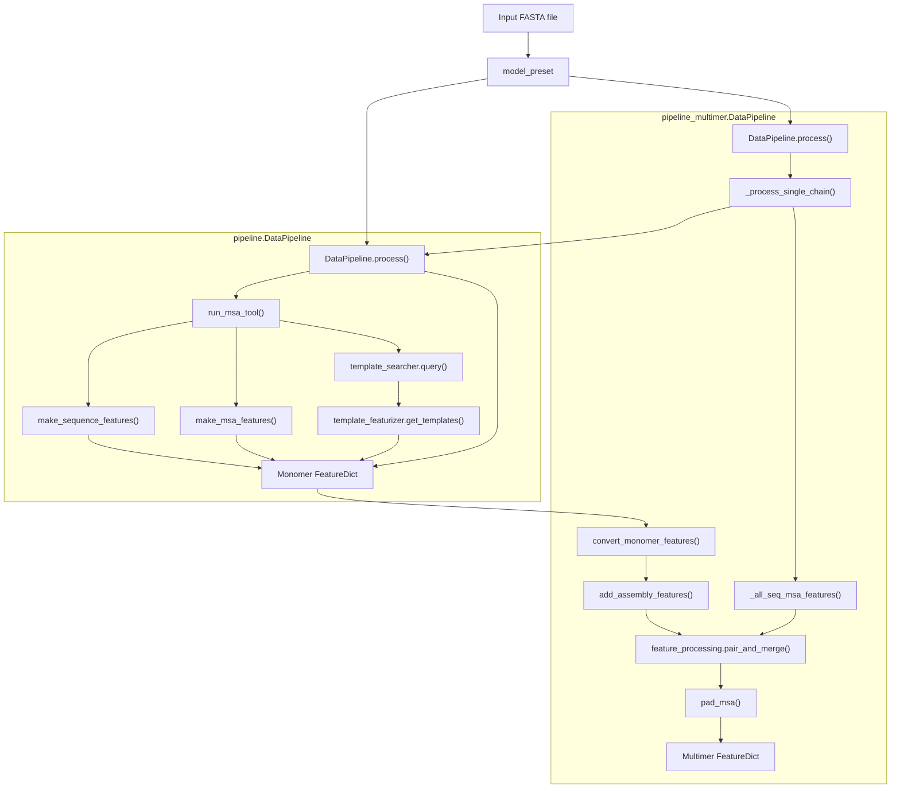
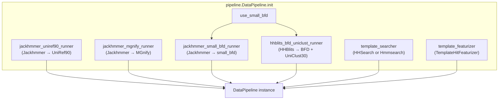
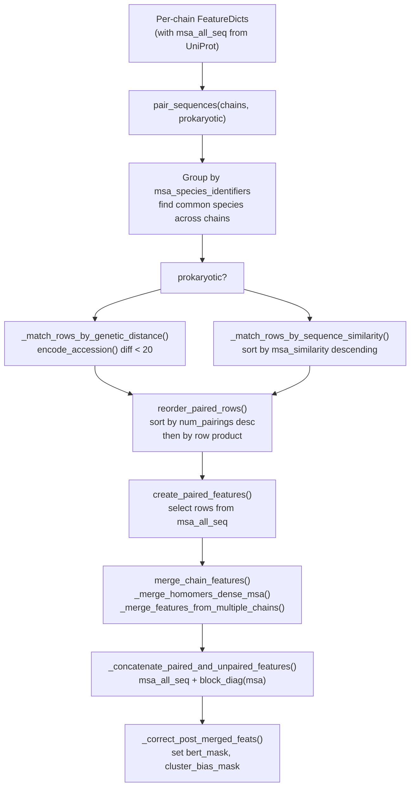
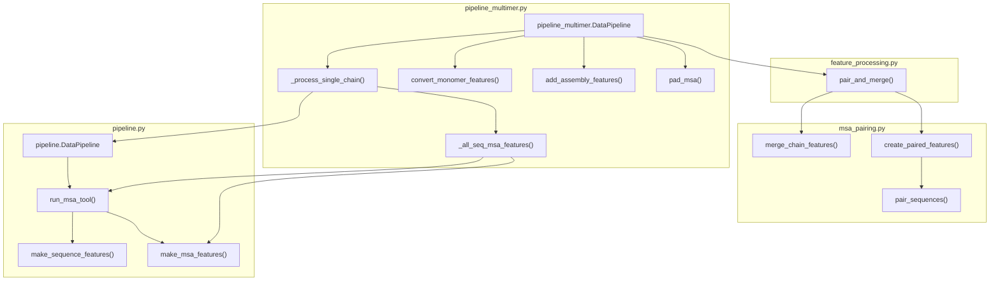

# Data Pipeline

> **Relevant source files**
> * [alphafold/data/msa_pairing.py](https://github.com/jcheongs/alphafold-multimer/blob/8e419501/alphafold/data/msa_pairing.py)
> * [alphafold/data/pipeline.py](https://github.com/jcheongs/alphafold-multimer/blob/8e419501/alphafold/data/pipeline.py)
> * [alphafold/data/pipeline_multimer.py](https://github.com/jcheongs/alphafold-multimer/blob/8e419501/alphafold/data/pipeline_multimer.py)

This page describes how raw FASTA sequences are transformed into model-ready feature dictionaries — the primary input to the AlphaFold neural network. It covers both the monomer path (`alphafold/data/pipeline.py`) and the multimer path (`alphafold/data/pipeline_multimer.py`), along with the shared utilities that connect them.

For details on the individual bioinformatics tool wrappers (Jackhmmer, HHBlits, HHSearch, Hmmsearch), see [MSA Generation Tools](/jcheongs/alphafold-multimer/4.2-msa-generation-tools). For template search and featurization logic, see [Template Processing](/jcheongs/alphafold-multimer/4.3-template-processing). For the complete multimer-specific steps, see [Multimer Data Pipeline](/jcheongs/alphafold-multimer/4.4-multimer-data-pipeline). For parsers and data formats, see [Data Formats and Parsers](/jcheongs/alphafold-multimer/4.5-data-formats-and-parsers).

---

## Overview

The data pipeline converts one or more amino acid sequences into a `FeatureDict` — a `MutableMapping[str, np.ndarray]` — that encodes sequence information, multiple sequence alignments (MSAs), and structural templates. The two main pipeline classes share this output contract but differ in how they handle multi-chain inputs.

**Pipeline entry points by model preset:**

| Model Preset | Pipeline Class | Module |
| --- | --- | --- |
| `monomer`, `monomer_ptm`, `monomer_casp14` | `pipeline.DataPipeline` | `alphafold/data/pipeline.py` |
| `multimer` | `pipeline_multimer.DataPipeline` | `alphafold/data/pipeline_multimer.py` |

The `run_alphafold.py` orchestrator instantiates one of these two classes based on the `--model_preset` flag and calls its `.process()` method per input FASTA file. See [Execution Pipeline](/jcheongs/alphafold-multimer/3-execution-pipeline) for how the orchestrator delegates to the pipeline.

Sources: [alphafold/data/pipeline.py L32-L33](https://github.com/jcheongs/alphafold-multimer/blob/8e419501/alphafold/data/pipeline.py#L32-L33)

 [alphafold/data/pipeline_multimer.py L170-L178](https://github.com/jcheongs/alphafold-multimer/blob/8e419501/alphafold/data/pipeline_multimer.py#L170-L178)

---

## End-to-End Data Flow

The following diagram shows the full transformation from FASTA input to `FeatureDict`, using the actual class and function names from the codebase.

**Diagram: FASTA to FeatureDict — Code-Level Flow**

Sources: [alphafold/data/pipeline.py L155-L248](https://github.com/jcheongs/alphafold-multimer/blob/8e419501/alphafold/data/pipeline.py#L155-L248)

 [alphafold/data/pipeline_multimer.py L197-L288](https://github.com/jcheongs/alphafold-multimer/blob/8e419501/alphafold/data/pipeline_multimer.py#L197-L288)

---

## Monomer Data Pipeline

The `DataPipeline` class in `alphafold/data/pipeline.py` handles single-chain inputs. Its constructor accepts binary paths, database paths, a `template_searcher`, and a `template_featurizer`. The `use_small_bfd` flag selects between two database configurations.

**Diagram: MonomerDataPipeline — Tool Wiring at Construction**

Sources: [alphafold/data/pipeline.py L116-L153](https://github.com/jcheongs/alphafold-multimer/blob/8e419501/alphafold/data/pipeline.py#L116-L153)

### The process() Method

`DataPipeline.process(input_fasta_path, msa_output_dir)` executes in the following sequence:

1. Reads and parses the FASTA file using `parsers.parse_fasta()`. Raises if more than one sequence is present.
2. Runs `run_msa_tool()` for **UniRef90** (Jackhmmer, `.sto`, up to `uniref_max_hits=10000` sequences).
3. Runs `run_msa_tool()` for **MGnify** (Jackhmmer, `.sto`, up to `mgnify_max_hits=501` sequences).
4. Deduplicates and strips empty columns from the UniRef90 Stockholm output, then passes it to the `template_searcher`.
5. Runs `run_msa_tool()` for the BFD database — either: * `small_bfd_hits.sto` via Jackhmmer (if `use_small_bfd=True`) * `bfd_uniclust_hits.a3m` via HHBlits (if `use_small_bfd=False`)
6. Calls `template_featurizer.get_templates()` on the template search results.
7. Assembles and returns the combined `FeatureDict`.

**MSA tool output files written to `msa_output_dir`:**

| File | Tool | Format | Database |
| --- | --- | --- | --- |
| `uniref90_hits.sto` | Jackhmmer | Stockholm | UniRef90 |
| `mgnify_hits.sto` | Jackhmmer | Stockholm | MGnify |
| `small_bfd_hits.sto` | Jackhmmer | Stockholm | small BFD |
| `bfd_uniclust_hits.a3m` | HHBlits | A3M | BFD + UniClust30 |
| `pdb_hits.hhr` or `pdb_hits.sto` | HHSearch or Hmmsearch | HHR or STO | PDB70 or PDB seqres |

Sources: [alphafold/data/pipeline.py L155-L248](https://github.com/jcheongs/alphafold-multimer/blob/8e419501/alphafold/data/pipeline.py#L155-L248)

### run_msa_tool() — Caching Helper

`run_msa_tool(msa_runner, input_fasta_path, msa_out_path, msa_format, use_precomputed_msas, max_sto_sequences)` checks whether the output file already exists before invoking the tool. If `use_precomputed_msas=True` and the file is present, it reads from disk and optionally truncates via `parsers.truncate_stockholm_msa()`. This is the primary mechanism for resuming interrupted pipeline runs.

Sources: [alphafold/data/pipeline.py L92-L113](https://github.com/jcheongs/alphafold-multimer/blob/8e419501/alphafold/data/pipeline.py#L92-L113)

### Feature Assembly Functions

Two functions combine intermediate results into the final monomer `FeatureDict`:

**`make_sequence_features(sequence, description, num_res)`** [alphafold/data/pipeline.py L36-L50](https://github.com/jcheongs/alphafold-multimer/blob/8e419501/alphafold/data/pipeline.py#L36-L50)

Produces these keys:

| Key | Shape / Type | Description |
| --- | --- | --- |
| `aatype` | `[num_res, 21]` int | One-hot amino acid encoding |
| `between_segment_residues` | `[num_res]` int32 | All zeros for single-chain |
| `domain_name` | `[1]` object | FASTA description |
| `residue_index` | `[num_res]` int32 | 0-based position indices |
| `seq_length` | `[num_res]` int32 | Constant: `num_res` |
| `sequence` | `[1]` object | Raw sequence string |

**`make_msa_features(msas)`** [alphafold/data/pipeline.py L53-L89](https://github.com/jcheongs/alphafold-multimer/blob/8e419501/alphafold/data/pipeline.py#L53-L89)

Accepts a list of `parsers.Msa` objects (one per database), deduplicates across all of them, and produces:

| Key | Description |
| --- | --- |
| `msa` | Integer-encoded MSA rows |
| `deletion_matrix_int` | Deletion counts per position per row |
| `num_alignments` | Total deduplicated rows |
| `msa_uniprot_accession_identifiers` | Accession IDs extracted from sequence headers |
| `msa_species_identifiers` | Species tags extracted from sequence headers |

The final return from `process()` merges `sequence_features`, `msa_features`, and `templates_result.features` into a single flat dict [alphafold/data/pipeline.py L248](https://github.com/jcheongs/alphafold-multimer/blob/8e419501/alphafold/data/pipeline.py#L248-L248)

---

## Multimer Data Pipeline

The `DataPipeline` class in `alphafold/data/pipeline_multimer.py` wraps the monomer `DataPipeline` and adds multi-chain assembly logic. Its constructor requires a fully-configured `monomer_data_pipeline` instance plus a path to the UniProt database for MSA pairing.

### The process() Method

`DataPipeline.process(input_fasta_path, msa_output_dir, is_prokaryote)` handles multiple sequences:

1. Parses the FASTA to extract all sequences and descriptions.
2. Calls `_make_chain_id_map()` to assign PDB-style chain IDs (A, B, C, ...).
3. Writes `chain_id_map.json` to `msa_output_dir` for traceability.
4. For each **unique** sequence, calls `_process_single_chain()`, which: * Writes a temporary per-chain FASTA file. * Delegates to the monomer `DataPipeline.process()`. * For heteromers, additionally calls `_all_seq_msa_features()` to run Jackhmmer against UniProt (stored as `uniprot_hits.sto`).
5. Duplicate sequences (homomers) are deep-copied rather than re-computed.
6. Calls `convert_monomer_features()` on each chain's feature dict.
7. Calls `add_assembly_features()` to stamp `asym_id`, `sym_id`, and `entity_id` onto each chain.
8. Calls `feature_processing.pair_and_merge()` to combine all chains.
9. Calls `pad_msa(np_example, 512)` to ensure at least 512 MSA rows.

Sources: [alphafold/data/pipeline_multimer.py L241-L288](https://github.com/jcheongs/alphafold-multimer/blob/8e419501/alphafold/data/pipeline_multimer.py#L241-L288)

### Key Transformation Functions

**`convert_monomer_features(monomer_features, chain_id)`** [alphafold/data/pipeline_multimer.py L72-L94](https://github.com/jcheongs/alphafold-multimer/blob/8e419501/alphafold/data/pipeline_multimer.py#L72-L94)

Reshapes monomer features for multimer compatibility:

* Strips leading dimensions from scalar array features (`sequence`, `domain_name`, `num_alignments`, `seq_length`).
* Converts `aatype` from one-hot to integer indices (the multimer model does its own one-hot).
* Converts `template_aatype` with a remapping via `residue_constants.MAP_HHBLITS_AATYPE_TO_OUR_AATYPE`.
* Renames `template_all_atom_masks` → `template_all_atom_mask`.
* Adds `auth_chain_id`.

**`add_assembly_features(all_chain_features)`** [alphafold/data/pipeline_multimer.py L119-L155](https://github.com/jcheongs/alphafold-multimer/blob/8e419501/alphafold/data/pipeline_multimer.py#L119-L155)

Groups chains by sequence to identify unique entities, then adds three per-residue arrays:

| Feature | Meaning |
| --- | --- |
| `entity_id` | Integer ID for each unique sequence type |
| `sym_id` | Copy number of this chain within its entity (1-indexed) |
| `asym_id` | Global chain index across all chains (1-indexed) |

Keys in the returned dict change from plain chain IDs (e.g. `A`) to compound keys of the form `<entity_str>_<sym_id>` (e.g. `A_1`, `A_2` for a homodimer).

**`pad_msa(np_example, min_num_seq)`** [alphafold/data/pipeline_multimer.py L158-L167](https://github.com/jcheongs/alphafold-multimer/blob/8e419501/alphafold/data/pipeline_multimer.py#L158-L167)

Zero-pads `msa`, `deletion_matrix`, `bert_mask`, `msa_mask`, and `cluster_bias_mask` to ensure at least `min_num_seq` rows. Called with `min_num_seq=512`.

---

## MSA Pairing (Multimer)

For heteromers, the pipeline constructs a **paired MSA** that aligns orthologous sequences from different chains in the same row. This is handled in `alphafold/data/msa_pairing.py` and invoked through `feature_processing.pair_and_merge()`.

**Diagram: MSA Pairing Logic in msa_pairing.py**

Sources: [alphafold/data/msa_pairing.py L60-L96](https://github.com/jcheongs/alphafold-multimer/blob/8e419501/alphafold/data/msa_pairing.py#L60-L96)

 [alphafold/data/msa_pairing.py L325-L417](https://github.com/jcheongs/alphafold-multimer/blob/8e419501/alphafold/data/msa_pairing.py#L325-L417)

 [alphafold/data/msa_pairing.py L574-L601](https://github.com/jcheongs/alphafold-multimer/blob/8e419501/alphafold/data/msa_pairing.py#L574-L601)

### Pairing Strategies

| Strategy | Condition | Function | Criterion |
| --- | --- | --- | --- |
| Genetic distance | `prokaryotic=True` | `_match_rows_by_genetic_distance()` | UniProt accession ID numeric difference < 20 |
| Sequence similarity | `prokaryotic=False` | `_match_rows_by_sequence_similarity()` | Sort by similarity to query, take top-N |

Sequences with gap fraction > `SEQUENCE_GAP_CUTOFF` (0.5) or similarity > `SEQUENCE_SIMILARITY_CUTOFF` (0.9) to the query are excluded from pairing [alphafold/data/msa_pairing.py L35-L36](https://github.com/jcheongs/alphafold-multimer/blob/8e419501/alphafold/data/msa_pairing.py#L35-L36)

### MSA Merge Strategy

After pairing, chains are merged into a single `FeatureDict` using `merge_chain_features()`:

* **Homomer chains** (same `entity_id`): MSA features are concatenated along the residue axis (`pair_msa_sequences=True`), making the MSA dense.
* **Heterocomplex unpaired MSA**: Block-diagonalized with `block_diag()` — off-diagonal positions are filled with the gap index.
* **Paired MSA** (`_all_seq` suffix features): Concatenated along the residue axis and prepended before the block-diagonal unpaired MSA.

Sources: [alphafold/data/msa_pairing.py L532-L601](https://github.com/jcheongs/alphafold-multimer/blob/8e419501/alphafold/data/msa_pairing.py#L532-L601)

---

## Feature Dictionary Schema Summary

The final `FeatureDict` returned by either pipeline class is a flat mapping of string keys to NumPy arrays. The following table summarizes the most significant keys.

| Key | Source | Present in Monomer | Present in Multimer |
| --- | --- | --- | --- |
| `aatype` | `make_sequence_features` | ✓ (one-hot) | ✓ (int indices) |
| `residue_index` | `make_sequence_features` | ✓ | ✓ |
| `seq_length` | `make_sequence_features` | ✓ | ✓ |
| `msa` | `make_msa_features` | ✓ | ✓ |
| `deletion_matrix_int` | `make_msa_features` | ✓ | ✓ |
| `num_alignments` | `make_msa_features` | ✓ | ✓ |
| `msa_species_identifiers` | `make_msa_features` | ✓ | ✓ |
| `template_aatype` | `TemplateHitFeaturizer` | ✓ | ✓ |
| `template_all_atom_positions` | `TemplateHitFeaturizer` | ✓ | ✓ |
| `template_all_atom_mask` | `TemplateHitFeaturizer` | ✓ | ✓ |
| `asym_id` | `add_assembly_features` | ✗ | ✓ |
| `sym_id` | `add_assembly_features` | ✗ | ✓ |
| `entity_id` | `add_assembly_features` | ✗ | ✓ |
| `msa_all_seq` | `_all_seq_msa_features` | ✗ | ✓ (heteromers) |
| `bert_mask` | `_correct_post_merged_feats` | ✗ | ✓ |
| `cluster_bias_mask` | `_correct_post_merged_feats` | ✗ | ✓ |

Sources: [alphafold/data/pipeline.py L36-L89](https://github.com/jcheongs/alphafold-multimer/blob/8e419501/alphafold/data/pipeline.py#L36-L89)

 [alphafold/data/pipeline_multimer.py L119-L167](https://github.com/jcheongs/alphafold-multimer/blob/8e419501/alphafold/data/pipeline_multimer.py#L119-L167)

 [alphafold/data/msa_pairing.py L47-L57](https://github.com/jcheongs/alphafold-multimer/blob/8e419501/alphafold/data/msa_pairing.py#L47-L57)

---

## Relationship Between the Two Pipeline Classes

**Diagram: pipeline.DataPipeline and pipeline_multimer.DataPipeline Dependencies**

Sources: [alphafold/data/pipeline_multimer.py L170-L288](https://github.com/jcheongs/alphafold-multimer/blob/8e419501/alphafold/data/pipeline_multimer.py#L170-L288)

 [alphafold/data/msa_pairing.py L60-L601](https://github.com/jcheongs/alphafold-multimer/blob/8e419501/alphafold/data/msa_pairing.py#L60-L601)

The multimer `DataPipeline` does not subclass the monomer `DataPipeline`; instead, it holds a reference to it as `self._monomer_data_pipeline` and delegates per-chain processing through `_process_single_chain()`. This means the monomer pipeline must be fully configured (with all database paths and tool binaries) before the multimer pipeline is constructed.