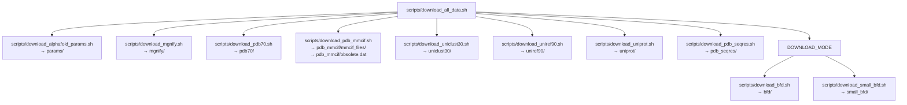
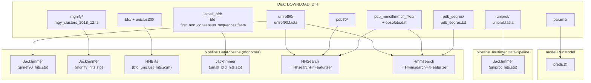

# Downloading Required Databases

> **Relevant source files**
> * [README.md](https://github.com/jcheongs/alphafold-multimer/blob/8e419501/README.md?plain=1)
> * [scripts/download_all_data.sh](https://github.com/jcheongs/alphafold-multimer/blob/8e419501/scripts/download_all_data.sh)
> * [scripts/download_alphafold_params.sh](https://github.com/jcheongs/alphafold-multimer/blob/8e419501/scripts/download_alphafold_params.sh)
> * [scripts/download_bfd.sh](https://github.com/jcheongs/alphafold-multimer/blob/8e419501/scripts/download_bfd.sh)
> * [scripts/download_pdb_mmcif.sh](https://github.com/jcheongs/alphafold-multimer/blob/8e419501/scripts/download_pdb_mmcif.sh)

This page describes every genetic database and model parameter archive required by AlphaFold, the shell scripts used to download them, the `full_dbs` versus `reduced_dbs` distinction, and the resulting directory layout on disk.

For information on how these databases are actually used during inference (which pipeline stages consume which databases), see [Data Pipeline](/jcheongs/alphafold-multimer/4-data-pipeline) and [Monomer Data Pipeline](/jcheongs/alphafold-multimer/4.1-monomer-data-pipeline). For instructions on passing database paths to a running prediction, see [Running Predictions](/jcheongs/alphafold-multimer/2.3-running-predictions).

---

## Prerequisites

All download scripts require `aria2c` to be installed. The PDB mmCIF download additionally requires `rsync`.

```
sudo apt install aria2 rsync
```

> **Important:** The download directory should **not** be a subdirectory of the AlphaFold repository. Placing it inside the repository causes the Docker build context to include all database files, making `docker build` extremely slow. See [Installation and Docker Setup](/jcheongs/alphafold-multimer/2.1-installation-and-docker-setup) for details.

Sources: [README.md L62-L97](https://github.com/jcheongs/alphafold-multimer/blob/8e419501/README.md?plain=1#L62-L97)

---

## Database Overview

The following table lists every database used by AlphaFold, its role in the pipeline, and whether it is required only for a specific preset.

| Directory | Database | Used For | Preset Requirement | Download Size | Unzipped Size |
| --- | --- | --- | --- | --- | --- |
| `bfd/` | BFD | MSA via HHBlits | `full_dbs` only | 271.6 GB | ~1.7 TB |
| `small_bfd/` | Small BFD | MSA via Jackhmmer | `reduced_dbs` only | 9.6 GB | ~17 GB |
| `mgnify/` | MGnify | MSA via Jackhmmer | Both | 32.9 GB | ~64 GB |
| `pdb70/` | PDB70 | Template search (monomer, HHSearch) | Both | 19.5 GB | ~56 GB |
| `pdb_mmcif/` | PDB mmCIF | Template featurization | Both | 46 GB | ~206 GB |
| `pdb_seqres/` | PDB seqres | Template search (multimer, Hmmsearch) | Multimer only | 0.2 GB | ~0.2 GB |
| `uniclust30/` | Uniclust30 | MSA via HHBlits (paired with BFD) | `full_dbs` only | 24.9 GB | ~86 GB |
| `uniprot/` | UniProt | MSA pairing for heteromers | Multimer only | 49 GB | ~98.3 GB |
| `uniref90/` | UniRef90 | MSA via Jackhmmer; template search seed | Both | 29.7 GB | ~58 GB |
| `params/` | Model parameters | Neural network weights | Both | 3.5 GB | ~3.5 GB |

**Total (full databases):** ~438 GB download, ~2.2 TB unzipped.
**Total (reduced databases):** Replaces `bfd/` + `uniclust30/` with `small_bfd/`, saving ~270 GB download.

Sources: [README.md L112-L143](https://github.com/jcheongs/alphafold-multimer/blob/8e419501/README.md?plain=1#L112-L143)

---

## Download Scripts

All scripts live in the `scripts/` directory. Each script accepts the target download directory as its sole argument and will create the appropriate subdirectory automatically.

**Script: `download_all_data.sh`** — The primary entry point. It calls all individual scripts in sequence and accepts an optional second argument specifying the download mode.

```markdown
# Full databases (default):bash scripts/download_all_data.sh <DOWNLOAD_DIR> # Reduced databases:bash scripts/download_all_data.sh <DOWNLOAD_DIR> reduced_dbs
```

The following diagram maps each sub-script to the database it downloads and the directory it populates.

**Diagram: download_all_data.sh orchestration**



Sources: [scripts/download_all_data.sh L1-L74](https://github.com/jcheongs/alphafold-multimer/blob/8e419501/scripts/download_all_data.sh#L1-L74)

---

### Individual Script Details

#### download_alphafold_params.sh

Downloads the official parameter archive from Google Cloud Storage and unpacks it into `params/`.

* Source URL: `https://storage.googleapis.com/alphafold/alphafold_params_2022-01-19.tar`
* Tool used: `aria2c`

[scripts/download_alphafold_params.sh L34-L41](https://github.com/jcheongs/alphafold-multimer/blob/8e419501/scripts/download_alphafold_params.sh#L34-L41)

The archive contains 16 files: 5 CASP14 models, 5 pTM models, 5 AlphaFold-Multimer models, and a LICENSE file.

---

#### download_bfd.sh

Downloads the full BFD (Big Fantastic Database) from a DeepMind-hosted Google Cloud Storage mirror of the original source at `bfd.mmseqs.com`.

* Source URL: `https://storage.googleapis.com/alphafold-databases/casp14_versions/bfd_metaclust_clu_complete_id30_c90_final_seq.sorted_opt.tar.gz`
* Tool used: `aria2c`

[scripts/download_bfd.sh L32-L43](https://github.com/jcheongs/alphafold-multimer/blob/8e419501/scripts/download_bfd.sh#L32-L43)

---

#### download_pdb_mmcif.sh

Uses `rsync` to mirror the entire PDB in mmCIF format from `rsync.rcsb.org`, then decompresses and flattens the directory structure into `pdb_mmcif/mmcif_files/`. Also downloads `obsolete.dat` via `aria2c`.

* Primary rsync mirror: `rsync.rcsb.org::ftp_data/structures/divided/mmCIF/`
* Alternative mirrors noted in the script: EBI (Europe), PDB Japan (Asia)
* Result: ~180,000 `.cif` files in a flat directory

[scripts/download_pdb_mmcif.sh L42-L65](https://github.com/jcheongs/alphafold-multimer/blob/8e419501/scripts/download_pdb_mmcif.sh#L42-L65)

> **Note:** When upgrading an existing installation to add multimer support, `pdb_mmcif/` must be re-downloaded together with `pdb_seqres/` so that both reflect the same PDB release date. Mismatched dates can cause template search failures.

Sources: [scripts/download_pdb_mmcif.sh L1-L65](https://github.com/jcheongs/alphafold-multimer/blob/8e419501/scripts/download_pdb_mmcif.sh#L1-L65)

 [README.md L175-L187](https://github.com/jcheongs/alphafold-multimer/blob/8e419501/README.md?plain=1#L175-L187)

---

## full_dbs vs reduced_dbs

The `DOWNLOAD_MODE` argument to `download_all_data.sh` controls which BFD variant is downloaded. This choice must match the `--db_preset` flag used when running predictions (see [Running Predictions](/jcheongs/alphafold-multimer/2.3-running-predictions)).

| Aspect | `full_dbs` | `reduced_dbs` |
| --- | --- | --- |
| BFD variant | Full BFD (~1.7 TB) + Uniclust30 (~86 GB), searched by HHBlits | Small BFD (~17 GB), searched by Jackhmmer |
| Script called | `download_bfd.sh` + `download_uniclust30.sh` | `download_small_bfd.sh` |
| Hardware target | High-disk, high-CPU servers | Workstations or reduced-resource environments |
| Minimum disk space | ~2.2 TB | ~600 GB |
| Minimum RAM | ~85 GB | ~8 GB |

In the data pipeline, the `db_preset` value is checked in `pipeline.DataPipeline` to determine whether to call HHBlits against BFD+Uniclust30 or Jackhmmer against `small_bfd`. See [Monomer Data Pipeline](/jcheongs/alphafold-multimer/4.1-monomer-data-pipeline) for details on this branching logic.

Sources: [README.md L279-L298](https://github.com/jcheongs/alphafold-multimer/blob/8e419501/README.md?plain=1#L279-L298)

 [scripts/download_all_data.sh L33-L51](https://github.com/jcheongs/alphafold-multimer/blob/8e419501/scripts/download_all_data.sh#L33-L51)

---

## Resulting Directory Layout

After a successful `full_dbs` run of `download_all_data.sh`, the download directory will have this structure:

```markdown
$DOWNLOAD_DIR/                             # Total: ~2.2 TB (download: ~438 GB)
    bfd/                                   # ~1.7 TB (download: 271.6 GB)
        # 6 files
    mgnify/                                # ~64 GB (download: 32.9 GB)
        mgy_clusters_2018_12.fa
    params/                                # ~3.5 GB (download: 3.5 GB)
        # 5 CASP14 models
        # 5 pTM models
        # 5 AlphaFold-Multimer models
        # LICENSE
    pdb70/                                 # ~56 GB (download: 19.5 GB)
        # 9 files
    pdb_mmcif/                             # ~206 GB (download: 46 GB)
        mmcif_files/
            # ~180,000 .cif files
        obsolete.dat
    pdb_seqres/                            # ~0.2 GB (download: 0.2 GB)
        pdb_seqres.txt
    uniclust30/                            # ~86 GB (download: 24.9 GB)
        uniclust30_2018_08/
            # 13 files
    uniprot/                               # ~98.3 GB (download: 49 GB)
        uniprot.fasta
    uniref90/                              # ~58 GB (download: 29.7 GB)
        uniref90.fasta
```

For `reduced_dbs`, replace `bfd/` and `uniclust30/` with:

```markdown
small_bfd/                             # ~17 GB (download: 9.6 GB)
        bfd-first_non_consensus_sequences.fasta
```

Sources: [README.md L112-L143](https://github.com/jcheongs/alphafold-multimer/blob/8e419501/README.md?plain=1#L112-L143)

---

## How Databases Map to Pipeline Stages

The following diagram shows which database directories are consumed by which pipeline components during a prediction run. This connects the on-disk layout to the code structures described in [Data Pipeline](/jcheongs/alphafold-multimer/4-data-pipeline).

**Diagram: Database-to-pipeline-component mapping**



Sources: [README.md L60-L143](https://github.com/jcheongs/alphafold-multimer/blob/8e419501/README.md?plain=1#L60-L143)

 [scripts/download_all_data.sh L42-L73](https://github.com/jcheongs/alphafold-multimer/blob/8e419501/scripts/download_all_data.sh#L42-L73)

---

## Model Parameters

Model parameters are licensed separately from the code under the **CC BY 4.0** license (the code itself is Apache 2.0).

The parameter archive at `alphafold_params_2022-01-19.tar` contains three sets of weights:

| Set | Count | Description |
| --- | --- | --- |
| CASP14 models | 5 | Original CASP14 submission, no pTM head |
| pTM models | 5 | Fine-tuned with pTM and PAE output heads |
| Multimer models | 5 | AlphaFold-Multimer, includes pTM and PAE |

The `model_preset` flag selects which parameter set is loaded at runtime. See [Neural Network Model](/jcheongs/alphafold-multimer/5-neural-network-model) for how parameters are loaded and applied.

Sources: [README.md L145-L163](https://github.com/jcheongs/alphafold-multimer/blob/8e419501/README.md?plain=1#L145-L163)

 [scripts/download_alphafold_params.sh L34-L41](https://github.com/jcheongs/alphafold-multimer/blob/8e419501/scripts/download_alphafold_params.sh#L34-L41)

---

## Upgrading an Existing Installation

If upgrading from AlphaFold v2.0.x (which lacked multimer support), only the following incremental downloads are required instead of a full re-download:

1. `scripts/download_uniprot.sh <DOWNLOAD_DIR>` — new database for multimer MSA pairing
2. Delete `<DOWNLOAD_DIR>/pdb_mmcif` entirely, then re-run `scripts/download_pdb_mmcif.sh <DOWNLOAD_DIR>`
3. `scripts/download_pdb_seqres.sh <DOWNLOAD_DIR>` — new database for multimer template search
4. Delete old `<DOWNLOAD_DIR>/params` and re-run `scripts/download_alphafold_params.sh <DOWNLOAD_DIR>`

Steps 2 and 3 must be done together because `pdb_mmcif` and `pdb_seqres` must reflect the same PDB release date for template searching to work correctly.

Sources: [README.md L165-L187](https://github.com/jcheongs/alphafold-multimer/blob/8e419501/README.md?plain=1#L165-L187)

---

## Note on Reproducibility

The scripts download **current** versions of each database, which may differ from the versions used in the original CASP14 evaluation. To reproduce CASP14 results exactly, the following pinned versions are needed:

| Database | CASP14 Version |
| --- | --- |
| UniRef90 | v2020_01 |
| MGnify | v2018_12 |
| Uniclust30 | v2018_08 |
| BFD | Only one version available |
| PDB / PDB70 | Snapshot from 2020-05-14 / 2020-05-13 |

Alternatively, using current databases with `--max_template_date=2020-05-14` limits template structures to those available at the start of CASP14, partially restoring reproducibility without requiring old database snapshots.

Sources: [README.md L523-L551](https://github.com/jcheongs/alphafold-multimer/blob/8e419501/README.md?plain=1#L523-L551)