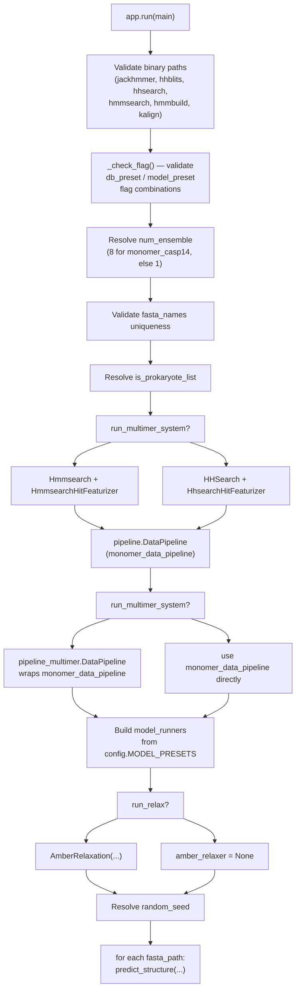
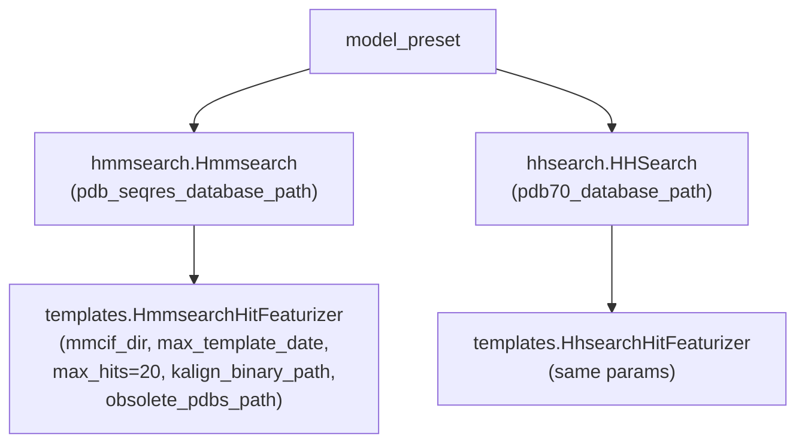
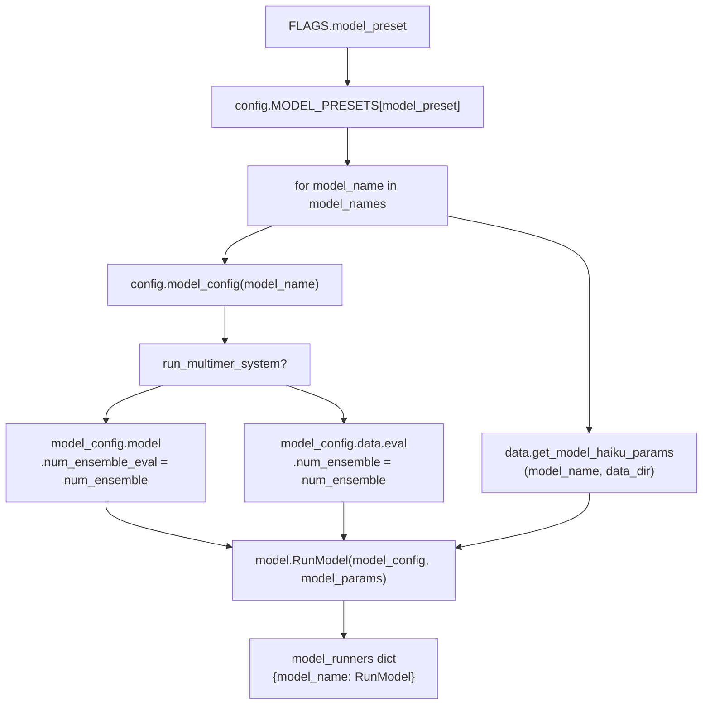

# Execution Pipeline

> **Relevant source files**
> * [run_alphafold.py](https://github.com/jcheongs/alphafold-multimer/blob/8e419501/run_alphafold.py)
> * [run_alphafold_test.py](https://github.com/jcheongs/alphafold-multimer/blob/8e419501/run_alphafold_test.py)

## Purpose and Scope

This page documents `run_alphafold.py`, the main orchestrator that wires together the data pipeline, neural network model runners, and Amber relaxation into a complete end-to-end prediction workflow. It covers CLI flag definitions, startup validation, object construction, and the `predict_structure()` function lifecycle including feature generation, per-model inference, ranking, and output file writing.

* For how to *invoke* the script via Docker or shell, see [Running Predictions](/jcheongs/alphafold-multimer/2.3-running-predictions).
* For the internals of the monomer and multimer data pipelines, see [Data Pipeline](/jcheongs/alphafold-multimer/4-data-pipeline).
* For model architecture and inference details, see [Neural Network Model](/jcheongs/alphafold-multimer/5-neural-network-model).
* For the Amber relaxation subsystem, see [Structure Relaxation](/jcheongs/alphafold-multimer/6-structure-relaxation).

---

## Entry Point and High-Level Flow

`run_alphafold.py` uses the `absl` library for flag parsing and application lifecycle. Execution starts at `main()` [run_alphafold.py L286-L429](https://github.com/jcheongs/alphafold-multimer/blob/8e419501/run_alphafold.py#L286-L429)

 which performs validation, constructs all objects once, and then iterates over each FASTA file, calling `predict_structure()` for each.

**Diagram: main() control flow**



Sources: [run_alphafold.py L286-L429](https://github.com/jcheongs/alphafold-multimer/blob/8e419501/run_alphafold.py#L286-L429)

---

## CLI Flags

All flags are defined using `absl.flags` at module level [run_alphafold.py L46-L132](https://github.com/jcheongs/alphafold-multimer/blob/8e419501/run_alphafold.py#L46-L132)

 The table below groups them by category.

### Required Flags

| Flag | Type | Description |
| --- | --- | --- |
| `--fasta_paths` | list | Comma-separated FASTA files. Multi-sequence FASTA → multimer prediction. |
| `--output_dir` | string | Root directory for all output. |
| `--data_dir` | string | Root of model parameter and database files. |
| `--uniref90_database_path` | string | Path to UniRef90 database. |
| `--mgnify_database_path` | string | Path to MGnify database. |
| `--template_mmcif_dir` | string | Directory of per-PDB mmCIF template files. |
| `--max_template_date` | string | Cutoff date for template structures (e.g. `2021-11-01`). |
| `--obsolete_pdbs_path` | string | Mapping of obsolete PDB IDs to replacements. |
| `--use_gpu_relax` | boolean | Whether to use GPU for Amber relaxation. |

### Preset / Mode Flags

| Flag | Allowed Values | Default | Effect |
| --- | --- | --- | --- |
| `--model_preset` | `monomer`, `monomer_casp14`, `monomer_ptm`, `multimer` | `monomer` | Selects model set and pipeline branch. |
| `--db_preset` | `full_dbs`, `reduced_dbs` | `full_dbs` | Switches between BFD+UniClust30 and small_bfd. |

### Conditional Flags (validated at startup)

| Flag | Required when |
| --- | --- |
| `--pdb70_database_path` | `model_preset` is **not** `multimer` |
| `--pdb_seqres_database_path` | `model_preset` is `multimer` |
| `--uniprot_database_path` | `model_preset` is `multimer` |
| `--small_bfd_database_path` | `db_preset` is `reduced_dbs` |
| `--bfd_database_path` | `db_preset` is `full_dbs` |
| `--uniclust30_database_path` | `db_preset` is `full_dbs` |

### Optional Flags

| Flag | Default | Description |
| --- | --- | --- |
| `--is_prokaryote_list` | all `False` | Per-FASTA boolean list controlling MSA pairing strategy in multimer mode. |
| `--run_relax` | `True` | Toggle Amber relaxation. |
| `--use_precomputed_msas` | `False` | Read MSA files from disk instead of re-running tools. |
| `--benchmark` | `False` | Run a second prediction pass to get a compilation-free timing. |
| `--random_seed` | random | Seed for data pipeline and model sampling. |

Sources: [run_alphafold.py L46-L132](https://github.com/jcheongs/alphafold-multimer/blob/8e419501/run_alphafold.py#L46-L132)

---

## Startup Validation

The `_check_flag()` helper [run_alphafold.py L143-L149](https://github.com/jcheongs/alphafold-multimer/blob/8e419501/run_alphafold.py#L143-L149)

 enforces that flag pairs are consistent: for each conditional flag it checks whether the flag value is set (or unset) based on another flag's value, raising `ValueError` with a descriptive message if not. All binary paths for `jackhmmer`, `hhblits`, `hhsearch`, `hmmsearch`, `hmmbuild`, and `kalign` are also verified to be non-empty [run_alphafold.py L290-L294](https://github.com/jcheongs/alphafold-multimer/blob/8e419501/run_alphafold.py#L290-L294)

---

## Object Construction

### Template Searcher and Featurizer

**Diagram: Template tool selection by model_preset**



`MAX_TEMPLATE_HITS` is a module-level constant set to `20` [run_alphafold.py L135](https://github.com/jcheongs/alphafold-multimer/blob/8e419501/run_alphafold.py#L135-L135)

Sources: [run_alphafold.py L338-L360](https://github.com/jcheongs/alphafold-multimer/blob/8e419501/run_alphafold.py#L338-L360)

### Data Pipeline

A `pipeline.DataPipeline` (monomer) is always constructed [run_alphafold.py L362-L373](https://github.com/jcheongs/alphafold-multimer/blob/8e419501/run_alphafold.py#L362-L373)

 If `run_multimer_system` is `True`, it is wrapped by `pipeline_multimer.DataPipeline` [run_alphafold.py L375-L382](https://github.com/jcheongs/alphafold-multimer/blob/8e419501/run_alphafold.py#L375-L382)

 which adds the UniProt jackhmmer search and assembly feature construction. The monomer pipeline is used directly for all single-chain presets.

### Model Runners

`config.MODEL_PRESETS` maps each preset name to a list of model names [run_alphafold.py L385](https://github.com/jcheongs/alphafold-multimer/blob/8e419501/run_alphafold.py#L385-L385)

 For each model name, `config.model_config()` and `data.get_model_haiku_params()` produce the configuration and parameters, which are passed to `model.RunModel()` [run_alphafold.py L384-L395](https://github.com/jcheongs/alphafold-multimer/blob/8e419501/run_alphafold.py#L384-L395)

**Diagram: MODEL_PRESETS → RunModel instantiation**



`num_ensemble` is `8` for `monomer_casp14` and `1` for all other presets [run_alphafold.py L312-L315](https://github.com/jcheongs/alphafold-multimer/blob/8e419501/run_alphafold.py#L312-L315)

Sources: [run_alphafold.py L384-L395](https://github.com/jcheongs/alphafold-multimer/blob/8e419501/run_alphafold.py#L384-L395)

 [run_alphafold.py L312-L315](https://github.com/jcheongs/alphafold-multimer/blob/8e419501/run_alphafold.py#L312-L315)

### Amber Relaxer

If `--run_relax` is set, `relax.AmberRelaxation` is constructed with these fixed constants [run_alphafold.py L136-L140](https://github.com/jcheongs/alphafold-multimer/blob/8e419501/run_alphafold.py#L136-L140)

 [run_alphafold.py L400-L408](https://github.com/jcheongs/alphafold-multimer/blob/8e419501/run_alphafold.py#L400-L408)

:

| Constant | Value |
| --- | --- |
| `RELAX_MAX_ITERATIONS` | `0` (no per-step cap) |
| `RELAX_ENERGY_TOLERANCE` | `2.39` |
| `RELAX_STIFFNESS` | `10.0` |
| `RELAX_EXCLUDE_RESIDUES` | `[]` (empty) |
| `RELAX_MAX_OUTER_ITERATIONS` | `3` |

If `--run_relax` is `False`, `amber_relaxer` is set to `None` and relaxation is skipped entirely.

Sources: [run_alphafold.py L136-L140](https://github.com/jcheongs/alphafold-multimer/blob/8e419501/run_alphafold.py#L136-L140)

 [run_alphafold.py L400-L409](https://github.com/jcheongs/alphafold-multimer/blob/8e419501/run_alphafold.py#L400-L409)

---

## predict_structure() Lifecycle

`predict_structure()` [run_alphafold.py L152-L283](https://github.com/jcheongs/alphafold-multimer/blob/8e419501/run_alphafold.py#L152-L283)

 is the core function executed once per FASTA file. It receives all pre-built objects (data pipeline, model runners, relaxer) and a random seed, and produces all output files.

**Diagram: predict_structure() execution sequence**

```mermaid
sequenceDiagram
  participant predict_structure()
  participant data_pipeline.process()
  participant model_runner (RunModel)
  participant amber_relaxer (AmberRelaxation)
  participant File System

  predict_structure()->>File System: "mkdir output_dir / msas"
  predict_structure()->>data_pipeline.process(): "process(fasta_path, msa_output_dir,
  data_pipeline.process()-->>predict_structure(): [is_prokaryote])"
  predict_structure()->>File System: "feature_dict"
  loop ["amber_relaxer is not None"]
    predict_structure()->>model_runner (RunModel): "write features.pkl"
    model_runner (RunModel)-->>predict_structure(): "process_features(feature_dict, random_seed)"
    predict_structure()->>model_runner (RunModel): "processed_feature_dict"
    model_runner (RunModel)-->>predict_structure(): "predict(processed_feature_dict, random_seed)"
    predict_structure()->>File System: "prediction_result"
    predict_structure()->>File System: "write result_{model_name}.pkl"
    predict_structure()->>amber_relaxer (AmberRelaxation): "write unrelaxed_{model_name}.pdb"
    amber_relaxer (AmberRelaxation)-->>predict_structure(): "process(prot=unrelaxed_protein)"
    predict_structure()->>File System: "relaxed_pdb_str"
  end
  predict_structure()->>predict_structure(): "write relaxed_{model_name}.pdb"
  predict_structure()->>File System: "rank models by ranking_confidence"
  predict_structure()->>File System: "write ranked_0.pdb ... ranked_N.pdb"
  predict_structure()->>File System: "write ranking_debug.json"
```

Sources: [run_alphafold.py L152-L283](https://github.com/jcheongs/alphafold-multimer/blob/8e419501/run_alphafold.py#L152-L283)

### Feature Generation

`data_pipeline.process()` is called once [run_alphafold.py L174-L182](https://github.com/jcheongs/alphafold-multimer/blob/8e419501/run_alphafold.py#L174-L182)

 For multimer runs, `is_prokaryote` is passed as a keyword argument; for monomer runs it is omitted. The returned `feature_dict` is immediately serialized to `features.pkl` [run_alphafold.py L186-L188](https://github.com/jcheongs/alphafold-multimer/blob/8e419501/run_alphafold.py#L186-L188)

### Model Loop

For each `(model_name, model_runner)` pair [run_alphafold.py L196-L259](https://github.com/jcheongs/alphafold-multimer/blob/8e419501/run_alphafold.py#L196-L259)

:

1. A per-model random seed is derived: `model_random_seed = model_index + random_seed * num_models` [run_alphafold.py L200](https://github.com/jcheongs/alphafold-multimer/blob/8e419501/run_alphafold.py#L200-L200)
2. `model_runner.process_features()` crops/samples/pads features for the specific model.
3. `model_runner.predict()` runs the JAX forward pass and returns a `prediction_result` dict.
4. If `--benchmark` is set, `predict()` is called a second time to capture a compilation-free timing [run_alphafold.py L214-L222](https://github.com/jcheongs/alphafold-multimer/blob/8e419501/run_alphafold.py#L214-L222)
5. `prediction_result['plddt']` is extracted and broadcast across all atom types to populate B-factor columns via `protein.from_prediction()` [run_alphafold.py L234-L242](https://github.com/jcheongs/alphafold-multimer/blob/8e419501/run_alphafold.py#L234-L242)
6. `prediction_result['ranking_confidence']` is stored for later ranking [run_alphafold.py L225](https://github.com/jcheongs/alphafold-multimer/blob/8e419501/run_alphafold.py#L225-L225)

### Relaxation

If `amber_relaxer` is not `None`, `amber_relaxer.process(prot=unrelaxed_protein)` is called immediately after each model's unrelaxed PDB is written [run_alphafold.py L247-L259](https://github.com/jcheongs/alphafold-multimer/blob/8e419501/run_alphafold.py#L247-L259)

 Relaxation happens per-model, not only for the best model.

### Ranking and Final Output

After all models complete, `ranking_confidences` is sorted in descending order [run_alphafold.py L262-L271](https://github.com/jcheongs/alphafold-multimer/blob/8e419501/run_alphafold.py#L262-L271)

 The best model is written as `ranked_0.pdb`, the next as `ranked_1.pdb`, etc. Each ranked file contains the relaxed PDB if `amber_relaxer` is set, otherwise the unrelaxed PDB.

The label used in `ranking_debug.json` is `iptm+ptm` when the `prediction_result` contains an `iptm` key (multimer), otherwise `plddts` (monomer) [run_alphafold.py L275](https://github.com/jcheongs/alphafold-multimer/blob/8e419501/run_alphafold.py#L275-L275)

Sources: [run_alphafold.py L262-L283](https://github.com/jcheongs/alphafold-multimer/blob/8e419501/run_alphafold.py#L262-L283)

---

## Output File Layout

For a run with `--output_dir=/out` and `--fasta_paths=protein.fasta` (FASTA stem = `protein`):

```python
/out/
└── protein/
    ├── features.pkl              # Serialized feature_dict from data pipeline
    ├── msas/                     # Raw MSA files written by pipeline tools
    ├── result_model_1.pkl        # Full prediction_result for model_1
    ├── result_model_2.pkl
    ├── ...
    ├── unrelaxed_model_1.pdb     # Unrelaxed structure, pLDDT in B-factors
    ├── unrelaxed_model_2.pdb
    ├── ...
    ├── relaxed_model_1.pdb       # Present only if --run_relax=true
    ├── relaxed_model_2.pdb
    ├── ...
    ├── ranked_0.pdb              # Best model by ranking_confidence
    ├── ranked_1.pdb
    ├── ...
    ├── ranking_debug.json        # {"iptm+ptm"|"plddts": {...}, "order": [...]}
    └── timings.json              # Wall-clock seconds per pipeline stage
```

Sources: [run_alphafold.py L165-L283](https://github.com/jcheongs/alphafold-multimer/blob/8e419501/run_alphafold.py#L165-L283)

 [run_alphafold_test.py L84-L91](https://github.com/jcheongs/alphafold-multimer/blob/8e419501/run_alphafold_test.py#L84-L91)

---

## Timing Instrumentation

`predict_structure()` maintains a `timings` dict that accumulates `time.time()` deltas for each major stage [run_alphafold.py L164](https://github.com/jcheongs/alphafold-multimer/blob/8e419501/run_alphafold.py#L164-L164)

 [run_alphafold.py L279-L283](https://github.com/jcheongs/alphafold-multimer/blob/8e419501/run_alphafold.py#L279-L283)

 The keys written to `timings.json` are:

| Key pattern | Covers |
| --- | --- |
| `features` | Full `data_pipeline.process()` call |
| `process_features_{model_name}` | `model_runner.process_features()` |
| `predict_and_compile_{model_name}` | First `model_runner.predict()` (includes JAX compilation) |
| `predict_benchmark_{model_name}` | Second `model_runner.predict()` if `--benchmark` is set |
| `relax_{model_name}` | `amber_relaxer.process()` per model |

Sources: [run_alphafold.py L173-L283](https://github.com/jcheongs/alphafold-multimer/blob/8e419501/run_alphafold.py#L173-L283)

---

## Random Seed Handling

If `--random_seed` is not specified, a random integer is drawn from `[0, sys.maxsize // len(model_names))` [run_alphafold.py L411-L413](https://github.com/jcheongs/alphafold-multimer/blob/8e419501/run_alphafold.py#L411-L413)

 The same base seed is used for every FASTA file in the batch. Per-model seeds are derived as `model_index + random_seed * num_models` to avoid collisions between models while keeping the run reproducible given the same base seed.

Sources: [run_alphafold.py L411-L414](https://github.com/jcheongs/alphafold-multimer/blob/8e419501/run_alphafold.py#L411-L414)

 [run_alphafold.py L200](https://github.com/jcheongs/alphafold-multimer/blob/8e419501/run_alphafold.py#L200-L200)