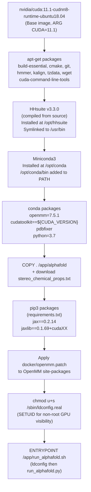
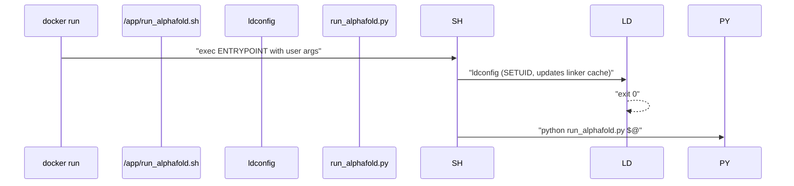
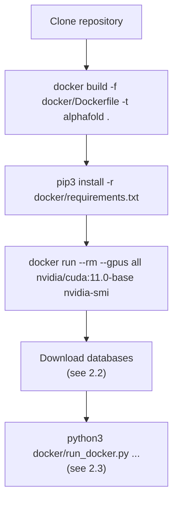

# Installation and Docker Setup

> **Relevant source files**
> * [.dockerignore](https://github.com/jcheongs/alphafold-multimer/blob/8e419501/.dockerignore)
> * [README.md](https://github.com/jcheongs/alphafold-multimer/blob/8e419501/README.md?plain=1)
> * [docker/Dockerfile](https://github.com/jcheongs/alphafold-multimer/blob/8e419501/docker/Dockerfile)

This page covers the Docker-based deployment model for AlphaFold-Multimer: what prerequisites are needed on the host machine, how the Docker image is built from [docker/Dockerfile](https://github.com/jcheongs/alphafold-multimer/blob/8e419501/docker/Dockerfile)

 what software layers the image contains, and how GPU access is granted inside the container. It does **not** cover database downloads (see [Downloading Required Databases](/jcheongs/alphafold-multimer/2.2-downloading-required-databases)) or how to invoke predictions once the image is running (see [Running Predictions](/jcheongs/alphafold-multimer/2.3-running-predictions)).

---

## Prerequisites

Before building the image, the following must be installed and configured on the **host machine**:

| Requirement | Purpose |
| --- | --- |
| Docker Engine | Container runtime |
| NVIDIA Container Toolkit | Exposes host GPU(s) to containers |
| Non-root Docker access | Allows running `docker` without `sudo` |
| Python 3 + `pip` | Needed to run `docker/run_docker.py` on the host |

GPU visibility can be verified before building anything:

```
docker run --rm --gpus all nvidia/cuda:11.0-base nvidia-smi
```

The output must list your GPU device(s). If the command fails, the NVIDIA Container Toolkit is not configured correctly.

Sources: [README.md L36-L53](https://github.com/jcheongs/alphafold-multimer/blob/8e419501/README.md?plain=1#L36-L53)

---

## Build Context and .dockerignore

The Docker build is invoked from the repository root:

```
docker build -f docker/Dockerfile -t alphafold .
```

The `.` sends the entire repository directory as the build context. The [.dockerignore](https://github.com/jcheongs/alphafold-multimer/blob/8e419501/.dockerignore)

 file excludes the two files that do not need to be copied into the image:

| Excluded file | Reason |
| --- | --- |
| `.dockerignore` | Build metadata, not needed at runtime |
| `docker/Dockerfile` | The recipe itself, not needed inside the image |

> **Important:** The download directory for genetic databases (`$DOWNLOAD_DIR`) must **not** be a subdirectory of the repository. If it is, Docker will copy terabytes of database files into the build context, making the build extremely slow.

Sources: [.dockerignore L1-L2](https://github.com/jcheongs/alphafold-multimer/blob/8e419501/.dockerignore#L1-L2)

 [README.md L95-L97](https://github.com/jcheongs/alphafold-multimer/blob/8e419501/README.md?plain=1#L95-L97)

---

## Docker Image Layers

The Dockerfile builds the image in a sequence of well-defined layers. The diagram below maps each logical layer to the Dockerfile instructions that produce it.

**Docker image layer diagram:**



Sources: [docker/Dockerfile L1-L88](https://github.com/jcheongs/alphafold-multimer/blob/8e419501/docker/Dockerfile#L1-L88)

---

## Software Component Details

### Base Image

[docker/Dockerfile L15-L16](https://github.com/jcheongs/alphafold-multimer/blob/8e419501/docker/Dockerfile#L15-L16)

 selects `nvidia/cuda:11.1-cudnn8-runtime-ubuntu18.04` as the base. The CUDA version is parameterized via `ARG CUDA=11.1`, allowing an alternate version to be specified at build time with `--build-arg CUDA=<version>`.

### System Packages (apt)

[docker/Dockerfile L24-L33](https://github.com/jcheongs/alphafold-multimer/blob/8e419501/docker/Dockerfile#L24-L33)

 installs:

| Package | Role |
| --- | --- |
| `build-essential`, `cmake` | Compiling HHsuite from source |
| `git` | Cloning the HHsuite repository |
| `hmmer` | HMMER suite (`jackhmmer`, `hmmsearch`, `hmmbuild`) |
| `kalign` | Multiple sequence alignment tool used during template search |
| `wget` | Downloading Miniconda and other assets |
| `cuda-command-line-tools-${CUDA}` | CUDA CLI tools matching the selected CUDA version |

### HHsuite

[docker/Dockerfile L36-L43](https://github.com/jcheongs/alphafold-multimer/blob/8e419501/docker/Dockerfile#L36-L43)

 compiles HHsuite **v3.3.0** from source (cloned from GitHub) and installs it to `/opt/hhsuite`. Binaries are symlinked into `/usr/bin` so they are available on `PATH` without further configuration. The source tree is removed after installation to keep the image size down.

HHsuite provides `hhblits`, `hhsearch`, and related tools used in the MSA and template-search stages of the data pipeline (see [Data Pipeline](/jcheongs/alphafold-multimer/4-data-pipeline)).

### Miniconda and Python Environment

[docker/Dockerfile L46-L59](https://github.com/jcheongs/alphafold-multimer/blob/8e419501/docker/Dockerfile#L46-L59)

 installs Miniconda to `/opt/conda` and sets `/opt/conda/bin` as the first entry on `PATH`. The conda environment installs:

| Package | Version | Role |
| --- | --- | --- |
| `python` | 3.7 | Runtime interpreter |
| `openmm` | 7.5.1 | Molecular dynamics engine for Amber relaxation |
| `cudatoolkit` | matches `${CUDA_VERSION}` | GPU runtime libraries for OpenMM |
| `pdbfixer` | latest | Adds missing atoms before OpenMM minimization |
| `pip` | latest | pip installer for subsequent packages |

### Application Code and stereo_chemical_props.txt

[docker/Dockerfile L61-L63](https://github.com/jcheongs/alphafold-multimer/blob/8e419501/docker/Dockerfile#L61-L63)

 copies the entire repository into `/app/alphafold` and then downloads `stereo_chemical_props.txt` from the OpenStructure repository into `alphafold/common/`. This file contains reference bond lengths and angles used by the structural violation checker in the relaxation pipeline (see [Structure Relaxation](/jcheongs/alphafold-multimer/6-structure-relaxation)).

### JAX and pip Packages

[docker/Dockerfile L66-L69](https://github.com/jcheongs/alphafold-multimer/blob/8e419501/docker/Dockerfile#L66-L69)

 installs the Python dependencies from `requirements.txt` and then installs JAX and its CUDA-aware `jaxlib`:

```
jax==0.2.14
jaxlib==0.1.69+cuda<CUDA_major><CUDA_minor>
```

The CUDA suffix is interpolated from the `CUDA` build argument (e.g., `cuda111` for CUDA 11.1). JAX is the primary neural network execution engine for the AlphaFold model.

### OpenMM Patch

[docker/Dockerfile L72-L73](https://github.com/jcheongs/alphafold-multimer/blob/8e419501/docker/Dockerfile#L72-L73)

 applies `docker/openmm.patch` to the installed OpenMM package. The patch is applied against the site-packages directory at `/opt/conda/lib/python3.7/site-packages`.

Sources: [docker/Dockerfile L15-L73](https://github.com/jcheongs/alphafold-multimer/blob/8e419501/docker/Dockerfile#L15-L73)

---

## GPU Access for Non-Root Users

A known quirk of Debian/Ubuntu-based containers is that GPU devices may not be visible unless `ldconfig` is run at container startup. However, `ldconfig` normally requires root.

The Dockerfile addresses this with two steps:

1. **SETUID on `ldconfig.real`** — [docker/Dockerfile L76](https://github.com/jcheongs/alphafold-multimer/blob/8e419501/docker/Dockerfile#L76-L76)  sets the SETUID bit on `/sbin/ldconfig.real`, allowing any user to execute it with root-equivalent privileges for the purpose of updating the dynamic linker cache.
2. **Entrypoint wrapper script** — [docker/Dockerfile L84-L88](https://github.com/jcheongs/alphafold-multimer/blob/8e419501/docker/Dockerfile#L84-L88)  writes `/app/run_alphafold.sh` and sets it as the `ENTRYPOINT`. The script calls `ldconfig` unconditionally before delegating to `run_alphafold.py`:

```bash
#!/bin/bash
ldconfig
python /app/alphafold/run_alphafold.py "$@"
```

This means every container invocation ensures GPU devices are correctly visible, regardless of the user identity under which the container runs.

**Entrypoint execution flow:**



Sources: [docker/Dockerfile L75-L88](https://github.com/jcheongs/alphafold-multimer/blob/8e419501/docker/Dockerfile#L75-L88)

---

## Host-Side Dependency for run_docker.py

The Python script `docker/run_docker.py` runs on the **host**, not inside the container. It uses the Docker SDK for Python to launch the container, bind-mount the database directories, and pass flags through to `run_alphafold.py`. Its own dependencies are separate from the container's and must be installed on the host:

```
pip3 install -r docker/requirements.txt
```

This is a small set of packages (primarily the `docker` Python SDK). No CUDA or JAX installation is needed on the host for this path. For a full description of how `run_docker.py` constructs the container invocation and mounts, see [Running Predictions](/jcheongs/alphafold-multimer/2.3-running-predictions).

Sources: [README.md L222-L236](https://github.com/jcheongs/alphafold-multimer/blob/8e419501/README.md?plain=1#L222-L236)

---

## Summary: Build and Verify Sequence



Sources: [README.md L32-L54](https://github.com/jcheongs/alphafold-multimer/blob/8e419501/README.md?plain=1#L32-L54)

 [docker/Dockerfile L1-L88](https://github.com/jcheongs/alphafold-multimer/blob/8e419501/docker/Dockerfile#L1-L88)