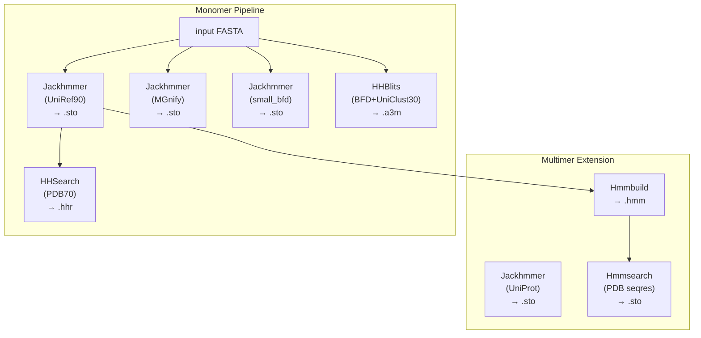
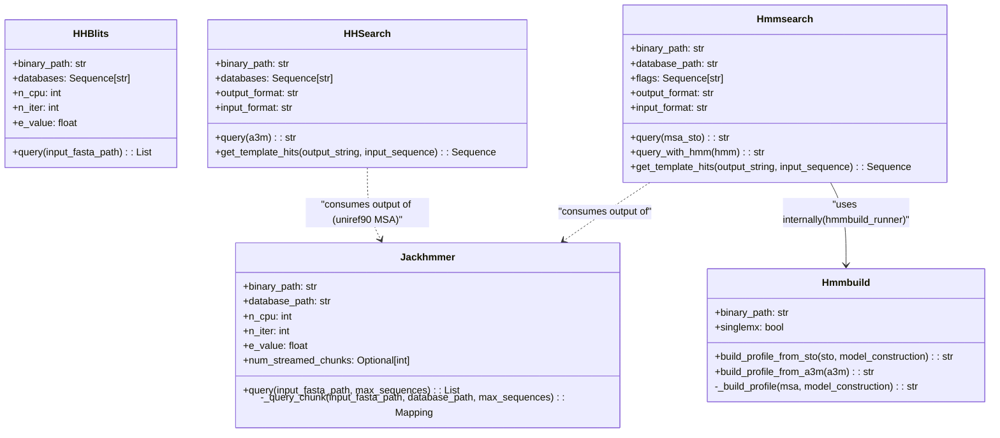

# MSA Generation Tools

> **Relevant source files**
> * [alphafold/common/confidence.py](https://github.com/jcheongs/alphafold-multimer/blob/8e419501/alphafold/common/confidence.py)
> * [alphafold/data/tools/hhblits.py](https://github.com/jcheongs/alphafold-multimer/blob/8e419501/alphafold/data/tools/hhblits.py)
> * [alphafold/data/tools/hhsearch.py](https://github.com/jcheongs/alphafold-multimer/blob/8e419501/alphafold/data/tools/hhsearch.py)
> * [alphafold/data/tools/hmmbuild.py](https://github.com/jcheongs/alphafold-multimer/blob/8e419501/alphafold/data/tools/hmmbuild.py)
> * [alphafold/data/tools/hmmsearch.py](https://github.com/jcheongs/alphafold-multimer/blob/8e419501/alphafold/data/tools/hmmsearch.py)
> * [alphafold/data/tools/jackhmmer.py](https://github.com/jcheongs/alphafold-multimer/blob/8e419501/alphafold/data/tools/jackhmmer.py)
> * [alphafold/model/modules.py](https://github.com/jcheongs/alphafold-multimer/blob/8e419501/alphafold/model/modules.py)

This page documents the five bioinformatics tool wrappers in `alphafold/data/tools/` that generate multiple sequence alignments (MSAs) and HMM profiles used during feature construction. These wrappers are consumed by the monomer and multimer data pipelines described in pages [4.1](/jcheongs/alphafold-multimer/4.1-monomer-data-pipeline) and [4.4](/jcheongs/alphafold-multimer/4.4-multimer-data-pipeline). Template searching (HHSearch and Hmmsearch in template-search mode) is described in more detail in [4.3](/jcheongs/alphafold-multimer/4.3-template-processing); parsers that consume the raw output formats are documented in [4.5](/jcheongs/alphafold-multimer/4.5-data-formats-and-parsers).

---

## Tool Overview

There are five wrapper classes, each encapsulating a subprocess call to an external binary.

**Tool roles at a glance:**

| Class | File | Binary | Input | Output Format | Used For |
| --- | --- | --- | --- | --- | --- |
| `Jackhmmer` | `jackhmmer.py` | `jackhmmer` | FASTA | Stockholm (`.sto`) | MSA against UniRef90, MGnify, UniProt |
| `HHBlits` | `hhblits.py` | `hhblits` | FASTA | A3M | MSA against BFD + UniClust30 |
| `HHSearch` | `hhsearch.py` | `hhsearch` | A3M | HHR | Monomer template search vs PDB70 |
| `Hmmbuild` | `hmmbuild.py` | `hmmbuild` | STO or A3M | HMM profile | Profile construction (used by Hmmsearch) |
| `Hmmsearch` | `hmmsearch.py` | `hmmsearch` | Stockholm (→ HMM via Hmmbuild) | Stockholm | Multimer template search vs PDB seqres |

**Data pipeline diagram — where each tool fits:**



Sources: [alphafold/data/tools/jackhmmer.py L1-L212](https://github.com/jcheongs/alphafold-multimer/blob/8e419501/alphafold/data/tools/jackhmmer.py#L1-L212)

 [alphafold/data/tools/hhblits.py L1-L156](https://github.com/jcheongs/alphafold-multimer/blob/8e419501/alphafold/data/tools/hhblits.py#L1-L156)

 [alphafold/data/tools/hhsearch.py L1-L108](https://github.com/jcheongs/alphafold-multimer/blob/8e419501/alphafold/data/tools/hhsearch.py#L1-L108)

 [alphafold/data/tools/hmmbuild.py L1-L139](https://github.com/jcheongs/alphafold-multimer/blob/8e419501/alphafold/data/tools/hmmbuild.py#L1-L139)

 [alphafold/data/tools/hmmsearch.py L1-L132](https://github.com/jcheongs/alphafold-multimer/blob/8e419501/alphafold/data/tools/hmmsearch.py#L1-L132)

---

## Temporary File Management

All five wrappers follow a consistent pattern for subprocess invocation and I/O. They rely on helpers from `alphafold/data/tools/utils.py`:

* **`utils.tmpdir_manager()`** — context manager that creates a temporary directory, yields its path, and deletes it on exit. All intermediate files (`.sto`, `.a3m`, `.hhr`, `.hmm`) are written here and never left on disk after the call returns.
* **`utils.timing(label)`** — context manager that logs wall-clock time for the enclosed subprocess call.

Every wrapper runs its binary via `subprocess.Popen` with `stdout=subprocess.PIPE, stderr=subprocess.PIPE`, checks the return code, and raises `RuntimeError` on non-zero exit.

Sources: [alphafold/data/tools/jackhmmer.py L95-L164](https://github.com/jcheongs/alphafold-multimer/blob/8e419501/alphafold/data/tools/jackhmmer.py#L95-L164)

 [alphafold/data/tools/hhblits.py L98-L155](https://github.com/jcheongs/alphafold-multimer/blob/8e419501/alphafold/data/tools/hhblits.py#L98-L155)

 [alphafold/data/tools/hhsearch.py L68-L100](https://github.com/jcheongs/alphafold-multimer/blob/8e419501/alphafold/data/tools/hhsearch.py#L68-L100)

 [alphafold/data/tools/hmmbuild.py L101-L138](https://github.com/jcheongs/alphafold-multimer/blob/8e419501/alphafold/data/tools/hmmbuild.py#L101-L138)

 [alphafold/data/tools/hmmsearch.py L81-L119](https://github.com/jcheongs/alphafold-multimer/blob/8e419501/alphafold/data/tools/hmmsearch.py#L81-L119)

---

## Jackhmmer

**Class:** `Jackhmmer` — [alphafold/data/tools/jackhmmer.py L31-L211](https://github.com/jcheongs/alphafold-multimer/blob/8e419501/alphafold/data/tools/jackhmmer.py#L31-L211)

Jackhmmer performs iterative profile HMM search (similar to PSI-BLAST) against a FASTA-format sequence database and returns a Stockholm-format MSA.

### Constructor Parameters

| Parameter | Type | Default | Description |
| --- | --- | --- | --- |
| `binary_path` | `str` | — | Path to the `jackhmmer` executable |
| `database_path` | `str` | — | Path to the FASTA database (or URL prefix in streaming mode) |
| `n_cpu` | `int` | `8` | `--cpu` flag passed to jackhmmer |
| `n_iter` | `int` | `1` | `-N` number of search iterations |
| `e_value` | `float` | `0.0001` | `--incE` / `-E` inclusion E-value threshold |
| `z_value` | `Optional[int]` | `None` | `-Z` database size override |
| `get_tblout` | `bool` | `False` | If `True`, also capture per-sequence tblout table |
| `filter_f1` | `float` | `0.0005` | `--F1` MSV pre-filter pass rate |
| `filter_f2` | `float` | `0.00005` | `--F2` Viterbi pre-filter pass rate |
| `filter_f3` | `float` | `0.0000005` | `--F3` Forward pre-filter pass rate |
| `incdom_e` | `Optional[float]` | `None` | `--incdomE` domain inclusion E-value |
| `dom_e` | `Optional[float]` | `None` | `--domE` domain E-value for tblout |
| `num_streamed_chunks` | `Optional[int]` | `None` | Activates streaming mode; number of remote chunks |
| `streaming_callback` | `Optional[Callable]` | `None` | Called after each chunk with the chunk index |

### Query Interface

**`query(input_fasta_path, max_sequences=None) → Sequence[Mapping[str, Any]]`**

Always returns a **list** of result dicts (one entry per database chunk). Each dict contains:

| Key | Content |
| --- | --- |
| `sto` | Stockholm-format alignment string |
| `tbl` | tblout content (empty string if `get_tblout=False`) |
| `stderr` | Raw stderr bytes from the subprocess |
| `n_iter` | The `n_iter` value used |
| `e_value` | The `e_value` used |

When `max_sequences` is set, the Stockholm file is truncated by calling `parsers.truncate_stockholm_msa()` before being read into memory.

### Streaming Mode

When `num_streamed_chunks` is set, `query()` does not search the full database in one call. Instead it:

1. Uses `urllib.request.urlretrieve` to download database chunk `i` from `{database_path}.{i}` to `/tmp/ramdisk/{basename}.{i}`.
2. Runs `_query_chunk()` against the local copy.
3. Deletes the local copy.
4. Downloads chunk `i+1` in parallel using a `futures.ThreadPoolExecutor(max_workers=2)` — one thread downloads while the other searches.

This is used in the Colab notebook (page [2.4](/jcheongs/alphafold-multimer/2.4-colab-notebook)) where databases are streamed from Google Cloud Storage rather than stored locally.

**Streaming chunk pipeline:**

```mermaid
sequenceDiagram
  participant query()
  participant ThreadPoolExecutor
  participant urlretrieve
  participant _query_chunk()
  participant os.remove()

  query()->>ThreadPoolExecutor: "submit download chunk 1"
  ThreadPoolExecutor->>urlretrieve: "urlretrieve(remote_chunk_1, local_chunk_1)"
  query()->>ThreadPoolExecutor: "submit download chunk 2"
  urlretrieve-->>ThreadPoolExecutor: "chunk 1 ready"
  query()->>_query_chunk(): "_query_chunk(local_chunk_1)"
  _query_chunk()-->>query(): "result_1"
  query()->>os.remove(): "remove local_chunk_1"
  ThreadPoolExecutor->>urlretrieve: "urlretrieve(remote_chunk_2, local_chunk_2)"
  urlretrieve-->>ThreadPoolExecutor: "chunk 2 ready"
  query()->>_query_chunk(): "_query_chunk(local_chunk_2)"
  _query_chunk()-->>query(): "result_2"
  query()->>os.remove(): "remove local_chunk_2"
  query()-->>query(): "return [result_1, result_2, ...]"
```

Sources: [alphafold/data/tools/jackhmmer.py L166-L211](https://github.com/jcheongs/alphafold-multimer/blob/8e419501/alphafold/data/tools/jackhmmer.py#L166-L211)

---

## HHBlits

**Class:** `HHBlits` — [alphafold/data/tools/hhblits.py L31-L155](https://github.com/jcheongs/alphafold-multimer/blob/8e419501/alphafold/data/tools/hhblits.py#L31-L155)

HHBlits performs HMM-HMM comparison against pre-clustered databases and returns an A3M-format alignment. It is used in `full_dbs` mode against BFD + UniClust30.

### Constructor Parameters

| Parameter | Type | Default | Description |
| --- | --- | --- | --- |
| `binary_path` | `str` | — | Path to the `hhblits` executable |
| `databases` | `Sequence[str]` | — | List of database path prefixes (passed as multiple `-d` flags) |
| `n_cpu` | `int` | `4` | `-cpu` flag |
| `n_iter` | `int` | `3` | `-n` number of iterations |
| `e_value` | `float` | `0.001` | `-e` E-value cutoff |
| `maxseq` | `int` | `1_000_000` | `-maxseq` max rows in input alignment |
| `realign_max` | `int` | `100_000` | `-realign_max` max HMM-HMM hits to realign |
| `maxfilt` | `int` | `100_000` | `-maxfilt` max hits passing 2nd prefilter |
| `min_prefilter_hits` | `int` | `1000` | `-min_prefilter_hits` |
| `all_seqs` | `bool` | `False` | If `True`, add `-all` flag (no MSA filtering) |
| `alt` | `Optional[int]` | `None` | `-alt` alternative alignments to show |
| `p` | `int` | `20` | `-p` minimum probability for hits in output |
| `z` | `int` | `500` | `-Z` hard cap on reported hits |

### Query Interface

**`query(input_fasta_path) → List[Mapping[str, Any]]`**

Returns a single-element list (consistent with Jackhmmer's interface) containing:

| Key | Content |
| --- | --- |
| `a3m` | A3M-format alignment string |
| `output` | Raw stdout bytes |
| `stderr` | Raw stderr bytes |
| `n_iter` | Iterations used |
| `e_value` | E-value used |

The binary writes its alignment to a temp file (`output.a3m`) and stdout is redirected to `/dev/null`. The A3M content is read from the temp file.

Sources: [alphafold/data/tools/hhblits.py L97-L155](https://github.com/jcheongs/alphafold-multimer/blob/8e419501/alphafold/data/tools/hhblits.py#L97-L155)

---

## HHSearch

**Class:** `HHSearch` — [alphafold/data/tools/hhsearch.py L29-L108](https://github.com/jcheongs/alphafold-multimer/blob/8e419501/alphafold/data/tools/hhsearch.py#L29-L108)

HHSearch compares a query profile (A3M) against a profile database and returns an HHR-format hit file. It is used in the monomer pipeline for template searching against PDB70.

### Constructor Parameters

| Parameter | Type | Default | Description |
| --- | --- | --- | --- |
| `binary_path` | `str` | — | Path to the `hhsearch` executable |
| `databases` | `Sequence[str]` | — | List of database path prefixes (multiple `-d` flags) |
| `maxseq` | `int` | `1_000_000` | `-maxseq` max input alignment rows |

At construction time, each database path is validated by globbing for `{path}_*` files. A `ValueError` is raised if none exist.

### Query Interface

**`query(a3m: str) → str`**

* Accepts an A3M string (the query profile).
* Writes it to a temp file and runs `hhsearch -i query.a3m -o output.hhr`.
* Returns the HHR file content as a string.

**`get_template_hits(output_string, input_sequence) → Sequence[parsers.TemplateHit]`**

* Delegates to `parsers.parse_hhr(output_string)`.
* `input_sequence` is ignored (accepted for interface compatibility with `Hmmsearch`).

| Property | Value |
| --- | --- |
| `output_format` | `'hhr'` |
| `input_format` | `'a3m'` |

Sources: [alphafold/data/tools/hhsearch.py L29-L108](https://github.com/jcheongs/alphafold-multimer/blob/8e419501/alphafold/data/tools/hhsearch.py#L29-L108)

---

## Hmmbuild

**Class:** `Hmmbuild` — [alphafold/data/tools/hmmbuild.py L26-L138](https://github.com/jcheongs/alphafold-multimer/blob/8e419501/alphafold/data/tools/hmmbuild.py#L26-L138)

Hmmbuild constructs a HMMER profile (`.hmm`) from an existing MSA. It is used internally by `Hmmsearch` and is not called directly by the data pipelines.

### Constructor Parameters

| Parameter | Type | Default | Description |
| --- | --- | --- | --- |
| `binary_path` | `str` | — | Path to the `hmmbuild` executable |
| `singlemx` | `bool` | `False` | If `True`, adds `--singlemx` (use a single substitution matrix) |

### Build Interface

Two public entry points both delegate to `_build_profile()`:

| Method | Input | Notes |
| --- | --- | --- |
| `build_profile_from_sto(sto, model_construction='fast')` | Stockholm string | `model_construction='hand'` uses reference annotation columns |
| `build_profile_from_a3m(a3m)` | A3M string | Strips lowercase inserted residues before calling `_build_profile` |

**`_build_profile(msa, model_construction='fast') → str`**

* Writes the MSA to a temp file.
* Runs: `hmmbuild [--hand] [--singlemx] --amino output.hmm query.msa`
* Returns the HMM profile as a string.
* Always uses `--amino` to force protein mode.

Sources: [alphafold/data/tools/hmmbuild.py L26-L138](https://github.com/jcheongs/alphafold-multimer/blob/8e419501/alphafold/data/tools/hmmbuild.py#L26-L138)

---

## Hmmsearch

**Class:** `Hmmsearch` — [alphafold/data/tools/hmmsearch.py L28-L131](https://github.com/jcheongs/alphafold-multimer/blob/8e419501/alphafold/data/tools/hmmsearch.py#L28-L131)

Hmmsearch searches a protein sequence database with a profile HMM. It wraps both `hmmbuild` and `hmmsearch` binaries: given a Stockholm MSA, it first builds a profile with `Hmmbuild`, then searches with `hmmsearch`. It is used in the multimer pipeline for template searching against PDB seqres.

### Constructor Parameters

| Parameter | Type | Default | Description |
| --- | --- | --- | --- |
| `binary_path` | `str` | — | Path to the `hmmsearch` executable |
| `hmmbuild_binary_path` | `str` | — | Path to `hmmbuild`; used to instantiate an internal `Hmmbuild` |
| `database_path` | `str` | — | Path to the FASTA-format sequence database |
| `flags` | `Optional[Sequence[str]]` | See below | Extra CLI flags passed to `hmmsearch` |

**Default flags** (applied when `flags=None`):

```
--F1 0.1  --F2 0.1  --F3 0.1
--incE 100  -E 100  --domE 100  --incdomE 100
```

These permissive defaults pass nearly all hits through; downstream filtering is done by the template featurizer (page [4.3](/jcheongs/alphafold-multimer/4.3-template-processing)).

### Query Interface

**`query(msa_sto: str) → str`**

1. Calls `self.hmmbuild_runner.build_profile_from_sto(msa_sto, model_construction='hand')` to produce an HMM string.
2. Passes the HMM to `query_with_hmm()`.

**`query_with_hmm(hmm: str) → str`**

* Writes the HMM to a temp file.
* Runs: `hmmsearch --noali --cpu 8 [flags] -A output.sto query.hmm {database_path}`
* Returns the Stockholm-format alignment as a string.

**`get_template_hits(output_string, input_sequence) → Sequence[parsers.TemplateHit]`**

1. Converts the Stockholm output to A3M via `parsers.convert_stockholm_to_a3m(output_string, remove_first_row_gaps=False)`.
2. Parses template hits via `parsers.parse_hmmsearch_a3m(query_sequence=input_sequence, a3m_string=a3m_string, skip_first=False)`.

| Property | Value |
| --- | --- |
| `output_format` | `'sto'` |
| `input_format` | `'sto'` |

Sources: [alphafold/data/tools/hmmsearch.py L28-L131](https://github.com/jcheongs/alphafold-multimer/blob/8e419501/alphafold/data/tools/hmmsearch.py#L28-L131)

---

## Class Relationship Diagram

The following diagram shows how the five wrapper classes relate to each other and to upstream callers in the data pipelines.



Sources: [alphafold/data/tools/jackhmmer.py L31-L88](https://github.com/jcheongs/alphafold-multimer/blob/8e419501/alphafold/data/tools/jackhmmer.py#L31-L88)

 [alphafold/data/tools/hhblits.py L31-L95](https://github.com/jcheongs/alphafold-multimer/blob/8e419501/alphafold/data/tools/hhblits.py#L31-L95)

 [alphafold/data/tools/hhsearch.py L29-L57](https://github.com/jcheongs/alphafold-multimer/blob/8e419501/alphafold/data/tools/hhsearch.py#L29-L57)

 [alphafold/data/tools/hmmbuild.py L26-L44](https://github.com/jcheongs/alphafold-multimer/blob/8e419501/alphafold/data/tools/hmmbuild.py#L26-L44)

 [alphafold/data/tools/hmmsearch.py L28-L65](https://github.com/jcheongs/alphafold-multimer/blob/8e419501/alphafold/data/tools/hmmsearch.py#L28-L65)

---

## Output Format Summary

```mermaid
flowchart TD

HMS_IN["Stockholm string"]
HMS_MID["HMM profile<br>(via Hmmbuild)"]
HMS_OUT["Stockholm .sto"]
TH2["Sequence[TemplateHit]"]
HMMBLD_IN["STO or A3M string"]
HMMBLD_OUT["HMM profile string"]
HHS_IN["A3M string"]
HHS_OUT["HHR .hhr"]
TH1["Sequence[TemplateHit]"]
HHB_IN["FASTA file"]
HHB_OUT["A3M .a3m"]
JH_IN["FASTA file"]
JH_OUT["Stockholm .sto<br>+ optional tblout"]

subgraph Hmmsearch ["Hmmsearch"]
    HMS_IN
    HMS_MID
    HMS_OUT
    TH2
    HMS_IN --> HMS_MID
    HMS_MID --> HMS_OUT
    HMS_OUT --> TH2
end

subgraph Hmmbuild ["Hmmbuild"]
    HMMBLD_IN
    HMMBLD_OUT
    HMMBLD_IN --> HMMBLD_OUT
end

subgraph HHSearch ["HHSearch"]
    HHS_IN
    HHS_OUT
    TH1
    HHS_IN --> HHS_OUT
    HHS_OUT --> TH1
end

subgraph HHBlits ["HHBlits"]
    HHB_IN
    HHB_OUT
    HHB_IN --> HHB_OUT
end

subgraph Jackhmmer ["Jackhmmer"]
    JH_IN
    JH_OUT
    JH_IN --> JH_OUT
end
```



Sources: [alphafold/data/tools/jackhmmer.py L151-L164](https://github.com/jcheongs/alphafold-multimer/blob/8e419501/alphafold/data/tools/jackhmmer.py#L151-L164)

 [alphafold/data/tools/hhblits.py L148-L155](https://github.com/jcheongs/alphafold-multimer/blob/8e419501/alphafold/data/tools/hhblits.py#L148-L155)

 [alphafold/data/tools/hhsearch.py L59-L66](https://github.com/jcheongs/alphafold-multimer/blob/8e419501/alphafold/data/tools/hhsearch.py#L59-L66)

 [alphafold/data/tools/hmmsearch.py L67-L73](https://github.com/jcheongs/alphafold-multimer/blob/8e419501/alphafold/data/tools/hmmsearch.py#L67-L73)

 [alphafold/data/tools/hmmsearch.py L121-L131](https://github.com/jcheongs/alphafold-multimer/blob/8e419501/alphafold/data/tools/hmmsearch.py#L121-L131)