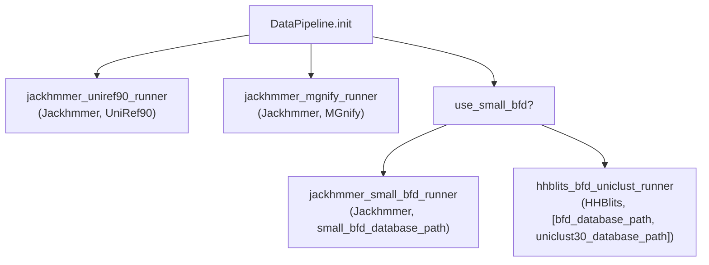
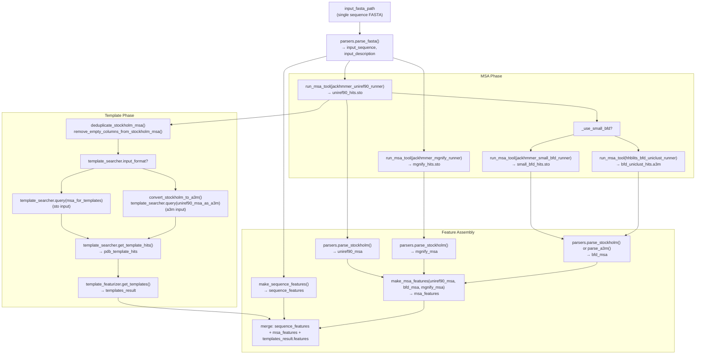
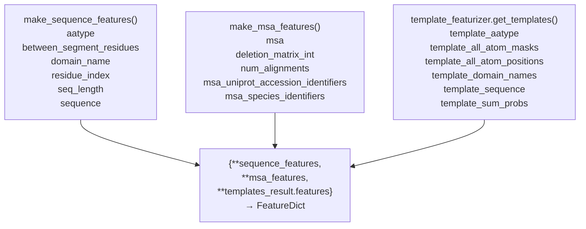

# Monomer Data Pipeline

> **Relevant source files**
> * [alphafold/data/parsers.py](https://github.com/jcheongs/alphafold-multimer/blob/8e419501/alphafold/data/parsers.py)
> * [alphafold/data/pipeline.py](https://github.com/jcheongs/alphafold-multimer/blob/8e419501/alphafold/data/pipeline.py)

## Purpose and Scope

This page documents the monomer data pipeline implemented in [alphafold/data/pipeline.py](https://github.com/jcheongs/alphafold-multimer/blob/8e419501/alphafold/data/pipeline.py)

 It covers the `DataPipeline` class, all MSA search steps, the template search branch, and the feature assembly functions that produce the final `FeatureDict` passed to the model.

This pipeline is used directly for monomer predictions (`monomer`, `monomer_ptm`, `monomer_casp14` presets) and also as a per-chain subroutine inside the multimer pipeline. For details on how the multimer pipeline wraps and extends this output, see [4.4](/jcheongs/alphafold-multimer/4.4-multimer-data-pipeline). For the bioinformatics tool wrappers themselves (Jackhmmer, HHBlits, HHSearch, Hmmsearch), see [4.2](/jcheongs/alphafold-multimer/4.2-msa-generation-tools). For template featurization, see [4.3](/jcheongs/alphafold-multimer/4.3-template-processing).

---

## Key Types

| Symbol | Location | Description |
| --- | --- | --- |
| `DataPipeline` | [alphafold/data/pipeline.py L116-L248](https://github.com/jcheongs/alphafold-multimer/blob/8e419501/alphafold/data/pipeline.py#L116-L248) | Main class; owns all tool runners and drives the pipeline |
| `FeatureDict` | [alphafold/data/pipeline.py L32](https://github.com/jcheongs/alphafold-multimer/blob/8e419501/alphafold/data/pipeline.py#L32-L32) | Type alias for `MutableMapping[str, np.ndarray]` |
| `TemplateSearcher` | [alphafold/data/pipeline.py L33](https://github.com/jcheongs/alphafold-multimer/blob/8e419501/alphafold/data/pipeline.py#L33-L33) | Union of `HHSearch` and `Hmmsearch` |
| `make_sequence_features` | [alphafold/data/pipeline.py L36-L50](https://github.com/jcheongs/alphafold-multimer/blob/8e419501/alphafold/data/pipeline.py#L36-L50) | Builds sequence-level features from the raw FASTA |
| `make_msa_features` | [alphafold/data/pipeline.py L53-L89](https://github.com/jcheongs/alphafold-multimer/blob/8e419501/alphafold/data/pipeline.py#L53-L89) | Merges and encodes MSA hits from all sources |
| `run_msa_tool` | [alphafold/data/pipeline.py L92-L113](https://github.com/jcheongs/alphafold-multimer/blob/8e419501/alphafold/data/pipeline.py#L92-L113) | Caching wrapper around any MSA runner |

---

## DataPipeline Constructor

`DataPipeline.__init__` [alphafold/data/pipeline.py L119-L153](https://github.com/jcheongs/alphafold-multimer/blob/8e419501/alphafold/data/pipeline.py#L119-L153)

 accepts the following parameters:

| Parameter | Type | Purpose |
| --- | --- | --- |
| `jackhmmer_binary_path` | `str` | Path to the Jackhmmer binary |
| `hhblits_binary_path` | `str` | Path to the HHBlits binary |
| `uniref90_database_path` | `str` | UniRef90 FASTA database |
| `mgnify_database_path` | `str` | MGnify FASTA database |
| `bfd_database_path` | `Optional[str]` | BFD database (required when `use_small_bfd=False`) |
| `uniclust30_database_path` | `Optional[str]` | UniClust30 database (required when `use_small_bfd=False`) |
| `small_bfd_database_path` | `Optional[str]` | Reduced BFD database (required when `use_small_bfd=True`) |
| `template_searcher` | `TemplateSearcher` | Either `HHSearch` or `Hmmsearch` instance |
| `template_featurizer` | `TemplateHitFeaturizer` | Converts template hits to numeric arrays |
| `use_small_bfd` | `bool` | Selects between reduced and full database paths |
| `mgnify_max_hits` | `int` | Cap on MGnify sequences (default: `501`) |
| `uniref_max_hits` | `int` | Cap on UniRef90 sequences (default: `10000`) |
| `use_precomputed_msas` | `bool` | If `True`, reuse previously saved MSA files |

The constructor conditionally instantiates either `jackhmmer_small_bfd_runner` or `hhblits_bfd_uniclust_runner` depending on `use_small_bfd`:

**DataPipeline: BFD Runner Selection**



Sources: [alphafold/data/pipeline.py L119-L153](https://github.com/jcheongs/alphafold-multimer/blob/8e419501/alphafold/data/pipeline.py#L119-L153)

---

## process() Method Flow

`DataPipeline.process(input_fasta_path, msa_output_dir)` [alphafold/data/pipeline.py L155-L248](https://github.com/jcheongs/alphafold-multimer/blob/8e419501/alphafold/data/pipeline.py#L155-L248)

 accepts a single-sequence FASTA file and an output directory. It raises `ValueError` if the FASTA contains more than one sequence.

The method proceeds in four logical phases:

1. **MSA generation** — run Jackhmmer against UniRef90 and MGnify; run either Jackhmmer against small BFD or HHBlits against BFD+UniClust30
2. **Template search** — derive a cleaned MSA from UniRef90 hits and pass it to the `template_searcher`
3. **Feature assembly** — encode the sequence, merge MSAs, featurize templates
4. **Return** — merge all sub-dictionaries into a single `FeatureDict`

**process() Method: Step-by-Step Data Flow**



Sources: [alphafold/data/pipeline.py L155-L248](https://github.com/jcheongs/alphafold-multimer/blob/8e419501/alphafold/data/pipeline.py#L155-L248)

---

## MSA Sequence Caps

Jackhmmer's streaming mode accepts a `max_sequences` argument to limit how many sequences it retains from the database. The caps configured in the constructor are applied inside `run_msa_tool`:

| Database | Runner | Default Cap | Output Format |
| --- | --- | --- | --- |
| UniRef90 | `jackhmmer_uniref90_runner` | `uniref_max_hits=10000` | Stockholm (`.sto`) |
| MGnify | `jackhmmer_mgnify_runner` | `mgnify_max_hits=501` | Stockholm (`.sto`) |
| Small BFD | `jackhmmer_small_bfd_runner` | No cap | Stockholm (`.sto`) |
| BFD + UniClust30 | `hhblits_bfd_uniclust_runner` | No cap | A3M (`.a3m`) |

Sources: [alphafold/data/pipeline.py L92-L113](https://github.com/jcheongs/alphafold-multimer/blob/8e419501/alphafold/data/pipeline.py#L92-L113)

 [alphafold/data/pipeline.py L167-L226](https://github.com/jcheongs/alphafold-multimer/blob/8e419501/alphafold/data/pipeline.py#L167-L226)

---

## run_msa_tool: Caching Helper

`run_msa_tool` [alphafold/data/pipeline.py L92-L113](https://github.com/jcheongs/alphafold-multimer/blob/8e419501/alphafold/data/pipeline.py#L92-L113)

 wraps any MSA runner to provide transparent file-based caching:

* If `use_precomputed_msas=True` **and** `msa_out_path` exists on disk, the tool is **not** re-run. The cached file is read back instead.
* When reading a cached `.sto` file with a `max_sto_sequences` cap, `parsers.truncate_stockholm_msa()` is applied in-memory to avoid loading the full file.
* Otherwise, the runner's `query()` method is called. For Stockholm format with a cap, it uses the two-argument `query(input_fasta_path, max_sto_sequences)` form (Jackhmmer's streaming interface). The result is written to disk.

```python
run_msa_tool(msa_runner, input_fasta_path, msa_out_path, msa_format, use_precomputed_msas, max_sto_sequences)
   │
   ├─ use_precomputed_msas=True AND file exists → read from disk
   │     └─ sto + max_sto_sequences? → truncate_stockholm_msa()
   │
   └─ otherwise → msa_runner.query(...)  → write to disk
         └─ sto + max_sto_sequences? → query(path, max_sto_sequences)
```

Sources: [alphafold/data/pipeline.py L92-L113](https://github.com/jcheongs/alphafold-multimer/blob/8e419501/alphafold/data/pipeline.py#L92-L113)

---

## Template Search Using UniRef90 MSA

The pipeline reuses the UniRef90 MSA (not the raw query) as the input to the template searcher. Before querying, the Stockholm string is cleaned to remove redundancy and uninformative columns:

1. `parsers.deduplicate_stockholm_msa(msa_for_templates)` — removes sequences that are identical to another hit after masking out insertion columns relative to the query [alphafold/data/parsers.py L340-L372](https://github.com/jcheongs/alphafold-multimer/blob/8e419501/alphafold/data/parsers.py#L340-L372)
2. `parsers.remove_empty_columns_from_stockholm_msa(msa_for_templates)` — strips columns where every row contains only gaps [alphafold/data/parsers.py L300-L337](https://github.com/jcheongs/alphafold-multimer/blob/8e419501/alphafold/data/parsers.py#L300-L337)

The cleaned MSA is then dispatched based on `template_searcher.input_format`:

* `'sto'` → passed directly (used by `HHSearch`)
* `'a3m'` → first converted via `parsers.convert_stockholm_to_a3m()`, then passed (used by `Hmmsearch`)

Template hits are saved to `pdb_hits.hhr` or `pdb_hits.a3m` depending on the searcher's `output_format`.

Sources: [alphafold/data/pipeline.py L184-L207](https://github.com/jcheongs/alphafold-multimer/blob/8e419501/alphafold/data/pipeline.py#L184-L207)

---

## make_sequence_features

[alphafold/data/pipeline.py L36-L50](https://github.com/jcheongs/alphafold-multimer/blob/8e419501/alphafold/data/pipeline.py#L36-L50)

Takes the raw `sequence` string, `description` line, and `num_res` count. Returns:

| Feature Key | Shape | dtype | Description |
| --- | --- | --- | --- |
| `aatype` | `(num_res, 21)` | `int32` | One-hot encoding using `restype_order_with_x`; unknowns mapped to X |
| `between_segment_residues` | `(num_res,)` | `int32` | All zeros (single-chain) |
| `domain_name` | `(1,)` | `object` | UTF-8 encoded description string |
| `residue_index` | `(num_res,)` | `int32` | `[0, 1, 2, ..., num_res-1]` |
| `seq_length` | `(num_res,)` | `int32` | `num_res` repeated `num_res` times |
| `sequence` | `(1,)` | `object` | UTF-8 encoded sequence string |

Sources: [alphafold/data/pipeline.py L36-L50](https://github.com/jcheongs/alphafold-multimer/blob/8e419501/alphafold/data/pipeline.py#L36-L50)

---

## make_msa_features

[alphafold/data/pipeline.py L53-L89](https://github.com/jcheongs/alphafold-multimer/blob/8e419501/alphafold/data/pipeline.py#L53-L89)

Accepts a sequence of `parsers.Msa` objects (one per source database) and merges them into a single feature set. Sequences are deduplicated globally across all sources — a sequence seen in UniRef90 will be skipped if it appears again in BFD or MGnify.

The MSA order passed in `process()` is:

```
make_msa_features((uniref90_msa, bfd_msa, mgnify_msa))
```

For each unique sequence, species and UniProt accession identifiers are extracted from the sequence description via `msa_identifiers.get_identifiers()`.

Output features:

| Feature Key | Shape | dtype | Description |
| --- | --- | --- | --- |
| `msa` | `(num_alignments, num_res)` | `int32` | Integer-encoded residues using `HHBLITS_AA_TO_ID` |
| `deletion_matrix_int` | `(num_alignments, num_res)` | `int32` | Deletion counts per position |
| `num_alignments` | `(num_res,)` | `int32` | Total deduplicated alignment count (repeated) |
| `msa_uniprot_accession_identifiers` | `(num_alignments,)` | `object` | Per-sequence UniProt accession |
| `msa_species_identifiers` | `(num_alignments,)` | `object` | Per-sequence species identifier |

Sources: [alphafold/data/pipeline.py L53-L89](https://github.com/jcheongs/alphafold-multimer/blob/8e419501/alphafold/data/pipeline.py#L53-L89)

---

## Final FeatureDict Composition

`process()` returns a single merged dictionary:

**FeatureDict Output Assembly**



This combined dictionary is returned to `run_alphafold.predict_structure()` for the monomer path, or to `pipeline_multimer.DataPipeline._process_single_chain()` for the multimer path.

Sources: [alphafold/data/pipeline.py L232-L248](https://github.com/jcheongs/alphafold-multimer/blob/8e419501/alphafold/data/pipeline.py#L232-L248)

---

## File Outputs

For each call to `process()`, the following files are written to `msa_output_dir`:

| Filename | Producer | Format |
| --- | --- | --- |
| `uniref90_hits.sto` | `jackhmmer_uniref90_runner` | Stockholm |
| `mgnify_hits.sto` | `jackhmmer_mgnify_runner` | Stockholm |
| `small_bfd_hits.sto` | `jackhmmer_small_bfd_runner` | Stockholm (reduced only) |
| `bfd_uniclust_hits.a3m` | `hhblits_bfd_uniclust_runner` | A3M (full only) |
| `pdb_hits.hhr` or `pdb_hits.a3m` | `template_searcher` | HHR or A3M |

These files serve as a cache when `use_precomputed_msas=True` on subsequent runs.

Sources: [alphafold/data/pipeline.py L167-L226](https://github.com/jcheongs/alphafold-multimer/blob/8e419501/alphafold/data/pipeline.py#L167-L226)

 [alphafold/data/pipeline.py L198-L201](https://github.com/jcheongs/alphafold-multimer/blob/8e419501/alphafold/data/pipeline.py#L198-L201)