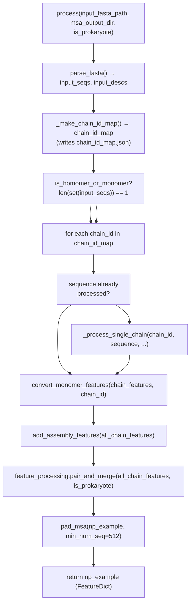
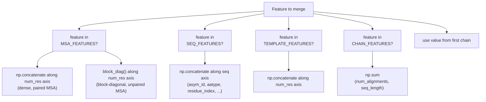

# Multimer Data Pipeline

> **Relevant source files**
> * [alphafold/data/msa_pairing.py](https://github.com/jcheongs/alphafold-multimer/blob/8e419501/alphafold/data/msa_pairing.py)
> * [alphafold/data/pipeline_multimer.py](https://github.com/jcheongs/alphafold-multimer/blob/8e419501/alphafold/data/pipeline_multimer.py)

This page documents the multimer-specific feature construction pipeline: how a multi-chain FASTA is processed per-chain, how monomer features are reshaped and annotated for assembly, and how MSA sequences from multiple chains are paired and merged into a single `FeatureDict` for model input.

For the monomer pipeline that runs as a sub-step here, see [Monomer Data Pipeline](/jcheongs/alphafold-multimer/4.1-monomer-data-pipeline). For the MSA tool wrappers (Jackhmmer, HHBlits, etc.) used internally, see [MSA Generation Tools](/jcheongs/alphafold-multimer/4.2-msa-generation-tools). For the final feature schema consumed by the model, see [Protein Feature Schema](/jcheongs/alphafold-multimer/5.2-protein-feature-schema).

---

## Entry Point: DataPipeline

The `DataPipeline` class in [alphafold/data/pipeline_multimer.py L170-L288](https://github.com/jcheongs/alphafold-multimer/blob/8e419501/alphafold/data/pipeline_multimer.py#L170-L288)

 is the top-level orchestrator for the multimer path. It wraps a `pipeline.DataPipeline` (the monomer pipeline) and adds:

* Per-chain MSA construction via the monomer pipeline
* A separate UniProt Jackhmmer search for heteromer pairing
* Assembly feature annotation (`asym_id`, `sym_id`, `entity_id`)
* MSA pairing and merging via `feature_processing.pair_and_merge`
* Final MSA padding

### Constructor Parameters

| Parameter | Type | Purpose |
| --- | --- | --- |
| `monomer_data_pipeline` | `pipeline.DataPipeline` | Runs the full monomer pipeline per chain |
| `jackhmmer_binary_path` | `str` | Path to the Jackhmmer binary |
| `uniprot_database_path` | `str` | Path to the unclustered UniProt FASTA, used for pairing |
| `max_uniprot_hits` | `int` | Cap on UniProt MSA rows (default: 50,000) |
| `use_precomputed_msas` | `bool` | If True, skip tool runs and read cached results |

Sources: [alphafold/data/pipeline_multimer.py L170-L196](https://github.com/jcheongs/alphafold-multimer/blob/8e419501/alphafold/data/pipeline_multimer.py#L170-L196)

---

## process() Method: High-Level Flow

The `process()` method [alphafold/data/pipeline_multimer.py L241-L288](https://github.com/jcheongs/alphafold-multimer/blob/8e419501/alphafold/data/pipeline_multimer.py#L241-L288)

 takes a multi-chain FASTA and returns a merged `FeatureDict`.

**Diagram: `DataPipeline.process()` Control Flow**



Sources: [alphafold/data/pipeline_multimer.py L241-L288](https://github.com/jcheongs/alphafold-multimer/blob/8e419501/alphafold/data/pipeline_multimer.py#L241-L288)

---

## Step 1: Per-Chain Processing (_process_single_chain)

[alphafold/data/pipeline_multimer.py L197-L222](https://github.com/jcheongs/alphafold-multimer/blob/8e419501/alphafold/data/pipeline_multimer.py#L197-L222)

For each chain:

1. A temporary single-chain FASTA file is written.
2. The monomer pipeline (`self._monomer_data_pipeline.process()`) runs, producing a standard monomer `FeatureDict`.
3. If the complex is a **heteromer** (more than one unique sequence), `_all_seq_msa_features()` runs a separate Jackhmmer search against UniProt. The results are stored as `_all_seq` suffixed features (e.g., `msa_all_seq`, `msa_species_identifiers_all_seq`).

> **Key distinction:** The homomer/monomer path skips the UniProt search entirely. The `is_homomer_or_monomer` flag is derived at the top of `process()` by checking `len(set(input_seqs)) == 1`.

### _all_seq_msa_features(): UniProt Search

[alphafold/data/pipeline_multimer.py L224-L239](https://github.com/jcheongs/alphafold-multimer/blob/8e419501/alphafold/data/pipeline_multimer.py#L224-L239)

* Runs Jackhmmer against `uniprot_database_path`, writing `uniprot_hits.sto`.
* Parses the result with `parsers.parse_stockholm()`.
* Truncates to `max_uniprot_hits` rows.
* Calls `pipeline.make_msa_features()` and renames each key with `_all_seq` suffix.
* The `msa_uniprot_accession_identifiers_all_seq` and `msa_species_identifiers_all_seq` features are required for pairing.

Sources: [alphafold/data/pipeline_multimer.py L197-L239](https://github.com/jcheongs/alphafold-multimer/blob/8e419501/alphafold/data/pipeline_multimer.py#L197-L239)

---

## Step 2: convert_monomer_features()

[alphafold/data/pipeline_multimer.py L72-L94](https://github.com/jcheongs/alphafold-multimer/blob/8e419501/alphafold/data/pipeline_multimer.py#L72-L94)

Reshapes monomer features to the format expected by the multimer model:

| Transformation | Detail |
| --- | --- |
| Strip leading dim from scalar features | `sequence`, `domain_name`, `num_alignments`, `seq_length` are reduced from shape `[1]` to scalars |
| `aatype` | Converted from one-hot to integer indices via `np.argmax(..., axis=-1)` |
| `template_aatype` | One-hot → integer index → remapped with `MAP_HHBLITS_AATYPE_TO_OUR_AATYPE` |
| `template_all_atom_masks` | Key renamed to `template_all_atom_mask` (no trailing `s`) |
| `auth_chain_id` | Added; stores the PDB-style chain letter (e.g., `"A"`) |

Sources: [alphafold/data/pipeline_multimer.py L72-L94](https://github.com/jcheongs/alphafold-multimer/blob/8e419501/alphafold/data/pipeline_multimer.py#L72-L94)

---

## Step 3: add_assembly_features()

[alphafold/data/pipeline_multimer.py L119-L155](https://github.com/jcheongs/alphafold-multimer/blob/8e419501/alphafold/data/pipeline_multimer.py#L119-L155)

Annotates each chain with three per-residue integer arrays that allow the model to distinguish chains and entities:

| Feature | Meaning | How assigned |
| --- | --- | --- |
| `asym_id` | Unique chain instance ID (1, 2, 3, …) | Monotonically incremented for every chain |
| `entity_id` | Unique sequence type ID (1, 2, …) | Shared by all chains with identical sequence |
| `sym_id` | Copy number within an entity (1, 2, …) | Incremented for each additional chain with same sequence |

All three arrays have shape `[seq_length]` with a constant value across the chain.

The function also renames the chain keys from `{"A": ..., "B": ...}` to `{"A_1": ..., "B_1": ...}` (or `"A_1"`, `"A_2"` for homomers), using the helper `int_id_to_str_id()` [alphafold/data/pipeline_multimer.py L97-L116](https://github.com/jcheongs/alphafold-multimer/blob/8e419501/alphafold/data/pipeline_multimer.py#L97-L116)

**Example — Heterodimer A+B:**

| Chain | `entity_id` | `sym_id` | `asym_id` | Key |
| --- | --- | --- | --- | --- |
| A | 1 | 1 | 1 | `A_1` |
| B | 2 | 1 | 2 | `B_1` |

**Example — Homotrimer A+A+A:**

| Chain | `entity_id` | `sym_id` | `asym_id` | Key |
| --- | --- | --- | --- | --- |
| A (copy 1) | 1 | 1 | 1 | `A_1` |
| A (copy 2) | 1 | 2 | 2 | `A_2` |
| A (copy 3) | 1 | 3 | 3 | `A_3` |

Sources: [alphafold/data/pipeline_multimer.py L119-L155](https://github.com/jcheongs/alphafold-multimer/blob/8e419501/alphafold/data/pipeline_multimer.py#L119-L155)

---

## Step 4: MSA Pairing and Merging (feature_processing.pair_and_merge)

This step takes the per-chain feature dictionaries (already annotated with assembly features) and produces a single merged `FeatureDict` for the whole complex. The core logic lives in [alphafold/data/msa_pairing.py](https://github.com/jcheongs/alphafold-multimer/blob/8e419501/alphafold/data/msa_pairing.py)

### Pairing Logic (pair_sequences)

[alphafold/data/msa_pairing.py L325-L391](https://github.com/jcheongs/alphafold-multimer/blob/8e419501/alphafold/data/msa_pairing.py#L325-L391)

MSA sequences from different chains are paired by species (via `msa_species_identifiers_all_seq`). Within a species, the matching strategy depends on the `prokaryotic` flag:

| Organism type | Strategy | Function |
| --- | --- | --- |
| Prokaryote | **Genetic distance** — pair by UniProt accession ID proximity | `_match_rows_by_genetic_distance()` |
| Eukaryote | **Sequence similarity** — sort by similarity to query, zip | `_match_rows_by_sequence_similarity()` |

#### Prokaryote: Genetic Distance Matching

[alphafold/data/msa_pairing.py L232-L286](https://github.com/jcheongs/alphafold-multimer/blob/8e419501/alphafold/data/msa_pairing.py#L232-L286)

* UniProt accession IDs are encoded as integers via `encode_accession()` [alphafold/data/msa_pairing.py L156-L180](https://github.com/jcheongs/alphafold-multimer/blob/8e419501/alphafold/data/msa_pairing.py#L156-L180)
* Pairs of accession IDs whose encoded values differ by less than `diff_cutoff=20` are considered a match (a proxy for genomic proximity / operons).
* A sequence is excluded if it is too similar to the query (`msa_similarity > 0.9`) or has too many gaps (`gap > 0.5`).

#### Eukaryote: Sequence Similarity Matching

[alphafold/data/msa_pairing.py L289-L322](https://github.com/jcheongs/alphafold-multimer/blob/8e419501/alphafold/data/msa_pairing.py#L289-L322)

* Within each species, sequences from each chain are sorted by similarity to their chain's query sequence (descending).
* The top-N sequences (where N is limited by the smallest chain's species MSA count) are zipped positionally across chains.

#### Ordering of Paired Rows

`reorder_paired_rows()` [alphafold/data/msa_pairing.py L394-L417](https://github.com/jcheongs/alphafold-multimer/blob/8e419501/alphafold/data/msa_pairing.py#L394-L417)

 sorts the final list of paired row-index tuples so that rows paired across **all** chains appear first, followed by rows paired across fewer chains.

Sources: [alphafold/data/msa_pairing.py L325-L417](https://github.com/jcheongs/alphafold-multimer/blob/8e419501/alphafold/data/msa_pairing.py#L325-L417)

---

### Merging Strategy

After pairing, chains are merged into a single feature dictionary. The merge strategy differs by feature class:

**Diagram: MSA Merging Strategies by Feature Type**



Sources: [alphafold/data/msa_pairing.py L498-L529](https://github.com/jcheongs/alphafold-multimer/blob/8e419501/alphafold/data/msa_pairing.py#L498-L529)

#### Homomer Dense Merging

Before the final block-diagonal merge, `_merge_homomers_dense_msa()` [alphafold/data/msa_pairing.py L532-L556](https://github.com/jcheongs/alphafold-multimer/blob/8e419501/alphafold/data/msa_pairing.py#L532-L556)

 groups chains sharing the same `entity_id` and concatenates their MSA features along the residue axis (`pair_msa_sequences=True`). This produces a dense MSA for repeated chains rather than a block-diagonal one.

#### Bert Mask and Cluster Bias Mask

After merging, `_correct_post_merged_feats()` [alphafold/data/msa_pairing.py L429-L473](https://github.com/jcheongs/alphafold-multimer/blob/8e419501/alphafold/data/msa_pairing.py#L429-L473)

 computes two auxiliary masks:

* **`bert_mask`**: Initialized as block-diagonal (ones on each chain's MSA block, zeros off-diagonal). When paired MSA features are present, the paired rows are prepended with a fully dense mask section.
* **`cluster_bias_mask`**: A 1D binary vector of length `num_msa_sequences`. When using unpaired MSA, it is 1 at the first row of each chain block (forcing query sequences into cluster centers). When using paired MSA, only row 0 is set to 1.

Sources: [alphafold/data/msa_pairing.py L429-L473](https://github.com/jcheongs/alphafold-multimer/blob/8e419501/alphafold/data/msa_pairing.py#L429-L473)

 [alphafold/data/msa_pairing.py L532-L556](https://github.com/jcheongs/alphafold-multimer/blob/8e419501/alphafold/data/msa_pairing.py#L532-L556)

---

## Step 5: pad_msa()

[alphafold/data/pipeline_multimer.py L158-L167](https://github.com/jcheongs/alphafold-multimer/blob/8e419501/alphafold/data/pipeline_multimer.py#L158-L167)

After merging, the MSA is padded to a minimum of 512 rows (the `min_num_seq` argument). If the merged MSA has fewer rows, the following features are zero-padded on the sequence axis:

* `msa`
* `deletion_matrix`
* `bert_mask`
* `msa_mask`
* `cluster_bias_mask`

This prevents zero-sized dimensions in `extra_msa` that would cause shape errors in the model.

Sources: [alphafold/data/pipeline_multimer.py L158-L167](https://github.com/jcheongs/alphafold-multimer/blob/8e419501/alphafold/data/pipeline_multimer.py#L158-L167)

---

## Full Data Flow Diagram

**Diagram: `pipeline_multimer.DataPipeline` — Code Entities and Data Flow**

```mermaid
flowchart TD

FASTA["Input FASTA<br>(multi-chain)"]
PF["parsers.parse_fasta()"]
CIM["_make_chain_id_map()<br>→ _FastaChain dataclass"]
HOM["is_homomer_or_monomer"]
PSC["_process_single_chain()"]
MONO["monomer DataPipeline.process()<br>→ monomer FeatureDict"]
UNI["_all_seq_msa_features()<br>Jackhmmer → uniprot_hits.sto<br>parsers.parse_stockholm()<br>→ *_all_seq features"]
CMF["convert_monomer_features()<br>→ reshape aatype, strip leading dims<br>add auth_chain_id"]
AAF["add_assembly_features()<br>→ asym_id, sym_id, entity_id<br>→ renamed keys (e.g. A_1, B_1)"]
PS["msa_pairing.pair_sequences()<br>→ paired row indices"]
CPF["msa_pairing.create_paired_features()<br>→ *_all_seq rows selected"]
DUP["msa_pairing.deduplicate_unpaired_sequences()"]
MHD["msa_pairing._merge_homomers_dense_msa()<br>(entity_id grouping)"]
MCF["msa_pairing.merge_chain_features()<br>→ block_diag() unpaired<br>→ np.concatenate() paired<br>→ _correct_post_merged_feats()<br>→ bert_mask, cluster_bias_mask"]
PAD["pad_msa(np_example, min_num_seq=512)"]
OUT["Multimer FeatureDict"]

FASTA --> PF
PF --> CIM
CIM --> HOM
HOM --> PSC
HOM --> PSC
CMF --> AAF
AAF --> PS
MCF --> PAD
PAD --> OUT

subgraph feature_processing.pair_and_merge() ["feature_processing.pair_and_merge()"]
    PS
    CPF
    DUP
    MHD
    MCF
    PS --> CPF
    PS --> CPF
    CPF --> DUP
    DUP --> MHD
    MHD --> MCF
end

subgraph subGraph0 ["Per Chain (loop)"]
    PSC
    MONO
    UNI
    CMF
    PSC --> MONO
    MONO --> UNI
    PSC --> CMF
    UNI --> CMF
end
```

Sources: [alphafold/data/pipeline_multimer.py L170-L288](https://github.com/jcheongs/alphafold-multimer/blob/8e419501/alphafold/data/pipeline_multimer.py#L170-L288)

 [alphafold/data/msa_pairing.py L574-L624](https://github.com/jcheongs/alphafold-multimer/blob/8e419501/alphafold/data/msa_pairing.py#L574-L624)

---

## Key Constants and Thresholds

| Constant | Value | Location | Role |
| --- | --- | --- | --- |
| `SEQUENCE_GAP_CUTOFF` | `0.5` | `msa_pairing.py:35` | Exclude MSA rows with >50% gaps from pairing |
| `SEQUENCE_SIMILARITY_CUTOFF` | `0.9` | `msa_pairing.py:36` | Exclude rows with >90% identity to query (likely paralogs) |
| `diff_cutoff` (genetic distance) | `20` | `msa_pairing.py:234` | Max allowed accession ID integer difference for prokaryote matching |
| `max_uniprot_hits` | `50000` (default) | `pipeline_multimer.py:178` | Cap on UniProt MSA sequences kept per chain |
| `min_num_seq` in `pad_msa` | `512` | `pipeline_multimer.py:286` | Minimum MSA rows in the final merged feature dict |
| Species count cutoff | `600` per species | `msa_pairing.py:362-365` | Skip species with >600 sequences (too slow to pair) |

Sources: [alphafold/data/msa_pairing.py L28-L57](https://github.com/jcheongs/alphafold-multimer/blob/8e419501/alphafold/data/msa_pairing.py#L28-L57)

 [alphafold/data/pipeline_multimer.py L158-L167](https://github.com/jcheongs/alphafold-multimer/blob/8e419501/alphafold/data/pipeline_multimer.py#L158-L167)