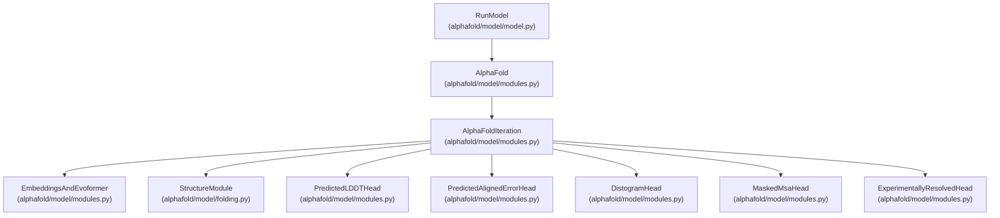
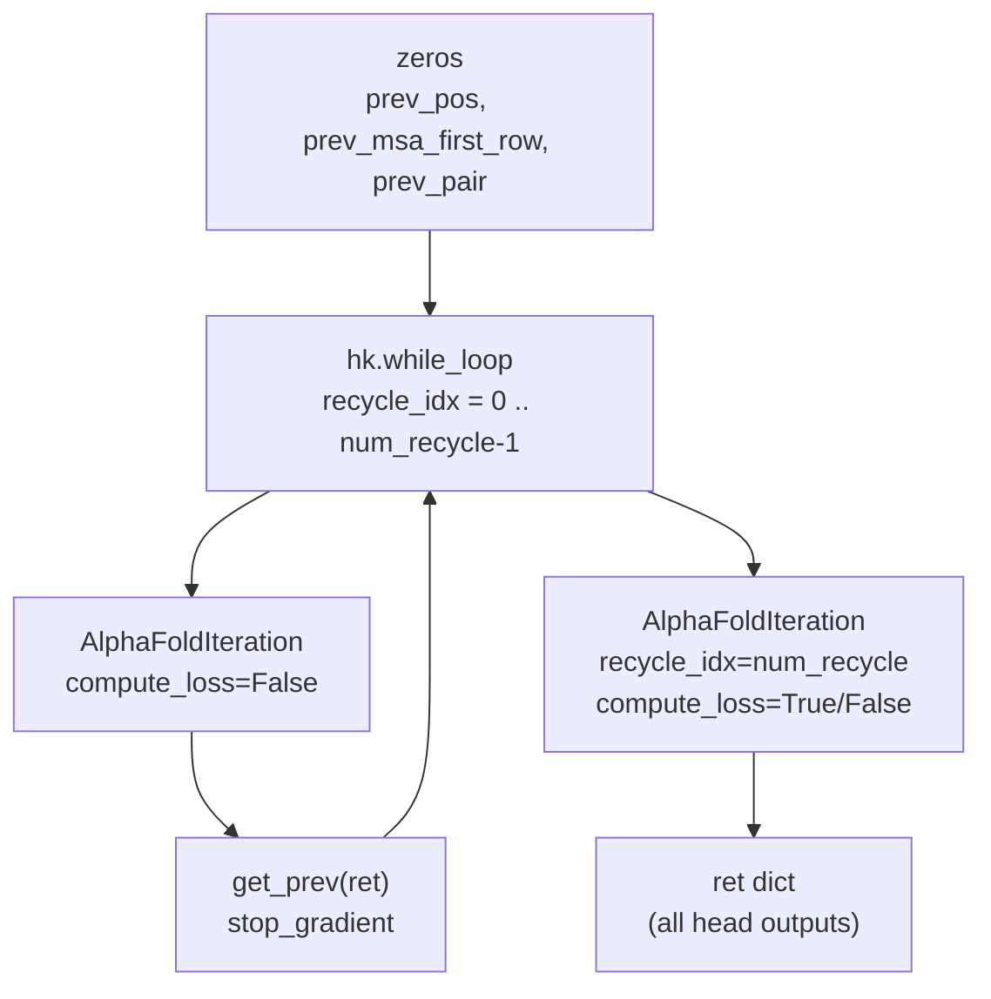
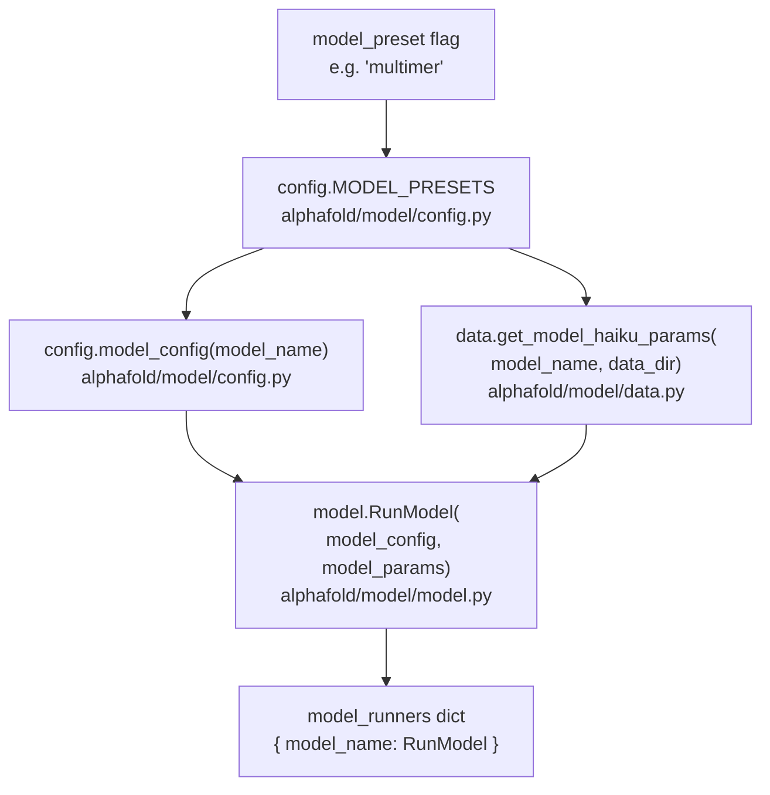

# Neural Network Model

> **Relevant source files**
> * [README.md](https://github.com/jcheongs/alphafold-multimer/blob/8e419501/README.md?plain=1)
> * [alphafold/data/tools/hmmbuild.py](https://github.com/jcheongs/alphafold-multimer/blob/8e419501/alphafold/data/tools/hmmbuild.py)
> * [alphafold/data/tools/hmmsearch.py](https://github.com/jcheongs/alphafold-multimer/blob/8e419501/alphafold/data/tools/hmmsearch.py)
> * [alphafold/model/modules.py](https://github.com/jcheongs/alphafold-multimer/blob/8e419501/alphafold/model/modules.py)
> * [run_alphafold.py](https://github.com/jcheongs/alphafold-multimer/blob/8e419501/run_alphafold.py)

## Purpose and Scope

This page describes the AlphaFold neural network: its top-level Haiku modules, how model configurations and parameters are loaded, and how inference is driven through `RunModel`. It covers the classes in [alphafold/model/modules.py](https://github.com/jcheongs/alphafold-multimer/blob/8e419501/alphafold/model/modules.py)

 and their interactions with `RunModel` in [alphafold/model/model.py](https://github.com/jcheongs/alphafold-multimer/blob/8e419501/alphafold/model/model.py)

For the 3D coordinate refinement components inside the network (IPA, FAPE loss, torsion angles), see the [Structure Module](/jcheongs/alphafold-multimer/5.1-structure-module). For how the confidence outputs (pLDDT, PAE, pTM, ipTM) are computed from model logits, see [Confidence Metrics](/jcheongs/alphafold-multimer/5.3-confidence-metrics). For the feature arrays consumed by the model, see [Protein Feature Schema](/jcheongs/alphafold-multimer/5.2-protein-feature-schema).

---

## Architecture Overview

The network is implemented with [Haiku](https://github.com/jcheongs/alphafold-multimer/blob/8e419501/Haiku)

 (a JAX neural network library) and compiled via JAX's JIT. The entry point for an external caller is `RunModel`, which wraps the Haiku-transformed `AlphaFold` module.

**Diagram: Module Class Hierarchy and File Locations**



Sources: [alphafold/model/modules.py L123-L268](https://github.com/jcheongs/alphafold-multimer/blob/8e419501/alphafold/model/modules.py#L123-L268)

 [run_alphafold.py L384-L395](https://github.com/jcheongs/alphafold-multimer/blob/8e419501/run_alphafold.py#L384-L395)

---

## AlphaFold and AlphaFoldIteration

### AlphaFold

Defined at [alphafold/model/modules.py L270-L390](https://github.com/jcheongs/alphafold-multimer/blob/8e419501/alphafold/model/modules.py#L270-L390)

 `AlphaFold` is the outermost Haiku module. Its responsibilities are:

1. **Recycling loop**: runs `AlphaFoldIteration` up to `config.num_recycle` times using `hk.while_loop`, passing the previous iteration's structural outputs as conditioning for the next.
2. **Final prediction call**: one last call to `AlphaFoldIteration` after the recycling loop completes, optionally computing loss.

The recycling state is a dict called `prev` with three keys:

| Key | Shape | Source |
| --- | --- | --- |
| `prev_pos` | `[N_res, atom_type_num, 3]` | `structure_module/final_atom_positions` |
| `prev_msa_first_row` | `[N_res, msa_channel]` | `representations/msa_first_row` |
| `prev_pair` | `[N_res, N_res, pair_channel]` | `representations/pair` |

All three are initialized to zeros before the first recycling step. They are passed as `non_ensembled_batch` into each `AlphaFoldIteration` call. Gradients are blocked with `jax.lax.stop_gradient` to prevent backprop through the recycling boundary.

If `config.resample_msa_in_recycling` is set, a fresh MSA sample is sliced from the batch at each recycling step using `jax.lax.dynamic_slice_in_dim`.

**Diagram: Recycling Loop Data Flow**



Sources: [alphafold/model/modules.py L304-L390](https://github.com/jcheongs/alphafold-multimer/blob/8e419501/alphafold/model/modules.py#L304-L390)

---

### AlphaFoldIteration

Defined at [alphafold/model/modules.py L123-L268](https://github.com/jcheongs/alphafold-multimer/blob/8e419501/alphafold/model/modules.py#L123-L268)

 this is a single pass through the entire network. It:

1. Calls `EmbeddingsAndEvoformer` on the first ensemble element to get initial representations.
2. Optionally averages representations across multiple ensemble batch elements using a `hk.while_loop`.
3. Constructs and runs all prediction heads in dependency order.

The `ensemble_representations` flag controls whether multiple ensemble copies in the batch dimension are averaged. During inference without CASP14-style ensembling, the batch dimension is 1 and this averaging loop is skipped.

---

## Prediction Heads

Each head is an `hk.Module` instantiated from a factory dict inside `AlphaFoldIteration.__call__` [alphafold/model/modules.py L204-L213](https://github.com/jcheongs/alphafold-multimer/blob/8e419501/alphafold/model/modules.py#L204-L213)

 Heads with a configuration weight of `0.0` are skipped entirely.

| Head Class | Config Key | Input Representation | Output |
| --- | --- | --- | --- |
| `MaskedMsaHead` | `masked_msa` | `representations['msa']` | `logits` over amino acid types |
| `DistogramHead` | `distogram` | `representations['pair']` | `logits` + `bin_edges` over Cβ distances |
| `StructureModule` | `structure_module` | `representations['single']` + `representations['pair']` | 3D atom positions, affines |
| `PredictedLDDTHead` | `predicted_lddt` | `representations['structure_module']` | per-residue `logits` over LDDT bins |
| `PredictedAlignedErrorHead` | `predicted_aligned_error` | `representations['pair']` | pairwise `logits` + `breaks` |
| `ExperimentallyResolvedHead` | `experimentally_resolved` | `representations['single']` | per-atom logits (atom37) |

`PredictedLDDTHead` and `PredictedAlignedErrorHead` are run **after** `StructureModule` because they depend on the single-residue activations exported by the structure module [alphafold/model/modules.py L231-L262](https://github.com/jcheongs/alphafold-multimer/blob/8e419501/alphafold/model/modules.py#L231-L262)

`MaskedMsaHead` has a `multimer_mode` branch: in multimer mode it uses `residue_constants.restypes_with_x_and_gap` for its output vocabulary instead of the config's `num_output` [alphafold/model/modules.py L968-L971](https://github.com/jcheongs/alphafold-multimer/blob/8e419501/alphafold/model/modules.py#L968-L971)

Sources: [alphafold/model/modules.py L200-L267](https://github.com/jcheongs/alphafold-multimer/blob/8e419501/alphafold/model/modules.py#L200-L267)

---

## Model Presets and Configuration

`config.MODEL_PRESETS` in [alphafold/model/config.py](https://github.com/jcheongs/alphafold-multimer/blob/8e419501/alphafold/model/config.py)

 maps each preset name to a list of five model names. These names correspond to the parameter files downloaded to `params/`.

| `model_preset` | Models in Preset | `num_ensemble` | pTM/PAE head |
| --- | --- | --- | --- |
| `monomer` | `model_1` – `model_5` | 1 | No |
| `monomer_casp14` | `model_1` – `model_5` | 8 | No |
| `monomer_ptm` | `model_1_ptm` – `model_5_ptm` | 1 | Yes |
| `multimer` | `model_1_multimer` – `model_5_multimer` | 1 | Yes (ipTM + pTM) |

For monomer presets, `num_ensemble` is set via `model_config.data.eval.num_ensemble`. For the multimer preset, it is set via `model_config.model.num_ensemble_eval`. See [run_alphafold.py L386-L391](https://github.com/jcheongs/alphafold-multimer/blob/8e419501/run_alphafold.py#L386-L391)

`config.model_config(model_name)` returns a `ml_collections.ConfigDict` for the specified model name. The global configuration key `global_config.multimer_mode` toggles multimer-specific behaviour inside heads [alphafold/model/modules.py L968-L971](https://github.com/jcheongs/alphafold-multimer/blob/8e419501/alphafold/model/modules.py#L968-L971)

**Diagram: Model Configuration Instantiation**



Sources: [run_alphafold.py L384-L395](https://github.com/jcheongs/alphafold-multimer/blob/8e419501/run_alphafold.py#L384-L395)

 [alphafold/model/config.py](https://github.com/jcheongs/alphafold-multimer/blob/8e419501/alphafold/model/config.py)

---

## Parameter Loading

`data.get_model_haiku_params(model_name, data_dir)` in [alphafold/model/data.py](https://github.com/jcheongs/alphafold-multimer/blob/8e419501/alphafold/model/data.py)

 loads the pre-trained parameters from disk. Each model's parameters are stored as a `.npz` or pickle file under `<data_dir>/params/params_<model_name>.npz`. The returned object is a nested Python dict compatible with Haiku's parameter structure, which `RunModel` passes directly into `hk.transform(...).apply(params, ...)` during inference.

---

## RunModel Inference

`RunModel` in [alphafold/model/model.py](https://github.com/jcheongs/alphafold-multimer/blob/8e419501/alphafold/model/model.py)

 is the external-facing class. It holds the Haiku-transformed `AlphaFold` function and the loaded parameters. Two methods are relevant to inference:

### process_features(feature_dict, random_seed)

Crops the raw feature dictionary, applies random MSA sampling, and pads arrays to a uniform size (using `make_fixed_size` for bulk inference). This is where the `random_seed` controls stochastic MSA cropping. The result is a `processed_feature_dict` ready for the model.

### predict(processed_feature_dict, random_seed)

Runs the JAX forward pass. The `random_seed` here is passed into the Haiku `rng` and controls stochastic operations inside the network (e.g., dropout during evaluation is typically off, but MSA sampling inside the multimer model is driven by this seed).

Returns a `prediction_result` dict containing:

| Key | Present when | Description |
| --- | --- | --- |
| `plddt` | Always | Per-residue pLDDT, shape `[N_res]`, range 0–100 |
| `ranking_confidence` | Always | Scalar used for model ranking |
| `structure_module` | Always | Dict with `final_atom_positions`, `final_atom_mask` |
| `distogram` | Always | `logits` and `bin_edges` |
| `predicted_aligned_error` | pTM/multimer models | PAE matrix, shape `[N_res, N_res]` |
| `ptm` | pTM/multimer models | Scalar predicted TM-score |
| `iptm` | Multimer models | Interface pTM scalar |

`ranking_confidence` is `iptm + ptm` for multimer models and mean pLDDT for monomer models, as reflected in the ranking label logic at [run_alphafold.py L275-L277](https://github.com/jcheongs/alphafold-multimer/blob/8e419501/run_alphafold.py#L275-L277)

**Diagram: Inference Call Sequence**

```mermaid
sequenceDiagram
  participant predict_structure()
  participant run_alphafold.py
  participant RunModel
  participant model.py
  participant JAX JIT
  participant (hk.transform)
  participant AlphaFold
  participant modules.py
  participant AlphaFoldIteration

  predict_structure()->>RunModel: "process_features(feature_dict, random_seed)"
  RunModel-->>predict_structure(): "processed_feature_dict"
  predict_structure()->>RunModel: "predict(processed_feature_dict, random_seed)"
  RunModel->>JAX JIT: "apply(params, rng, batch)"
  JAX JIT->>AlphaFold: "__call__(batch, is_training=False)"
  loop ["recycle_idx = 0 .. num_recycle-1"]
    AlphaFold->>AlphaFoldIteration: "do_call(prev, recycle_idx)"
    AlphaFoldIteration-->>AlphaFold: "ret (stop_gradient)"
  end
  AlphaFold->>AlphaFoldIteration: "do_call(prev, recycle_idx=num_recycle)"
  AlphaFoldIteration-->>AlphaFold: "final ret"
  AlphaFold-->>JAX JIT: "prediction_result dict"
  JAX JIT-->>RunModel: "prediction_result dict"
  RunModel-->>predict_structure(): "prediction_result dict"
```

Sources: [run_alphafold.py L196-L230](https://github.com/jcheongs/alphafold-multimer/blob/8e419501/run_alphafold.py#L196-L230)

 [alphafold/model/modules.py L281-L390](https://github.com/jcheongs/alphafold-multimer/blob/8e419501/alphafold/model/modules.py#L281-L390)

---

## Relation to Other Subsystems

The neural network sits between two subsystems in the overall pipeline:

* **Input**: The feature dictionary produced by the [Data Pipeline](/jcheongs/alphafold-multimer/4-data-pipeline), either `pipeline.DataPipeline` (monomer) or `pipeline_multimer.DataPipeline` (multimer), is consumed by `RunModel.process_features()`.
* **Output**: The `prediction_result` dict is used by [Structure Relaxation](/jcheongs/alphafold-multimer/6-structure-relaxation) (`AmberRelaxation.process()`) and is serialized to `result_model_N.pkl`. The pLDDT values are embedded in PDB B-factor columns via `protein.from_prediction()` [run_alphafold.py L236-L240](https://github.com/jcheongs/alphafold-multimer/blob/8e419501/run_alphafold.py#L236-L240)