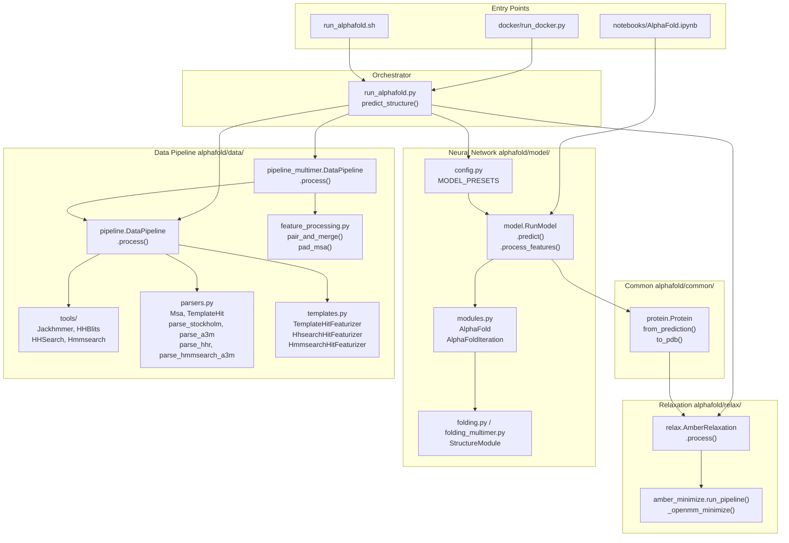
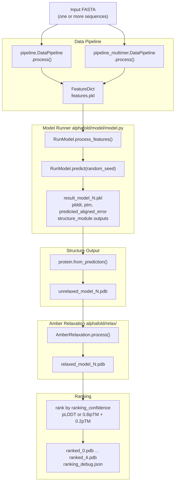

# Overview

> **Relevant source files**
> * [README.md](https://github.com/jcheongs/alphafold-multimer/blob/8e419501/README.md?plain=1)
> * [requirements.txt](https://github.com/jcheongs/alphafold-multimer/blob/8e419501/requirements.txt)
> * [setup.py](https://github.com/jcheongs/alphafold-multimer/blob/8e419501/setup.py)

This page introduces the `alphafold-multimer` repository: what it does, the key terminology a reader needs, and how the major subsystems relate to one another. It is a starting point for navigating the codebase; each subsystem is documented in depth on its own page. For setup and execution instructions, see [Getting Started](/jcheongs/alphafold-multimer/2-getting-started). For the step-by-step orchestration logic, see [Execution Pipeline](/jcheongs/alphafold-multimer/3-execution-pipeline).

---

## What This Repository Does

This codebase is an implementation of the **inference pipeline** for two related protein structure prediction systems:

* **AlphaFold v2** — predicts the 3D structure of a single protein chain (monomer) from its amino acid sequence alone.
* **AlphaFold-Multimer** — extends AlphaFold v2 to predict the structure of protein complexes composed of two or more chains (multimers: homomers and heteromers).

Given one or more protein sequences in FASTA format, the system:

1. Searches genetic databases to build multiple sequence alignments (MSAs).
2. Searches structural databases to find homologous template structures.
3. Passes the resulting feature dictionary through a deep neural network to produce 3D atom coordinates.
4. Optionally refines the predicted structure using Amber molecular mechanics.

The pipeline outputs PDB-format structure files and confidence scores for each prediction.

Sources: [README.md L1-L18](https://github.com/jcheongs/alphafold-multimer/blob/8e419501/README.md?plain=1#L1-L18)

 [setup.py L22-L25](https://github.com/jcheongs/alphafold-multimer/blob/8e419501/setup.py#L22-L25)

---

## Key Terminology

| Term | Definition |
| --- | --- |
| **MSA** (Multiple Sequence Alignment) | An alignment of homologous sequences from databases such as UniRef90, MGnify, BFD, and UniProt. The MSA is the primary input signal for the neural network. |
| **pLDDT** | Per-residue Local Distance Difference Test score (0–100). Higher is more confident. Stored in the B-factor column of output PDB files. Used for model ranking. |
| **pTM** | Predicted TM-score. A scalar global confidence metric assessing overall domain packing. Present only in `monomer_ptm` and `multimer` model outputs. |
| **PAE** | Predicted Aligned Error. An `[N_res, N_res]` matrix of predicted positional error (in Å) between residue pairs. Useful for assessing inter-domain confidence. |
| **Amber relaxation** | Post-prediction energy minimization using the Amber99sb force field and OpenMM to remove steric clashes. Controlled by `--run_relax`. |
| **model_preset** | Selects which model weights and configuration to use: `monomer`, `monomer_casp14`, `monomer_ptm`, or `multimer`. |
| **db_preset** | Selects the database set to use: `full_dbs` (all databases, highest quality) or `reduced_dbs` (smaller BFD subset, faster). |
| **ranking_confidence** | The metric used to rank the 5 model outputs. For monomers: mean pLDDT. For multimers: a weighted combination of pTM and ipTM. |

Sources: [README.md L260-L298](https://github.com/jcheongs/alphafold-multimer/blob/8e419501/README.md?plain=1#L260-L298)

 [README.md L451-L499](https://github.com/jcheongs/alphafold-multimer/blob/8e419501/README.md?plain=1#L451-L499)

---

## Repository Layout

The repository is organized into the following top-level directories and key files:

```markdown
alphafold-multimer/
├── run_alphafold.py          # Main orchestrator (predict_structure)
├── run_alphafold.sh          # Direct-execution entry point (bash)
├── docker/
│   ├── Dockerfile            # Container build definition
│   └── run_docker.py         # Host-side Docker launcher
├── notebooks/
│   └── AlphaFold.ipynb       # Colab notebook (cloud execution)
├── scripts/
│   └── download_*.sh         # Database download scripts
└── alphafold/
    ├── data/
    │   ├── pipeline.py           # Monomer DataPipeline
    │   ├── pipeline_multimer.py  # Multimer DataPipeline
    │   ├── parsers.py            # MSA/hit parsers (Msa, TemplateHit)
    │   ├── feature_processing.py # pair_and_merge, pad_msa
    │   ├── msa_pairing.py        # Prokaryote/eukaryote pairing logic
    │   └── tools/                # Jackhmmer, HHBlits, HHSearch, Hmmsearch
    ├── model/
    │   ├── config.py             # MODEL_PRESETS, RunModel config
    │   ├── model.py              # RunModel (predict, process_features)
    │   ├── modules.py            # AlphaFold, AlphaFoldIteration
    │   └── modules_multimer.py   # Multimer-specific network modules
    ├── relax/
    │   ├── relax.py              # AmberRelaxation facade
    │   └── amber_minimize.py     # run_pipeline, _openmm_minimize
    └── common/
        ├── protein.py            # Protein dataclass, to_pdb, from_prediction
        └── residue_constants.py  # Atom definitions, stereo chemistry
```

Sources: [README.md L109-L140](https://github.com/jcheongs/alphafold-multimer/blob/8e419501/README.md?plain=1#L109-L140)

---

## Subsystem Map

The following diagram maps the main subsystems to the code files and classes that implement them.

**Diagram: Subsystems and Their Code Entities**



Sources: [README.md L32-L48](https://github.com/jcheongs/alphafold-multimer/blob/8e419501/README.md?plain=1#L32-L48)

 [README.md L206-L319](https://github.com/jcheongs/alphafold-multimer/blob/8e419501/README.md?plain=1#L206-L319)

---

## End-to-End Data Flow

This diagram traces data from FASTA input to final output files, naming the specific functions and classes at each stage.

**Diagram: Data Flow from Input to Output Files**



Sources: [README.md L428-L499](https://github.com/jcheongs/alphafold-multimer/blob/8e419501/README.md?plain=1#L428-L499)

---

## Model Presets

The `MODEL_PRESETS` dictionary in `alphafold/model/config.py` controls which set of model weights and network configurations is used. The `--model_preset` flag selects among four options:

| `model_preset` | # Models | Ensembling | pTM / PAE output | Use case |
| --- | --- | --- | --- | --- |
| `monomer` | 5 | 1× | No | Standard single-chain prediction |
| `monomer_casp14` | 5 | 8× | No | CASP14 reproduction (expensive) |
| `monomer_ptm` | 5 | 1× | Yes | Single-chain with confidence maps |
| `multimer` | 5 | 1× | Yes (+ ipTM) | Protein complex prediction |

The `--db_preset` flag is independent and controls which genetic databases are searched:

| `db_preset` | BFD variant | Approx. disk use |
| --- | --- | --- |
| `full_dbs` | Full BFD + UniClust30 (via HHBlits) | ~2.2 TB |
| `reduced_dbs` | `small_bfd` (via Jackhmmer) | ~600 GB |

Sources: [README.md L260-L298](https://github.com/jcheongs/alphafold-multimer/blob/8e419501/README.md?plain=1#L260-L298)

---

## Output Files

For each input FASTA, `predict_structure()` writes a subdirectory under `--output_dir`:

```markdown
<target_name>/
    features.pkl                  # serialized FeatureDict (NumPy arrays)
    unrelaxed_model_{1..5}.pdb    # raw network output
    relaxed_model_{1..5}.pdb      # after AmberRelaxation
    ranked_{0..4}.pdb             # models sorted by ranking_confidence
    ranking_debug.json            # per-model confidence scores
    result_model_{1..5}.pkl       # full prediction dict (logits, plddt, ptm, PAE)
    timings.json                  # wall-clock time per pipeline stage
    msas/
        uniref90_hits.sto
        mgnify_hits.sto
        bfd_uniclust_hits.a3m     # or small_bfd_hits.sto for reduced_dbs
```

The `pLDDT` value for each residue is written into the **B-factor column** of all PDB output files. A higher value (closer to 100) means higher per-residue confidence.

Sources: [README.md L428-L499](https://github.com/jcheongs/alphafold-multimer/blob/8e419501/README.md?plain=1#L428-L499)

---

## Major Subsystems and Where to Learn More

| Subsystem | Key code location | Wiki page |
| --- | --- | --- |
| Docker / direct invocation | `docker/run_docker.py`, `run_alphafold.sh` | [Getting Started](/jcheongs/alphafold-multimer/2-getting-started) |
| Database download | `scripts/download_*.sh` | [Downloading Required Databases](/jcheongs/alphafold-multimer/2.2-downloading-required-databases) |
| Main orchestrator | `run_alphafold.py` | [Execution Pipeline](/jcheongs/alphafold-multimer/3-execution-pipeline) |
| Monomer data pipeline | `alphafold/data/pipeline.py` | [Monomer Data Pipeline](/jcheongs/alphafold-multimer/4.1-monomer-data-pipeline) |
| MSA tools | `alphafold/data/tools/` | [MSA Generation Tools](/jcheongs/alphafold-multimer/4.2-msa-generation-tools) |
| Template processing | `alphafold/data/templates.py` | [Template Processing](/jcheongs/alphafold-multimer/4.3-template-processing) |
| Multimer data pipeline | `alphafold/data/pipeline_multimer.py` | [Multimer Data Pipeline](/jcheongs/alphafold-multimer/4.4-multimer-data-pipeline) |
| Parsers and data formats | `alphafold/data/parsers.py` | [Data Formats and Parsers](/jcheongs/alphafold-multimer/4.5-data-formats-and-parsers) |
| Neural network | `alphafold/model/modules.py` | [Neural Network Model](/jcheongs/alphafold-multimer/5-neural-network-model) |
| Structure module | `alphafold/model/folding.py`, `folding_multimer.py` | [Structure Module](/jcheongs/alphafold-multimer/5.1-structure-module) |
| Confidence metrics | `alphafold/model/confidence.py` | [Confidence Metrics](/jcheongs/alphafold-multimer/5.3-confidence-metrics) |
| Amber relaxation | `alphafold/relax/relax.py`, `amber_minimize.py` | [Structure Relaxation](/jcheongs/alphafold-multimer/6-structure-relaxation) |
| Protein data structure | `alphafold/common/protein.py` | [Common Data Structures](/jcheongs/alphafold-multimer/7-common-data-structures) |

Sources: [README.md L1-L18](https://github.com/jcheongs/alphafold-multimer/blob/8e419501/README.md?plain=1#L1-L18)

 [setup.py L19-L58](https://github.com/jcheongs/alphafold-multimer/blob/8e419501/setup.py#L19-L58)