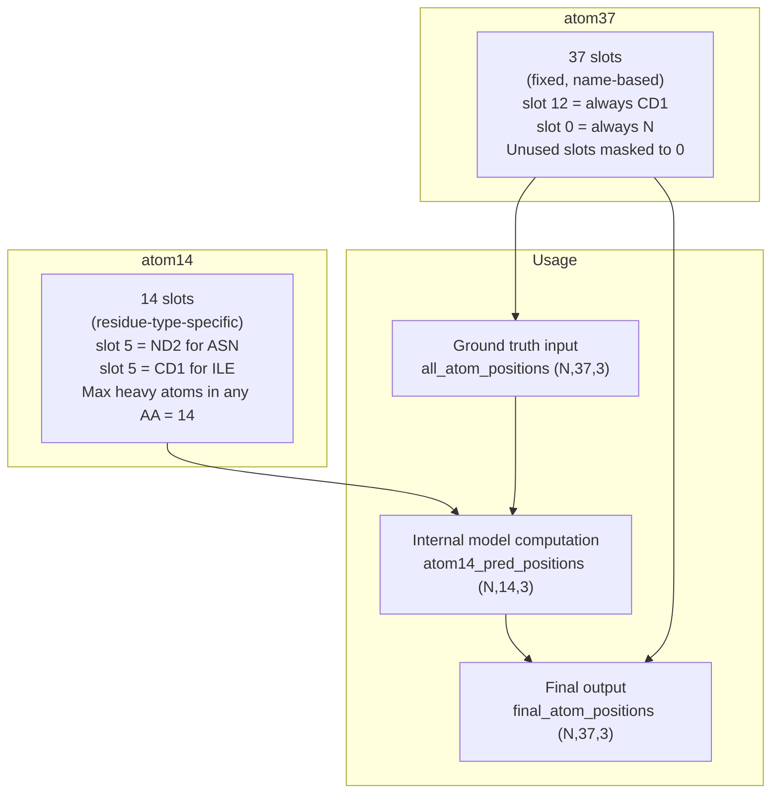
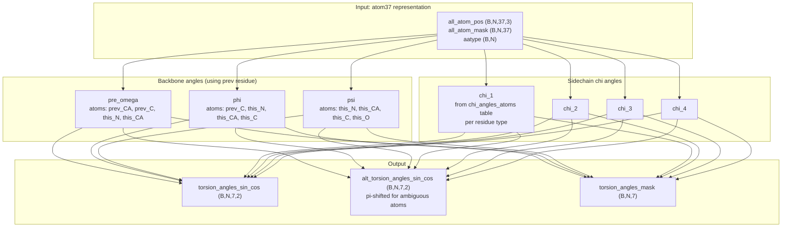
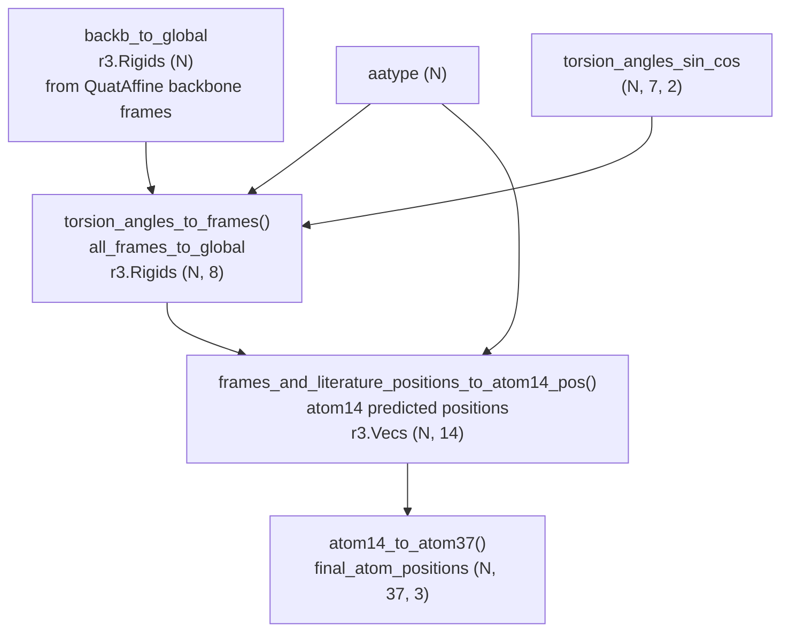
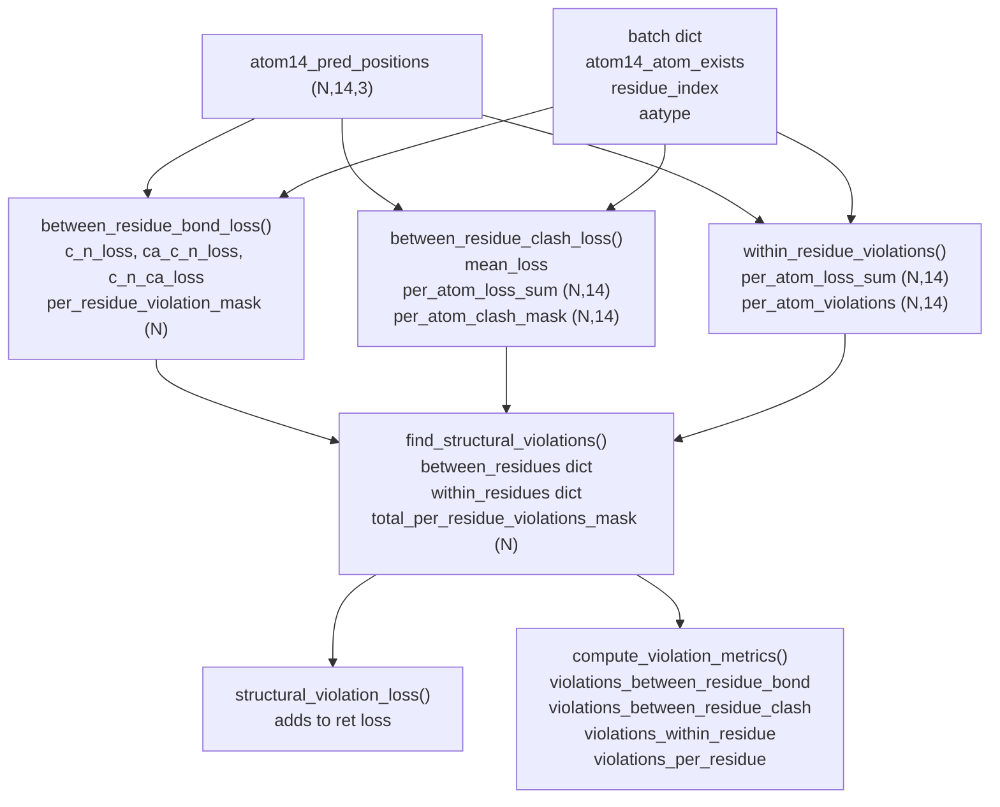
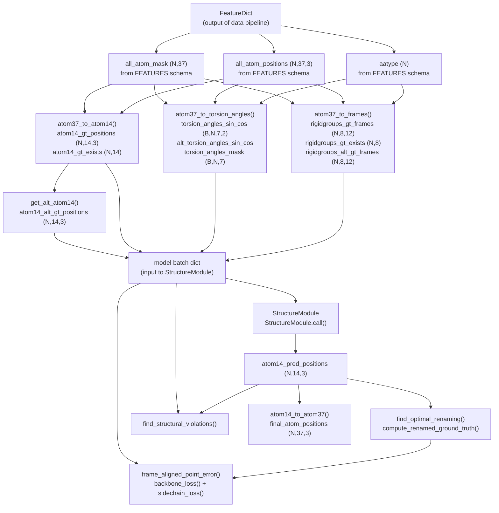

# Protein Feature Schema

> **Relevant source files**
> * [alphafold/model/all_atom.py](https://github.com/jcheongs/alphafold-multimer/blob/8e419501/alphafold/model/all_atom.py)
> * [alphafold/model/folding.py](https://github.com/jcheongs/alphafold-multimer/blob/8e419501/alphafold/model/folding.py)
> * [alphafold/model/tf/input_pipeline.py](https://github.com/jcheongs/alphafold-multimer/blob/8e419501/alphafold/model/tf/input_pipeline.py)
> * [alphafold/model/tf/protein_features.py](https://github.com/jcheongs/alphafold-multimer/blob/8e419501/alphafold/model/tf/protein_features.py)
> * [alphafold/relax/utils.py](https://github.com/jcheongs/alphafold-multimer/blob/8e419501/alphafold/relax/utils.py)

This page documents the low-level data representation layer used inside the AlphaFold neural network: the `FEATURES` metadata registry, the `FeatureType` classification enum, the dual atom-coordinate representations (atom14 and atom37), torsion angle computation, rigid group frame construction, and the all-atom geometry loss functions.

This page is specifically about the *model-internal* feature schema. For how raw sequence and MSA data are assembled into the initial feature dictionary, see the Data Pipeline pages ([4](https://github.com/jcheongs/alphafold-multimer/blob/8e419501/4)

), ([4.1](https://github.com/jcheongs/alphafold-multimer/blob/8e419501/4.1)

), and ([4.4](https://github.com/jcheongs/alphafold-multimer/blob/8e419501/4.4)

). For how the structure module consumes these features during 3D coordinate refinement, see [5.1](https://github.com/jcheongs/alphafold-multimer/blob/8e419501/5.1)

 For the `Protein` dataclass and PDB I/O, see [7](https://github.com/jcheongs/alphafold-multimer/blob/8e419501/7)

---

## Feature Metadata Registry

[alphafold/model/tf/protein_features.py](https://github.com/jcheongs/alphafold-multimer/blob/8e419501/alphafold/model/tf/protein_features.py)

 defines the canonical registry of named features that the model expects.

### FeatureType Enum

[alphafold/model/tf/protein_features.py L25-L29](https://github.com/jcheongs/alphafold-multimer/blob/8e419501/alphafold/model/tf/protein_features.py#L25-L29)

```
FeatureType.ZERO_DIM  → shape [x]
FeatureType.ONE_DIM   → shape [num_res, x]
FeatureType.TWO_DIM   → shape [num_res, num_res, x]
FeatureType.MSA       → shape [msa_length, num_res, x]
```

This enum classifies features by their leading dimensionality. It is used downstream when building TFRecord examples and when applying data transforms to crop or pad tensors to uniform size.

### Shape Placeholder Constants

[alphafold/model/tf/protein_features.py L33-L38](https://github.com/jcheongs/alphafold-multimer/blob/8e419501/alphafold/model/tf/protein_features.py#L33-L38)

Three string constants serve as placeholder values inside shape specifications:

| Constant | Placeholder string | Resolved to |
| --- | --- | --- |
| `NUM_RES` | `"num residues placeholder"` | actual sequence length |
| `NUM_SEQ` | `"length msa placeholder"` | actual MSA depth |
| `NUM_TEMPLATES` | `"num templates placeholder"` | actual number of templates |

These are substituted with runtime values by the `shape()` function ([alphafold/model/tf/protein_features.py L80-L129](https://github.com/jcheongs/alphafold-multimer/blob/8e419501/alphafold/model/tf/protein_features.py#L80-L129)

).

### FEATURES Dictionary

[alphafold/model/tf/protein_features.py L41-L65](https://github.com/jcheongs/alphafold-multimer/blob/8e419501/alphafold/model/tf/protein_features.py#L41-L65)

`FEATURES` maps each feature name to a `(tf.DType, shape_list)` tuple. `FEATURE_TYPES` and `FEATURE_SIZES` are derived lookup dicts exposing dtype and shape separately.

**Sequence-level features:**

| Feature | DType | Shape | Description |
| --- | --- | --- | --- |
| `aatype` | float32 | `[NUM_RES, 21]` | One-hot amino acid type (20 types + unknown) |
| `between_segment_residues` | int64 | `[NUM_RES, 1]` | 1 at chain breaks |
| `residue_index` | int64 | `[NUM_RES, 1]` | Per-residue sequence index |
| `seq_length` | int64 | `[NUM_RES, 1]` | Sequence length broadcast per residue |
| `sequence` | string | `[1]` | Raw sequence string |
| `domain_name` | string | `[1]` | Identifier string |
| `resolution` | float32 | `[1]` | Crystal resolution if known |

**MSA features:**

| Feature | DType | Shape | Description |
| --- | --- | --- | --- |
| `msa` | int64 | `[NUM_SEQ, NUM_RES, 1]` | Integer-encoded MSA rows |
| `deletion_matrix` | float32 | `[NUM_SEQ, NUM_RES, 1]` | Deletion counts at each MSA position |
| `num_alignments` | int64 | `[NUM_RES, 1]` | Number of MSA sequences (broadcast) |

**All-atom ground truth features:**

| Feature | DType | Shape | Description |
| --- | --- | --- | --- |
| `all_atom_positions` | float32 | `[NUM_RES, atom_type_num, 3]` | atom37 coordinates |
| `all_atom_mask` | int64 | `[NUM_RES, atom_type_num]` | atom37 existence mask |

**Template features:**

| Feature | DType | Shape | Description |
| --- | --- | --- | --- |
| `template_aatype` | float32 | `[NUM_TEMPLATES, NUM_RES, 22]` | Template AA types (one-hot, 22 classes) |
| `template_all_atom_positions` | float32 | `[NUM_TEMPLATES, NUM_RES, atom_type_num, 3]` | Template atom37 positions |
| `template_all_atom_masks` | float32 | `[NUM_TEMPLATES, NUM_RES, atom_type_num, 1]` | Template atom37 masks |
| `template_domain_names` | string | `[NUM_TEMPLATES]` | Template identifier strings |
| `template_sum_probs` | float32 | `[NUM_TEMPLATES, 1]` | Template selection scores |

`atom_type_num` is `residue_constants.atom_type_num`, which is **37**.

### Registering Custom Features

Additional features can be added at runtime via `register_feature()` ([alphafold/model/tf/protein_features.py L71-L77](https://github.com/jcheongs/alphafold-multimer/blob/8e419501/alphafold/model/tf/protein_features.py#L71-L77)

), which inserts a new entry into `FEATURES`, `FEATURE_TYPES`, and `FEATURE_SIZES`.

---

## Atom Coordinate Representations

[alphafold/model/all_atom.py L1-L44](https://github.com/jcheongs/alphafold-multimer/blob/8e419501/alphafold/model/all_atom.py#L1-L44)

The model uses two parallel representations for all heavy-atom coordinates. The docstring at the top of `all_atom.py` describes both:

**Diagram: atom14 vs atom37 representation**



Sources: [alphafold/model/all_atom.py L16-L34](https://github.com/jcheongs/alphafold-multimer/blob/8e419501/alphafold/model/all_atom.py#L16-L34)

### Conversion Functions

[alphafold/model/all_atom.py L76-L111](https://github.com/jcheongs/alphafold-multimer/blob/8e419501/alphafold/model/all_atom.py#L76-L111)

Both directions require index mapping arrays that must be present in the batch:

| Function | Input | Output | Required batch keys |
| --- | --- | --- | --- |
| `atom14_to_atom37()` | `(N, 14, ...)` | `(N, 37, ...)` | `residx_atom37_to_atom14`, `atom37_atom_exists` |
| `atom37_to_atom14()` | `(N, 37, ...)` | `(N, 14, ...)` | `residx_atom14_to_atom37`, `atom14_atom_exists` |

The conversion uses `utils.batched_gather()` to remap slots according to these index arrays, then applies the existence mask to zero out absent atoms.

In `StructureModule.__call__()` ([alphafold/model/folding.py L500-L508](https://github.com/jcheongs/alphafold-multimer/blob/8e419501/alphafold/model/folding.py#L500-L508)

), the final predicted atom14 positions are converted to atom37 for output:

```markdown
atom37_pred_positions = all_atom.atom14_to_atom37(atom14_pred_positions, batch)atom37_pred_positions *= batch['atom37_atom_exists'][:, :, None]ret['final_atom_positions'] = atom37_pred_positions  # (N, 37, 3)
```

---

## Torsion Angle Computation

[alphafold/model/all_atom.py L271-L442](https://github.com/jcheongs/alphafold-multimer/blob/8e419501/alphafold/model/all_atom.py#L271-L442)

`atom37_to_torsion_angles()` computes 7 backbone and sidechain torsion angles per residue from atom37 coordinates.

**Diagram: 7 torsion angles and their atom dependencies**



Sources: [alphafold/model/all_atom.py L271-L442](https://github.com/jcheongs/alphafold-multimer/blob/8e419501/alphafold/model/all_atom.py#L271-L442)

Each angle is encoded as `(sin, cos)` rather than a scalar. The ordering in the output tensor is fixed: `[pre_omega=0, phi=1, psi=2, chi_1=3, chi_2=4, chi_3=5, chi_4=6]`.

`get_chi_atom_indices()` ([alphafold/model/all_atom.py L50-L73](https://github.com/jcheongs/alphafold-multimer/blob/8e419501/alphafold/model/all_atom.py#L50-L73)

) builds a static lookup table of shape `[21 residue_types, 4 chis, 4 atoms]` that maps residue type × chi index to the four atom37 slot indices needed to define that dihedral.

---

## Rigid Group Frame Construction

Each residue is decomposed into up to **8 rigid groups** — sets of atoms that move as a unit under a single torsion angle.

### atom37_to_frames()

[alphafold/model/all_atom.py L114-L268](https://github.com/jcheongs/alphafold-multimer/blob/8e419501/alphafold/model/all_atom.py#L114-L268)

Computes the 8 rigid group coordinate frames for every residue from atom37 coordinates. The 8 groups and their identities are:

| Index | Name | Defining atoms |
| --- | --- | --- |
| 0 | backbone | C, CA, N |
| 1 | pre-omega | (empty) |
| 2 | phi | (empty — defines hydrogens only) |
| 3 | psi | CA, C, O |
| 4 | chi1 | residue-type dependent |
| 5 | chi2 | residue-type dependent |
| 6 | chi3 | residue-type dependent |
| 7 | chi4 | residue-type dependent |

**Output dictionary from `atom37_to_frames()`:**

| Key | Shape | Description |
| --- | --- | --- |
| `rigidgroups_gt_frames` | `(..., 8, 12)` | Ground truth rigid frames as flat 4×3 matrices |
| `rigidgroups_gt_exists` | `(..., 8)` | Mask: all three defining atoms resolved |
| `rigidgroups_group_exists` | `(..., 8)` | Mask: group defined for this AA type |
| `rigidgroups_group_is_ambiguous` | `(..., 8)` | Mask: naming ambiguity present |
| `rigidgroups_alt_gt_frames` | `(..., 8, 12)` | Alternative frames with swapped naming |

The backbone frame (group 0) is built as `r3.rigids_from_3_points(C, CA, N)` then mirrored by negating the x and z axes to match the AlphaFold convention ([alphafold/model/all_atom.py L220-L223](https://github.com/jcheongs/alphafold-multimer/blob/8e419501/alphafold/model/all_atom.py#L220-L223)

).

### torsion_angles_to_frames()

[alphafold/model/all_atom.py L445-L529](https://github.com/jcheongs/alphafold-multimer/blob/8e419501/alphafold/model/all_atom.py#L445-L529)

Converts predicted torsion angles (sin, cos format) back into rigid group frames. Used during inference in `MultiRigidSidechain.__call__()` ([alphafold/model/folding.py L994-L998](https://github.com/jcheongs/alphafold-multimer/blob/8e419501/alphafold/model/folding.py#L994-L998)

).

The chi2, chi3, and chi4 frames are chained relative to the previous frame rather than directly to the backbone:

```
chi1 → backbone
chi2 → chi1
chi3 → chi2
chi4 → chi3
```

### frames_and_literature_positions_to_atom14_pos()

[alphafold/model/all_atom.py L532-L572](https://github.com/jcheongs/alphafold-multimer/blob/8e419501/alphafold/model/all_atom.py#L532-L572)

Places atom14 positions by applying per-residue rigid frames to idealized literature positions from `residue_constants.restype_atom14_rigid_group_positions`. This implements Algorithm 24 from Jumper et al. (2021) Suppl.

**Diagram: Frame construction pipeline (inference)**



Sources: [alphafold/model/all_atom.py L445-L572](https://github.com/jcheongs/alphafold-multimer/blob/8e419501/alphafold/model/all_atom.py#L445-L572)

 [alphafold/model/folding.py L990-L1002](https://github.com/jcheongs/alphafold-multimer/blob/8e419501/alphafold/model/folding.py#L990-L1002)

---

## Symmetric Atom Renaming

Seven amino acids have pairs of atoms related by 180° rotational symmetry (e.g., PHE CD1/CD2, ASP OD1/OD2). This creates a naming ambiguity in ground truth coordinates.

### RENAMING_MATRICES

[alphafold/model/all_atom.py L1082-L1109](https://github.com/jcheongs/alphafold-multimer/blob/8e419501/alphafold/model/all_atom.py#L1082-L1109)

A static array of shape `(21, 14, 14)` — one permutation matrix per residue type — that swaps the atom14 slot assignments for ambiguous atom pairs. Built once at module import by `_make_renaming_matrices()`.

### get_alt_atom14()

[alphafold/model/all_atom.py L1112-L1141](https://github.com/jcheongs/alphafold-multimer/blob/8e419501/alphafold/model/all_atom.py#L1112-L1141)

Applies `RENAMING_MATRICES` to produce an alternative set of atom14 positions and masks where ambiguous atom names have been swapped.

### find_optimal_renaming()

[alphafold/model/all_atom.py L929-L1010](https://github.com/jcheongs/alphafold-multimer/blob/8e419501/alphafold/model/all_atom.py#L929-L1010)

Given predicted and ground truth atom14 positions, determines for each residue whether swapping the ambiguous atom names (using the alternative naming) brings the ground truth closer to the prediction in LDDT terms. Returns a float mask of shape `(N)` with `1.0` where the swap is preferred.

Used in `compute_renamed_ground_truth()` ([alphafold/model/folding.py L561-L615](https://github.com/jcheongs/alphafold-multimer/blob/8e419501/alphafold/model/folding.py#L561-L615)

) before all loss computations.

---

## All-Atom Geometry Loss Functions

[alphafold/model/all_atom.py](https://github.com/jcheongs/alphafold-multimer/blob/8e419501/alphafold/model/all_atom.py)

 contains three classes of structural quality losses.

### FAPE: Frame Aligned Point Error

[alphafold/model/all_atom.py L1013-L1079](https://github.com/jcheongs/alphafold-multimer/blob/8e419501/alphafold/model/all_atom.py#L1013-L1079)

`frame_aligned_point_error()` implements Algorithm 28 from Jumper et al. (2021) Suppl. It measures the average L1 distance between predicted and target atom positions after aligning each pair of frames.

**Inputs:**

| Argument | Type | Description |
| --- | --- | --- |
| `pred_frames` | `r3.Rigids (num_frames)` | Predicted coordinate frames |
| `target_frames` | `r3.Rigids (num_frames)` | Ground truth frames |
| `frames_mask` | `(num_frames,)` | Which frame pairs to use |
| `pred_positions` | `r3.Vecs (num_positions)` | Predicted atom positions |
| `target_positions` | `r3.Vecs (num_positions)` | Target atom positions |
| `positions_mask` | `(num_positions,)` | Which positions to score |
| `length_scale` | float | Normalizes the error |
| `l1_clamp_distance` | Optional float | Gradient clamp cutoff |

Used in two contexts in `folding.py`:

* **Backbone FAPE** ([alphafold/model/folding.py L618-L669](https://github.com/jcheongs/alphafold-multimer/blob/8e419501/alphafold/model/folding.py#L618-L669) ): frames from the backbone trajectory, clamp at `config.fape.clamp_distance`
* **Sidechain FAPE** ([alphafold/model/folding.py L672-L714](https://github.com/jcheongs/alphafold-multimer/blob/8e419501/alphafold/model/folding.py#L672-L714) ): flattened sidechain frames from all 8 rigid groups

### Bond and Angle Violation Losses

[alphafold/model/all_atom.py L609-L741](https://github.com/jcheongs/alphafold-multimer/blob/8e419501/alphafold/model/all_atom.py#L609-L741)

`between_residue_bond_loss()` penalizes deviations in peptide bond geometry between consecutive residues. Uses reference bond lengths and standard deviations from `residue_constants`.

**Three components per residue pair:**

| Component | Geometry measured |
| --- | --- |
| `c_n_loss_mean` | C–N peptide bond length (Proline vs non-Proline) |
| `ca_c_n_loss_mean` | Bond angle at C (CA–C–N) |
| `c_n_ca_loss_mean` | Bond angle at N (C–N–CA) |

### Clash Detection

[alphafold/model/all_atom.py L744-L926](https://github.com/jcheongs/alphafold-multimer/blob/8e419501/alphafold/model/all_atom.py#L744-L926)

Two functions handle steric clash detection in atom14 representation:

**`between_residue_clash_loss()`** ([alphafold/model/all_atom.py L744-L850](https://github.com/jcheongs/alphafold-multimer/blob/8e419501/alphafold/model/all_atom.py#L744-L850)

):

* Computes all pairwise atom distances `(N, N, 14, 14)`
* Excludes same-residue pairs, C–N backbone bonds, and disulfide bridges (CYS–SG pairs)
* Returns `mean_loss`, `per_atom_loss_sum (N,14)`, `per_atom_clash_mask (N,14)`

**`within_residue_violations()`** ([alphafold/model/all_atom.py L853-L926](https://github.com/jcheongs/alphafold-multimer/blob/8e419501/alphafold/model/all_atom.py#L853-L926)

):

* Uses precomputed distance bounds from `residue_constants.make_atom14_dists_bounds()`
* Returns `per_atom_loss_sum (N,14)` and `per_atom_violations (N,14)`

**`extreme_ca_ca_distance_violations()`** ([alphafold/model/all_atom.py L575-L606](https://github.com/jcheongs/alphafold-multimer/blob/8e419501/alphafold/model/all_atom.py#L575-L606)

):

* Flags consecutive CA–CA pairs more than `max_angstrom_tolerance` apart

### Combined Violation Detection in the Structure Module

[alphafold/model/folding.py L734-L819](https://github.com/jcheongs/alphafold-multimer/blob/8e419501/alphafold/model/folding.py#L734-L819)

`find_structural_violations()` aggregates all three violation types into a single dictionary used by both `structural_violation_loss()` and `compute_violation_metrics()`.

**Diagram: Structural violation computation flow**



Sources: [alphafold/model/folding.py L717-L851](https://github.com/jcheongs/alphafold-multimer/blob/8e419501/alphafold/model/folding.py#L717-L851)

 [alphafold/model/all_atom.py L575-L926](https://github.com/jcheongs/alphafold-multimer/blob/8e419501/alphafold/model/all_atom.py#L575-L926)

---

## Data Flow Summary

The diagram below shows how these schema elements connect the data pipeline output to the structure module inputs and loss computations.

**Diagram: Feature schema to model consumption**



Sources: [alphafold/model/tf/protein_features.py L41-L65](https://github.com/jcheongs/alphafold-multimer/blob/8e419501/alphafold/model/tf/protein_features.py#L41-L65)

 [alphafold/model/all_atom.py L76-L268](https://github.com/jcheongs/alphafold-multimer/blob/8e419501/alphafold/model/all_atom.py#L76-L268)

 [alphafold/model/folding.py L500-L558](https://github.com/jcheongs/alphafold-multimer/blob/8e419501/alphafold/model/folding.py#L500-L558)