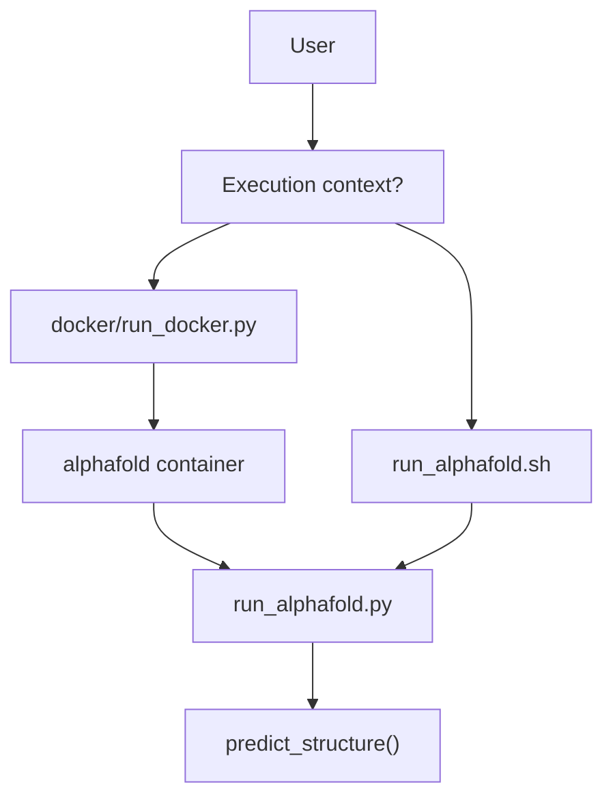
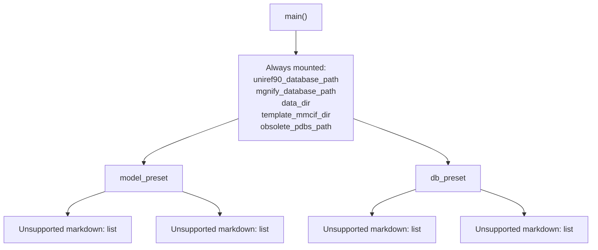

# Running Predictions

> **Relevant source files**
> * [README.md](https://github.com/jcheongs/alphafold-multimer/blob/8e419501/README.md?plain=1)
> * [docker/run_docker.py](https://github.com/jcheongs/alphafold-multimer/blob/8e419501/docker/run_docker.py)
> * [run_alphafold.sh](https://github.com/jcheongs/alphafold-multimer/blob/8e419501/run_alphafold.sh)

This page covers the two supported invocation methods for AlphaFold predictions: `docker/run_docker.py` (containerized, recommended) and `run_alphafold.sh` (direct execution). It explains every major flag, how database mounts are constructed, and what environment variables are set in each case.

For the internal pipeline that executes after invocation (feature generation, model loop, relaxation), see [Execution Pipeline](/jcheongs/alphafold-multimer/3-execution-pipeline). For the Colab-based simplified interface, see [Colab Notebook](/jcheongs/alphafold-multimer/2.4-colab-notebook). For database setup, see [Downloading Required Databases](/jcheongs/alphafold-multimer/2.2-downloading-required-databases).

---

## Invocation Methods

There are two primary entry points into the prediction pipeline.

**Invocation Decision Diagram**



Sources: [docker/run_docker.py L1-L257](https://github.com/jcheongs/alphafold-multimer/blob/8e419501/docker/run_docker.py#L1-L257)

 [run_alphafold.sh L1-L195](https://github.com/jcheongs/alphafold-multimer/blob/8e419501/run_alphafold.sh#L1-L195)

---

## Method 1: docker/run_docker.py

`docker/run_docker.py` is a Python wrapper that uses the Docker Python SDK to launch the `alphafold` container image. It handles translating host-side file paths into container-internal bind mounts and assembles the command passed to `run_alphafold.py` inside the container.

### Prerequisites

* Docker installed with NVIDIA Container Toolkit.
* Docker image built: `docker build -f docker/Dockerfile -t alphafold .`
* Python dependencies for the script: `pip3 install -r docker/requirements.txt`
* Output directory exists with write permissions.

### Minimal invocation

```
python3 docker/run_docker.py \  --fasta_paths=T1050.fasta \  --max_template_date=2020-05-14 \  --data_dir=$DOWNLOAD_DIR
```

### All flags

| Flag | Type | Default | Description |
| --- | --- | --- | --- |
| `--fasta_paths` | list | required | Comma-separated paths to FASTA files. One prediction per file. |
| `--data_dir` | string | required | Root directory of all databases and model parameters. |
| `--max_template_date` | string | required | ISO-8601 date cutoff for template structures (e.g. `2020-05-14`). |
| `--output_dir` | string | `/tmp/alphafold` | Host path where outputs are written. |
| `--model_preset` | enum | `monomer` | One of `monomer`, `monomer_casp14`, `monomer_ptm`, `multimer`. |
| `--db_preset` | enum | `full_dbs` | One of `full_dbs` or `reduced_dbs`. |
| `--is_prokaryote_list` | list | `None` | Comma-separated booleans (one per FASTA), for multimer MSA pairing. |
| `--use_gpu` | bool | `True` | Enable NVIDIA GPU runtime. |
| `--gpu_devices` | string | `all` | `NVIDIA_VISIBLE_DEVICES` value passed to container. |
| `--enable_gpu_relax` | bool | `True` | Run Amber relaxation on GPU (only if `use_gpu` is also true). |
| `--run_relax` | bool | `True` | Run Amber relaxation on predicted structures. |
| `--benchmark` | bool | `False` | Run extra JAX evaluations to get a compilation-excluded timing. |
| `--use_precomputed_msas` | bool | `False` | Read MSAs from disk instead of recomputing. |
| `--docker_image_name` | string | `alphafold` | Name of the Docker image to run. |
| `--docker_user` | string | `uid:gid` | UID:GID for the container process (defaults to current user). |

Sources: [docker/run_docker.py L29-L93](https://github.com/jcheongs/alphafold-multimer/blob/8e419501/docker/run_docker.py#L29-L93)

### How database mounts are constructed

The `_create_mount()` function [docker/run_docker.py L100-L109](https://github.com/jcheongs/alphafold-multimer/blob/8e419501/docker/run_docker.py#L100-L109)

 maps each database file or directory on the host to a path under `/mnt/` inside the container. The container-internal path is passed as the corresponding `--*_database_path` flag to `run_alphafold.py`.

The set of database paths mounted varies by `model_preset` and `db_preset`:

**Database Mount Selection Diagram**



Sources: [docker/run_docker.py L176-L202](https://github.com/jcheongs/alphafold-multimer/blob/8e419501/docker/run_docker.py#L176-L202)

### Environment variables passed to the container

| Variable | Value | Purpose |
| --- | --- | --- |
| `NVIDIA_VISIBLE_DEVICES` | `FLAGS.gpu_devices` | Controls GPU visibility inside container. |
| `TF_FORCE_UNIFIED_MEMORY` | `1` | Allows TensorFlow to use unified CPU/GPU memory. |
| `XLA_PYTHON_CLIENT_MEM_FRACTION` | `4.0` | Allows JAX/XLA to use more than the default GPU memory fraction. |

Sources: [docker/run_docker.py L233-L240](https://github.com/jcheongs/alphafold-multimer/blob/8e419501/docker/run_docker.py#L233-L240)

---

## Method 2: run_alphafold.sh

`run_alphafold.sh` is a Bash script for running predictions directly on the host without Docker. It resolves binary paths via `which`, sets environment variables, constructs database path arguments, and calls `run_alphafold.py` directly.

### Required parameters

| Flag | Description |
| --- | --- |
| `-d <data_dir>` | Path to directory containing databases and parameters. |
| `-o <output_dir>` | Path to output directory. |
| `-f <fasta_path>` | Path to a FASTA file (single file, not a list). |
| `-t <max_template_date>` | Template date cutoff (YYYY-MM-DD). |

### Optional parameters

| Flag | Default | Description |
| --- | --- | --- |
| `-m <model_preset>` | `monomer` | Model preset (`monomer`, `monomer_casp14`, `monomer_ptm`, `multimer`). |
| `-c <db_preset>` | `full_dbs` | Database preset (`full_dbs` or `reduced_dbs`). |
| `-g <use_gpu>` | `true` | Enable GPU. Sets `CUDA_VISIBLE_DEVICES`. |
| `-a <gpu_devices>` | `0` | GPU device indices for `CUDA_VISIBLE_DEVICES`. |
| `-n <openmm_threads>` | all cores | Sets `OPENMM_CPU_THREADS`. |
| `-l <is_prokaryote>` | `None` | Prokaryote flag for multimer pairing. |
| `-r <run_relax>` | `true` | Run Amber relaxation. |
| `-h <use_gpu_relax>` | `true` | Run relaxation on GPU. |
| `-p <use_precomputed_msas>` | `false` | Reuse MSAs from disk. |
| `-b` | `false` | Benchmark mode. |

Sources: [run_alphafold.sh L4-L26](https://github.com/jcheongs/alphafold-multimer/blob/8e419501/run_alphafold.sh#L4-L26)

### Environment variables set by the script

```
CUDA_VISIBLE_DEVICES     = gpu_devices (or -1 if use_gpu=false)
OPENMM_CPU_THREADS       = openmm_threads (if provided)
TF_FORCE_UNIFIED_MEMORY  = 1
XLA_PYTHON_CLIENT_MEM_FRACTION = 4.0
```

Sources: [run_alphafold.sh L131-L151](https://github.com/jcheongs/alphafold-multimer/blob/8e419501/run_alphafold.sh#L131-L151)

### Binary path resolution

The script resolves tool binary paths using `which` at runtime:

```
hhblits_binary_path  = $(which hhblits)
hhsearch_binary_path = $(which hhsearch)
jackhmmer_binary_path= $(which jackhmmer)
kalign_binary_path   = $(which kalign)
```

These are passed as `--hhblits_binary_path`, `--hhsearch_binary_path`, etc., directly to `run_alphafold.py`.

Sources: [run_alphafold.sh L166-L169](https://github.com/jcheongs/alphafold-multimer/blob/8e419501/run_alphafold.sh#L166-L169)

### Database path construction

All database paths are derived from the single `-d <data_dir>` argument using fixed relative subdirectory names. The same conditional logic as `docker/run_docker.py` applies:

```
uniref90_database_path = $data_dir/uniref90/uniref90.fasta
mgnify_database_path   = $data_dir/mgnify/mgy_clusters_2018_12.fa
bfd_database_path      = $data_dir/bfd/bfd_metaclust_clu_complete_id30_c90_final_seq.sorted_opt
small_bfd_database_path= $data_dir/small_bfd/bfd-first_non_consensus_sequences.fasta
uniclust30_database_path=$data_dir/uniclust30/uniclust30_2018_08/uniclust30_2018_08
pdb70_database_path    = $data_dir/pdb70/pdb70
pdb_seqres_database_path=$data_dir/pdb_seqres/pdb_seqres.txt
uniprot_database_path  = $data_dir/uniprot/uniprot.fasta
template_mmcif_dir     = $data_dir/pdb_mmcif/mmcif_files
obsolete_pdbs_path     = $data_dir/pdb_mmcif/obsolete.dat
```

Sources: [run_alphafold.sh L154-L163](https://github.com/jcheongs/alphafold-multimer/blob/8e419501/run_alphafold.sh#L154-L163)

 [run_alphafold.sh L177-L187](https://github.com/jcheongs/alphafold-multimer/blob/8e419501/run_alphafold.sh#L177-L187)

---

## Model Presets

The `--model_preset` flag selects the neural network configuration and the number of ensemble evaluations.

| Preset | Description | Ensembling | Outputs pTM / PAE |
| --- | --- | --- | --- |
| `monomer` | Original CASP14 model, no ensembling. | `num_ensemble=1` | No |
| `monomer_casp14` | CASP14 configuration with full ensembling. 8× more compute. | `num_ensemble=8` | No |
| `monomer_ptm` | Fine-tuned monomer model with pTM/PAE head. Slightly lower structure accuracy. | `num_ensemble=1` | Yes |
| `multimer` | AlphaFold-Multimer model. Requires multi-sequence FASTA input. | — | Yes |

Sources: [docker/run_docker.py L67-L75](https://github.com/jcheongs/alphafold-multimer/blob/8e419501/docker/run_docker.py#L67-L75)

 [README.md L260-L276](https://github.com/jcheongs/alphafold-multimer/blob/8e419501/README.md?plain=1#L260-L276)

---

## Database Presets

The `--db_preset` flag controls the MSA database set used.

| Preset | BFD variant | Approx. disk usage | Speed |
| --- | --- | --- | --- |
| `full_dbs` | Full BFD + Uniclust30 (HHBlits) | ~2.2 TB total | Slower, higher sensitivity |
| `reduced_dbs` | small_bfd (Jackhmmer) | ~600 GB | Faster, fewer resources |

Sources: [README.md L278-L298](https://github.com/jcheongs/alphafold-multimer/blob/8e419501/README.md?plain=1#L278-L298)

 [docker/run_docker.py L68-L70](https://github.com/jcheongs/alphafold-multimer/blob/8e419501/docker/run_docker.py#L68-L70)

---

## Input FASTA Format

* Each FASTA file represents one prediction job.
* A file with a **single sequence** is treated as a monomer.
* A file with **multiple sequences** is treated as a multimer (requires `--model_preset=multimer`).
* All FASTA files must have unique basenames — the basename is used as the output subdirectory name.

### Example: heteromer A2B3

```
>sequence_1<SEQUENCE A>>sequence_2<SEQUENCE A>>sequence_3<SEQUENCE B>>sequence_4<SEQUENCE B>>sequence_5<SEQUENCE B>
```

Sources: [README.md L369-L396](https://github.com/jcheongs/alphafold-multimer/blob/8e419501/README.md?plain=1#L369-L396)

---

## --is_prokaryote_list Flag

Only relevant for `--model_preset=multimer`. This flag controls how MSA pairing is performed across chains:

* `true` — Uses genetic-distance-based pairing (appropriate for prokaryotes).
* `false` — Uses sequence-similarity-based pairing (appropriate for eukaryotes or unknown origin).

When running multiple FASTA files in one invocation, the list must have one boolean per FASTA:

```
python3 docker/run_docker.py \  --fasta_paths=multimer1.fasta,multimer2.fasta \  --is_prokaryote_list=true,true \  --model_preset=multimer \  --data_dir=$DOWNLOAD_DIR \  --max_template_date=2021-11-01
```

Sources: [docker/run_docker.py L49-L53](https://github.com/jcheongs/alphafold-multimer/blob/8e419501/docker/run_docker.py#L49-L53)

 [README.md L301-L319](https://github.com/jcheongs/alphafold-multimer/blob/8e419501/README.md?plain=1#L301-L319)

---

## Output Files

All outputs land in `<output_dir>/<target_name>/`, where `<target_name>` is the FASTA file's basename without extension.

```markdown
<target_name>/
    features.pkl                  # Input feature NumPy arrays (FeatureDict)
    ranked_{0,1,2,3,4}.pdb        # Relaxed structures sorted by confidence
    ranking_debug.json            # pLDDT scores and model name mapping
    relaxed_model_{1..5}.pdb      # Per-model relaxed structures
    unrelaxed_model_{1..5}.pdb    # Per-model raw structure module output
    result_model_{1..5}.pkl       # Full model output dicts (plddt, ptm, PAE, ...)
    timings.json                  # Wall-clock time per pipeline stage
    msas/
        bfd_uniclust_hits.a3m
        mgnify_hits.sto
        uniref90_hits.sto
```

Key output details:

| File | Contents |
| --- | --- |
| `features.pkl` | Serialized `FeatureDict` passed to the model. |
| `unrelaxed_model_N.pdb` | Raw model output. pLDDT is stored in the B-factor column. |
| `relaxed_model_N.pdb` | After Amber minimization (see [Structure Relaxation](/jcheongs/alphafold-multimer/6-structure-relaxation)). |
| `ranked_0.pdb` | Highest-confidence prediction (by pLDDT or `ranking_confidence`). |
| `result_model_N.pkl` | Includes `plddt`, `ptm`, `predicted_aligned_error` arrays (see [Confidence Metrics](/jcheongs/alphafold-multimer/5.3-confidence-metrics)). |
| `timings.json` | Per-stage timings for profiling. |

Sources: [README.md L428-L498](https://github.com/jcheongs/alphafold-multimer/blob/8e419501/README.md?plain=1#L428-L498)

---

## Flag Flow Diagram: docker/run_docker.py to Container

This diagram shows how user-provided flags map to the container's command-line and environment.

```mermaid
flowchart TD

F1["--fasta_paths"]
F2["--data_dir"]
F3["--model_preset"]
F4["--db_preset"]
F5["--max_template_date"]
F6["--gpu_devices"]
F7["--run_relax"]
F8["--is_prokaryote_list"]
F9["--use_precomputed_msas"]
M1["fasta_path_N -> /mnt/fasta_path_N/"]
M2["uniref90_database_path -> /mnt/uniref90_database_path/"]
M3["bfd_database_path -> /mnt/bfd_database_path/"]
M4["output_dir -> /mnt/output/"]
ENV["NVIDIA_VISIBLE_DEVICES<br>TF_FORCE_UNIFIED_MEMORY<br>XLA_PYTHON_CLIENT_MEM_FRACTION"]
CMD["command_args list<br>passed to run_alphafold.py"]

F1 --> M1
M1 --> CMD
F2 --> M2
M2 --> CMD
F2 --> M3
M3 --> CMD
F3 --> CMD
F4 --> CMD
F5 --> CMD
F6 --> ENV
F7 --> CMD
F8 --> CMD
F9 --> CMD

subgraph client.containers.run() ["client.containers.run()"]
    ENV
    CMD
end

subgraph _create_mount() ["_create_mount()"]
    M1
    M2
    M3
    M4
end

subgraph subGraph0 ["Host: docker/run_docker.py"]
    F1
    F2
    F3
    F4
    F5
    F6
    F7
    F8
    F9
end
```

Sources: [docker/run_docker.py L165-L247](https://github.com/jcheongs/alphafold-multimer/blob/8e419501/docker/run_docker.py#L165-L247)

---

## Common Invocation Examples

### Monomer, full databases

```
python3 docker/run_docker.py \  --fasta_paths=monomer.fasta \  --max_template_date=2021-11-01 \  --model_preset=monomer \  --db_preset=full_dbs \  --data_dir=$DOWNLOAD_DIR
```

### Multimer (prokaryote), reduced databases

```
python3 docker/run_docker.py \  --fasta_paths=multimer.fasta \  --is_prokaryote_list=true \  --max_template_date=2021-11-01 \  --model_preset=multimer \  --db_preset=reduced_dbs \  --data_dir=$DOWNLOAD_DIR
```

### Direct execution via shell script

```
bash run_alphafold.sh \  -d $DOWNLOAD_DIR \  -o /tmp/alphafold \  -f monomer.fasta \  -t 2021-11-01 \  -m monomer \  -c full_dbs \  -g true \  -a 0
```

Sources: [README.md L323-L426](https://github.com/jcheongs/alphafold-multimer/blob/8e419501/README.md?plain=1#L323-L426)

 [run_alphafold.sh L171-L194](https://github.com/jcheongs/alphafold-multimer/blob/8e419501/run_alphafold.sh#L171-L194)

---

## Reusing Precomputed MSAs

Both entry points support `--use_precomputed_msas=true` / `-p true`. When set, the pipeline reads MSA files from the `msas/` subdirectory of the output directory instead of re-running Jackhmmer and HHBlits. The output directory must be the same across runs. No validation is performed that the sequence or database configuration has not changed.

Sources: [docker/run_docker.py L82-L87](https://github.com/jcheongs/alphafold-multimer/blob/8e419501/docker/run_docker.py#L82-L87)

 [run_alphafold.sh L19](https://github.com/jcheongs/alphafold-multimer/blob/8e419501/run_alphafold.sh#L19-L19)