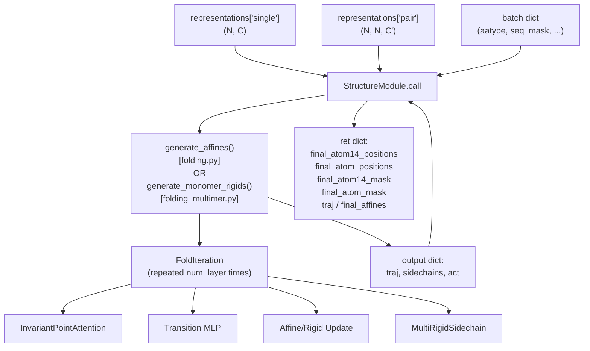
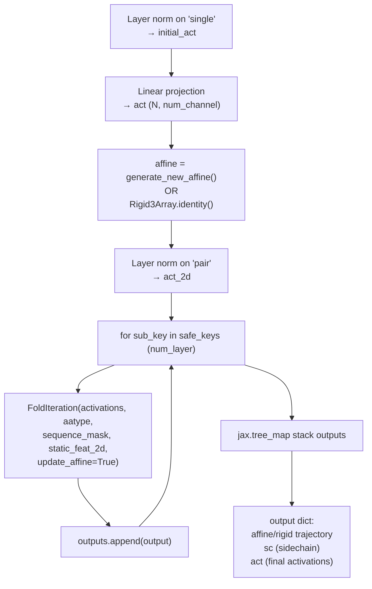
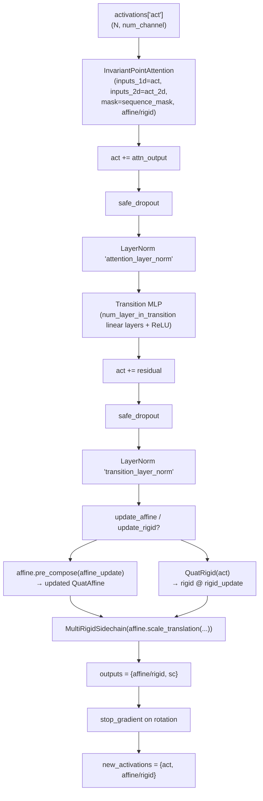
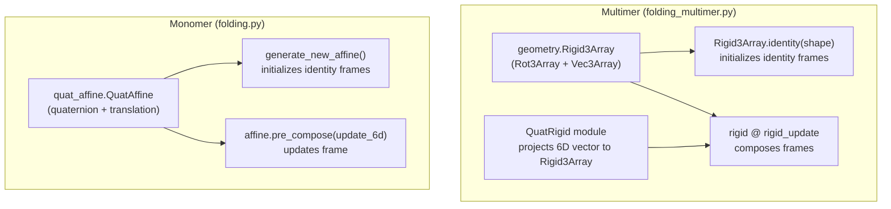
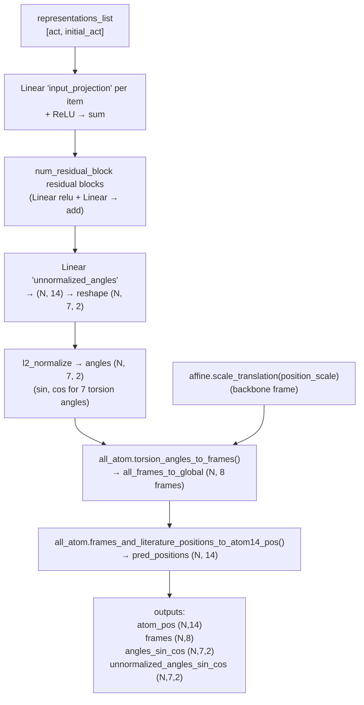
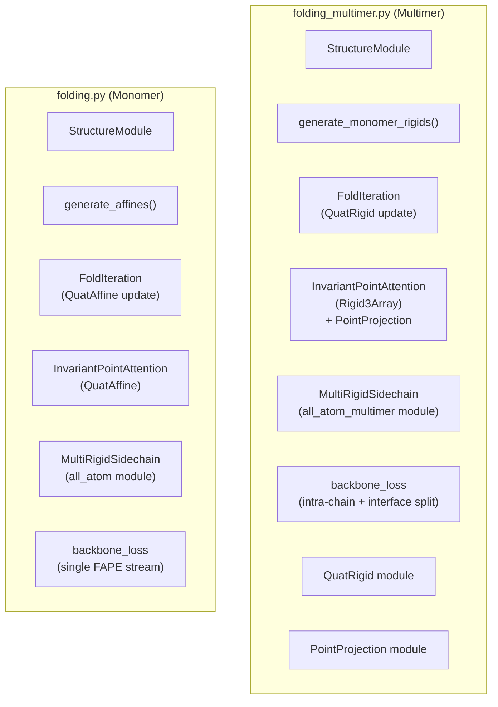

# Structure Module

> **Relevant source files**
> * [alphafold/model/folding.py](https://github.com/jcheongs/alphafold-multimer/blob/8e419501/alphafold/model/folding.py)
> * [alphafold/model/folding_multimer.py](https://github.com/jcheongs/alphafold-multimer/blob/8e419501/alphafold/model/folding_multimer.py)
> * [alphafold/model/tf/input_pipeline.py](https://github.com/jcheongs/alphafold-multimer/blob/8e419501/alphafold/model/tf/input_pipeline.py)
> * [alphafold/relax/utils.py](https://github.com/jcheongs/alphafold-multimer/blob/8e419501/alphafold/relax/utils.py)

This page documents the iterative 3D coordinate refinement subsystem of AlphaFold, covering both the monomer implementation in `alphafold/model/folding.py` and the multimer implementation in `alphafold/model/folding_multimer.py`. It describes the network components, the rigid body representations they use, and the loss functions applied during training.

For the upstream network that produces the `single` and `pair` representations consumed here, see the Neural Network Model overview ([5](https://github.com/jcheongs/alphafold-multimer/blob/8e419501/5)

). For the atom representations, torsion utilities, and FAPE geometry used by these loss functions, see the Protein Feature Schema page ([5.2](https://github.com/jcheongs/alphafold-multimer/blob/8e419501/5.2)

). For the post-prediction Amber relaxation that refines coordinates after this module runs, see Structure Relaxation ([6](https://github.com/jcheongs/alphafold-multimer/blob/8e419501/6)

).

---

## Overview

The Structure Module converts per-residue scalar (`single`) and pairwise (`pair`) embedding tensors into 3D atom coordinates. It does this through a fixed number of iterative refinement steps. In each step, residue frames (rigid body transformations) are updated using geometry-aware attention, and sidechain torsion angles are predicted from the updated representations. Only the final frame positions are used for inference; the full trajectory is used for training.

**Top-level execution flow:**



Sources: [alphafold/model/folding.py L464-L518](https://github.com/jcheongs/alphafold-multimer/blob/8e419501/alphafold/model/folding.py#L464-L518)

 [alphafold/model/folding_multimer.py L556-L625](https://github.com/jcheongs/alphafold-multimer/blob/8e419501/alphafold/model/folding_multimer.py#L556-L625)

---

## StructureModule

Both implementations define a class named `StructureModule` as a Haiku module (`hk.Module`). The two versions have the same role but differ in their rigid body representation and loss structure.

| Attribute | Monomer (`folding.py`) | Multimer (`folding_multimer.py`) |
| --- | --- | --- |
| Class | `StructureModule` | `StructureModule` |
| Inner loop fn | `generate_affines()` | `generate_monomer_rigids()` |
| Rigid type | `QuatAffine` | `Rigid3Array` |
| Position output | `final_atom14_positions` (N, 14, 3) | `final_atom14_positions` (N, 14, 3) |
| All-atom helper | `all_atom` module | `all_atom_multimer` module |
| `compute_loss` param | Constructor arg | `__call__` arg |
| Trajectory key | `traj` | `traj` |
| Final rigids key | `final_affines` | `final_rigids` |

The `__call__` method normalizes the `single` and `pair` representations, runs the iterative loop, and converts the final sidechain atom positions from atom14 to atom37 format before returning.

Sources: [alphafold/model/folding.py L464-L558](https://github.com/jcheongs/alphafold-multimer/blob/8e419501/alphafold/model/folding.py#L464-L558)

 [alphafold/model/folding_multimer.py L556-L748](https://github.com/jcheongs/alphafold-multimer/blob/8e419501/alphafold/model/folding_multimer.py#L556-L748)

---

## Iterative Refinement Loop

The main loop runs `FoldIteration` exactly `config.num_layer` times. Each call to `FoldIteration` consumes the current activations and rigid frames, and produces updated activations, updated frames, and sidechain outputs. The rotation gradient is stopped at the end of each iteration so that frame updates compose without back-propagating through the rotation accumulation.

**`generate_affines` (monomer) / `generate_monomer_rigids` (multimer) structure:**



Sources: [alphafold/model/folding.py L390-L461](https://github.com/jcheongs/alphafold-multimer/blob/8e419501/alphafold/model/folding.py#L390-L461)

 [alphafold/model/folding_multimer.py L478-L553](https://github.com/jcheongs/alphafold-multimer/blob/8e419501/alphafold/model/folding_multimer.py#L478-L553)

---

## FoldIteration

`FoldIteration` is a single step of the iterative loop. It is defined in both files and follows the same structural pattern.

**Steps within one `FoldIteration.__call__`:**



The backbone update projects `act` to a 6-dimensional vector (quaternion components + translation) and composes it with the current frame. In the monomer version this is done via `affine.pre_compose(affine_update)` [alphafold/model/folding.py L362-L374](https://github.com/jcheongs/alphafold-multimer/blob/8e419501/alphafold/model/folding.py#L362-L374)

 In the multimer version this uses the `QuatRigid` module [alphafold/model/folding_multimer.py L456-L461](https://github.com/jcheongs/alphafold-multimer/blob/8e419501/alphafold/model/folding_multimer.py#L456-L461)

Sources: [alphafold/model/folding.py L281-L387](https://github.com/jcheongs/alphafold-multimer/blob/8e419501/alphafold/model/folding.py#L281-L387)

 [alphafold/model/folding_multimer.py L374-L475](https://github.com/jcheongs/alphafold-multimer/blob/8e419501/alphafold/model/folding_multimer.py#L374-L475)

---

## InvariantPointAttention

`InvariantPointAttention` (IPA) is a geometry-aware attention mechanism. Residues produce query and key points in their **local** reference frame; these are projected into the **global** frame to compute attention weights via squared Euclidean distance. Value points are gathered in the global frame and converted back to each query residue's local frame.

The attention logit for a query-key pair has three additive components:

| Term | Source | Weight |
| --- | --- | --- |
| Scalar dot-product | `q_scalar` · `k_scalar` | `sqrt(1 / (3 * scalar_variance))` |
| Point distance | `-0.5 * Σ |  |
| Pair bias | linear projection of `inputs_2d` | `sqrt(1/3)` |

The output concatenates: flattened scalar values, local-frame point values (x, y, z), their norms, and pair-attention-pooled 2D features.

**Monomer vs Multimer IPA differences:**

| Aspect | `folding.py:InvariantPointAttention` | `folding_multimer.py:InvariantPointAttention` |
| --- | --- | --- |
| Rigid input type | `QuatAffine` (via `affine` arg) | `Rigid3Array` (via `rigid` arg) |
| Point projection | Manual `apply_to_point` / `invert_point` | `PointProjection` Haiku module |
| Softmax axis | `axis=-1` (last) | `axis=-2` (key dimension) |
| Normalization | Separate weights per term | Single `sqrt(1/3)` factor applied once |

The multimer version introduces two helper modules used only within its `InvariantPointAttention`:

* `PointProjection` — wraps a `Linear` that produces 3D point coordinates in a residue's local frame, then applies the rigid transform to get global-frame points [alphafold/model/folding_multimer.py L140-L185](https://github.com/jcheongs/alphafold-multimer/blob/8e419501/alphafold/model/folding_multimer.py#L140-L185)

Sources: [alphafold/model/folding.py L37-L278](https://github.com/jcheongs/alphafold-multimer/blob/8e419501/alphafold/model/folding.py#L37-L278)

 [alphafold/model/folding_multimer.py L188-L371](https://github.com/jcheongs/alphafold-multimer/blob/8e419501/alphafold/model/folding_multimer.py#L188-L371)

---

## Rigid Body Representations

The two implementations use different data structures to represent residue frames.

**Diagram: rigid body types and their origins**



`QuatRigid` [alphafold/model/folding_multimer.py L65-L137](https://github.com/jcheongs/alphafold-multimer/blob/8e419501/alphafold/model/folding_multimer.py#L65-L137)

 is a Haiku module that applies a `Linear` layer to produce a 6D (or 7D with `full_quat=True`) rigid update vector, then constructs a `Rigid3Array` from it using `Rot3Array.from_quaternion`. This replaces the `affine.pre_compose` call used in the monomer path.

Sources: [alphafold/model/folding.py L914-L921](https://github.com/jcheongs/alphafold-multimer/blob/8e419501/alphafold/model/folding.py#L914-L921)

 [alphafold/model/folding_multimer.py L65-L137](https://github.com/jcheongs/alphafold-multimer/blob/8e419501/alphafold/model/folding_multimer.py#L65-L137)

 [alphafold/model/folding_multimer.py L456-L461](https://github.com/jcheongs/alphafold-multimer/blob/8e419501/alphafold/model/folding_multimer.py#L456-L461)

---

## MultiRigidSidechain

`MultiRigidSidechain` predicts sidechain torsion angles and converts them to 3D atom positions. It exists in both `folding.py` and `folding_multimer.py` with the same design.

**Processing steps:**



The 7 torsion angles are: backbone φ, ψ, ω (3) and χ₁–χ₄ (4). The first 3 are backbone angles predicted alongside backbone frames; the last 4 are chi angles used for sidechain atom placement.

The `position_scale` config factor converts normalized quaternion frame translations to Ångströms before passing to `MultiRigidSidechain`.

Sources: [alphafold/model/folding.py L929-L1009](https://github.com/jcheongs/alphafold-multimer/blob/8e419501/alphafold/model/folding.py#L929-L1009)

 [alphafold/model/folding_multimer.py L1076-L1159](https://github.com/jcheongs/alphafold-multimer/blob/8e419501/alphafold/model/folding_multimer.py#L1076-L1159)

---

## Loss Functions

The `StructureModule.loss()` method assembles the total loss from four components. The final loss is a weighted sum:

```
total_loss = (1 - sidechain.weight_frac) * backbone_fape
           + sidechain.weight_frac * sidechain_fape
           + chi_weight * chi_loss
           + angle_norm_weight * angle_norm_loss
           + structural_violation_loss_weight * violation_loss
```

### Backbone FAPE

Function: `backbone_loss` in both files.

Frame-Aligned Point Error (FAPE) measures how well predicted backbone frames align with ground-truth frames. It is applied over the entire trajectory (all `num_layer` steps) via `jax.vmap`, and the mean across steps is accumulated as loss. The final-layer value is stored separately as `ret['fape']` for logging.

The monomer version optionally switches between a clamped loss (`l1_clamp_distance`) and unclamped loss controlled by `batch['use_clamped_fape']` [alphafold/model/folding.py L650-L668](https://github.com/jcheongs/alphafold-multimer/blob/8e419501/alphafold/model/folding.py#L650-L668)

The **multimer** version splits the backbone loss into two parts using `batch['asym_id']`:

| Component | Pair mask | Config section |
| --- | --- | --- |
| `intra_chain_bb_loss` | `asym_id[i] == asym_id[j]` | `config.intra_chain_fape` |
| `interface_bb_loss` | `asym_id[i] != asym_id[j]` | `config.interface_fape` |

Sources: [alphafold/model/folding.py L618-L669](https://github.com/jcheongs/alphafold-multimer/blob/8e419501/alphafold/model/folding.py#L618-L669)

 [alphafold/model/folding_multimer.py L780-L798](https://github.com/jcheongs/alphafold-multimer/blob/8e419501/alphafold/model/folding_multimer.py#L780-L798)

 [alphafold/model/folding_multimer.py L686-L706](https://github.com/jcheongs/alphafold-multimer/blob/8e419501/alphafold/model/folding_multimer.py#L686-L706)

### Sidechain FAPE

Function: `sidechain_loss` in both files.

Applies FAPE using sidechain rigid group frames (8 frames per residue from `MultiRigidSidechain`) as reference frames, and atom14 positions as the predicted points. Only the **final** iteration's sidechain output is used.

Ground-truth sidechain frames are first renamed to resolve symmetric atom ambiguity (e.g., the two oxygens of ASP) via `compute_renamed_ground_truth` (monomer) or `compute_atom14_gt` / `compute_frames` (multimer).

Sources: [alphafold/model/folding.py L672-L714](https://github.com/jcheongs/alphafold-multimer/blob/8e419501/alphafold/model/folding.py#L672-L714)

 [alphafold/model/folding_multimer.py L831-L867](https://github.com/jcheongs/alphafold-multimer/blob/8e419501/alphafold/model/folding_multimer.py#L831-L867)

### Supervised Chi Loss

Function: `supervised_chi_loss` in both files.

Directly supervises the 4 sidechain chi angles predicted by `MultiRigidSidechain`. Angles are represented as (sin, cos) pairs. For π-periodic angles (e.g., PHE χ₂), the loss takes the minimum of the error and the π-shifted error. An angle normalization term penalizes the magnitude of `unnormalized_angles_sin_cos` deviating from 1.

```
sq_chi_error = min(||sin_cos_pred - sin_cos_gt||², ||sin_cos_pred - sin_cos_gt_shifted||²)
chi_loss = mean over masked chi angles of sq_chi_error
angle_norm_loss = mean of ||(unnormed_angles)|| - 1|
```

Sources: [alphafold/model/folding.py L854-L911](https://github.com/jcheongs/alphafold-multimer/blob/8e419501/alphafold/model/folding.py#L854-L911)

 [alphafold/model/folding_multimer.py L1009-L1050](https://github.com/jcheongs/alphafold-multimer/blob/8e419501/alphafold/model/folding_multimer.py#L1009-L1050)

### Structural Violation Loss

Function: `structural_violation_loss` (both files), assembled from `find_structural_violations`.

`find_structural_violations` checks three categories of structural plausibility:

| Category | Checker function | Violations detected |
| --- | --- | --- |
| Backbone bonds/angles | `between_residue_bond_loss` | C-N bond length, Cα-C-N angle, C-N-Cα angle |
| Inter-residue clashes | `between_residue_clash_loss` | Atom pairs from different residues overlapping Van der Waals radii |
| Intra-residue geometry | `within_residue_violations` | Bond distances and angles within one residue |

The combined per-residue violation mask (`total_per_residue_violations_mask`) is also used by the pLDDT head to suppress confidence in violated regions.

Sources: [alphafold/model/folding.py L717-L819](https://github.com/jcheongs/alphafold-multimer/blob/8e419501/alphafold/model/folding.py#L717-L819)

 [alphafold/model/folding_multimer.py L870-L976](https://github.com/jcheongs/alphafold-multimer/blob/8e419501/alphafold/model/folding_multimer.py#L870-L976)

---

## Monomer vs Multimer: Summary of Differences



| Feature | Monomer | Multimer |
| --- | --- | --- |
| File | `folding.py` | `folding_multimer.py` |
| Frame type | `quat_affine.QuatAffine` | `geometry.Rigid3Array` |
| Frame update | `affine.pre_compose(6d)` | `QuatRigid` → `rigid @ update` |
| IPA point helper | inline via `apply_to_point` | `PointProjection` module |
| All-atom util | `alphafold.model.all_atom` | `alphafold.model.all_atom_multimer` |
| Backbone loss | single stream | intra-chain + interface streams |
| `compute_loss` | constructor flag | `__call__` flag |
| `loss()` availability | implemented | raises `NotImplementedError` (requires chain permutation alignment) |

The multimer `StructureModule.loss()` raises `NotImplementedError` because computing the correct loss requires first aligning chain orderings — a step performed externally before the loss is called (referenced in the raise message as Evans et al. (2021) Section 7.3).

Sources: [alphafold/model/folding.py L520-L558](https://github.com/jcheongs/alphafold-multimer/blob/8e419501/alphafold/model/folding.py#L520-L558)

 [alphafold/model/folding_multimer.py L627-L748](https://github.com/jcheongs/alphafold-multimer/blob/8e419501/alphafold/model/folding_multimer.py#L627-L748)