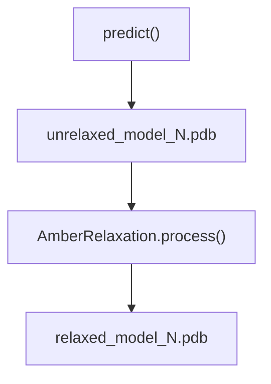
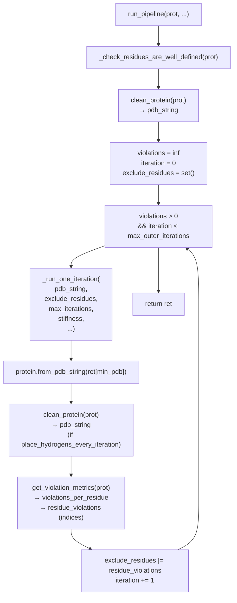
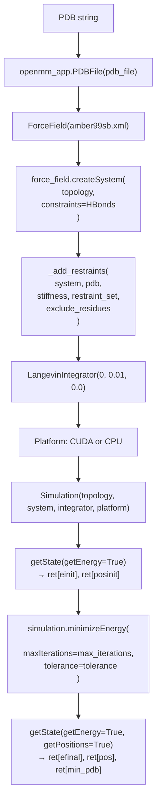
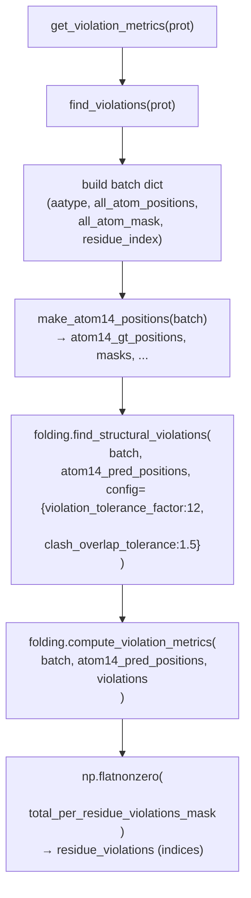

# Structure Relaxation

> **Relevant source files**
> * [alphafold/relax/amber_minimize.py](https://github.com/jcheongs/alphafold-multimer/blob/8e419501/alphafold/relax/amber_minimize.py)
> * [alphafold/relax/amber_minimize_test.py](https://github.com/jcheongs/alphafold-multimer/blob/8e419501/alphafold/relax/amber_minimize_test.py)
> * [alphafold/relax/relax.py](https://github.com/jcheongs/alphafold-multimer/blob/8e419501/alphafold/relax/relax.py)
> * [alphafold/relax/relax_test.py](https://github.com/jcheongs/alphafold-multimer/blob/8e419501/alphafold/relax/relax_test.py)

This page documents the Amber-based structure relaxation subsystem in `alphafold/relax/`. Relaxation is a post-prediction step that resolves steric clashes and bond-geometry violations in the raw neural network output by running constrained energy minimization. This page covers the public API, the iterative minimization pipeline, the OpenMM simulation setup, violation detection, and how B-factors (pLDDT values) are preserved across the process. For information on how pLDDT scores are originally computed and placed in B-factors, see [Confidence Metrics](/jcheongs/alphafold-multimer/5.3-confidence-metrics). For the `Protein` dataclass used throughout this subsystem, see [Common Data Structures](/jcheongs/alphafold-multimer/7-common-data-structures).

---

## Where Relaxation Fits

Relaxation is the final stage of the prediction lifecycle, invoked inside `predict_structure()` in `run_alphafold.py` after each model's unrelaxed PDB has been written.

**Relaxation position in the execution pipeline**



Sources: [alphafold/relax/relax.py L1-L85](https://github.com/jcheongs/alphafold-multimer/blob/8e419501/alphafold/relax/relax.py#L1-L85)

---

## Module Structure

The relaxation subsystem lives entirely under `alphafold/relax/` and is split across two main modules.

| File | Role |
| --- | --- |
| `alphafold/relax/relax.py` | Public facade: `AmberRelaxation` class |
| `alphafold/relax/amber_minimize.py` | All minimization logic: pipeline, OpenMM setup, violation analysis |
| `alphafold/relax/cleanup.py` | PDB cleaning utilities (`fix_pdb`, `clean_structure`) called by `clean_protein` |
| `alphafold/relax/utils.py` | Coordinate and B-factor overwrite helpers |
| `alphafold/relax/relax_test.py` | Integration tests for `AmberRelaxation` |
| `alphafold/relax/amber_minimize_test.py` | Unit tests for `amber_minimize` internals |

Sources: [alphafold/relax/relax.py L1-L85](https://github.com/jcheongs/alphafold-multimer/blob/8e419501/alphafold/relax/relax.py#L1-L85)

 [alphafold/relax/amber_minimize.py L1-L55](https://github.com/jcheongs/alphafold-multimer/blob/8e419501/alphafold/relax/amber_minimize.py#L1-L55)

---

## AmberRelaxation — Public Facade

`AmberRelaxation` in [alphafold/relax/relax.py L23-L84](https://github.com/jcheongs/alphafold-multimer/blob/8e419501/alphafold/relax/relax.py#L23-L84)

 is the only class that callers in `run_alphafold.py` interact with. Its constructor captures all configuration; the actual work happens in `process()`.

### Constructor Parameters

| Parameter | Type | Description |
| --- | --- | --- |
| `max_iterations` | `int` | Max L-BFGS steps per minimization call. `0` = no limit. |
| `tolerance` | `float` | Energy convergence criterion (kcal/mol). Default: `2.39`. |
| `stiffness` | `float` | Spring constant for harmonic restraints (kcal/mol Ų). |
| `exclude_residues` | `Sequence[int]` | Zero-indexed residues to exclude from restraints from the start. |
| `max_outer_iterations` | `int` | Max violation-informed relax cycles. Use `20` for production runs; `1` replicates CASP14 behavior. |
| `use_gpu` | `bool` | Whether to use the CUDA platform in OpenMM. |

Sources: [alphafold/relax/relax.py L26-L56](https://github.com/jcheongs/alphafold-multimer/blob/8e419501/alphafold/relax/relax.py#L26-L56)

### process() Return Values

[alphafold/relax/relax.py L58-L84](https://github.com/jcheongs/alphafold-multimer/blob/8e419501/alphafold/relax/relax.py#L58-L84)

```
process(prot: protein.Protein) -> Tuple[str, Dict[str, Any], np.ndarray]
```

| Return value | Description |
| --- | --- |
| `min_pdb` (str) | PDB string with minimized coordinates and **original B-factors restored** |
| `debug_data` (dict) | `initial_energy`, `final_energy`, `attempts`, `rmsd` |
| `violations` (np.ndarray) | Per-residue violation mask (`total_per_residue_violations_mask`) |

The B-factor restoration step is explicit: `process()` calls `utils.overwrite_b_factors(pdb_str, prot.b_factors)` to write the original prediction's B-factors (pLDDT scores) back into the output, since OpenMM does not preserve them.

Sources: [alphafold/relax/relax.py L58-L84](https://github.com/jcheongs/alphafold-multimer/blob/8e419501/alphafold/relax/relax.py#L58-L84)

---

## Minimization Pipeline — run_pipeline

`process()` immediately delegates to `amber_minimize.run_pipeline()` in [alphafold/relax/amber_minimize.py L425-L502](https://github.com/jcheongs/alphafold-multimer/blob/8e419501/alphafold/relax/amber_minimize.py#L425-L502)

**`run_pipeline` iterative loop**



Key behaviors:

* Violations from one iteration expand the `exclude_residues` set for the next, allowing problematic residues to move freely.
* `max_outer_iterations=1` turns this into a single non-iterative pass (the CASP14 configuration).
* The comment in `relax.py` states that `max_outer_iterations=20` resolves violations in >95% of difficult cases.

Sources: [alphafold/relax/amber_minimize.py L425-L502](https://github.com/jcheongs/alphafold-multimer/blob/8e419501/alphafold/relax/amber_minimize.py#L425-L502)

---

## Protein Cleaning — clean_protein

Before any minimization, `clean_protein()` in [alphafold/relax/amber_minimize.py L153-L184](https://github.com/jcheongs/alphafold-multimer/blob/8e419501/alphafold/relax/amber_minimize.py#L153-L184)

 prepares the structure:

1. `_check_atom_mask_is_ideal(prot)` — asserts that the atom mask matches the expected ideal mask (via `protein.ideal_atom_mask()`).
2. `protein.to_pdb(prot)` — serializes the `Protein` object to a PDB string.
3. `cleanup.fix_pdb(pdb_file, alterations_info)` — uses **pdbfixer** to add missing heavy atoms and perform other standard PDB repairs.
4. `cleanup.clean_structure(pdb_structure, alterations_info)` — applies additional structural normalization.
5. If `checks=True`, `_check_cleaned_atoms()` verifies that no existing atom coordinates were altered during cleaning (only additions are permitted).

The result is a PDB string that OpenMM can load without errors.

Sources: [alphafold/relax/amber_minimize.py L153-L184](https://github.com/jcheongs/alphafold-multimer/blob/8e419501/alphafold/relax/amber_minimize.py#L153-L184)

 [alphafold/relax/amber_minimize.py L119-L143](https://github.com/jcheongs/alphafold-multimer/blob/8e419501/alphafold/relax/amber_minimize.py#L119-L143)

---

## OpenMM Minimization — _openmm_minimize

`_run_one_iteration()` [alphafold/relax/amber_minimize.py L367-L422](https://github.com/jcheongs/alphafold-multimer/blob/8e419501/alphafold/relax/amber_minimize.py#L367-L422)

 wraps `_openmm_minimize()` [alphafold/relax/amber_minimize.py L73-L109](https://github.com/jcheongs/alphafold-multimer/blob/8e419501/alphafold/relax/amber_minimize.py#L73-L109)

 with retry logic (up to `max_attempts` tries on exception).

**OpenMM simulation setup**



Notes:

* The force field is **Amber99sb** (`amber99sb.xml`).
* `HBonds` constraints fix all bonds involving hydrogen, allowing a larger effective time step for L-BFGS.
* The `LangevinIntegrator` with friction=0 and step size=0 is a dummy integrator; `minimizeEnergy` uses L-BFGS regardless of integrator choice in OpenMM.
* The platform is `"CUDA"` when `use_gpu=True`, else `"CPU"`.

Sources: [alphafold/relax/amber_minimize.py L73-L109](https://github.com/jcheongs/alphafold-multimer/blob/8e419501/alphafold/relax/amber_minimize.py#L73-L109)

### Harmonic Restraints — _add_restraints

[alphafold/relax/amber_minimize.py L48-L70](https://github.com/jcheongs/alphafold-multimer/blob/8e419501/alphafold/relax/amber_minimize.py#L48-L70)

A `CustomExternalForce` implements the restraint:

```
U = 0.5 * k * ((x - x0)² + (y - y0)² + (z - z0)²)
```

The restraint set determines which atoms are pinned:

| `restraint_set` value | Atoms restrained |
| --- | --- |
| `"non_hydrogen"` | All heavy atoms (default) |
| `"c_alpha"` | Only Cα atoms |

Atoms belonging to any residue in `exclude_residues` are skipped entirely — these residues are free to move without penalty, which is how the iterative loop releases stuck residues.

Sources: [alphafold/relax/amber_minimize.py L39-L70](https://github.com/jcheongs/alphafold-multimer/blob/8e419501/alphafold/relax/amber_minimize.py#L39-L70)

---

## Violation Detection

After each minimization iteration, `get_violation_metrics()` [alphafold/relax/amber_minimize.py L355-L364](https://github.com/jcheongs/alphafold-multimer/blob/8e419501/alphafold/relax/amber_minimize.py#L355-L364)

 is called to find residues that still have structural violations.

**Violation detection call chain**



`find_structural_violations()` and `compute_violation_metrics()` are functions from `alphafold/model/folding.py` (see [Structure Module](/jcheongs/alphafold-multimer/5.1-structure-module)). The violation configuration used here — `violation_tolerance_factor=12`, `clash_overlap_tolerance=1.5` — matches the values from the model config.

The key output fields from `get_violation_metrics()` used by `run_pipeline()`:

| Field | Description |
| --- | --- |
| `violations_per_residue` | Scalar; loop exit condition (must reach 0) |
| `residue_violations` | Array of zero-indexed residue indices with violations |
| `num_residue_violations` | Count of violating residues |
| `structural_violations` | Full violation dict, passed back to `process()` caller |

Sources: [alphafold/relax/amber_minimize.py L319-L364](https://github.com/jcheongs/alphafold-multimer/blob/8e419501/alphafold/relax/amber_minimize.py#L319-L364)

---

## Atom14 Representation — make_atom14_positions

`find_violations()` requires atom positions in the **atom14** format (14 atoms per residue, dense) rather than the atom37 format stored in `protein.Protein`. `make_atom14_positions()` [alphafold/relax/amber_minimize.py L187-L316](https://github.com/jcheongs/alphafold-multimer/blob/8e419501/alphafold/relax/amber_minimize.py#L187-L316)

 performs this conversion by:

1. Building per-residue-type lookup tables from `residue_constants`.
2. Gathering positions from atom37 into atom14 using the mapping.
3. Computing alternative atom14 positions for the 7 residue types with symmetrically ambiguous atoms (e.g., Phe, Tyr).
4. Adding all computed arrays back into the `batch` dict in-place.

For a full description of atom14 vs atom37, see [Protein Feature Schema](/jcheongs/alphafold-multimer/5.2-protein-feature-schema).

Sources: [alphafold/relax/amber_minimize.py L187-L316](https://github.com/jcheongs/alphafold-multimer/blob/8e419501/alphafold/relax/amber_minimize.py#L187-L316)

---

## B-Factor Preservation

A model prediction encodes per-atom pLDDT scores in the PDB B-factor column. OpenMM does not preserve B-factors when writing output. The `process()` method explicitly restores them:

```markdown
pdb_str = amber_minimize.clean_protein(prot)          # get canonical heavy-atom PDB
min_pdb = utils.overwrite_pdb_coordinates(pdb_str, min_pos)   # apply minimized coords
min_pdb = utils.overwrite_b_factors(min_pdb, prot.b_factors)  # restore original pLDDT
```

[alphafold/relax/relax.py L76-L78](https://github.com/jcheongs/alphafold-multimer/blob/8e419501/alphafold/relax/relax.py#L76-L78)

`prot.b_factors` carries the original per-atom confidence values from `protein.from_prediction()`. After the overwrite, the final PDB file has minimized coordinates but unmodified confidence scores in the B-factor column.

Sources: [alphafold/relax/relax.py L66-L84](https://github.com/jcheongs/alphafold-multimer/blob/8e419501/alphafold/relax/relax.py#L66-L84)

---

## Complete Data Flow

**End-to-end structure relaxation data flow**

```mermaid
flowchart TD

INPUT["protein.Protein<br>(atom_positions, atom_mask,<br>b_factors=pLDDT)"]
RP["amber_minimize.run_pipeline()"]
CP["clean_protein(prot)<br>→ pdb_string (with H)"]
ROI["_run_one_iteration(pdb_string, exclude_residues, ...)"]
OM["_openmm_minimize(<br>  amber99sb, HBonds,<br>  CustomExternalForce,<br>  minimizeEnergy L-BFGS<br>)"]
PARSE["protein.from_pdb_string(ret[min_pdb])"]
VM["get_violation_metrics(prot)<br>→ find_violations()<br>→ folding.find_structural_violations()"]
EXCL["exclude_residues |= residue_violations"]
COORD["utils.overwrite_pdb_coordinates(pdb_str, min_pos)"]
BF["utils.overwrite_b_factors(min_pdb, prot.b_factors)"]
OUTPUT["relaxed PDB string<br>(minimized coords + original B-factors)"]

INPUT --> RP
BF --> OUTPUT

subgraph AmberRelaxation.process() ["AmberRelaxation.process()"]
    RP
    COORD
    BF
    RP --> CP
    EXCL --> COORD
    COORD --> BF

subgraph subGraph1 ["run_pipeline loop"]
    CP
    ROI
    PARSE
    VM
    EXCL
    CP --> ROI
    ROI --> OM
    OM --> PARSE
    PARSE --> VM
    VM --> EXCL
    EXCL --> CP

subgraph _run_one_iteration ["_run_one_iteration"]
    OM
end
end
end
```

Sources: [alphafold/relax/relax.py L58-L84](https://github.com/jcheongs/alphafold-multimer/blob/8e419501/alphafold/relax/relax.py#L58-L84)

 [alphafold/relax/amber_minimize.py L425-L502](https://github.com/jcheongs/alphafold-multimer/blob/8e419501/alphafold/relax/amber_minimize.py#L425-L502)

---

## Test Coverage

### amber_minimize_test.py

[alphafold/relax/amber_minimize_test.py L33-L133](https://github.com/jcheongs/alphafold-multimer/blob/8e419501/alphafold/relax/amber_minimize_test.py#L33-L133)

| Test | Description |
| --- | --- |
| `test_multiple_disulfides_target` | Runs full pipeline on a 191-residue protein with 3 disulfide bonds; checks `opt_time` and `min_attempts` are present. |
| `test_raises_invalid_protein_assertion` | Zeroes out `atom_mask[4, :]` and asserts `run_pipeline` raises `ValueError` about undefined residues. |
| `test_iterative_relax` | Loads `with_violations.pdb`, asserts initial violations exist, runs 10 outer iterations, asserts `num_residue_violations == 0` and `efinal < einit`. |
| `test_find_violations` | Regression test on `multiple_disulfides_target.pdb` with exact expected arrays for `connections_per_residue_violation_mask`, `clashes_per_atom_clash_mask`, and `per_atom_violations`. |

Test data files live in `alphafold/relax/testdata/`.

### relax_test.py

[alphafold/relax/relax_test.py L25-L89](https://github.com/jcheongs/alphafold-multimer/blob/8e419501/alphafold/relax/relax_test.py#L25-L89)

| Test | Description |
| --- | --- |
| `test_process` | Runs `AmberRelaxation.process()` on `model_output.pdb`; verifies energy drops, RMSD > 0, `aatype`/`residue_index` unchanged, B-factors preserved (except terminal OXT), and zero final violations. |
| `test_unresolved_violations` | Runs on `with_violations_casp14.pdb` with `max_outer_iterations=1` (CASP14 configuration); asserts the result's violations are no worse than a known expected array — a regression guard that no new violations are introduced. |

The `test_unresolved_violations` test is the most important regression: it encodes the known CASP14 behavior where a single non-iterative pass leaves some violations unresolved, and confirms that the implementation does not regress to a worse outcome.

Sources: [alphafold/relax/relax_test.py L40-L89](https://github.com/jcheongs/alphafold-multimer/blob/8e419501/alphafold/relax/relax_test.py#L40-L89)

 [alphafold/relax/amber_minimize_test.py L33-L133](https://github.com/jcheongs/alphafold-multimer/blob/8e419501/alphafold/relax/amber_minimize_test.py#L33-L133)