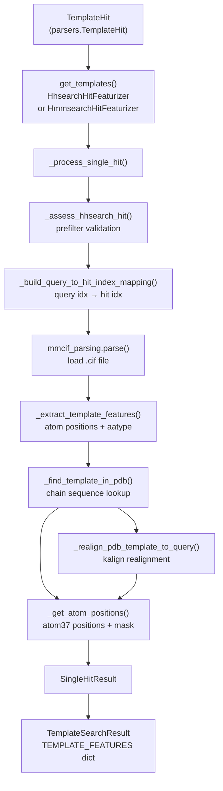
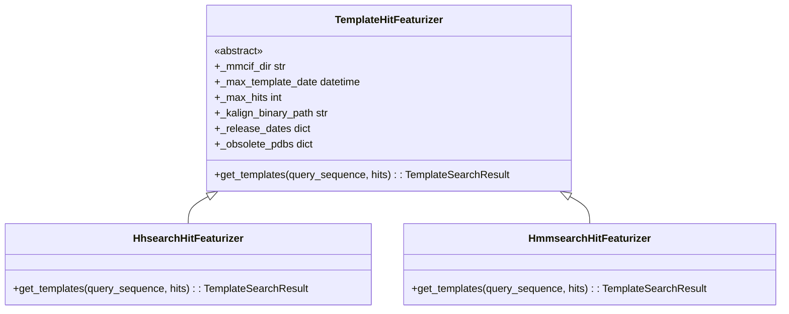
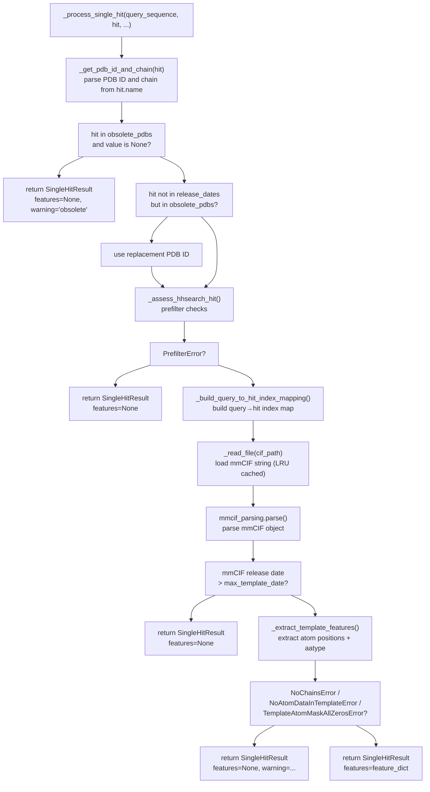
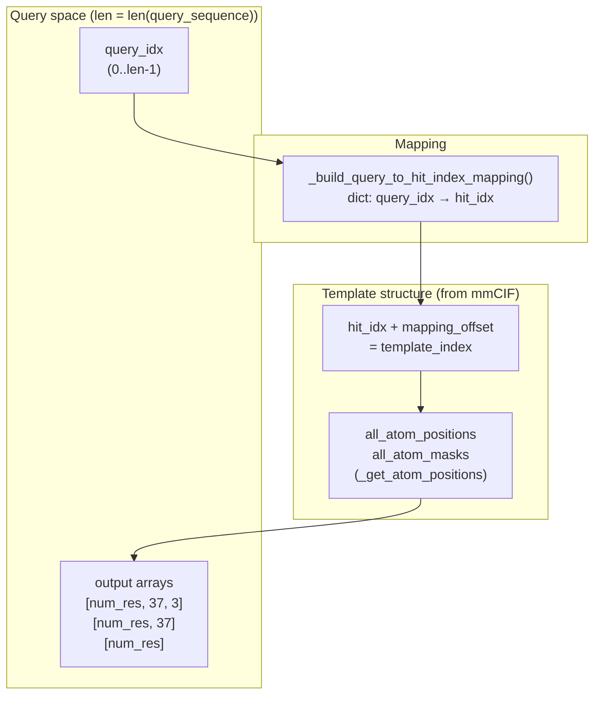
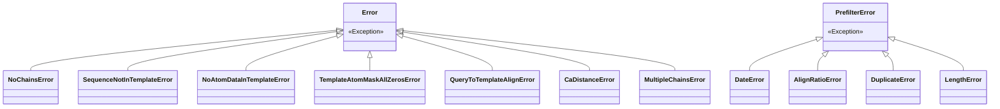

# Template Processing

> **Relevant source files**
> * [alphafold/data/parsers.py](https://github.com/jcheongs/alphafold-multimer/blob/8e419501/alphafold/data/parsers.py)
> * [alphafold/data/templates.py](https://github.com/jcheongs/alphafold-multimer/blob/8e419501/alphafold/data/templates.py)

This page documents how structural template hits are validated and converted into numerical feature arrays for the AlphaFold model. It covers the classes and functions in [alphafold/data/templates.py](https://github.com/jcheongs/alphafold-multimer/blob/8e419501/alphafold/data/templates.py)

 the `TemplateHit` data structure from [alphafold/data/parsers.py](https://github.com/jcheongs/alphafold-multimer/blob/8e419501/alphafold/data/parsers.py)

 and the complete chain from raw search hits to the final `TEMPLATE_FEATURES` arrays.

For the upstream tools that produce template hits (HHSearch, Hmmsearch), see [MSA Generation Tools](/jcheongs/alphafold-multimer/4.2-msa-generation-tools). For the data pipeline context in which template features are assembled alongside MSA features, see [Monomer Data Pipeline](/jcheongs/alphafold-multimer/4.1-monomer-data-pipeline) and [Multimer Data Pipeline](/jcheongs/alphafold-multimer/4.4-multimer-data-pipeline). For parsing of the raw hit file formats (`.hhr`, hmmsearch A3M), see [Data Formats and Parsers](/jcheongs/alphafold-multimer/4.5-data-formats-and-parsers).

---

## Overview

Template processing converts a list of `TemplateHit` objects — produced by HHSearch or Hmmsearch — into a fixed-shape dictionary of numerical arrays that the model uses as structural priors. The process involves:

1. **Prefiltering** each hit (date, alignment ratio, duplicate detection)
2. **Index mapping** from query sequence positions to template hit positions
3. **mmCIF parsing** to load the actual PDB structure
4. **Atom position extraction** into atom37 representation
5. **Alignment-based placement** of template atoms at query-indexed positions
6. **Stacking** all passing hits into batch arrays

**Template diagram: End-to-end flow**



Sources: [alphafold/data/templates.py L686-L791](https://github.com/jcheongs/alphafold-multimer/blob/8e419501/alphafold/data/templates.py#L686-L791)

 [alphafold/data/templates.py L800-L1010](https://github.com/jcheongs/alphafold-multimer/blob/8e419501/alphafold/data/templates.py#L800-L1010)

---

## Key Data Structures

### TemplateHit

Defined in [alphafold/data/parsers.py L55-L66](https://github.com/jcheongs/alphafold-multimer/blob/8e419501/alphafold/data/parsers.py#L55-L66)

 `TemplateHit` is a frozen dataclass produced by `parse_hhr` (HHSearch) or `parse_hmmsearch_a3m` (Hmmsearch).

| Field | Type | Description |
| --- | --- | --- |
| `index` | `int` | Hit rank within the search result |
| `name` | `str` | Template identifier, e.g. `"4abc_A"` (PDB ID + chain) |
| `aligned_cols` | `int` | Number of aligned columns in the hit |
| `sum_probs` | `Optional[float]` | Sum of posterior probabilities (used for sorting; `None` in Hmmsearch hits) |
| `query` | `str` | The aligned query subsequence (may contain gaps `-`) |
| `hit_sequence` | `str` | The aligned hit subsequence (may contain gaps `-`) |
| `indices_query` | `List[int]` | Per-position index into the original query sequence; `-1` for gaps |
| `indices_hit` | `List[int]` | Per-position index into the hit sequence; `-1` for gaps |

### TEMPLATE_FEATURES Schema

Defined at [alphafold/data/templates.py L88-L95](https://github.com/jcheongs/alphafold-multimer/blob/8e419501/alphafold/data/templates.py#L88-L95)

 this dictionary specifies the six feature arrays that every successful template contributes to:

| Feature name | dtype | Shape (per hit) |
| --- | --- | --- |
| `template_aatype` | `float32` | `[num_res, 22]` — one-hot using HHBLITS_AA_TO_ID encoding |
| `template_all_atom_masks` | `float32` | `[num_res, 37]` — atom37 mask |
| `template_all_atom_positions` | `float32` | `[num_res, 37, 3]` — atom37 coordinates (Å) |
| `template_domain_names` | `object` | `[1]` — bytes string, e.g. `b"4abc_a"` |
| `template_sequence` | `object` | `[1]` — bytes string of aligned residues, `-` for gaps |
| `template_sum_probs` | `float32` | `[1]` — copied from `hit.sum_probs`, or `0` if absent |

After processing all hits, each feature is stacked on axis 0 to yield shape `[num_templates, ...]`.

### SingleHitResult and TemplateSearchResult

[alphafold/data/templates.py L672-L677](https://github.com/jcheongs/alphafold-multimer/blob/8e419501/alphafold/data/templates.py#L672-L677)

 and [alphafold/data/templates.py L793-L797](https://github.com/jcheongs/alphafold-multimer/blob/8e419501/alphafold/data/templates.py#L793-L797)

:

* `SingleHitResult` — a frozen dataclass with fields `features`, `error`, `warning`. `features` is `None` if the hit was rejected or failed.
* `TemplateSearchResult` — the return type of `get_templates()`, containing `features` (the stacked dict), `errors` (list of strings), and `warnings` (list of strings).

---

## TemplateHitFeaturizer (Abstract Base Class)

Defined at [alphafold/data/templates.py L800-L867](https://github.com/jcheongs/alphafold-multimer/blob/8e419501/alphafold/data/templates.py#L800-L867)

 All concrete featurizers share a common constructor:

| Parameter | Type | Purpose |
| --- | --- | --- |
| `mmcif_dir` | `str` | Directory of `.cif` files indexed by PDB ID |
| `max_template_date` | `str` | ISO 8601 date string (e.g. `"2021-11-01"`); templates after this date are excluded |
| `max_hits` | `int` | Maximum number of accepted templates to return |
| `kalign_binary_path` | `str` | Path to `kalign` executable for sequence realignment |
| `release_dates_path` | `Optional[str]` | Path to precomputed PDB release date file (avoids repeated mmCIF parsing) |
| `obsolete_pdbs_path` | `Optional[str]` | Path to PDB obsolete entries file |
| `strict_error_check` | `bool` | If `True`, date/duplicate errors are promoted to hard errors |

The constructor validates that `mmcif_dir` contains `.cif` files, parses `max_template_date` into a `datetime` object, and optionally loads `_release_dates` and `_obsolete_pdbs` maps via `_parse_release_dates` and `_parse_obsolete`.

The single abstract method is:

```
get_templates(query_sequence: str, hits: Sequence[TemplateHit]) -> TemplateSearchResult
```

Sources: [alphafold/data/templates.py L800-L868](https://github.com/jcheongs/alphafold-multimer/blob/8e419501/alphafold/data/templates.py#L800-L868)

---

## Concrete Implementations

**Diagram: Class hierarchy and search-tool alignment**



Sources: [alphafold/data/templates.py L870-L1010](https://github.com/jcheongs/alphafold-multimer/blob/8e419501/alphafold/data/templates.py#L870-L1010)

### HhsearchHitFeaturizer

Used with monomer presets. Hits are sorted descending by `sum_probs` before processing. Processing stops once `num_hits >= max_hits` successful hits have been collected. Defined at [alphafold/data/templates.py L870-L929](https://github.com/jcheongs/alphafold-multimer/blob/8e419501/alphafold/data/templates.py#L870-L929)

### HmmsearchHitFeaturizer

Used with the multimer preset. Key behavioral differences from `HhsearchHitFeaturizer`:

* Sorting by `sum_probs` is skipped when hits have no `sum_probs` value (Hmmsearch A3M hits always have `sum_probs=None`)
* Deduplication is performed by `template_sequence` content: a hit whose aligned sequence was already seen is skipped
* When no hits pass, a **zero-filled default template** is returned rather than an empty array — this ensures a valid shape for model consumption

The default template shape when no hits pass is `(1, num_res, ...)` with zeros and empty byte strings. Defined at [alphafold/data/templates.py L932-L1010](https://github.com/jcheongs/alphafold-multimer/blob/8e419501/alphafold/data/templates.py#L932-L1010)

| Behavior | `HhsearchHitFeaturizer` | `HmmsearchHitFeaturizer` |
| --- | --- | --- |
| Sort order | `sum_probs` descending | `sum_probs` descending if available, else original order |
| Deduplication | None | By `template_sequence` bytes |
| Empty result | Empty `np.array([], dtype=...)` | Zero-filled `(1, num_res, ...)` arrays |
| Search tool source | HHSearch → `.hhr` → `parse_hhr` | Hmmsearch → A3M → `parse_hmmsearch_a3m` |

---

## _process_single_hit Internals

[alphafold/data/templates.py L686-L790](https://github.com/jcheongs/alphafold-multimer/blob/8e419501/alphafold/data/templates.py#L686-L790)

 orchestrates the full processing pipeline for one `TemplateHit`. Steps in order:

**Diagram: `_process_single_hit` decision flow**



Note: `_read_file` at [alphafold/data/templates.py L679-L683](https://github.com/jcheongs/alphafold-multimer/blob/8e419501/alphafold/data/templates.py#L679-L683)

 is decorated with `@functools.lru_cache(16)`, so repeated reads of the same `.cif` file within a run are served from memory.

Sources: [alphafold/data/templates.py L686-L790](https://github.com/jcheongs/alphafold-multimer/blob/8e419501/alphafold/data/templates.py#L686-L790)

---

## Hit Prefiltering: _assess_hhsearch_hit

[alphafold/data/templates.py L173-L230](https://github.com/jcheongs/alphafold-multimer/blob/8e419501/alphafold/data/templates.py#L173-L230)

 This function performs four checks before any mmCIF file is touched:

| Check | Exception raised | Condition |
| --- | --- | --- |
| Date cutoff | `DateError` | Template release date > `max_template_date` |
| Alignment ratio | `AlignRatioError` | `aligned_cols / len(query_sequence) <= 0.1` |
| Duplicate detection | `DuplicateError` | Template sequence is substring of query and covers > 95% of query length |
| Minimum length | `LengthError` | Template sequence (gap-stripped) has fewer than 10 residues |

All four are subclasses of `PrefilterError` [alphafold/data/templates.py L68-L85](https://github.com/jcheongs/alphafold-multimer/blob/8e419501/alphafold/data/templates.py#L68-L85)

 In non-strict mode, all prefilter rejections result in `SingleHitResult(features=None, error=None, warning=None)` — the hit is silently skipped. In strict mode (`strict_error_check=True`), `DateError` and `DuplicateError` are promoted to the `error` field.

The date check relies on `_is_after_cutoff` [alphafold/data/templates.py L108-L129](https://github.com/jcheongs/alphafold-multimer/blob/8e419501/alphafold/data/templates.py#L108-L129)

 which uses a preloaded `release_dates` dict where available, and skips the check (returning `False`) when the PDB ID is not found — to avoid false positives in the prefilter.

---

## Query-to-Hit Index Mapping: _build_query_to_hit_index_mapping

[alphafold/data/templates.py L615-L669](https://github.com/jcheongs/alphafold-multimer/blob/8e419501/alphafold/data/templates.py#L615-L669)

 This function converts the gapped alignment columns from a `TemplateHit` into a dictionary `{query_position: hit_position}` using 0-based indices into the **ungapped** sequences.

The alignment in a `TemplateHit` covers only the matched region of the query; `hit.query` is a substring of the full query. The function corrects for this by:

1. Stripping gaps from `hit.query` to get `hhsearch_query_sequence`
2. Finding the offset of `hhsearch_query_sequence` within `original_query_sequence` via `str.find()`
3. Re-zeroing `indices_hit` and `indices_query` by subtracting their respective minimums
4. Adding the offset to all query indices so they reference positions in the full `original_query_sequence`

Pairs where either index is `-1` (gap character) are skipped. The resulting mapping is used directly in `_extract_template_features` to place atoms at the correct query positions.

---

## Feature Extraction: _extract_template_features

[alphafold/data/templates.py L485-L612](https://github.com/jcheongs/alphafold-multimer/blob/8e419501/alphafold/data/templates.py#L485-L612)

 Given a parsed `MmcifObject` and the query-to-hit index mapping, this function produces one template's contribution to `TEMPLATE_FEATURES`.

### Chain Lookup: _find_template_in_pdb

[alphafold/data/templates.py L233-L294](https://github.com/jcheongs/alphafold-multimer/blob/8e419501/alphafold/data/templates.py#L233-L294)

 Locates the correct chain in the mmCIF by trying three strategies in order:

1. Exact match on both chain ID and sequence (substring)
2. Exact match on sequence only (across all chains)
3. Fuzzy match where `X` in the template sequence acts as a wildcard

Returns `(chain_sequence, chain_id, mapping_offset)` where `mapping_offset` is the start position of the template subsequence within the chain.

If none of these succeed, `SequenceNotInTemplateError` is raised, which triggers a fallback to `_realign_pdb_template_to_query`.

### Realignment Fallback: _realign_pdb_template_to_query

[alphafold/data/templates.py L297-L406](https://github.com/jcheongs/alphafold-multimer/blob/8e419501/alphafold/data/templates.py#L297-L406)

 Called when the sequence in PDB70 (used by HHSearch) differs from the sequence in the actual mmCIF file (PDB is updated more frequently than PDB70). Steps:

1. Runs `Kalign.align([old_template_sequence, new_template_sequence])`
2. Parses the aligned output via `parsers.parse_a3m`
3. Builds `old_to_new_template_mapping` from the pairwise alignment
4. Rejects the hit if fewer than 90% of residues match (min-length normalized)
5. Remaps the original `query_to_template_mapping` through the new alignment

### Atom Position Extraction: _get_atom_positions

[alphafold/data/templates.py L430-L482](https://github.com/jcheongs/alphafold-multimer/blob/8e419501/alphafold/data/templates.py#L430-L482)

 Iterates over residues in the chain's SEQRES sequence and populates atom37 arrays:

* `all_positions`: shape `[num_res, 37, 3]`, float32
* `all_positions_mask`: shape `[num_res, 37]`, int64

Special cases handled:

* Missing residues (`res_at_position.is_missing`) are left as zeros
* Selenomethionine (`MSE`) selenium (`SE`) is placed at the sulphur (`SD`) index
* Arginine NH1/NH2 naming errors are corrected based on distance to CD

Residue distance validation via `_check_residue_distances` [alphafold/data/templates.py L409-L427](https://github.com/jcheongs/alphafold-multimer/blob/8e419501/alphafold/data/templates.py#L409-L427)

 rejects templates where adjacent Cα atoms are more than 150 Å apart (`CaDistanceError`).

### Alignment-Based Atom Placement

[alphafold/data/templates.py L575-L612](https://github.com/jcheongs/alphafold-multimer/blob/8e419501/alphafold/data/templates.py#L575-L612)

 The core loop of `_extract_template_features`:

1. Initializes output arrays of length `len(query_sequence)` with zeros and gap characters (`-`)
2. For each `(query_idx, hit_idx)` pair in the mapping, copies: * `all_atom_positions[hit_idx + mapping_offset]` → `templates_all_atom_positions[query_idx]` * `all_atom_masks[hit_idx + mapping_offset]` → `templates_all_atom_masks[query_idx]` * `template_sequence[hit_idx]` → `output_templates_sequence[query_idx]`
3. Converts the output sequence to one-hot via `residue_constants.sequence_to_onehot(..., HHBLITS_AA_TO_ID)`
4. Rejects the template if total atom mask sum < 5 (`TemplateAtomMaskAllZerosError`)

**Diagram: Index mapping through `_extract_template_features`**



Sources: [alphafold/data/templates.py L485-L612](https://github.com/jcheongs/alphafold-multimer/blob/8e419501/alphafold/data/templates.py#L485-L612)

---

## Error Hierarchy



| Exception class | Where raised | Effect in `_process_single_hit` |
| --- | --- | --- |
| `PrefilterError` subclasses | `_assess_hhsearch_hit` | Hit skipped (warning in strict mode for some) |
| `NoChainsError` | `_extract_template_features` | Converted to warning |
| `NoAtomDataInTemplateError` | `_extract_template_features` | Converted to warning |
| `TemplateAtomMaskAllZerosError` | `_extract_template_features` | Converted to warning |
| `SequenceNotInTemplateError` | `_find_template_in_pdb` | Triggers `_realign_pdb_template_to_query` |
| `QueryToTemplateAlignError` | `_realign_pdb_template_to_query` | Hard error |
| `CaDistanceError` | `_check_residue_distances` | Wrapped into `NoAtomDataInTemplateError` |
| `MultipleChainsError` | `_get_atom_positions` | Wrapped into `NoAtomDataInTemplateError` |

Sources: [alphafold/data/templates.py L35-L95](https://github.com/jcheongs/alphafold-multimer/blob/8e419501/alphafold/data/templates.py#L35-L95)

---

## Obsolete PDB Handling

[alphafold/data/templates.py L132-L152](https://github.com/jcheongs/alphafold-multimer/blob/8e419501/alphafold/data/templates.py#L132-L152)

 `_parse_obsolete` reads the PDB `obsolete.dat` file. The resulting dict maps:

* `old_pdb_id → new_pdb_id` (replaced entries)
* `old_pdb_id → None` (removed entries)

In `_process_single_hit`, if a hit's PDB code maps to `None` it is skipped immediately with a warning. If it maps to a replacement ID, that replacement is used for the release date lookup and passed to `_assess_hhsearch_hit`. The mmCIF file is still looked up using the original hit code from the filename.

---

## Release Date Handling

[alphafold/data/templates.py L155-L170](https://github.com/jcheongs/alphafold-multimer/blob/8e419501/alphafold/data/templates.py#L155-L170)

 `_parse_release_dates` reads a plain-text file with lines of the form `PDBID: YYYY-MM-DD`. The resulting dict is checked by `_is_after_cutoff` before any mmCIF parsing occurs (fast prefilter). After mmCIF parsing, the release date from the mmCIF header is also checked directly in `_process_single_hit` [alphafold/data/templates.py L743-L752](https://github.com/jcheongs/alphafold-multimer/blob/8e419501/alphafold/data/templates.py#L743-L752)

 as a secondary guard.

Sources: [alphafold/data/templates.py L108-L170](https://github.com/jcheongs/alphafold-multimer/blob/8e419501/alphafold/data/templates.py#L108-L170)