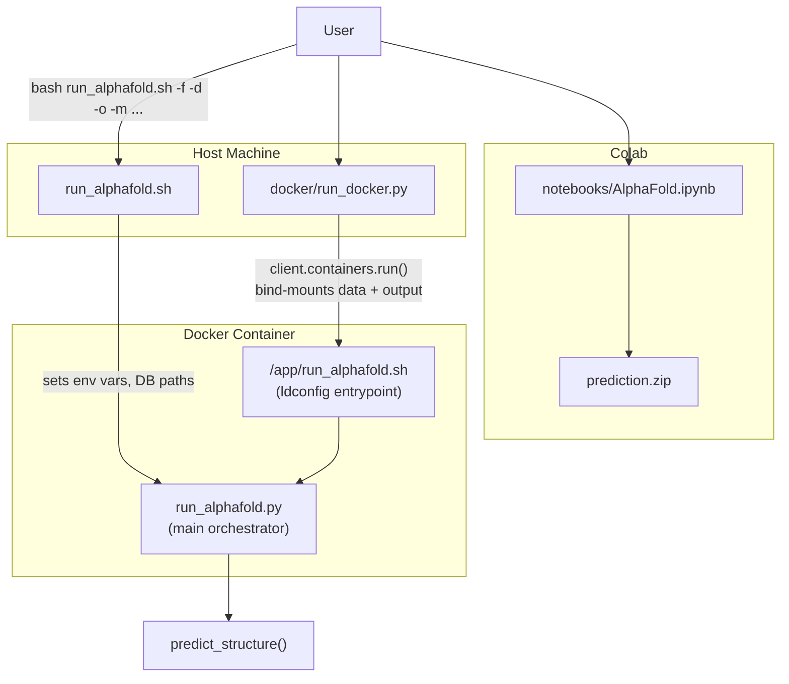
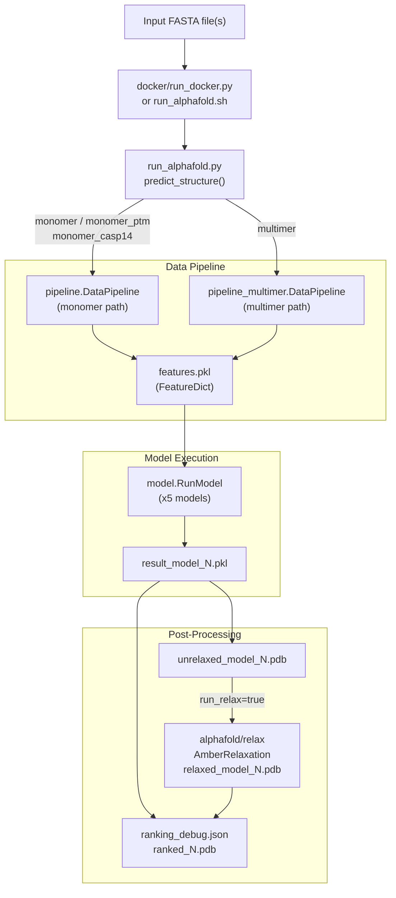

# Getting Started

# Getting Started

> **Relevant source files**
> - [README\.md](https://github.com/jcheongs/alphafold-multimer/blob/8e419501/README.md?plain=1)
> - [docker/Dockerfile](https://github.com/jcheongs/alphafold-multimer/blob/8e419501/docker/Dockerfile)

 This page orients a new user to the full setup and execution workflow for AlphaFold\-Multimer\. It covers the high\-level steps required to go from a bare machine to a running prediction, and links to child pages for each step\. It does not document the internal data pipeline, neural network architecture, or relaxation subsystem in depth — those are covered in pages [4](https://deepwiki.com/jcheongs/alphafold-multimer/4-data-pipeline), [5](https://deepwiki.com/jcheongs/alphafold-multimer/5-neural-network-model), and [6](https://deepwiki.com/jcheongs/alphafold-multimer/6-structure-relaxation) respectively\.

---

## Overview

 Running AlphaFold requires three things in place before any prediction can be made:

 1. A working runtime environment \(Docker image or equivalent\)
2. The genetic databases and model parameters downloaded to local disk
3. An invocation command pointing at a FASTA file

 There are three supported execution paths:

| Path | Entry Point | Use Case |
| --- | --- | --- |
| Docker \(recommended\) | docker/run\_docker\.py | Full local run, GPU server |
| Direct \(bash\) | run\_alphafold\.sh | HPC or pre\-configured environments |
| Colab notebook | notebooks/AlphaFold\.ipynb | Cloud\-based, no local DB stack |

 Each path ultimately drives the same core logic in `run_alphafold.py`\. See the diagram below\.

 **Execution path overview:**



 Sources: [README\.md?plain=1 L207-L319](https://github.com/jcheongs/alphafold-multimer/blob/8e419501/README.md?plain=1#L207-L319) [Dockerfile L84-L88](https://github.com/jcheongs/alphafold-multimer/blob/8e419501/docker/Dockerfile#L84-L88)

---

## Step 1: Installation and Docker Setup

 The standard deployment model is Docker\. The image is defined in `docker/Dockerfile` and bundles all required system dependencies\.

 **What the image contains:**

| Layer | Component | Version |
| --- | --- | --- |
| Base image | nvidia/cuda with cudnn8 | CUDA 11\.1 |
| System packages | hmmer, kalign, build tools | apt |
| HHsuite | compiled from source | v3\.3\.0 |
| Python runtime | Miniconda | Python 3\.7 |
| ML libraries | JAX \+ jaxlib \(CUDA build\) | 0\.2\.14 / 0\.1\.69 |
| Simulation | OpenMM \+ pdbfixer | 7\.5\.1 |
| AlphaFold code | copied to /app/alphafold | — |

 The entrypoint script `/app/run_alphafold.sh` runs `ldconfig` before invoking `run_alphafold.py`, which is required to make GPUs visible inside the container [Dockerfile L84-L88](https://github.com/jcheongs/alphafold-multimer/blob/8e419501/docker/Dockerfile#L84-L88)

 Non\-root GPU access requires the NVIDIA Container Toolkit and Docker configured for non\-root users\.

 For full details on the build and GPU configuration, see [Installation and Docker Setup](https://deepwiki.com/jcheongs/alphafold-multimer/2.1-installation-and-docker-setup)\.

 Sources: [Dockerfile L1-L88](https://github.com/jcheongs/alphafold-multimer/blob/8e419501/docker/Dockerfile#L1-L88) [README\.md?plain=1 L36-L58](https://github.com/jcheongs/alphafold-multimer/blob/8e419501/README.md?plain=1#L36-L58)

---

## Step 2: Downloading Required Databases

 AlphaFold requires several large genetic databases\. The `scripts/download_all_data.sh` script handles all downloads\.

 **Database inventory:**

| Directory | Database | Size \(unpacked\) | Notes |
| --- | --- | --- | --- |
| bfd/ | BFD | ~1\.7 TB | full\_dbs only |
| small\_bfd/ | Small BFD | ~17 GB | reduced\_dbs only |
| mgnify/ | MGnify | ~64 GB | — |
| pdb70/ | PDB70 | ~56 GB | Monomer templates |
| pdb\_mmcif/ | PDB mmCIF | ~206 GB | All\-atom structures |
| pdb\_seqres/ | PDB seqres | ~0\.2 GB | Multimer templates |
| uniclust30/ | Uniclust30 | ~86 GB | full\_dbs only |
| uniprot/ | UniProt | ~98 GB | Multimer only |
| uniref90/ | UniRef90 | ~58 GB | — |
| params/ | Model weights | ~3\.5 GB | 15 model files |

 **Total:** ~2\.2 TB unpacked \(438 GB download for full databases\)\.

 > **Note:** Place `<DOWNLOAD_DIR>` outside the repository directory\. If it is inside, the Docker build context will attempt to copy the databases during `docker build`, making it extremely slow [README\.md?plain=1 L95-L97](https://github.com/jcheongs/alphafold-multimer/blob/8e419501/README.md?plain=1#L95-L97)

 Two database presets are available, controlled by `--db_preset`:

 - `full_dbs` — uses BFD \+ Uniclust30 via HHBlits; matches CASP14 configuration
- `reduced_dbs` — uses small BFD via Jackhmmer; requires ~600 GB disk, 8 GB RAM

 For full download script documentation, see [Downloading Required Databases](https://deepwiki.com/jcheongs/alphafold-multimer/2.2-downloading-required-databases)\.

 Sources: [README\.md?plain=1 L60-L143](https://github.com/jcheongs/alphafold-multimer/blob/8e419501/README.md?plain=1#L60-L143)

---

## Step 3: Running Predictions

 **Model presets** control which neural network variant is used, set via `--model_preset`:

| Preset | Description |
| --- | --- |
| monomer | Original CASP14 model, no ensembling |
| monomer\_casp14 | CASP14 model with num\_ensemble=8 \(8× slower\) |
| monomer\_ptm | CASP14 model fine\-tuned with pTM/PAE heads |
| multimer | AlphaFold\-Multimer for complexes |

 **Key flags summary:**

| Flag | Default | Description |
| --- | --- | --- |
| \-\-fasta\_paths | required | Comma\-separated FASTA file paths |
| \-\-data\_dir | required | Root of the database download directory |
| \-\-output\_dir | /tmp/alphafold | Where results are written |
| \-\-model\_preset | monomer | Model variant to run |
| \-\-db\_preset | full\_dbs | Database set to use |
| \-\-max\_template\_date | required | Exclude templates after this date |
| \-\-gpu\_devices | all | Comma\-separated GPU UUIDs or indices |
| \-\-is\_prokaryote\_list | — | Per\-FASTA boolean; multimer only |
| \-\-run\_relax | true | Whether to run Amber relaxation |

 **Minimal invocation \(Docker path\):**

```
python3 docker/run_docker.py \
  --fasta_paths=T1050.fasta \
  --max_template_date=2020-05-14 \
  --data_dir=$DOWNLOAD_DIR
```

 **Multimer invocation:**

```
python3 docker/run_docker.py \
  --fasta_paths=multimer.fasta \
  --is_prokaryote_list=true \
  --max_template_date=2021-11-01 \
  --model_preset=multimer \
  --data_dir=$DOWNLOAD_DIR
```

 **FASTA format for complexes:** Each chain is a separate `>header` / sequence entry in the same file\. Homomers repeat the same sequence once per chain copy\.

 For full flag documentation and the direct\-execution \(`run_alphafold.sh`\) path, see [Running Predictions](https://deepwiki.com/jcheongs/alphafold-multimer/2.3-running-predictions)\.

 Sources: [README\.md?plain=1 L205-L426](https://github.com/jcheongs/alphafold-multimer/blob/8e419501/README.md?plain=1#L205-L426)

---

## Step 4: Colab Notebook

 For users without a local GPU server or database stack, `notebooks/AlphaFold.ipynb` provides a self\-contained alternative\. It streams databases from Google Cloud Storage rather than requiring a local copy\. Predictions are exported as `prediction.zip`\.

 See [Colab Notebook](https://deepwiki.com/jcheongs/alphafold-multimer/2.4-colab-notebook) for details\.

---

## Output Files

 Results are written to `<output_dir>/<target_name>/` with the following structure:

```
<target_name>/
    features.pkl                  # Input feature arrays (NumPy)
    msas/
        bfd_uniclust_hits.a3m
        mgnify_hits.sto
        uniref90_hits.sto
    unrelaxed_model_{1..5}.pdb    # Raw model output; pLDDT in B-factor column
    relaxed_model_{1..5}.pdb      # After Amber relaxation
    ranked_{0..4}.pdb             # Sorted by confidence; ranked_0 = best
    ranking_debug.json            # pLDDT scores and model name mapping
    result_model_{1..5}.pkl       # Full model output dict (logits, pLDDT, PAE, etc.)
    timings.json                  # Wall-clock time per pipeline stage
```

 **Key output fields in `result_model_*.pkl`:**

| Field | Shape | Description |
| --- | --- | --- |
| plddt | \[N\_res\] | Per\-residue confidence, 0–100 |
| ptm | scalar | Predicted TM\-score \(pTM models only\) |
| predicted\_aligned\_error | \[N\_res, N\_res\] | PAE matrix \(pTM models only\) |
| distogram/logits | \[N\_res, N\_res, N\_bins\] | Raw distogram logits |

 `ranked_0.pdb` is typically the file of interest\. The pLDDT score is stored in the B\-factor column of all PDB output files \(higher = more confident, opposite convention to crystallographic B\-factors\)\.

 Sources: [README\.md?plain=1 L429-L499](https://github.com/jcheongs/alphafold-multimer/blob/8e419501/README.md?plain=1#L429-L499)

---

## End\-to\-End Flow Diagram

 The following diagram maps the full execution pipeline from user input to output files, annotated with the code entities involved at each stage\.



 Sources: [README\.md?plain=1 L205-L499](https://github.com/jcheongs/alphafold-multimer/blob/8e419501/README.md?plain=1#L205-L499) [Dockerfile L84-L88](https://github.com/jcheongs/alphafold-multimer/blob/8e419501/docker/Dockerfile#L84-L88)

---

## Upgrading an Existing Installation

 If upgrading from AlphaFold v2\.0\.x to v2\.1\+ \(to add multimer support\), the incremental update requires:

 1. `git fetch origin main` to update code
2. Download UniProt: `scripts/download_uniprot.sh <DOWNLOAD_DIR>`
3. Re\-download PDB mmCIF and PDB seqres \(they must be from the same date\): remove `<DOWNLOAD_DIR>/pdb_mmcif`, then run `scripts/download_pdb_mmcif.sh` and `scripts/download_pdb_seqres.sh`
4. Replace model parameters: remove `<DOWNLOAD_DIR>/params`, run `scripts/download_alphafold_params.sh <DOWNLOAD_DIR>`

 **API changes in v2\.1\.0** relevant to any custom code built on top of `RunModel`:

 - `RunModel.predict()` now requires a `random_seed` argument
- `--preset` flag split into `--db_preset` and `--model_preset`
- `--model_names` removed; use `model_preset` and the `MODEL_PRESETS` dict in `alphafold/model/config.py`
- `--data_dir` is now required when using `run_docker.py`

 Sources: [README\.md?plain=1 L165-L202](https://github.com/jcheongs/alphafold-multimer/blob/8e419501/README.md?plain=1#L165-L202)

---
*Source: [https://deepwiki.com/jcheongs/alphafold-multimer/2-getting-started](https://deepwiki.com/jcheongs/alphafold-multimer/2-getting-started) on DeepWiki*