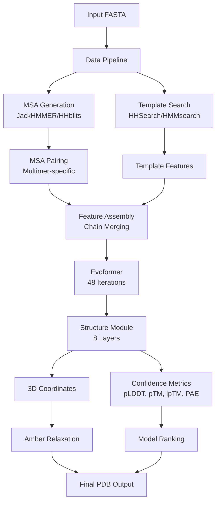

---
slug:1-overview
blog_type:normal
---

Alpha-Multimer 是 DeepMind AlphaFold v2.0 的高级实现版本，专为预测蛋白质复合物——即两条或多条蛋白质链相互作用并折叠在一起形成的结构——而设计。该代码库扩展了 AlphaFold 突破性的单体预测能力，以处理多聚体蛋白质组装，代表了计算结构生物学领域的重大进展。来源: [README.md](README.md#L1-L20)

## 什么是 AlphaFold-Multimer？

AlphaFold-Multimer 建立在革命性的 AlphaFold v2.0 架构之上，该架构在 CASP14 竞赛中取得了前所未有的准确度。它通过添加专门用于同时处理多条相互作用蛋白质链的组件进行了扩展。该系统保留了原始 AlphaFold 的核心神经网络架构，同时引入了用于复合物形成预测的关键创新，包括多重序列比对 (MSA) 配对、链感知特征处理以及界面预测 TM-score (ipTM) 等多聚体特异性置信度指标。来源: [README.md](README.md#L1-L20), [alphafold/model/model.py](alphafold/model/model.py#L26-L54)

该实现根据 Apache 2.0 许可证（代码）和 CC BY 4.0 许可证（模型参数）以正在进行的工作形式提供。这允许研究人员和开发人员使用、修改和分发该系统，同时保持适当的署名。多聚体能力代表了对单链预测的巨大扩展，使研究人员能够理解对生物学过程至关重要的蛋白质-蛋白质相互作用、信号传导复合物和分子组装。来源: [README.md](README.md#L22-L28)

## 核心架构

AlphaFold-Multimer 架构集成了多个精密组件协同工作以预测蛋白质复合物结构。系统通过综合流程处理输入序列，将原始氨基酸序列转换为丰富的特征表示，将其传递给 Evoformer 神经网络进行迭代优化，最后通过结构模块生成原子坐标预测。

多聚体系统引入了专门的处理机制来处理多条链。流程独立处理每条链的 MSA 生成和模板搜索，然后应用复杂的配对算法来对齐链之间的进化信息。这一配对步骤至关重要，因为相互作用的蛋白质通常会共同进化，捕捉这些进化耦合能为它们在复合物中的相对取向提供强有力的约束。该系统支持原核和真核配对策略，认识到这些生物类型之间的进化约束有所不同。来源: [alphafold/data/pipeline_multimer.py](alphafold/data/pipeline_multimer.py#L1-L100), [alphafold/data/msa_pairing.py](alphafold/data/msa_pairing.py#L54-L100)

## 关键组件概述

AlphaFold-Multimer 代码库组织成不同的模块，每个模块处理预测流程的特定方面。这种模块化设计使研究人员能够理解、修改和扩展单个组件，同时保持整体系统的完整性。来源: [get_repo_structure](get_repo_structure)

| 模块 | 用途 | 关键文件 |
|--------|---------|-----------|
| **数据处理** | 特征生成、MSA 构建、模板搜索 | `alphafold/data/pipeline.py`, `alphafold/data/pipeline_multimer.py`, `alphafold/data/msa_pairing.py` |
| **模型架构** | 神经网络组件、Evoformer、结构模块 | `alphafold/model/modules.py`, `alphafold/model/modules_multimer.py`, `alphafold/model/folding_multimer.py` |
| **模型接口** | 预测执行、配置管理 | `alphafold/model/model.py`, `alphafold/model/config.py` |
| **置信度指标** | pLDDT, pTM, ipTM, PAE 计算 | `alphafold/common/confidence.py` |
| **后处理** | Amber 弛豫、结构优化 | `alphafold/relax/relax.py`, `alphafold/relax/amber_minimize.py` |
| **通用工具** | 蛋白质数据结构、残基常数 | `alphafold/common/protein.py`, `alphafold/common/residue_constants.py` |

`RunModel` 类是执行预测的主要接口，负责管理模型初始化、特征处理和推理。它会根据配置自动检测是使用单体模式还是多聚体模式，并应用适当的处理，包括在回收迭代期间的 MSA 采样。该类处理五种不同的模型预设 (model_1 到 model_5)，每种都有针对不同类型目标进行优化的独特架构变体。来源: [alphafold/model/model.py](alphafold/model/model.py#L60-L95), [run_alphafold.py](run_alphafold.py#L60-L100)

## 模型预设和配置

AlphaFold-Multimer 提供了三种针对不同预测任务定制的不同模型预设。每个预设包含五个具有不同架构配置的模型变体，能够通过多样性进行集成预测以提高准确度。来源: [alphafold/model/config.py](alphafold/model/config.py#L44-L60)

| 预设 | 模型 | 用途 | 关键特性 |
|--------|--------|---------|--------------|
| **monomer** | model_1-5 | 单条蛋白质链 | 基础 AlphaFold v2.0 架构 |
| **monomer_ptm** | model_1_ptm-5_ptm | 带置信度的单链 | 包含预测对齐误差 (PAE) 和预测 TM-score (pTM) |
| **multimer** | model_1_multimer-5_multimer | 蛋白质复合物 | 完整的多聚体能力，具有用于排序的 ipTM (界面 pTM) |

多聚体模型包含几个用于复合物预测的架构适应性调整。这些包括扩展的 MSA 处理以处理配对的比对、具有链感知的修改后的注意力机制，以及专门评估链间界面质量的界面 FAPE (框架对齐点误差) 损失。多聚体预测的排序机制使用加权公式结合了整体置信度 (pTM) 和界面特异性置信度 (ipTM)：`ranking_confidence = 0.8 * iptm + 0.2 * ptm`，确保模型准确预测单个链结构及其相对取向。来源: [alphafold/model/model.py](alphafold/model/model.py#L26-L54), [alphafold/model/config.py](alphafold/model/config.py#L600-L658)

<CgxTip>多聚体排序公式 (0.8 × ipTM + 0.2 × ptm) 优先考虑界面质量，同时仍然考虑整体结构准确性，这反映了正确预测链之间的相互作用通常比实现完美的单链结构更具挑战性和生物学关键性。</CgxTip>

## 数据流程和遗传数据库

预测流程依赖于大量的遗传数据库来构建信息丰富的多重序列比对 (MSA)，这为准确的结构预测提供了关键的进化约束。系统搜索多个数据库以收集同源序列，不同的数据库提供关于序列保守性和多样性的互补信息。来源: [README.md](README.md#L60-L95)

| 数据库 | 用途 | 大小 (完整版) | 大小 (精简版) |
|----------|---------|-------------|----------------|
| **BFD** | 多样化的宏基因组序列 | 1.7 TB (271.6 GB) | 未使用 |
| **MGnify** | 宏基因组蛋白质簇 | 64 GB (32.9 GB) | 包含 |
| **Uniclust30** | 聚类的 UniProt 序列 | 86 GB (24.9 GB) | 包含 |
| **UniRef90** | 90% 相同性的非冗余 UniProt | 58 GB (29.7 GB) | 包含 |
| **UniProt** | 完整 UniProt 数据库 | 98.3 GB (49 GB) | 仅用于多聚体 |
| **PDB seqres** | 蛋白质数据库序列 | 0.2 GB (0.2 GB) | 仅用于多聚体 |
| **PDB70** | HHsearch 的模板结构 | 56 GB (19.5 GB) | 包含 |
| **PDB mmCIF** | mmCIF 格式的模板结构 | 206 GB (46 GB) | 包含 |

多聚体系统需要两个单体预测中未使用的额外数据库：PDB seqres 和 UniProt。这些使系统能够识别 MSA 中哪些序列来自同一生物体，并收集特定于多聚体复合物的进化信息。原核标志决定使用哪种配对策略——原核序列基于序列相似性进行配对，而真核序列使用物种识别来解释产生旁系同源基因的基因复制事件。来源: [README.md](README.md#L110-L150), [alphafold/data/msa_pairing.py](alphafold/data/msa_pairing.py#L54-L100)

## 置信度指标和输出

AlphaFold-Multimer 提供多种置信度指标以帮助用户评估预测质量。这些指标对于解释结果和确定预测是否足够可靠以用于下游应用（如实验设计或计算对接研究）至关重要。来源: [alphafold/common/confidence.py](alphafold/common/confidence.py#L1-L100)

| 指标 | 描述 | 范围 | 解释 |
|--------|-------------|-------|----------------|
| **pLDDT** | 预测局部距离差异测试 | 0-100 | 每残基置信度；越高越好 |
| **pTM** | 预测 TM-score | 0-1 | 整体折叠质量；评估结构域堆积 |
| **ipTM** | 界面 pTM (仅多聚体) | 0-1 | 链之间的界面特异性质量 |
| **PAE** | 预测对齐误差 | 0-31+ Å | 残基对之间的预期误差 |
| **ranking_confidence** | 模型选择的综合得分 | 变化 | pLDDT (单体) 或 0.8×ipTM+0.2×pTM (多聚体) |

输出目录包含综合结果，包括排序的 PDB 文件、调试信息、计时数据和原始模型输出。`ranked_0.pdb` 文件包含根据排序指标确定的最高置信度预测。置信度分数嵌入在 PDB 文件的 B-factor 字段中，以便在分子图形软件中进行可视化，尽管用户必须记住较高的值表示较高的置信度（与传统的 B-factor 解释相反）。来源: [README.md](README.md#L450-L520)

<CgxTip>在 PyMOL 或 Chimera 等工具中可视化预测时，按 B-factor 为结构着色以查看每残基置信度。红色/黄色区域表示低置信度，可能需要实验验证或额外的建模方法。</CgxTip>

## 你可以用 AlphaFold-Multimer 做什么？

AlphaFold-Multimer 使研究人员能够解决广泛的生物学问题，这些问题需要理解蛋白质-蛋白质相互作用和复合物组装。来源: [README.md](README.md#L1-L30)

### 研究应用

**蛋白质-蛋白质相互作用作图**：预测单个蛋白质如何相互作用以形成功能性复合物，使研究人员能够在无需实验结构的情况下理解信号通路、酶复合物和分子机器。对于难以结晶或纯化的复合物，这特别有价值。

**抗体-抗原复合物**：模拟抗体如何与其目标抗原结合，支持治疗性抗体设计和表位定位。即使单个组分已经过实验表征，多聚体系统也可以预测抗体-抗原界面的取向。

**膜蛋白复合物**：研究与膜相关的复合物的结构，由于纯化和结晶的困难，这些结构在实验上极具挑战性。AlphaFold-Multimer 可以提供指导实验验证的结构假设。

**病原体-宿主相互作用**：了解病原体蛋白质如何与宿主细胞机制相互作用，为感染机制和潜在药物靶点提供见解。MSA 中捕获的进化信息有助于识别保守的相互作用界面。

### 实际应用

**药物发现**：利用预测的复合物结构识别蛋白质-蛋白质界面处的结合口袋，从而对仅存在单体结构时被认为是“不可成药”的靶点进行基于结构的药物设计。

**蛋白质工程**：通过分析相互作用界面并预测突变对复合物稳定性的影响，指导设计具有增强或改变结合特性的修饰蛋白质。

**实验设计**：基于置信度指标和预测的结构特征，规划诱变实验、表达构建边界和设计验证实验。

**功能注释转移**：通过与已知复合物的结构相似性识别并预测相互作用伙伴，从而推断未表征蛋白质的功能。

## 系统要求和部署

运行 AlphaFold-Multimer 需要大量的计算资源，这主要由庞大的遗传数据库和密集的神经网络计算驱动。该系统设计为在支持 GPU 加速的 Docker 容器中运行，以获得最佳性能。来源: [run_alphafold.py](run_alphafold.py#L60-L100), [README.md](README.md#L30-L60)

| 要求 | 最低 | 推荐 |
|-------------|---------|-------------|
| **存储** | 2 TB | 3+ TB SSD 以获得更好的数据库性能 |
| **内存 (RAM)** | 32 GB | 64-128 GB 用于大型复合物 |
| **GPU** | 具有 16 GB VRAM 的 NVIDIA GPU | NVIDIA RTX 3090/4090 或 A100 |
| **GPU 内存** | 16 GB | 24+ GB 用于大于 1000 个残基的复合物 |
| **CPU** | 8 核 | 16+ 核以加快 MSA 生成 |

Docker 部署隔离了依赖项，并确保在不同计算环境中的可重复性。容器包括所有必需的生物信息学工具 (JackHMMER, HHblits, HHsearch, HMMsearch, Kalign) 和必要的 Python 包。用户必须安装 NVIDIA Container Toolkit 以在 Docker 容器中启用 GPU 访问。来源: [docker/Dockerfile](docker/Dockerfile)

## 入门路径

文档结构旨在引导你从初始安装到高级使用和自定义。遵循推荐的进度将帮助你逐步建立理解并避免常见的陷阱。

**推荐阅读顺序**：

1. [快速入门](2-quick-start) - 以最少的设置运行你的第一次预测
2. [使用 Docker 安装 AlphaFold-Multimer](3-installing-alphafold-multimer-with-docker) - 完整安装指南
3. [下载遗传数据库和模型参数](4-downloading-genetic-databases-and-model-parameters) - 获取所需数据
4. [运行你的第一次预测](5-running-your-first-prediction) - 执行预测并解释结果

**深入理解**：

完成快速入门后，探索架构文档以了解系统内部：

- [AlphaFold-Multimer 架构概述](6-alphafold-multimer-architecture-overview) - 系统设计和组件
- [数据流程和特征处理](7-data-pipeline-and-feature-processing) - 输入如何转换
- [MSA 配对](9-multiple-sequence-alignment-msa-pairing) - 关键的多聚体特定创新

**实际应用**：

- [置信度指标](16-per-residue-confidence-plddt), [17-predicted-tm-score-ptm), [18-predicted-aligned-error-pae-visualization) - 解释预测质量
- [模型排序和选择](20-model-ranking-and-selection) - 选择最佳预测
- [性能优化](22-database-presets-reduced_dbs-vs-full_dbs), [23-gpu-configuration-and-resource-management) - 针对你的硬件进行优化

AlphaFold-Multimer 代表了推进结构生物学研究的强大工具，使研究人员能够以前所未有的规模和准确度探索蛋白质复合物。通过了解其架构、能力和局限性，你可以有效地应用该系统来解决多样化的生物学问题并推动结构生物学的发现。