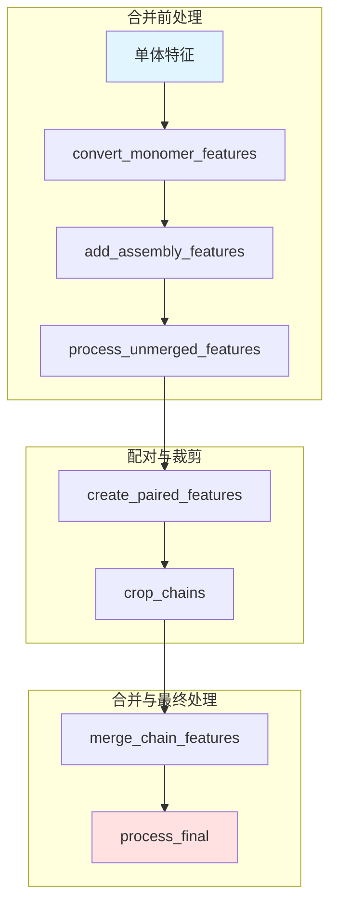

---
slug:10-chain-feature-merging-and-assembly
blog_type:normal
---

AlphaFold-Multimer 中的链特征合并与组装流程，将独立的多肽链表示转换为统一的多聚体特征张量，同时保留了链内和链间的进化信息。这一机制通过整合来自多条多肽链的特征，并结合适当的结构和进化上下文，使模型能够对蛋白质复合物的组装过程进行推理。

## 架构概述

合并流水线通过一系列协调的变换操作，逐步将链级别的数据聚合为复合物级别的表示。该架构区分同源复合物（相同链）和异源复合物（不同链），并针对每种情况应用专门的加工策略。

## 从单体到多聚体特征转换

转换过程通过 `convert_monomer_features` 开始，旨在使单体特征适应多聚体处理。该函数执行三个关键操作：对标量特征进行降维、将独热编码转换回整数索引，以及将模板氨基酸类型从 HHblits 格式映射到 AlphaFold 的内部表示。

转换过程有选择地从 `sequence`、`domain_name`、`num_alignments` 和 `seq_length` 等特征中移除不必要的前导维度，同时将编码特征转换为适合多聚体建模的格式。`aatype` 和 `template_aatype` 特征通过 argmax 操作从独热编码转换为整数索引，并且模板氨基酸类型还使用 `MAP_HHBLITS_AATYPE_TO_OUR_AATYPE` 转换表进行了重新映射。

来源：[pipeline_multimer.py](alphafold/data/pipeline_multimer.py#L72-L96)

## 组装特征标注

组装特征为模型提供了必要的结构上下文，用于区分复合物内的链并建立链间关系。`add_assembly_features` 函数生成三个关键标识符：`asym_id` 为每条链分配唯一的整数标识符，`sym_id` 将具有相同序列的链分组（适用于同源物），而 `entity_id` 按生物学实体对链进行分组，以支持对称性推理。

该实现根据氨基酸序列对链进行分组，并基于序列的唯一性递增地分配实体 ID。对于包含两条相同链的同源二聚体，两条链接收相同的实体 ID，但拥有不同的 `asym_id` 和 `sym_id` 值（例如 A_1 和 A_2）。对于具有不同序列的异源二聚体，各条链接收不同的实体 ID（例如 A_1 和 B_1）。这种编码使模型能够在结构预测期间识别并利用生物学对称性。

来源：[pipeline_multimer.py](alphafold/data/pipeline_multimer.py#L119-L157)

## 合并前特征处理

在合并之前，`process_unmerged_features` 应用链级别的变换，为特征的多聚体组装做准备。这包括将删除矩阵从整数表示转换为浮点表示，计算 MSA（多序列比对）中的删除均值，以及基于氨基酸类型生成占位符的全原子位置和掩码。

该函数还添加 `assembly_num_chains` 以向模型提供复合物大小信息，并生成 `entity_mask` 用于识别属于有效实体的残基与填充位置。这些特征使模型能够在推理过程中理解链边界和组装拓扑。

来源：[feature_processing.py](alphafold/data/feature_processing.py#L203-L232)

## 链间关系的 MSA 配对

对于异源复合物，MSA 配对识别跨链的可能源自同一基因组生物的序列，保留对于预测链间接触至关重要的共进化信号。`create_paired_features` 函数利用 `pair_sequences` 基于登录 ID 匹配（适用于原核生物）或遗传距离度量（适用于真核生物）来生成配对的 MSA 行。

配对过程在 `_all_seq` 特征（完整的未配对 MSA 数据库）上操作，并创建在多条链中均有匹配的序列子集。这些配对序列被提取并存储在带有 `_all_seq` 后缀的独立特征中，而剩余的未配对序列则保留用于后续的块对角合并。这种双轨方法既保留了配对的共进化信息，又保留了链特异性多样性。

来源：[msa_pairing.py](alphafold/data/msa_pairing.py#L60-L98)

## 特征裁剪与资源管理

`crop_chains` 函数通过限制 MSA 维度来管理计算内存，同时保留信息量最大的序列。对于未配对特征，裁剪很简单：选择前 `msa_crop_size` 个序列。对于配对特征，该实现采用了一种平衡配对和未配对表示的自适应策略。

当启用序列配对时，裁剪大小在来自 `_all_seq` 特征的配对序列和未配对序列之间进行分配。该算法计算非空隙的配对序列，并动态调整未配对的裁剪大小，以确保每条链的总 MSA 大小不超过 `msa_crop_size`。这防止了当一条链具有大量配对匹配而另一条链匹配很少时出现不成比例的表示。

模板特征同样被裁剪到 `max_templates`（默认为 4），确保跨链的模板使用一致。裁剪统一应用于所有与 MSA 相关的特征，包括 `msa`、`msa_mask`、`deletion_matrix` 及其 `_all_seq` 变体。

来源：[feature_processing.py](alphafold/data/feature_processing.py#L84-L163)

## 特征合并策略

`merge_chain_features` 函数通过 `_merge_features_from_multiple_chains` 实施，使用针对不同特征类别的独特策略来协调整个最终组装过程。合并逻辑识别四种具有适当连接语义的特征类别。

**MSA 特征**：对于未配对序列使用块对角化合并，对于配对序列使用直接连接。块对角化将链的 MSA 沿着组合矩阵的对角线排列，并在非对角线位置使用空隙填充，既保留了链特异性序列多样性，又使跨链注意力机制能够区分边界。

**序列特征**：沿着残基维度连接，将所有链的残基组合成单一序列。像 `residue_index`、`aatype` 和掩码之类的特征被简单地堆叠，而链标识符（`asym_id`、`sym_id`、`entity_id`）则保留链拓扑信息。

**模板特征**：类似于序列特征，沿着残基维度连接，使模板能够为整个复合物提供结构约束。

**链特征**：如 `num_alignments` 和 `seq_length`，在链之间进行求和，以产生指导模型注意力分配的复合物级聚合数据。

专门的 `block_diag` 函数实现了具有可配置填充值的块对角连接，使用 `scipy.linalg.block_diag` 构建对角线结构，并使用适当的空隙索引或掩码应用非对角线填充。

来源：[msa_pairing.py](alphafold/data/msa_pairing.py#L498-L532)，[msa_pairing.py](alphafold/data/msa_pairing.py#L420-L428)

## 配对与未配对特征整合

对于具有配对序列的复合物，`_concatenate_paired_and_unpaired_features` 通过将配对的 `_all_seq` 特征连接在未配对的块对角特征之上，整合了这两条 MSA 轨道。这创建了一个统一的 MSA，其中顶部包含保留共进化信号的跨链配对序列，底部包含链特异性多样性。

连接顺序很重要：配对序列被放在前面，因为它们通常包含更高质量的链间信息，在 Evoformer 中尽早处理这些信息会受益。`num_alignments` 值会更新以反映连接后的总 MSA 深度。

来源：[msa_pairing.py](alphafold/data/msa_pairing.py#L559-L573)，[msa_pairing.py](alphafold/data/msa_pairing.py#L574-L603)

## 最终特征处理

`process_final` 函数应用最终转换，准备合并后的特征字典以供模型使用。这包括校正 MSA 残基类型顺序以匹配 `residue_constants`，生成识别有效位置的序列和 MSA 掩码，以及过滤以仅保留所需特征。

序列掩码识别具有有效实体 ID 的残基，并且该掩码在 MSA 维度上进行广播以创建 `msa_mask`。这使模型能够在推理期间区分实际的生物学数据和填充 token。最后的过滤步骤移除了处理期间使用的中间特征，确保仅保留与模型相关的特征。

来源：[feature_processing.py](alphafold/data/feature_processing.py#L165-L200)

## 特征字典结构

最终合并的特征字典包含分类特征，这些特征在多聚体预测流水线中服务于不同的目的。

| 特征类别 | 代表性特征 | 用途 |
|----------------|------------------------|---------|
| MSA 特征 | `msa`, `msa_mask`, `deletion_matrix` | 跨序列的进化信息 |
| 序列特征 | `aatype`, `residue_index`, `all_atom_positions` | 每个残基的生化和结构信息 |
| 组装特征 | `asym_id`, `sym_id`, `entity_id` | 链拓扑和对称性信息 |
| 模板特征 | `template_aatype`, `template_all_atom_mask` | 基于模板的结构约束 |
| 元数据特征 | `num_alignments`, `seq_length` | 复合物级聚合信息 |

MSA 特征使用形状为 (num_sequences, num_residues) 的三维张量，其中 num_sequences 包括配对和未配对的 MSA 行。组装特征沿残基维度广播，以识别每个位置的链成员资格。

来源：[msa_pairing.py](alphafold/data/msa_pairing.py#L42-L56)

## 流程集成

完整的流水线通过 `DataPipeline.process` 集成这些组件，该函数协调单体处理、特征转换、组装标注、配对、裁剪和合并，形成一个连贯的工作流程。该函数接受多链 FASTA 文件并生成准备好作为模型输入的单个特征字典。

该实现通过为相同序列缓存特征来优化同源物的处理，避免了冗余的 MSA 生成。合并后，MSA 会被填充到最小大小（512），以防止可能在训练期间导致数值问题的零大小额外 MSA 区域。

来源：[pipeline_multimer.py](alphafold/data/pipeline_multimer.py#L241-L289)

## 关键实现见解

<CgxTip>用于未配对 MSA 特征的块对角合并策略至关重要——它保留了链特异性序列多样性，同时通过显式空隙填充使跨链注意力能够区分边界，而不是依赖模型隐式学习这些转换。</CgxTip>

<CgxTip>平衡配对和未配对 MSA 表示的自适应裁剪算法，在链具有不对称配对可用性时防止信息丢失，确保无论配对统计如何，模型在所有链上都能接收一致的总 MSA 深度。</CgxTip>

## 相关文档

要深入了解相关的多聚体处理组件，请参阅 [多序列比对 (MSA) 配对](9-multiple-sequence-alignment-msa-pairing) 了解配对算法详情，参阅 [原核与真核配对策略](11-prokaryotic-vs-eukaryotic-pairing-strategies) 了解特定生物体的考虑因素，以及参阅 [特征字典结构](27-feature-dictionary-structure) 获取全面的特征文档。