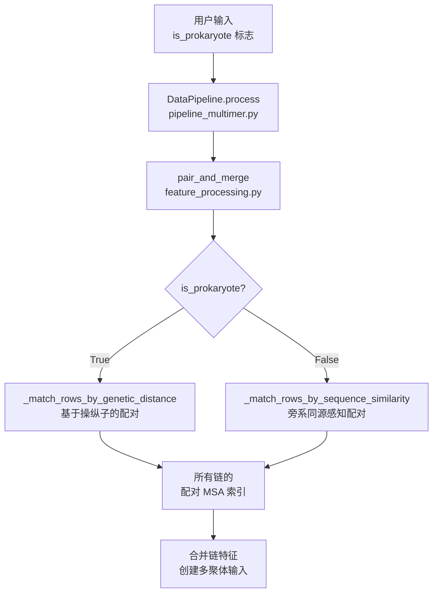
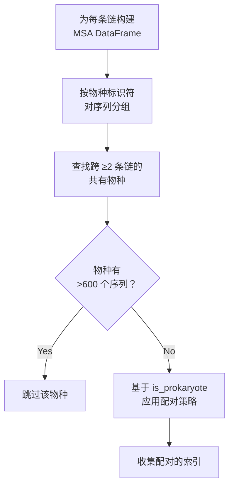

---
slug:11-prokaryotic-vs-eukaryotic-pairing-strategies
blog_type:normal
---


本页探讨了 AlphaFold-Multimer 在预测蛋白质-蛋白质相互作用时使用的多序列比对（MSA）配对策略的根本生物学和算法差异。在原核和真核配对策略之间的选择直接影响模型如何识别蛋白质链之间的共进化信号，这对于准确的多聚体结构预测至关重要。

## 生物学基础

配对策略的选择反映了原核生物和真核生物中不同的基因组架构。**原核生物**通常将功能相关的基因组织成操纵子——即共同转录的基因簇，编码相互作用的蛋白质。这种基因组邻近性产生了一个强烈的信号：由相邻基因编码的蛋白质很可能在物理上发生相互作用。然而，**真核生物**缺乏操纵子组织结构；它们的基因分布在基因组中，蛋白质相互作用的发生与基因组距离无关。

这种生物学现实需要不同的算法方法。对于原核生物，遗传距离（通过 UniProt 登录号 ID 的差异近似）作为相互作用潜力的可靠代理。对于真核生物，系统依赖于基于序列相似性的匹配，考虑到旁系同源蛋白质的存在以及基因组共定位信号的缺失。

来源：[msa_pairing.py](/alphafold/data/msa_pairing.py#L355-L367)

## 策略选择流程

配对策略由 `is_prokaryote` 参数决定，该参数从用户界面通过数据管道流向配对逻辑：



该标志在 `run_alphafold.py` 的命令行界面中通过 `--is_prokaryote_list` 参数暴露，允许用户指定每个目标复合物的生物学起源。该标志在管道中传播：从 `run_alphafold.py` → `DataPipeline.process()` → `pair_and_merge()` → `create_paired_features()` → `pair_sequences()`。

来源：[run_alphafold.py](/run_alphafold.py#L52-L57), [pipeline_multimer.py](/alphafold/data/pipeline_multimer.py#L241-L272), [feature_processing.py](/alphafold/data/feature_processing.py#L48-L70)

## 原核生物遗传距离配对

### 算法概述

原核策略利用操纵子原理，根据链之间 UniProt 登录标识符的差异来匹配 MSA 序列。这假设由遗传上接近的位点编码的蛋白质很可能发生相互作用。

核心函数 `_match_rows_by_genetic_distance()` 实现了此逻辑：


### 登录号 ID 编码

遗传距离计算需要将 UniProt 登录字符串转换为数值。`encode_accession()` 函数基于 UniProt 登录号格式实现此转换：

- **格式 O/P/Q**：使用 6 字符模式（例如 P12345）并进行特定位置编码
- **格式 6-char**：较短登录号的替代编码
- **格式 10-char**：特殊情况的扩展编码

编码将每个字符位置映射到一个基值（A-Z 对应 0-25，0-9 对应 0-9），并使用位置乘数系统计算复合值。

来源：[msa_pairing.py](/alphafold/data/msa_pairing.py#L156-L180)

### 距离计算与匹配

`_find_all_accession_matches()` 函数通过计算链之间编码登录号 ID 的绝对差值来识别潜在配对：

```python
def _calc_id_diff(id_a: bytes, id_b: bytes) -> int:
    return abs(encode_accession(id_a.decode()) - encode_accession(id_b.decode()))
```

默认的截止值为 20，意味着彼此在 20 个位置内的登录号 ID 被视为潜在匹配，这反映了细菌操纵子中共定位基因的预期范围。

### 过滤标准

即使在遗传距离匹配之后，序列也必须通过质量过滤器：

1. **相似度过滤器**：序列必须与目标的相似度低于 `SEQUENCE_SIMILARITY_CUTOFF` (0.9)
2. **间隙过滤器**：序列的间隙含量必须低于 `SEQUENCE_GAP_CUTOFF` (0.5)

这些过滤器防止配对低质量或过度分歧的序列，这些序列可能会给共进化信号引入噪声。

来源：[msa_pairing.py](/alphafold/data/msa_pairing.py#L232-L288)

## 真核生物序列相似度配对

### 算法概述

真核策略通过使用序列相似度作为主要配对标准来解决基因组共定位信号缺失的问题。`_match_rows_by_sequence_similarity()` 函数根据序列与其各自目标序列的相似度来配对序列。


### 实现细节

算法遵循以下步骤：

1. 提取至少在两条链中存在的物种的 MSA 序列
2. 对于每条链，根据其与目标序列的相似度对序列进行排序（降序）
3. 确定所有现有链中的最小序列计数
4. 从每条链中配对前 N 个序列（其中 N 是最小计数）

这种方法通过根据序列与查询的进化关系而非基因组邻近性对序列进行排名，从而处理旁系同源蛋白质。

来源：[msa_pairing.py](/alphafold/data/msa_pairing.py#L289-L324)

## 策略比较

| 方面 | 原核策略 | 真核策略 |
|--------|---------------------|---------------------|
| **生物学基础** | 操纵子共定位 | 序列同源性 |
| **主要指标** | 遗传距离（登录号 ID 差异） | 与目标的序列相似度 |
| **默认截止值** | 20 个登录号位置 | 无（使用所有可用的） |
| **过滤** | 相似度 + 间隙截止值 | 通过排序隐式处理 |
| **旁系同源处理** | 有限（假设唯一的操纵子基因） | 稳健（按查询相似度排名） |
| **最适用于** | 细菌复合物，操纵子组织的基因 | 真核复合物，基因家族 |

<CgxTip>
原核策略的优势在于其直接利用操纵子结构，但对于相互作用基因不共定位的细菌系统可能会失败。相反，真核策略对序列相似度的依赖可能会被许多紧密旁系同源但不实际相互作用的基因家族误导。
</CgxTip>

来源：[msa_pairing.py](/alphafold/data/msa_pairing.py#L232-L324)

## 与 MSA 处理的集成

### 基于物种的分组

两种策略都在基于物种分组的框架内运行。`pair_sequences()` 函数首先识别所有链之间的共有物种：



这种以物种为中心的方法确保了生物学上有意义的配对，因为来自同一生物体的直系同源序列之间的共进化信号最强。

### MSA DataFrame 构建

`_make_msa_df()` 函数构建一个 pandas DataFrame，其中包含每个 MSA 行的基本元数据：

- `msa_species_identifiers`：物种分类
- `msa_uniprot_accession_identifiers`：UniProt 登录号 ID
- `msa_row`：用于引用的行索引
- `msa_similarity`：与查询序列匹配的残基比例
- `gap`：序列中间隙字符的比例

相似度计算为：`sum(query == sequence) / len(query)`

来源：[msa_pairing.py](/alphafold/data/msa_pairing.py#L127-L148), [msa_pairing.py](/alphafold/data/msa_pairing.py#L325-L393)

## 配对后的特征合并

一旦识别出配对的索引，`create_paired_features()` 函数仅从每条链中提取配对的 MSA 行：

1. 过滤掉不以 `_all_seq` 后缀结尾的特征
2. 根据需要填充特征
3. 使用索引映射提取配对的行
4. 更新 `num_alignments_all_seq` 以反映配对计数

然后通过 `merge_chain_features()` 合并配对的特征，该函数将单独的链特征合并为具有适当块对角结构的单一多聚体特征字典。

来源：[msa_pairing.py](/alphafold/data/msa_pairing.py#L60-L98), [msa_pairing.py](/alphafold/data/msa_pairing.py#L574-L603)

## 实际考虑

### 何时使用每种策略

- **使用原核模式**：当目标是由已知或怀疑组织成操纵子的基因组成的细菌蛋白质复合物时。这包括大多数原核多亚基酶、核糖体复合物和细菌信号系统。

- **使用真核模式**：针对所有真核目标、基因分散的原核复合物，或当基因组组织未知时。这是不确定时更安全的默认选择。

### 混合场景

某些生物体或生物学场景可能无法完全归入任一类别。例如：

- 古菌系统（原核组织但操纵子结构不同）
- 与宿主蛋白质相互作用的病毒蛋白质（混合起源）
- 合成或工程设计的蛋白质复合物

<CgxTip>
当不确定适当的策略时，真核模式通常更为保守，因为它不依赖于基因组邻近性假设。然而，对于特征明确的细菌操纵子，原核模式通常产生更高质量的共进化信号。
</CgxTip>

来源：[run_alphafold.py](/run_alphafold.py#L52-L57)

## 后续步骤

理解这些配对策略对于有效使用 AlphaFold-Multimer 至关重要。要加深您对相关概念的理解：

- 探索配对的 MSA 如何组装成多聚体输入，请参阅 [链特征合并与组装](10-chain-feature-merging-and-assembly)
- 了解更广泛的 MSA 处理管道，请参阅 [多序列比对（MSA）配对](9-multiple-sequence-alignment-msa-pairing)
- 理解数据管道架构，请参阅 [数据管道与特征处理](7-data-pipeline-and-feature-processing)

有关实现细节，请检查 [msa_pairing.py](/alphafold/data/msa_pairing.py#L325-L393) 中的核心配对逻辑以及 [pipeline_multimer.py](/alphafold/data/pipeline_multimer.py#L241-L289) 中的管道集成。