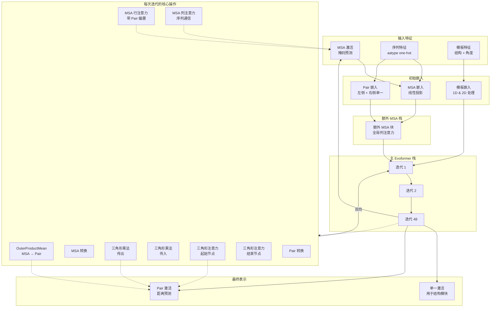

---
slug:12-evoformer-and-embedding-modules
blog_type:normal
---


Evoformer 和 Embedding 模块构成了 AlphaFold-Multimer 的计算核心，将原始序列和结构特征转换为高维表示，从而实现精确的蛋白质结构预测。该架构采用了一种复杂的基于注意力的机制，通过双向信息流迭代地优化多序列比对（MSA）、成对和单一表示。

## 架构概览

Evoformer 架构采用了一种新颖的三重表示系统，信息在 MSA（序列 × 残基）、Pair（残基 × 残基）和 Single（残基）表示之间流动。这种设计使得模型既能通过 MSA 数据捕获进化约束，又能通过成对表示捕获空间关系，其中单一表示作为结构生成的桥梁。



AlphaFold-Multimer 中针对多聚体的特定实现与单体版本相比引入了关键的架构差异，最显著的是将 MSA 采样移至 JAX 模型内部，以更有效地支持循环和集成机制 [modules_multimer.py#L15-L20](alphafold/model/modules_multimer.py#L15-L20)。

## 输入嵌入流水线

嵌入流水线通过精心设计的操作序列，将原始特征转换为三个核心表示空间。该过程始于目标序列编码和 MSA 预处理。

### 目标和 MSA 特征创建

目标序列经过 21 种氨基酸类型的 One-hot 编码，随后通过线性投影映射到 MSA 通道维度：[modules_multimer.py#L554-L558](alphafold/model/modules_multimer.py#L554-L558)

```python
target_feat = jax.nn.one_hot(batch['aatype'], 21)
preprocess_1d = common_modules.Linear(
    c.msa_channel, name='preprocess_1d')(target_feat)
```

MSA 采样采用 Gumbel-max 采样随机选择序列，并通过偏置掩码保留第一行（目标序列）。采样的 MSA 和剩余的额外 MSA 经过不同的处理以优化计算效率 [modules_multimer.py#L253-L286](alphafold/model/modules_multimer.py#L253-L286)。

MSA 特征的拼接创建了一个丰富的表示，包含：[modules_multimer.py#L205-L223](alphafold/model/modules_multimer.py#L205-L223)

* One-hot 编码的氨基酸（23 个通道）
* 二进制删除指示符
* 归一化删除值（arctan 变换）
* 来自最近邻分配的聚类谱
* 聚类删除均值

这种多维编码使模型能够同时利用进化信息、序列保守模式和结构约束。

### Pair 表示初始化

Pair 表示通过左右单一表示的加法组合构建，创建了一个捕获残基关系的对称成对编码：[modules_multimer.py#L570-L576](alphafold/model/modules_multimer.py#L570-L576)

```python
left_single = common_modules.Linear(
    c.pair_channel, name='left_single')(target_feat)
right_single = common_modules.Linear(
    c.pair_channel, name='right_single')(target_feat)
pair_activations = left_single[:, None] + right_single[None]
```

多聚体预测中的一个关键增强是**相对位置编码**，它融合了链感知的位置信息。当启用 `use_chain_relative` 时，编码包括：[modules_multimer.py#L507-L574](alphafold/model/modules_multimer.py#L507-L574)

* 链内裁剪的残基索引差
* 链间残基对的特殊分箱
* 实体身份匹配（相同的蛋白质链类型）
* 相对对称性索引
* 链类型匹配（同源聚体 vs 异源聚体）

这种复杂的编码使模型能够区分链内和链间的残基关系，对于精确的多聚体界面预测至关重要。

<CgxTip>
与单体模式相比，多聚体模式下的链相对编码向 pair 表示添加了大约 `2 * max_relative_idx + 2 + 2 * max_relative_chain + 2` 个额外特征，显著丰富了模型编码四级结构约束的能力。
</CgxTip>

## 循环机制

AlphaFold-Multimer 实现了一个健壮的循环系统，允许模型利用先前迭代的信息迭代地优化预测。这使得能够收敛到更准确的结构。

### 位置循环

启用时，位置循环将先前迭代的伪 beta 坐标通过 distogram 转换为基于距离的表示：[modules_multimer.py#L588-L595](alphafold/model/modules_multimer.py#L588-L595)

```python
prev_pseudo_beta = modules.pseudo_beta_fn(
    batch['aatype'], batch['prev_pos'], None)
dgram = modules.dgram_from_positions(
    prev_pseudo_beta, **self.config.prev_pos)
pair_activations += common_modules.Linear(
    c.pair_channel, name='prev_pos_linear')(dgram)
```

这为模型提供了来自先前迭代的显式几何约束，弥合了进化信息和三维结构之间的差距。

### 特征循环

特征循环在迭代之间保留学习到的表示：[modules_multimer.py#L597-L610](alphafold/model/modules_multimer.py#L597-L610)

* **MSA 第一行循环**：将归一化的先前 MSA 第一行添加到当前 MSA 表示中，保留目标序列嵌入
* **Pair 表示循环**：添加归一化的先前 pair 表示，维持残基间关系知识

两个循环特征在添加前都经过层归一化，确保稳定的训练动态。

## Evoformer 架构

Evoformer 栈实现了 48 个迭代块（默认），每个块包含精心编排的操作序列，实现 MSA 和 pair 表示之间的双向信息流。

### 单次 Evoformer 迭代

每次迭代执行以下操作序列：[modules.py#L1558-L1688](alphafold/model/modules.py#L1558-L1688)

1. **OuterProductMean**：通过外积聚合计算源自 MSA 的成对更新
2. **MSARowAttentionWithPairBias**：跨序列的行级注意力，受 pair 表示偏置
3. **MSAColumnAttention/Global**：跨残基的列级注意力（或针对额外 MSA 的全局注意力）
4. **MSA Transition**：带有 dropout 和残差连接的前馈转换
5. **TriangleMultiplication Outgoing**：沿残基三元组传播信息的三角形更新
6. **TriangleMultiplication Incoming**：相反方向的互补三角形更新
7. **TriangleAttention Starting Node**：对 pair 矩阵行的注意力
8. **TriangleAttention Ending Node**：对 pair 矩阵列的注意力
9. **Pair Transition**：Pair 表示的前馈转换

### OuterProductMean 操作

OuterProductMean 作为从 MSA 到 pair 表示的关键桥梁，计算加权的外积以聚合共进化信息：[modules.py#L1419-L1506](alphafold/model/modules.py#L1419-L1506)

```python
left_act = mask * common_modules.Linear(
    c.num_outer_channel, name='left_projection')(act)
right_act = mask * common_modules.Linear(
    c.num_outer_channel, name='right_projection')(act)
# Equivalent to: act = jnp.einsum('abc,ade->dceb', left_act, right_act)
act = jnp.einsum('acb,ade->dceb', left_act, right_act)
act = jnp.einsum('dceb,cef->dbf', act, output_w) + output_b
```

该操作为每个残基对 计算所有序列上残基投影外积的均值，从而有效地以成对格式捕获共进化约束。实现使用分块处理和子批处理来管理大型蛋白质复合物的内存效率。

### 注意力机制

#### 带有 Pair 偏置的 MSA 行注意力

该注意力机制使信息能够在 MSA 中的序列之间流动，注意力对数受当前 pair 表示的偏置：[modules.py#L712-L779](alphafold/model/modules.py#L712-L779)

Pair 偏置通过每个注意力头对 pair 表示的学习投影计算：

```python
nonbatched_bias = jnp.einsum('qkc,ch->hqk', pair_act, weights)
```

这允许模型将成对约束直接纳入序列级注意力，使 MSA 表示能够通过结构关系获得信息。

#### MSA 列注意力

列注意力对转置的 MSA 进行操作，使每条序列的残基之间能够通信：[modules.py#L779-L834](alphafold/model/modules.py#L779-L834)

在额外 MSA 栈中，这被替换为 **MSAColumnGlobalAttention**，它使用全局注意力来高效处理更大的额外 MSA 序列：[modules.py#L834-L892](alphafold/model/modules.py#L834-L892)

#### 三角形注意力

三角形注意力对 pair 表示矩阵进行操作，使几何约束能够在残基三元组之间传播：[modules.py#L892-L954](alphafold/model/modules.py#L892-L954)

支持两种方向：

* **起始节点** (per_row)：对行维度的注意力，关注不同的起始残基
* **结束节点** (per_column)：对列维度的注意力，关注不同的结束残基

该实现处理特定方向的轴交换，并使用子批处理以提高内存效率。

### 三角形乘法

三角形乘法实现乘法更新，捕获 pair 表示中的三元组关系：[modules.py#L1255-L1345](alphafold/model/modules.py#L1255-L1345)

使用两种互补的变体：

* **传出** (Outgoing)：`ikc,jkc→ijc` - 将信息从残基 k 传播到 (i,j) 对
* **传入** (Incoming)：`kjc,kic→ijc` - 互补的传播方向

两种变体都采用门控机制：

```python
left_gate_values = jax.nn.sigmoid(common_modules.Linear(
    c.num_intermediate_channel, bias_init=1., name='left_gate')(act))
right_proj_act *= left_gate_values
```

门控允许模型动态控制信息流，偏置初始化为 1.0 使得训练期间的梯度能够平滑流动。

## 模板嵌入

模板提供来自已知同源结构的结构先验。在多聚体预测中，模板逐链处理并通过链内掩码组合。

### 模板嵌入架构

模板嵌入模块通过两个并行路径处理每个模板：[modules_multimer.py#L780-L1000](alphafold/model/modules_multimer.py#L780-L1000)

1. **2D 模板路径**：通过特定的模板 Evoformer 迭代处理成对模板特征
2. **1D 模板路径**：将模板特征嵌入为额外的 MSA 行

2D 路径应用一个专用的 **TemplateEmbeddingIteration**，它与 Evoformer pair 更新共享架构：[modules_multimer.py#L1001-L1073](alphafold/model/modules_multimer.py#L1001-L1073)

* 三角形乘法（传出和传入）
* 三角形注意力（起始和结束节点）
* Pair 转换

这使得模板能够提供成对距离约束，补充源自 MSA 的 pair 表示。

### 1D 模板特征构建

1D 模板特征编码每个残基的结构信息：[modules_multimer.py#L1075-L1130](alphafold/model/modules_multimer.py#L1075-L1130)

特征包括：

* One-hot 编码的氨基酸类型
* Chi 角（扭转角）的正弦和余弦
* Chi 角掩码（针对未定义的角度）

这些特征通过一个带有 ReLU 激活的两层 MLP 处理，然后作为额外行拼接到 MSA。这使得模型能够通过 MSA 列注意力机制关注模板特征。

### 多聚体特定的模板处理

一个关键的多聚体特定优化是使用 `multichain_mask_2d` 将模板特征计算限制在链内对：[modules_multimer.py#L632-L634](alphafold/model/modules_multimer.py#L632-L634)

```python
multichain_mask = batch['asym_id'][:, None] == batch['asym_id'][None, :]
```

由于模板是逐链提供的，计算链间模板特征是不正确的。该掩码确保模板信息仅影响链内预测，而链感知相对编码处理链间约束。

## 额外 MSA 栈

额外 MSA 栈处理较大的、未聚类的 MSA 序列，这些序列包含额外的进化信息，但数量太多而无法在主 Evoformer 栈中处理。

### 额外 MSA 处理流水线

额外 MSA 栈通过较少数量的迭代（通常为 4）处理特征：[modules_multimer.py#L652-L675](alphafold/model/modules_multimer.py#L652-L675)

额外 MSA 特征在流水线后期创建，以最小化 One-hot 编码的内存开销：[modules_multimer.py#L226-L245](alphafold/model/modules_multimer.py#L226-L245)

```python
extra_msa = batch['extra_msa'][:num_extra_msa]
msa_1hot = jax.nn.one_hot(extra_msa, 23)
has_deletion = jnp.clip(deletion_matrix, 0., 1.)[..., None]
deletion_value = (jnp.arctan(deletion_matrix / 3.) * (2. / jnp.pi))[..., None]
```

### 全局列注意力

额外 MSA 栈使用 `MSAColumnGlobalAttention` 代替标准列注意力，这对于更大的序列数量更有效率。这种全局注意力机制允许每个残基位置关注所有其他位置，而没有标准注意力的二次开销：[modules.py#L834-L892](alphafold/model/modules.py#L834-L892)

来自额外 MSA 栈的 pair 表示随后被馈送到主 Evoformer 栈，提供源自更广泛 MSA 的额外进化约束。

## 输出生成

在通过 Evoformer 栈处理后，提取最终表示供下游组件使用。

### 单一表示

单一表示源自 MSA 的第一行（目标序列）：[modules_multimer.py#L755-L758](alphafold/model/modules_multimer.py#L755-L758)

```python
single_activations = common_modules.Linear(
    c.seq_channel, name='single_activations')(
        msa_activations[0])
```

该表示捕获由进化（MSA）和结构约束信息丰富的残基特定信息，作为结构模块生成坐标的主要输入。

### Pair 表示

Pair 表示来自 Evoformer 栈的最终迭代，包含关于残基间关系的浓缩信息。它直接用于：

* 距离预测（通过 DistogramHead）
* 对齐误差预测（通过 PredictedAlignedErrorHead）
* 结构模块注意力偏置

### MSA 表示

MSA 表示在输出前被裁剪以移除模板行：[modules_multimer.py#L763-L765](alphafold/model/modules_multimer.py#L763-L765)

```python
'msa': msa_activations[:num_msa_sequences, :, :],
```

这确保模板特征不会在掩码 MSA 预测等辅助任务中被错误使用，这些任务应仅针对进化序列进行操作。

## 配置参数

控制 Evoformer 和嵌入行为的关键配置参数：

| 参数 | 默认值 | 目的 |
|-----------|---------|---------|
| `num_msa` | 512 | 要采样的 MSA 序列数量 |
| `num_extra_msa` | 1024 | 要处理的额外 MSA 序列数量 |
| `evoformer_num_block` | 48 | 主 Evoformer 迭代次数 |
| `extra_msa_stack_num_block` | 4 | 额外 MSA 迭代次数 |
| `msa_channel` | 256 | MSA 表示通道维度 |
| `pair_channel` | 128 | Pair 表示通道维度 |
| `seq_channel` | 384 | 单一表示通道维度 |
| `use_chain_relative` | True | 启用链感知相对编码 |
| `recycle_pos` | True | 启用位置循环 |
| `recycle_features` | True | 启用特征循环 |

<CgxTip>
多聚体配置与单体配置显著不同，默认情况下启用 `use_chain_relative` 并实施仅用于链内处理的模板掩码。这些架构变化对于精确的四级结构预测至关重要。
</CgxTip>

## 内存优化策略

该实现采用了几种对大型多聚体复合物至关重要的内存优化策略：

### 子批处理

注意力和外积操作都使用 `inference_subbatch` 来分块处理张量：[modules.py#L1459-L1472](alphafold/model/modules.py#L1459-L1472)

```python
act = mapping.inference_subbatch(
    compute_chunk,
    c.chunk_size,
    batched_args=[left_act],
    nonbatched_args=[],
    low_memory=True,
    input_subbatch_dim=1,
    output_subbatch_dim=0)
```

这使得能够处理包含数百个残基的蛋白质，这些残基在单个批次中会超过 GPU 内存。

### 梯度检查点

当启用 `gc.use_remat` 时，Evoformer 块使用 Haiku 的重材料化在反向传播期间重新计算中间值，以计算换内存：[modules_multimer.py#L711-L714](alphafold/model/modules_multimer.py#L711-L714)

```python
if gc.use_remat:
  extra_evoformer_fn = hk.remat(extra_evoformer_fn)
```

这对于在有限的 GPU 内存下训练大型模型至关重要。

### 延迟 One-hot 扩展

额外的 MSA 特征在处理之前保持为整数，延迟内存密集型的 One-hot 编码：[modules_multimer.py#L226-L227](alphafold/model/modules_multimer.py#L226-L227)

注释明确指出了这种优化：“我们尽可能晚地执行此操作，因为 one_hot 额外 msa 可能非常大。”

## 后续步骤

Evoformer 和 Embedding 模块生成精细的表示，这些表示输入到 [Structure Module and InvariantPointAttention](13-structure-module-and-invariantpointattention) 以生成 3D 坐标。要了解如何整合模板信息，请参阅 [Template Embedding for Multimer Prediction](14-template-embedding-for-multimer-prediction)。此处描述的循环机制连接到更广泛的 [Recycling and Ensembling Mechanisms](15-recycling-and-ensembling-mechanisms)。有关模型配置的详细信息，请参阅 [Model Configuration and Presets](8-model-configuration-and-presets)。