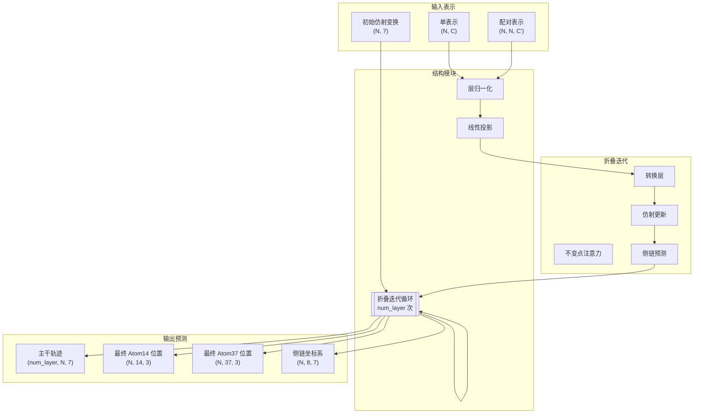
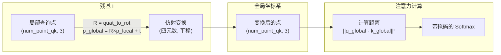

---
slug:13-structure-module-and-invariantpointattention
blog_type:normal
---


Structure Module 和 InvariantPointAttention 构成了 AlphaFold-Multimer 的几何核心，将抽象的序列和配对表示转换为精确的三维原子坐标。该模块实现了一种复杂的注意力机制，直接在 3D 几何表示上操作，使模型能够推理空间关系，同时保持旋转和平移不变性——这是蛋白质结构预测的关键属性。

来源：[folding.py](alphafold/model/folding.py#L37-L37), [folding_multimer.py](alphafold/model/folding_multimer.py#L188-L188)

## 架构概览

Structure Module 实现了一个迭代的折叠过程，通过多轮几何推理逐步完善 3D 结构预测。该模块的核心是表示每个残基在 3D 空间中位置和方向的刚体变换，采用一种直接在这些几何表示上操作的专用注意力机制。



该模块接收来自 Evoformer 的单表示和配对表示，以及描述每个残基局部坐标系的初始仿射变换。通过迭代优化，它生成主干构象轨迹、详细的侧链预测，以及 atom14 和 atom37 表示中的最终原子坐标。

来源：[folding.py](alphafold/model/folding.py#L464-L520), [folding_multimer.py](alphafold/model/folding_multimer.py#L556-L626)

## 不变点注意力机制

InvariantPointAttention (IPA) 代表了几何深度学习的基础创新，直接在 3D 点而非标量特征上计算注意力。该机制通过让每个残基在其局部参考系中生成查询点和键点，然后将其转换为全局坐标系以计算欧几里得距离作为注意力 logits 来运行。

**关键创新**：通过在全局坐标系中计算注意力但在局部表示查询和键，IPA 保持了**旋转和平移不变性**——无论蛋白质在空间中的绝对方向或位置如何，注意力模式保持不变。这种不变性对于学习在不同坐标系间泛化的几何关系至关重要。

来源：[folding.py](alphafold/model/folding.py#L37-L100), [folding_multimer.py](alphafold/model/folding_multimer.py#L188-L227)

### 三层注意力 Logits

IPA 从三个互补来源计算注意力 logits，每个来源归一化以贡献相等：

| Logit 分量 | 描述 | 几何直觉 | 方差归一化 |
|----------------|-------------|---------------------|------------------------|
| **标量查询** | 标量查询/键向量的点积 | 捕获特征相似性 | `num_scalar_qk × 1` |
| **点查询** | 3D 点之间的负平方距离 | 捕获空间邻近性 | `num_point_qk × 9/2` |
| **2D 注意力** | 配对表示偏置 | 捕获成对约束 | 常数 1 |

点注意力机制计算注意力为 `-0.5 × point_weights × ||q_point - k_point||²`，其中全局坐标系中的平方欧几里得距离提供了几何邻近性的自然度量。可训练的每头权重（`trainable_point_weights`）允许模型学习空间与基于特征的注意力的相对重要性。

来源：[folding.py](alphafold/model/folding.py#L166-L195), [folding_multimer.py](alphafold/model/folding_multimer.py#L218-L259)

### 局部到全局坐标系变换

关键的几何操作涉及将点从局部残基坐标系变换到全局坐标系：



多聚体实现使用 `PointProjection` 和 `Rigid3Array` 类进行更清晰的几何操作，而单体版本使用带有显式 `apply_to_point` 方法的 `QuatAffine`。两者通过不同的抽象实现等效的几何变换。

来源：[folding.py](alphafold/model/folding.py#L124-L155), [folding_multimer.py](alphafold/model/folding_multimer.py#L261-L278)

<CgxTip>
注意力 logits 的归一化对训练稳定性至关重要。每个分量（标量、点、2D）通过 `sqrt(1/(num_logit_terms × variance))` 归一化，确保贡献相等并防止任何单一机制主导注意力模式。
</CgxTip>

## 折叠迭代架构

每个 `FoldIteration` 执行三个顺序操作：InvariantPointAttention、转换层和仿射更新。这个三元组构成一次结构优化迭代，重复应用（`num_layer` 次，通常 4-8 次）以逐步改进预测结构。

来源：[folding.py](alphafold/model/folding.py#L281-L390), [folding_multimer.py](alphafold/model/folding_multimer.py#L374-L477)

### 注意力和转换层

在计算带有残差连接的 IPA 后，模块应用层归一化和 dropout。转换层由一个两层 MLP 组成，层间带有 ReLU 激活，维持表征现代神经架构的残差连接模式：

```python
# 转换层模式
input_act = act
for i in range(num_layer_in_transition):
    init = 'relu' if i < num_layer_in_transition - 1 else final_init
    act = Linear(num_channel, initializer=init)(act)
    if i < num_layer_in_transition - 1:
        act = relu(act)
act += input_act  # 残差连接
act = LayerNorm()(act)
```

最终初始化（`zero_init=True` 时为 `zeros`，否则为 `linear`）对稳定训练至关重要，防止模型在学习有意义的几何特征之前进行大的结构更新。

来源：[folding.py](alphafold/model/folding.py#L317-L340), [folding_multimer.py](alphafold/model/folding_multimer.py#L415-L438)

### 仿射更新和主干优化

仿射更新将学习到的激活转换为每个残基的增量刚体变换。在单体实现中，这是一个表示旋转和平移更新的 6 维向量，通过 `pre_compose` 应用。多聚体版本使用 `QuatRigid` 生成完整的刚体变换，使用 `@` 运算符与当前状态组合。

更新时仅在旋转分量上停止梯度，确保反向传播通过预测的位置流动，但不通过旋转矩阵本身。这种架构选择有助于通过分离方向和位置的学习来稳定训练。

来源：[folding.py](alphafold/model/folding.py#L342-L355), [folding_multimer.py](alphafold/model/folding_multimer.py#L440-L453), [quat_affine.py](alphafold/model/quat_affine.py#L259-L287)

### 使用 MultiRigidSidechain 的侧链预测

侧链原子使用映射到刚体坐标系的扭转角度进行预测。`MultiRigidSidechain` 模块：

1. 通过残差块投影激活
2. 预测 7 个未归一化的扭转角（φ, ψ, ω 和 4 个 χ 角）作为正弦/余弦对
3. 使用 L2 归一化将角度归一化为单位向量
4. 将扭转角转换为每个侧链原子的刚体坐标系
5. 使用基于文献的理想几何计算原子位置

这种方法确保物理现实的侧链构象，同时允许在独立于主机的旋转异构体选择中的灵活性。

来源：[folding.py](alphafold/model/folding.py#L929-L1010), [folding_multimer.py](alphafold/model/folding_multimer.py#L1076-L1161)

## 单体与多聚体实现比较

多聚体变体重构了结构模块，以实现更清晰的几何操作和更好的链间交互处理：

| 方面 | 单体实现 | 多聚体实现 |
|--------|----------------------|------------------------|
| **刚体表示** | `QuatAffine` 带有分离的旋转/平移 | `Rigid3Array` 统一刚体 |
| **点变换** | 显式 `apply_to_point`/`invert_point` 方法 | `PointProjection` 抽象 |
| **注意力模式** | 为 TPU 兼容性的显式张量交换 | 更清晰代码的直接操作 |
| **坐标系更新** | `pre_compose` 带 6D 向量 | `QuatRigid` 带完整刚体组合 |
| **坐标存储** | 混合张量/r3 对象格式 | 一致的 `Vec3Array`/`Rigid3Array` |

尽管存在这些实现差异，两个版本都实现了 Jumper et al. (2021) 补充算法 20 "StructureModule" 中描述的相同算法。

来源：[folding.py](alphafold/model/folding.py#L37-L280), [folding_multimer.py](alphafold/model/folding_multimer.py#L188-L373)

<CgxTip>
多聚体实现中使用几何模块的 `Rigid3Array` 和 `Vec3Array` 提供了更清晰的抽象和更好的组合运算符（`@` 用于刚体组合），使几何推理更明确并减少实现错误。
</CgxTip>

## 几何基元和变换

Structure Module 在几个关键的几何抽象上操作：

### QuatAffine (单体)

`QuatAffine` 使用单位四元数表示旋转和平移向量表示仿射变换。它维护四元数和旋转矩阵表示（通过 jit 编译保持同步）以灵活使用：

- **组件**：四元数 (4D)、旋转矩阵 (3×3)、平移 (3D)
- **关键操作**：`apply_to_point`、`invert_point`、`pre_compose`、`scale_translation`
- **坐标变换**：`R × p_local + t` 用于局部到全局

来源：[quat_affine.py](alphafold/model/quat_affine.py#L181-L340)

### Rigid3Array (多聚体)

`Rigid3Array` 为刚体变换数组提供统一表示：

- **组件**：旋转 (3×3 矩阵)、平移 (Vec3Array)
- **组合**：`rigid1 @ rigid2` 运算符
- **点操作**：`apply_inverse_to_point`、`scale_translation`
- **优势**：对批量操作和基于树的变换的原生支持

来源：[folding_multimer.py](alphafold/model/folding_multimer.py#L188-L373)

## 输出表示

Structure Module 为不同用例生成多个坐标表示：

| 输出 | 形状 | 用途 | 描述 |
|--------|-------|---------|-------------|
| **轨迹** | `(num_layer, N, 7)` | 收敛分析 | 每次迭代的主干构象 |
| **最终 Atom14** | `(N, 14, 3)` | 每残基指标 | 重原子位置（14 个标准原子） |
| **最终 Atom37** | `(N, 37, 3)` | 完整结构 | 所有原子位置包括氢 |
| **侧链坐标系** | `(N, 8, 7)` | 结构分析 | 主干 + 7 个侧链组的刚体坐标系 |
| **激活** | `(N, C)` | 置信度预测 | pLDDT/PAE 头的最终嵌入 |

Atom14 表示对于每残基置信度指标（pLDDT）特别重要，因为它在不同氨基酸类型间提供一致的参考框架。

来源：[folding.py](alphafold/model/folding.py#L487-L520), [folding_multimer.py](alphafold/model/folding_multimer.py#L580-L620)

## 训练和推理考虑

### 损失函数

Structure Module 优化几个几何目标：

1. **主干 FAPE 损失**：主干原子的坐标系对齐点误差
2. **侧链 FAPE 损失**：侧链原子的坐标系对齐点误差
3. **结构违规损失**：惩罚空间冲突和键违规
4. **监督 χ 损失**：对扭转角的直接监督

这些损失以适当权重组合，以鼓励物理现实的结构，同时在实验数据不确定的地方保持灵活性。

来源：[folding.py](alphafold/model/folding.py#L618-L717), [folding_multimer.py](alphafold/model/folding_multimer.py#L780-L870)

### 可循环设计

Structure Module 设计为**可循环**——输出结构可以反馈到模型中进行额外优化。每个 `FoldIteration` 更新刚体变换和激活表示，为通过 [循环和集成机制](15-recycling-and-ensembling-mechanisms) 中描述的循环机制进行迭代改进创建自然接口。

来源：[modules_multimer.py](alphafold/model/modules_multimer.py#L294-L410)

## 与完整模型的集成

Structure Module 作为 AlphaFold-Multimer 架构中的最终头运行，消耗来自 Evoformer 的优化单表示和配对表示。其输出直接输入到：

1. **置信度预测头**：pLDDT 和 PAE 预测使用最终 atom14 位置和结构模块激活
2. **结构优化**：Amber 弛豫优化最终原子坐标
3. **模型排名**：结构违规和置信度指标指导模型选择

从序列表示到原子坐标的转换代表了信息流通过模型的最终阶段，使 Structure Module 成为学习嵌入与物理有意义的 3D 结构之间的关键桥梁。

来源：[modules_multimer.py](alphafold/model/modules_multimer.py#L294-L410), [folding.py](alphafold/model/folding.py#L464-L520)

## 下一步

要更深入地了解完整架构，请探索：

- [Evoformer 和嵌入模块](12-evoformer-and-embedding-modules) - 了解输入到 Structure Module 的表示
- [结构优化的 Amber 弛豫](19-amber-relaxation-for-structure-refinement) - Structure Module 输出的后处理
- [每残基置信度 (pLDDT)](16-per-residue-confidence-plddt) - Structure Module 输出如何告知置信度预测

Structure Module 代表了几何推理和深度学习的卓越综合，展示了注意力机制如何设计为直接在 3D 空间表示上操作，同时保持准确结构预测所需的数学属性。