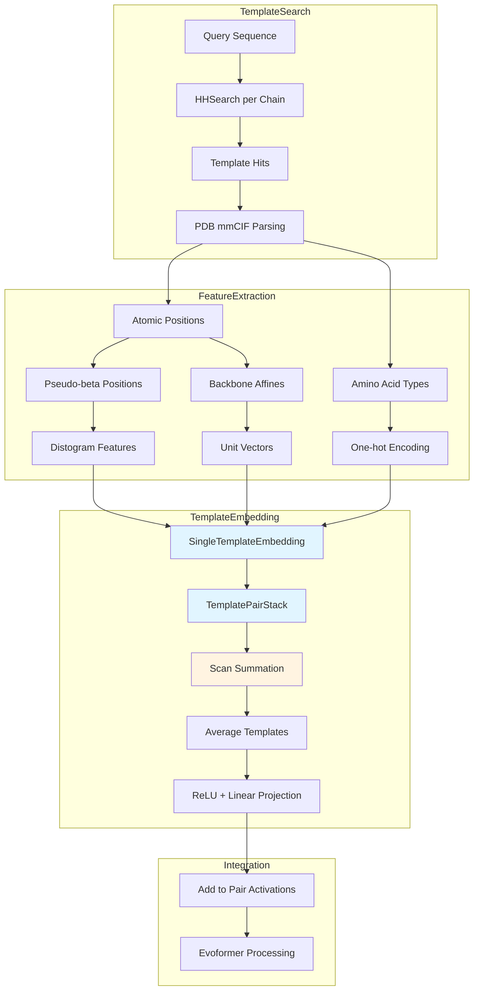

---
slug:14-template-embedding-for-multimer-prediction
blog_type:normal
---


AlphaFold-Multimer 中的模板嵌入从已知同源结构中提供了关键的结构先验，使模型能够利用超出多序列对齐范围之外的进化和结构信息。多聚体模板嵌入架构对单体方法进行了重大修改，以处理多链组装，同时保持每条链的模板约束。

## 架构概述

多聚体模板嵌入系统通过分层架构运行，该架构逐链处理模板，并使用链间掩码聚合它们，以防止链之间发生不适当的特征泄漏。



## 核心模板嵌入类

### TemplateEmbedding 模块

`modules_multimer.py` 中的主要 `TemplateEmbedding` 类通过求和策略而不是单体模型中使用的基于注意力策略来协调多个模板的嵌入过程。这种架构选择反映了在为 Evoformer 提供统一表示的同时保持模板多样性的需求。

该模块通过 `SingleTemplateEmbedding` 独立处理每个模板，通过 `hk.scan` 累积结果，然后按模板数进行归一化。关键实现演示了这种求和方法：

来源: [modules_multimer.py](alphafold/model/modules_multimer.py#L780-L857)

```python
def scan_fn(carry, x):
  return carry + partial_template_embedder(*x), None

scan_init = jnp.zeros((num_res, num_res, c.num_channels),
                      dtype=query_embedding.dtype)
summed_template_embeddings, _ = hk.scan(
    scan_fn, scan_init,
    (template_batch['template_aatype'],
     template_batch['template_all_atom_positions'],
     template_batch['template_all_atom_mask'], unsafe_keys))

embedding = summed_template_embeddings / num_templates
embedding = jax.nn.relu(embedding)
embedding = common_modules.Linear(
    query_num_channels,
    initializer='relu',
    name='output_linear')(embedding)
```

这种方法与单体的模板逐点注意力机制根本不同，后者使用查询嵌入对模板进行注意力处理。多聚体的平均策略提供了更统一的模板信息合并方式，而不会基于查询-模板相似性优先考虑特定模板。

### SingleTemplateEmbedding 模块

`SingleTemplateEmbedding` 类通过多阶段特征构建管道为单个模板构建特征表示，该管道结合了几何和进化信息。

来源: [modules_multimer.py](alphafold/model/modules_multimer.py#L860-L997)

特征构建过程连接以下组件：

1. **模板 Distogram**：根据伪 beta 位置计算的分箱距离特征，提供残基-残基距离表示
2. **伪 beta 掩码**：指示哪些残基具有有效伪 beta 原子（通常是 CB 原子）的 2D 掩码
3. **氨基酸类型特征**：投射到对表示的行和列上的独热编码氨基酸类型
4. **单位向量特征**：在局部残基坐标系中表示的骨架原子位置之间的归一化向量
5. **骨架掩码**：指示哪些残基具有完整骨架原子（N、CA、C）的 2D 掩码
6. **查询嵌入**：提供序列位置上下文的层归一化查询对表示

<CgxTip>
multichain_mask_2d 参数对于确保仅在链内计算模板特征至关重要。此掩码防止模型使用来自模板的链间距离信息，这是不合适的，因为模板是针对每条链单独搜索的。该掩码应用于第 907 行和第 935 行的 distogram 特征和单位向量特征。</CgxTip>

### TemplatePairStack 处理

特征构建后，嵌入通过 `TemplateEmbeddingIteration` 中的一堆注意力和乘法层。该堆栈按顺序通过以下操作处理对表示：

来源: [modules_multimer.py](alphafold/model/modules_multimer.py#L1001-L1072)

1. **TriangleMultiplicationOutgoing**：沿传出边传播信息的三角形乘法
2. **TriangleMultiplicationIncoming**：用于传入边的三角形乘法
3. **TriangleAttentionStartingNode**：专注于起始节点的三角形注意力
4. **TriangleAttentionEndingNode**：专注于结束节点的三角形注意力
5. **Transition**：带有 Dropout 的密集层转换

这些操作使模板嵌入能够捕获超出简单成对距离的高级几何关系。

## 特征构建详细信息

### 伪 beta 和 Distogram 特征

系统使用 `pseudo_beta_fn` 计算伪 beta 位置，该函数为大多数残基选择 CB 原子，为甘氨酸选择 CA 原子。这些位置用作计算 distogram 特征的参考点，distogram 特征是残基间距离的分箱表示。

来源: [modules_multimer.py](alphafold/model/modules_multimer.py#L903-L910)

```python
template_positions, pseudo_beta_mask = modules.pseudo_beta_fn(
    template_aatype, template_all_atom_positions, template_all_atom_mask)
pseudo_beta_mask_2d = (pseudo_beta_mask[:, None] *
                       pseudo_beta_mask[None, :])
pseudo_beta_mask_2d *= multichain_mask_2d
template_dgram = modules.dgram_from_positions(
    template_positions, **self.config.dgram_features)
template_dgram *= pseudo_beta_mask_2d[..., None]
```

### 骨架仿射单位向量

多聚体实现使用专门的方法通过 `folding_multimer.make_backbone_affine` 计算骨架仿射。此函数根据 N、CA 和 C 原子位置构建刚性变换，从而能够计算在局部坐标系中表示残基位置的单位向量。

来源: [modules_multimer.py](alphafold/model/modules_multimer.py#L924-L936)

```python
atom_pos = geometry.Vec3Array.from_array(raw_atom_pos)
rigid, backbone_mask = folding_multimer.make_backbone_affine(
    atom_pos,
    template_all_atom_mask,
    template_aatype)
points = rigid.translation
rigid_vec = rigid[:, None].inverse().apply_to_point(points)
unit_vector = rigid_vec.normalized()
unit_vector = [unit_vector.x, unit_vector.y, unit_vector.z]

backbone_mask_2d = backbone_mask[:, None] * backbone_mask[None, :]
backbone_mask_2d *= multichain_mask_2d
unit_vector = [x*backbone_mask_2d for x in unit_vector]
```

这种方法与单体实现不同，后者使用 `quat_affine.make_transform_from_reference` 并计算逆距离标量而不是单位向量。多聚体中的单位向量表示提供了更稳定的坐标不变表示。

## 多聚体特定架构差异

下表总结了单体和多聚体模板嵌入之间的关键架构差异：

| 组件 | 单体 | 多聚体 |
|-----------|---------|----------|
| 模板聚合 | 对模板的逐点注意力 | 求和与平均 |
| 模板选择 | 基于查询注意力 | 统一平均 |
| 链间特征 | 不适用（单链） | 通过 multichain_mask_2d 掩码屏蔽 |
| 骨架特征 | 逆距离标量 | 局部坐标系中的单位向量 |
| 仿射计算 | quat_affine.make_transform_from_reference | folding_multimer.make_backbone_affine |
| 与查询的集成 | 基于注意力的求和 | 直接连接到特征中 |

来源: [modules.py](alphafold/model/modules.py#L1926-L2106), [modules_multimer.py](alphafold/model/modules_multimer.py#L780-L857)

<CgxTip>
在多聚体中选择求和而不是注意力反映了模板在每种架构中扮演的不同角色。在单体预测中，模型使用注意力为每个查询位置选择最相关的模板。在多聚体预测中，模板代表单个链结构而不是完整的复合体，统一平均提供了更合适的先验，不会不适当地偏袒特定的链级模板。</CgxTip>

## 数据管道集成

在多聚体数据管道期间，逐链构建模板特征。`pipeline_multimer.py` 中的 `convert_monomer_features` 函数处理从单体格式模板特征到多聚体兼容格式的转换。

来源: [pipeline_multimer.py](alphafold/data/pipeline_multimer.py#L72-L94)

```python
elif feature_name == 'template_aatype':
  feature = np.argmax(feature, axis=-1).astype(np.int32)
  new_order_list = residue_constants.MAP_HHBLITS_AATYPE_TO_OUR_AATYPE
  feature = np.take(new_order_list, feature.astype(np.int32), axis=0)
elif feature_name == 'template_all_atom_masks':
  feature_name = 'template_all_atom_mask'
```

转换过程删除不必要的维度，并将独热编码的氨基酸类型转换回具有适当重新映射的整数索引。

## 与 Evoformer 的集成

模板嵌入通过 `EmbeddingsAndEvoformer` 类集成到 Evoformer 处理流程中。在 Evoformer 迭代之前，模板激活被添加到对表示中。

来源: [modules_multimer.py](alphafold/model/modules_multimer.py#L653-L671)

```python
if c.template.enabled:
  template_module = TemplateEmbedding(c.template, gc)
  template_batch = {
      'template_aatype': batch['template_aatype'],
      'template_all_atom_positions': batch['template_all_atom_positions'],
      'template_all_atom_mask': batch['template_all_atom_mask']
  }
  # 构建掩码，使得仅计算链内模板特征，因为所有模板都是针对每条链单独的。
  multichain_mask = batch['asym_id'][:, None] == batch['asym_id'][None, :]
  safe_key, safe_subkey = safe_key.split()
  template_act = template_module(
      query_embedding=pair_activations,
      template_batch=template_batch,
      padding_mask_2d=mask_2d,
      multichain_mask_2d=multichain_mask,
      is_training=is_training,
      safe_key=safe_subkey)
  pair_activations += template_act
```

`multichain_mask` 确保模板特征仅应用于链内残基对，防止模型使用来自模板的链间距离信息，这是不合适的，因为模板是基于每条链搜索和应用的。

## 配置参数

模板嵌入的关键配置参数包括：

| 参数 | 描述 | 典型范围 |
|-----------|-------------|---------------|
| `num_templates` | 使用的最大模板数 | 1-4 |
| `num_channels` | 模板嵌入的通道维度 | 64-128 |
| `dgram_features` | Distogram 分箱配置（最小值、最大值、bin 数量） | 各种 |
| `template_pair_stack` | 堆栈深度和注意力配置 | 48 层 |

这些参数在模型配置中指定，控制模板嵌入系统的复杂性和容量。

## 高级考虑因素

### 模板选择和预过滤

通过针对 PDB 结构的 HHSearch 识别模板，并根据截止日期、比对率和序列长度要求进行严格的预过滤。系统为不同的过滤场景实现了多个异常类：

来源: [templates.py](alphafold/data/templates.py#L35-L85)

- `DateError`：模板在截止日期后发布
- `AlignRatioError`：与查询的比对不足
- `DuplicateError`：模板是查询的精确子序列
- `LengthError`：模板太短
- `CaDistanceError`：模板中 CA-CA 距离过大

### 缺失模板处理

当链没有可用模板时，系统通过跳过该链的模板嵌入来优雅地处理此问题。嵌入乘以一个指示是否存在任何模板的掩码，防止梯度通过空的模板槽流动。

来源: [modules_multimer.py](alphafold/model/modules_multimer.py#L850-L852)

```python
embedding = summed_template_embeddings / num_templates
embedding = jax.nn.relu(embedding)
```

除以 `num_templates` 和随后的 ReLU 激活在模板为空时提供隐式处理。

### 用于侧链预测的 1D 模板嵌入

辅助的 `template_embedding_1d` 函数为侧链预测提供残基级模板特征，将 chi 角特征与氨基酸类型信息结合。

来源: [modules_multimer.py](alphafold/model/modules_multimer.py#L1075-L1129)

```python
template_chi_angles, template_chi_mask = all_atom_multimer.compute_chi_angles(
    atom_pos,
    batch['template_all_atom_mask'][i, :, :],
    batch['template_aatype'][i, :])

template_features = jnp.concatenate([
    aatype_one_hot,
    jnp.sin(chi_angles) * chi_mask,
    jnp.cos(chi_angles) * chi_mask,
    chi_mask], axis=-1)
```

这为侧链构象预测提供了额外的结构先验，除了对级模板特征之外。

## 总结

用于多聚体预测的模板嵌入代表了对单体架构的复杂改编，以处理多链蛋白质复合体的挑战。主要创新包括：

1. **逐链模板处理**和链间掩码防止不适当的特征泄漏
2. **基于求和的聚合**提供统一的模板合并，而不是查询偏向的选择
3. **局部坐标系中的单位向量特征**提供稳定的坐标不变表示
4. **严格的预过滤**确保模板质量和时间有效性
5. **优雅的缺失模板处理**保持模型鲁棒性

这些设计选择使 AlphaFold-Multimer 能够有效地利用结构模板，同时尊重模板代表单个链结构而不是完整复合体的生物学现实。

有关模板嵌入如何与更广泛架构集成的更多详细信息，请参阅 [Evoformer 和嵌入模块](12-evoformer-and-embedding-modules)。要了解如何跨链合并特征，请参阅 [链特征合并和组装](10-chain-feature-merging-and-assembly)。