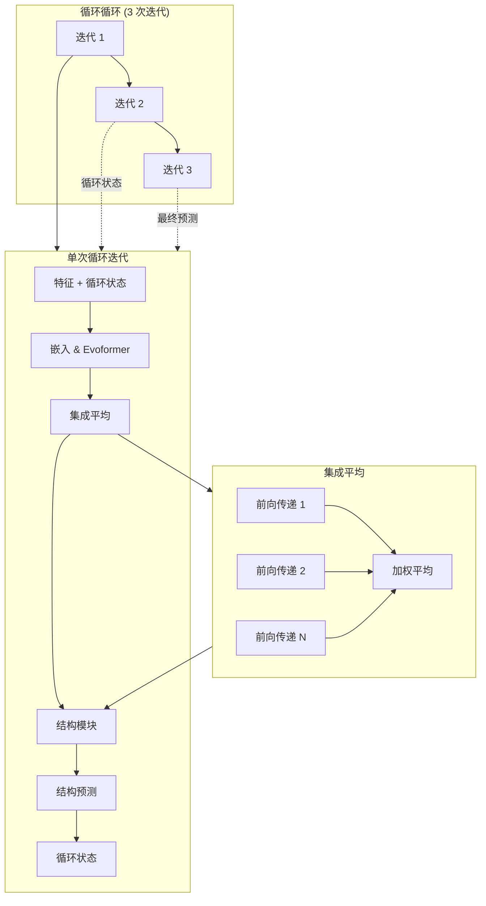

---
slug:15-recycling-and-ensembling-mechanisms
blog_type:normal
---

本页面记录了迭代优化和集成平均策略，这些策略使 AlphaFold-Multimer 能够逐步改进蛋白质结构预测并增强预测的鲁棒性。这些机制是实现单体和多聚体预测最先进准确性的基础。

## 架构概述

AlphaFold-Multimer 采用两种互补策略来提高预测质量：**循环**通过多次传递迭代优化预测，而**集成**聚合多次前向传递以减少方差并提高稳定性。循环循环在最高架构级别运行，将模型输出反馈作为后续迭代的输入，而集成在每个循环迭代内的表示级别发生。

## 循环机制

循环实现了迭代优化策略，模型通过结合先前迭代的结构信息逐步改进其预测。这使模型能够通过多个优化周期纠正初始错误并优化原子位置。

### 单体循环实现

单体模型使用 `while_loop` 构造实现循环，该构造执行可配置的迭代次数（默认：3）。每次迭代接收一个包含三个循环组件的 `prev` 字典：来自结构模块的原子位置、MSA 表示的第一行，以及配对表示 [alphafold/model/modules.py#L312-L319](alphafold/model/modules.py#L312-L319)。

循环体函数通过 `do_call` 方法将批次特征与先前迭代的输出合并来协调每次迭代 [alphafold/model/modules.py#L321-L342](alphafold/model/modules.py#L321-L342)。当启用 `resample_msa_in_recycling` 时（默认：True），通过根据当前循环索引切片批次维度，为每次循环迭代使用不同的 MSA 样本 [alphafold/model/modules.py#L324-L333](alphafold/model/modules.py#L324-L333)。

<CgxTip>循环的原子位置在反馈到网络之前被转换为距离图表示，允许模型推理残基间距离而不是原始坐标。这种旋转不变表示保留了几何信息，同时保持了网络的等变性质。</CgxTip>

### 多聚体循环实现

多聚体模型遵循类似的模式，但使用 JAX 的 `fori_loop` 构造进行显式迭代控制 [alphafold/model/modules_multimer.py#L477-L484](alphafold/model/modules_multimer.py#L477-L484)。多聚体实现处理随机数生成的安全密钥拆分，这对于循环迭代期间的 MSA 重采样至关重要。

多聚体循环的一个关键架构区别是 PRNG 密钥的显式管理。当启用 `resample_msa_in_recycling` 时，安全密钥在每次迭代时拆分，以确保独立的随机采样 [alphafold/model/modules_multimer.py#L480-L482](alphafold/model/modules_multimer.py#L480-L482)。这种设计即使在循环迭代之间也能实现适当的随机梯度行为。

### 循环特征组件

循环机制在迭代之间维护三个关键状态组件：

| 组件 | 形状 | 目的 | 来源 |
|-----------|-------|---------|--------|
| `prev_pos` | `[num_res, atom_type_num, 3]` | 来自先前结构模块输出的原子坐标 | `structure_module['final_atom_positions']` |
| `prev_msa_first_row` | `[num_res, msa_channel]` | MSA 表示的第一行（查询序列） | `representations['msa_first_row']` |
| `prev_pair` | `[num_res, num_res, pair_channel]` | 成对残基表示 | `representations['pair']` |

这些特征在第一次迭代时初始化为零，并使用来自每个先前迭代的梯度停止输出逐步更新 [alphafold/model/modules_multimer.py#L456-L463](alphafold/model/modules_multimer.py#L456-L463)。

### 训练与推理行为

在训练期间，循环迭代次数由批次中的 `num_iter_recycling` 特征动态控制 [alphafold/model/modules_multimer.py#L465-L472](alphafold/model/modules_multimer.py#L465-L472)。这实现了课程学习策略，模型在早期训练阶段学习从较少的循环迭代中受益。在推理时，始终使用最大配置的迭代次数（默认：3）。

循环循环对循环特征使用 `stop_gradient` 以防止梯度跨越迭代边界流动 [alphafold/model/modules.py#L319](alphafold/model/modules.py#L319)，确保每次迭代的梯度独立计算，同时仍允许信息向前传播。

## 集成机制

集成通过平均具有不同随机种子或 MSA 样本的网络的多次前向传递来提高预测鲁棒性。这减少了学习表示中的方差，并导致更稳定的结构预测。

### 单体集成

单体模型通过 `ensemble_representations` 参数支持集成，该参数在批次维度上平均表示 [alphafold/model/modules.py#L148-L196](alphafold/model/modules.py#L148-L196)。实现切片批次以独立处理每个集成成员，然后累积并标准化结果表示。

<CgxTip>单体模型中故意将 MSA 表示排除在集成之外，以保留 MSA 采样的随机多样性。仅平均单序列和配对表示，在减少最终结构预测中方差的同时，保持进化信息的丰富多样性。</CgxTip>

集成循环使用 `while_loop` 遍历每个集成成员，将其表示添加到累加器 [alphafold/model/modules.py#L169-L191](alphafold/model/modules.py#L169-L191)。累积后，除 MSA 外的所有表示都除以集成计数以产生平均值 [alphafold/model/modules.py#L193-L195](alphafold/model/modules.py#L193-L195)。

### 多聚体集成

多聚体模型以不同方式实现集成，为训练（`num_ensemble_train`）和评估（`num_ensemble_eval`）模式使用单独的配置参数 [alphafold/model/modules_multimer.py#L313-L316](alphafold/model/modules_multimer.py#L313-L316)。默认情况下，两者都设置为 1，实际上禁用了集成。

多聚体集成使用 JAX 的 `scan` 原语在集成成员之间进行高效并行计算 [alphafold/model/modules_multimer.py#L344-L345](alphafold/model/modules_multimer.py#L344-L345)。每个集成成员接收 PRNG 密钥的拆分，确保独立的随机采样 [alphafold/model/modules_multimer.py#L331](alphafold/model/modules_multimer.py#L331)。

多聚体集成中的一个关键设计选择是对 MSA 相关特征与结构特征的差异化处理。`ensemble_body` 函数显式排除 `msa`、`true_msa` 和 `bert_mask` 的平均，仅对其他表示应用标准化因子 [alphafold/model/modules_multimer.py#L335-L340](alphafold/model/modules_multimer.py#L335-L340)。

### MSA 重采样策略

当启用 `resample_msa_in_recycling` 时，模型在每个循环迭代时重采样 MSA，在优化过程中提供多样化的进化信息 [alphafold/model/config.py#L136](alphafold/model/config.py#L136)。这对于 MSA 质量和配对显著影响界面建模的多聚体预测尤为重要。

单体模型通过沿集成维度切片批次来处理 MSA 重采样，每个切片对应不同的循环迭代 [alphafold/model/modules.py#L324-L333](alphafold/model/modules.py#L324-L333)。多聚体模型通过每次迭代时的显式 PRNG 密钥拆分实现类似功能 [alphafold/model/modules_multimer.py#L480-L482](alphafold/model/modules_multimer.py#L480-L482)。

## 配置参数

循环和集成行为通过模型配置字典中的配置参数进行控制。这些参数允许调整计算成本和预测准确性之间的权衡。

### 循环配置

| 参数 | 默认值 | 描述 |
|-----------|---------------|-------------|
| `num_recycle` | 3 | 推理期间的循环迭代次数 |
| `resample_msa_in_recycling` | True | 是否在每个循环迭代时重采样 MSA |

这些参数在数据和模型级别定义 [alphafold/model/config.py#L134-L136](alphafold/model/config.py#L134-L136), [alphafold/model/config.py#L429-L430](alphafold/model/config.py#L429-L430), [alphafold/model/config.py#L654-L655](alphafold/model/config.py#L654-L655)。

### 集成配置

| 参数 | 单体默认值 | 多聚体默认值 | 描述 |
|-----------|-----------------|------------------|-------------|
| `num_ensemble_eval` | N/A | 1 | 评估期间的集成成员数量 |
| `ensemble_representations` | True (参数化) | N/A | 是否在集成间平均表示 |

多聚体配置显式定义了训练和评估的集成计数 [alphafold/model/config.py#L653](alphafold/model/config.py#L653)，而单体模型通过 `ensemble_representations` 函数参数控制集成。

## 计算考虑

### 内存和计算

循环使计算成本随迭代次数线性增加。每次循环迭代都需要完整的 Evoformer 和结构模块前向传递，消耗大量 GPU 内存和计算资源。3 次循环迭代的默认配置代表预测质量和计算效率之间的平衡。

集成将计算成本乘以集成大小，因为每个集成成员需要独立的前向传递。然而，多聚体的 `num_ensemble_eval=1` 默认配置实际上禁用了集成，以减少计算开销 [alphafold/model/config.py#L653](alphafold/model/config.py#L653)。

### 梯度计算

在训练期间，由于对循环特征使用 `stop_gradient`，每个循环迭代的梯度是独立计算的 [alphafold/model/modules.py#L319](alphafold/model/modules.py#L319)。这种设计选择防止了梯度爆炸，使优化问题更容易处理，尽管代价是收敛可能较慢。

## 与模型架构的集成

循环和集成机制与 AlphaFold-Multimer 的模块化架构深度集成，与几个关键组件交互：

### Evoformer 模块

Evoformer 接收循环特征作为附加输入，将其合并到注意力机制和转换层 [alphafold/model/modules_multimer.py#L319-L325](alphafold/model/modules_multimer.py#L319-L325)。循环配对表示直接影响成对注意力计算，而循环 MSA 第一行影响 MSA 注意力机制。

### 结构模块

结构模块输出是循环状态的主要来源，`final_atom_positions` 被转换回距离图表示以供下一次迭代使用 [alphafold/model/modules_multimer.py#L440-L441](alphafold/model/modules_multimer.py#L440-L441)。这创建了一个闭环反馈循环，能够迭代优化 3D 结构。

### 预测头

置信度预测头（pLDDT、pTM、PAE）仅对最终迭代的输出操作，不对中间循环迭代操作。这确保置信度指标反映最终优化结构的质量，而不是跨迭代的平均值。

## 后续步骤

了解循环和集成机制有助于深入理解 AlphaFold-Multimer 的迭代优化策略。要完成对模型架构的理解，请探索：

- [Evoformer 和嵌入模块](12-evoformer-and-embedding-modules) - 核心注意力机制如何处理循环特征
- [结构模块和 InvariantPointAttention](13-structure-module-and-invariantpointattention) - 生成循环原子位置的最终结构预测阶段
- [模型配置和预设](8-model-configuration-and-presets) - 循环和集成参数的详细配置选项

有关实际应用指导，请参阅[运行你的第一个预测](5-running-your-first-prediction)，以了解这些机制如何影响现实场景中的预测运行时间和质量。