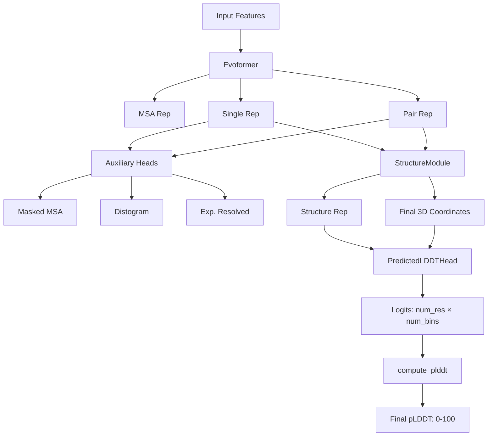

---
slug:16-per-residue-confidence-plddt
blog_type:normal
---

每残基预测的局部距离差异检验（pLDDT）是 AlphaFold 的主要置信度指标，它为预测结构中的每个残基提供估计的准确度分数，范围从 0 到 100。该指标对于理解预测的哪些区域是可靠的，哪些可能需要实验验证或额外的建模方法至关重要。

## 理论基础

pLDDT 指标建立在局部距离差异检验算法的基础上，该算法在不需要叠加预测结构和参考结构的情况下测量局部结构准确度。核心 lDDT 函数计算参考结构中指定截止距离（默认 15Å）内所有原子对的预测原子位置与真实原子位置之间的归一化距离差异 [lddt.py](/alphafold/model/lddt.py#L19-L89)。

lDDT 算法评估四个距离差异阈值：0.5Å、1.0Å、2.0Å 和 4.0Å。对于截止距离内的每个有效残基对，算法计算预测距离满足这四个阈值中的多少个，然后计算平均分数。这种方法提供了一个稳健的局部质量度量，对全局域运动或刚体位移不敏感。

在 AlphaFold 的实现中，lDDT 计算使用 Cα 原子进行每残基评估，创建二进制掩码以排除不存在的残基和自相互作用。距离矩阵针对预测结构和真实结构进行计算，并且仅针对参考结构中两个残基均有效且在截止距离内的对计算差异。

<CgxTip>AlphaFold 使用一种近似的 lDDT 计算，省略了原始算法中存在的物理可行性修正（例如键长违例）。这种近似对于置信度估计是足够的，但在与通过完整结构验证计算的真实 lDDT 值进行比较时应予以考虑。</CgxTip>

## 神经网络架构

pLDDT 预测通过 [modules.py](/alphafold/model/modules.py#L1004-L1107) 中的 `PredictedLDDTHead` 模块实现，该模块作为附加到 StructureModule 输出的专用网络头运行。该头学习直接从 Evoformer 和 StructureModule 生成的结构表示中预测每个残基的 lDDT 分数。

网络架构由一个连续的流水线组成：

1. **输入层归一化**：层归一化操作对 StructureModule 的单个表示（形状：`[N_res, c_s]`）进行标准化，确保训练期间梯度流动的稳定性。

2. **两层前馈网络**：两个具有 ReLU 激活的线性投影，每个配置有 `num_channels` 维度（默认 128），变换表示以提取与局部结构质量相关的特征。

3. **Logit 输出层**：最终的线性投影为每个残基产生 `num_bins` 个 logit（默认 50 个 bin），代表网络对每个残基落入哪个 lDDT 范围的预测。

该头设计为在 StructureModule 生成最终原子位置后执行，允许其访问学习的结构表示和实际预测坐标以进行训练信号计算。

来源：[modules.py](/alphafold/model/modules.py#L1004-L1060)

## 训练过程

在训练期间，PredictedLDDTHead 通过监督交叉熵损失学习预测 lDDT 分数。训练流水线涉及几个关键步骤 [modules.py](/alphafold/model/modules.py#L1062-L1107)：

1. **目标 lDDT 计算**：使用 `lddt()` 函数通过比较预测的 Cα 位置与实验真实位置来计算真实的 lDDT 分数，并设置 `per_residue=True` 为每个残基生成分数。

2. **分箱转换**：通过将连续的 lDDT 值（范围 [0,1]）乘以 `num_bins` 并对结果向下取整，将其转换为离散的 bin 索引。最大值操作可防止恰好为 1.0 的完美 lDDT 分数出现越界索引。

3. **独热编码**：Bin 索引被转换为独热向量（形状：`[num_res, num_bins]`）以作为交叉熵损失的训练目标。

4. **损失计算**：在预测的 logit 和目标独热向量之间计算 Softmax 交叉熵损失，并由 CA 原子掩码加权以排除无效残基。

当 `filter_by_resolution=True` 时，训练损失可以选择性地按结构分辨率范围过滤训练示例，排除 NMR 结构和蒸馏数据（分辨率=0），以专注于高质量的 X 射线晶体结构。

## 推理计算流水线

在推理时，pLDDT 值通过 [confidence.py](/alphafold/common/confidence.py#L22-L31) 中的 `compute_plddt()` 函数计算，该函数将来自 PredictedLDDTHead 的原始 logit 转换为可解释的置信度分数。

计算遵循以下步骤：

1. **Bin 中心计算**：算法在 [0,1] 区间内创建等间距的 bin 中心。当 `num_bins=50` 时，这会在 0.01, 0.03, 0.05, ..., 0.99 处创建中心。

2. **概率分布**：对 logit（形状：`[num_res, num_bins]`）应用 Softmax，将其转换为每个残基在 lDDT bin 上的概率分布。

3. **期望值计算**：每个残基的预测 lDDT 值计算为概率分布的期望值：`pLDDT_i = Σ_j (prob_ij × center_j)`。

4. **缩放转换**：最终的 pLDDT 分数通过乘以 100 从 [0,1] 范围缩放到 [0,100]，以匹配传统的 pLDDT 表示形式。

整体的置信度指标计算由 [model.py](/alphafold/model/model.py#L31-L61) 中的 `get_confidence_metrics()` 协调，该函数从预测结果中提取 pLDDT logit 并通过 `compute_plddt()` 处理它们。

## 与 AlphaFold 架构的集成

pLDDT 预测头通过 AlphaFoldIteration 类集成到更广泛的 AlphaFold 架构中 [modules.py](/alphafold/model/modules.py#L123-L268)。执行顺序经过精心设计，以确保头可以访问所有必要信息：

1. **Evoformer 处理**：EmbeddingsAndEvoformer 模块处理输入特征以生成单个、对和 MSA 表示。

2. **非置信度头**：辅助头（masked_msa、distogram、experimentally_resolved）首先执行，其中一些提供 StructureModule 可能使用的附加表示。

3. **StructureModule 执行**：StructureModule 生成最终的 3D 原子坐标，这是训练期间 pLDDT 目标计算所必需的。

4. **pLDDT 和 PAE 头**：StructureModule 完成后，PredictedLDDTHead 和 PredictedAlignedErrorHead 执行，访问学习的表示和结构输出。

这种依赖感知的执行确保置信度指标可以利用结构信息，同时保持正确的计算图拓扑。

来源：[modules.py](/alphafold/model/modules.py#L189-L268)

## pLDDT 分数解读

pLDDT 分数遵循结构生物学中使用的传统置信度解释方案：

- **90-100**：非常高的置信度（通常准确到 1-2Å RMSD）。这些区域通常对于下游应用（如药物对接或活性位点分析）是可靠的。

- **70-90**：高置信度。折叠通常是正确的，但侧链取向可能具有中等不确定性。

- **50-70**：低置信度。整体拓扑可能是正确的，但局部定位不确定性显著增加。

- **0-50**：非常低的置信度。这些区域应被视为不可靠；它们可能代表固有无序区域、缺乏进化约束或真正的预测失败。

<CgxTip>在多聚体预测中，置信度分布通常在链和界面之间变化。界面残基通常显示出与单体区域不同的置信度模式，反映了蛋白质-蛋白质相互作用建模的额外约束和挑战。</CgxTip>

pLDDT 指标特别有价值，因为它提供每残基的粒度，允许研究人员即使在其他不确定的预测中也能识别可靠的子区域。这种能力对于结构生物学应用至关重要，因为在这些应用中，部分结构信息仍然可以产生有意义的生物学见解。

## 模型排序和选择

对于单体模型，pLDDT 作为主要的排序指标。`get_confidence_metrics()` 函数计算 `ranking_confidence` 为所有残基的平均 pLDDT [model.py](/alphafold/model/model.py#L52-L61)。这个单一值允许在多个模型预测之间进行直接比较和选择。

在多聚体模式下，排序策略发生显著变化。排序置信度结合了界面预测 TM-score (ipTM) 和全局 pTM，使用加权公式：`ranking_confidence = 0.8 × ipTM + 0.2 × pTM` [model.py](/alphafold/model/model.py#L47-L50)。这反映了在多聚体复合物中，相对于单体结构质量，正确预测链间相互作用的重要性增加。

## 配置和参数

pLDDT 预测行为由 [config.py](/alphafold/model/config.py) 中定义的配置参数控制。默认配置包括：

- **num_bins**：50 个 bin，用于离散化 [0,1] lDDT 范围
- **num_channels**：128 维，用于 PredictedLDDTHead 中的隐藏层
- **filter_by_resolution**：布尔标志，用于按结构分辨率过滤训练示例
- **min_resolution**：0.1Å（分辨率过滤的下限）
- **max_resolution**：3.0Å（分辨率过滤的上限）

这些参数在置信度预测的粒度、模型复杂性和训练数据质量之间取得平衡。50-bin 离散化在 pLDDT 空间中提供 2% 的分辨率，足以区分置信度等级，同时保持可管理的计算要求。

来源：[config.py](/alphafold/model/config.py#L336-L354)

## 实际应用和局限性

pLDDT 置信度分数在结构生物学和药物发现中实现了众多实际应用：

- **可靠区域提取**：可以提取高置信度区域用于同源建模、片段组装或域表征，而无需完整的结构验证。

- **诱变规划**：低 pLDDT 分数的残基可能指示可以耐受突变的柔性或非结构化区域，而高置信度区域通常代表结构受限的位置。

- **界面分析**：在多聚体复合物中，比较界面残基 pLDDT 分数与结构的其余部分有助于识别可靠的相互作用表面和潜在的建模伪影。

然而，应考虑几个局限性：

- **训练数据偏差**：pLDDT 预测继承了训练集的偏差，该训练集偏向于高分辨率 X 射线结构。这可能会降低 NMR 结构、低分辨率 cryo-EM 图或具有不寻常特征的蛋白质的准确性。

- **构象灵活性**：固有无序区域或柔性连接物通常获得低 pLDDT 分数，不是因为预测失败，而是因为它们确实缺乏稳定的结构。解释这些需要生物学背景。

- **链终止效应**：链终止附近的残基通常由于进化约束减少和训练集特征而表现出系统性的较低 pLDDT 分数。

理解这些细微差别使研究人员能够有效地利用 pLDDT，同时避免对置信度信号的误解。

## 相关置信度指标

pLDDT 作为 AlphaFold 更广泛置信度估计框架的一部分运行。虽然 pLDDT 提供每残基的局部置信度，但其他指标提供互补的视角：

- **预测对齐误差 (PAE)**：提供整个结构中成对残基间误差估计，能够识别域取向和相对定位不确定性 [18-predicted-aligned-error-pae-visualization](18-predicted-aligned-error-pae-visualization)。

- **预测 TM-score (pTM)**：为整个结构提供单一的全局置信度指标，源于预测结构和参考结构之间的预期对齐质量。

- **界面 pTM (ipTM)**：专用于多聚体界面的 TM-score 预测，对于评估蛋白质复合物中的相互作用质量至关重要。

这些指标共同提供全面的置信度评估，每个指标解决预测质量的不同方面。pLDDT 的每残基粒度使其对于详细的结构分析具有独特的价值，而 PAE 和 pTM 提供关于预测可靠性的全局和成对视角。