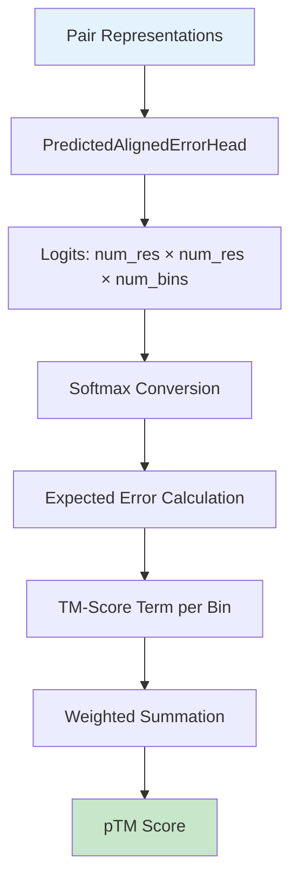

---
slug:17-predicted-tm-score-ptm
blog_type:normal
---

预测的 TM-Score (pTM) 是蛋白质结构预测的**全局置信度指标**，提供单一的标量值来估计预测结构与天然构象相比的整体质量。与 pLDDT 等基于残基的指标不同，pTM 通过模板建模评分 (TM-score) 的视角评估整个结构，这是评估结构相似性的成熟指标。

来源: [confidence.py](alphafold/common/confidence.py#L111-L169), [model.py](alphafold/model/model.py#L31-L62)

## 理解 TM-Score 基础

TM-score 由 Yang 和 Skolnick (2004) 提出，作为衡量结构相似性的指标，具有**长度无关性**并对全局拓扑结构敏感。核心公式依赖于距离相关的加权函数，其中特定距离阈值内的残基对评分的贡献更为显著。关键参数是 d₀，它根据以下公式随蛋白质大小缩放：

d₀ = 1.24 × (N - 15)^(1/3) - 1.8

其中 N 代表残基数量。这种缩放确保评分阈值适应蛋白质大小，使 TM-score 在不同长度的蛋白质之间具有可比性。

来源: [confidence.py](alphafold/common/confidence.py#L134-L140)

## pTM 计算架构

pTM 计算遵循**多阶段管道**，将模型预测转换为置信度估计。该过程从 PredictedAlignedErrorHead 开始，它预测结构中所有残基对之间的距离误差。

PredictedAlignedErrorHead 在离散距离区间（通常为 64 个区间，跨度 0 到 31.5 Å）上输出 logits。这些 logits 通过 softmax 转换为概率，然后按区间中心加权以计算每个残基对的预期对齐误差。

来源: [modules.py](alphafold/model/modules.py#L1108-L1147), [confidence.py](alphafold/common/confidence.py#L80-L109)

## 数学实现

pTM 计算通过概率加权期望实现 TM-score 公式。对于每个距离区间，算法计算：

**TM(d) = 1 / (1 + (d/d₀)²)**

其中 d 代表区间中心距离。最终的 pTM 计算为所有残基对上这些 TM-score 项的**加权平均值**，权重来自预测的误差概率：

pTM = Σᵢⱼ [pᵢⱼ × TM(dⱼ)] / Σᵢⱼ pᵢⱼ

其中 pᵢⱼ 表示残基 i 和 j 的距离误差对应于区间 j 的概率。

来源: [confidence.py](alphafold/common/confidence.py#L145-L162)

## 多聚体预测的界面 pTM (ipTM)

在多聚体模式下，AlphaFold 计算一个名为**界面 pTM (ipTM)** 的额外指标，专门评估蛋白质-蛋白质界面的置信度。这对于评估复合物形成质量至关重要，因为链间相互作用决定了生物功能。

ipTM 计算应用掩码过滤器，将残基对限制为仅来自不同链（不对称单元）的那些。掩码构造如下：

pair_mask = asym_id[:, None] ≠ asym_id[None, :]

这确保只有链间残基对对评分有贡献，提供针对性的界面质量评估。

来源: [confidence.py](alphafold/common/confidence.py#L159-L162), [model.py](alphafold/model/model.py#L48-L54)

<CgxTip>
多聚体模型的排序置信度指标使用加权组合：0.8 × ipTM + 0.2 × pTM。这种加权优先考虑界面质量，同时仍考虑整体结构质量，反映了正确复合物形成的生物学重要性。</CgxTip>

来源: [model.py](alphafold/model/model.py#L55-L57)

## 模型集成和输出

pTM 计算通过 `get_confidence_metrics` 函数集成到预测管道中，该函数处理模型输出以提取置信度指标。该函数处理两种不同场景：

**对于单体模型**：使用平均 pLDDT 作为排序置信度指标
**对于多聚体模型**：计算 pTM 和 ipTM，然后将它们组合为排序置信度分数

这种差异化确保置信度指标与预测任务的特定要求一致——单体质量与多聚体复合物形成。

来源: [model.py](alphafold/model/model.py#L31-L62)

## 参数配置

pTM 计算接受几个可选参数来修改其行为：

| 参数 | 类型 | 目的 | 默认值 |
|-----------|------|---------|---------|
| `logits` | ndarray | [num_res, num_res, num_bins] 对齐误差 logits | 必需 |
| `breaks` | ndarray | [num_bins - 1] 距离区间边界 | 必需 |
| `residue_weights` | ndarray | [num_res] 每个残基的加权因子 | 全1数组 |
| `asym_id` | ndarray | [num_res] 用于 ipTM 的链标识符 | None |
| `interface` | bool | 启用 ipTM 计算模式 | False |

`residue_weights` 参数对于处理不完整结构或在评估期间屏蔽低置信度区域特别有用。

来源: [confidence.py](alphafold/common/confidence.py#L111-L120)

## 实用解释指南

解释 pTM 分数需要理解其规模和与预测质量的关系：

- **pTM > 0.7**：高置信度预测，具有正确的整体折叠
- **0.5 < pTM < 0.7**：中等置信度，拓扑正确但可能存在局部误差
- **pTM < 0.5**：低置信度，可能存在显著的结构偏差

对于 ipTM 分数，阈值通常更严格，因为界面质量更难准确预测。组合排序置信度分数高于 0.75 通常表示可靠的多聚体预测。

来源: [model.py](alphafold/model/model.py#L55-L59)

<CgxTip>
当比较具有相似 pTM 分数的模型时，检查预测对齐误差 (PAE) 矩阵以获取额外的见解。结构中均匀的低误差比误差局限于特定区域的情况表明更高的置信度。</CgxTip>

## 与其他置信度指标的关系

pTM 指标补充了 AlphaFold 工具包中的其他置信度度量：

- **pLDDT**：基于残基的局部置信度 (0-100 刻度)
- **PAE**：成对误差矩阵，显示相对位置的置信度
- **pTM**：整体折叠质量的全局置信度

这些指标共同提供预测质量的**多维度评估**，pTM 作为整体结构正确性的主要指标。这些指标的集成使用户能够对预测可靠性和潜在用例做出明智决策。

来源: [confidence.py](alphafold/common/confidence.py#L22-L30), [model.py](alphafold/model/model.py#L35-L44)

## 后续步骤

要进行全面置信度评估，请探索 pTM 如何与其他指标集成：

- **基于残基的置信度 (pLDDT)**：[基于残基的置信度 (pLDDT)](16-per-residue-confidence-plddt) - 了解局部结构质量
- **预测对齐误差 (PAE)**：[预测对齐误差 (PAE) 可视化](18-predicted-aligned-error-pae-visualization) - 分析成对置信度模式
- **模型排序和选择**：[模型排序和选择](20-model-ranking-and-selection) - 应用置信度指标进行模型比较

有关在预测管道中使用这些指标的实现细节：[RunModel 类和预测接口](25-runmodel-class-and-prediction-interface)