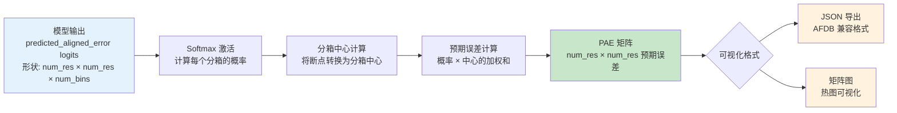

---
slug:18-predicted-aligned-error-pae-visualization
blog_type:normal
---


预测对齐误差（PAE）提供一种**成对置信度度量**，用于在预测结构与参考结构对齐时，估计任意两个残基之间的预期位置误差。与衡量单残基置信度的 pLDDT 不同，PAE 揭示了多聚体预测中的**结构域级置信度**和**链间可靠性**，这对于理解复杂的蛋白质组装和定义明确的结构域特别有价值。

## PAE 计算架构

PAE 计算流程通过基于分箱的系统化概率估计过程，将原始模型 logit 转换为置信度矩阵。该架构遵循三个阶段的变换：从 logit 到概率，从概率到预期误差，最后转换为可视化就绪的数据结构。



### 核心计算函数

PAE 计算依赖于置信度模块中三个相互关联的函数。`compute_predicted_aligned_error()` 函数作为主要接口，接收来自 PredictedAlignedErrorHead 的 logit 和相应的分箱断点。该函数首先应用 softmax 归一化，将 logit 转换为跨越 64 个分箱的概率，每个分箱代表特定的误差距离范围。然后，它使用分箱中心作为权重，通过加权和计算预期对齐误差。
来源：[alphafold/common/confidence.py](/alphafold/common/confidence.py#L80-L103)

基于分箱的离散化策略允许模型预测误差分布，而不是点估计。分箱断点定义了误差距离区间之间的边界，通常范围从 0Å 到 32Å 或更高，具体取决于模型配置。`_calculate_bin_centers()` 辅助函数将这些边界转换为每个分箱的代表性中心点，并在上端包含一个额外的兜底分箱，以容纳异常值。
来源：[alphafold/common/confidence.py](/alphafold/common/confidence.py#L39-L56)

`_calculate_expected_aligned_error()` 函数通过计算概率分布与分箱中心之间的点积来执行核心数学运算，从而生成所有残基对的预期误差矩阵。该矩阵代表了驱动下游可视化分析的**基础 PAE 度量**。该函数还返回最大可能误差值，该值作为可视化缩放的归一化参考。
来源：[alphafold/common/confidence.py](/alphafold/common/confidence.py#L58-L78)

### 模型集成点

PAE 计算通过模型模块中的 `get_confidence_metrics()` 函数集成到预测流程中，该函数处理原始预测结果并提取所有可用的置信度指标。该函数检查预测结果中是否存在 PAE logit，并在可用时应用计算函数。生成的 PAE 矩阵与其他指标一起存储在输出字典中，可通过 'predicted_aligned_error' 键访问。
来源：[alphafold/model/model.py](/alphafold/model/model.py#L31-L62)

模型运行器的预测方法会自动调用置信度指标计算，确保所有预测输出中都包含 PAE 数据。这种集成发生在模型推理完成之后，置信度指标模块确保在返回结果之前计算并实现所有张量。对于多聚体模型，PAE 数据尤为重要，因为它直接输入到用于模型排序的 ipTM（界面预测 TM-score）计算中。
来源：[alphafold/model/model.py](/alphafold/model/model.py#L149-L178)

## PAE 数据结构和解释

### 输出模式

PAE 计算生成一个包含三个不同数据结构的综合字典，支持不同的分析和可视化用例。`aligned_confidence_probs` 字段包含跨越所有分箱的完整概率分布，支持自定义误差阈值分析。`predicted_aligned_error` 字段提供主要的预期误差矩阵，作为一个密集的二维数组，其中每个元素代表两个残基之间以埃为单位的预期距离误差。`max_predicted_aligned_error` 标量指示误差范围的上限，对于正确的热图归一化至关重要。
来源：[alphafold/common/confidence.py](/alphafold/common/confidence.py#L80-L103)

| 数据字段 | 形状 | 类型 | 用途 |
|------------|-------|------|---------|
| `aligned_confidence_probs` | [num_res, num_res, num_bins] | float32 | 每个残基对的完整概率分布 |
| `predicted_aligned_error` | [num_res, num_res] | float32 | 以埃为单位的预期误差值 |
| `max_predicted_aligned_error` | 标量 | float32 | 用于归一化的最大误差 |

### PAE 矩阵语义

PAE 矩阵沿对角线呈现**对称特性**，反映了残基 i 和 j 之间的预期误差等于 j 和 i 之间的误差。对角线元素代表自对齐误差，理论上应接近于零，但由于数值精度和模型不确定性，可能会显示小的非零值。低值的非对角线区域表示相对定位的**高置信度**，而高值则表明残基之间的相对位置模糊或不确定。
来源：[alphafold/common/confidence.py](/alphafold/common/confidence.py#L58-L78)

在多聚体预测中，PAE 矩阵自然分割为**链间**和**链内**块。链内块通常显示定义明确结构域的典型块状模式，其中连续区域显示均匀的低误差。链间块揭示了链取向和界面定位的置信度，低值表明可靠的对接预测。这种模式识别能力使 PAE 对于验证多聚体组装预测和识别潜在的建模伪影特别有价值。
来源：[alphafold/model/model.py](/alphafold/model/model.py#L31-L62)

### 误差范围解释

PAE 值遵循一个可解释的范围，其中较低的值表示相对定位的较高置信度。低于 5Å 的误差通常表示**高置信度区域**，其中残基位置彼此之间已很好地确定。5-10Å 之间的值表示中等置信度，通常在柔性连接子或具有构象模糊性的区域中观察到。超过 15-20Å 的误差表示低置信度，其中相对位置约束较差，这可能是由于缺乏进化信息或真正的结构灵活性。
来源：[alphafold/common/confidence.py](/alphafold/common/confidence.py#L39-L56)

<CgxTip>在分析多聚体预测时，应重点关注链间 PAE 块而非绝对值。即使适度的链间误差（10-15Å）也是可以接受的，只要链内结构域显示出高置信度，这表明单个链建模良好，但它们的相对取向存在一些不确定性。ipTM 指标（源自 PAE）提供了一个专门用于界面置信度的单一数值摘要。</CgxTip>

## PAE 数据提取和导出

### 从预测结果中访问 PAE

PAE 数据是自动计算并包含在预测结果中的，可通过标准预测字典结构访问。当使用 `run_alphafold.py` 脚本时，预测会保存到输出目录中的 pickle 文件，包含包括 PAE 指标在内的完整结果字典。要提取 PAE 数据，请加载 pickle 文件并访问嵌套的置信度结果：

```python
import pickle
import numpy as np

# 加载预测结果
with open('result_model_1.pkl', 'rb') as f:
    prediction_result = pickle.load(f)

# 访问 PAE 组件
pae_matrix = prediction_result['predicted_aligned_error']
max_pae = prediction_result['max_predicted_aligned_error']
pae_probs = prediction_result['aligned_confidence_probs']

print(f"PAE 矩阵形状: {pae_matrix.shape}")
print(f"最大误差范围: {max_pae:.1f} Å")
```

PAE 矩阵为标准绘图工具之外的自定义可视化或定量分析提供了基础。
来源：[run_alphafold.py](/run_alphafold.py#L216-L220)

### 用于 AlphaFold DB 可视化的 JSON 导出

notebook 工具模块中的 `get_pae_json()` 函数将 PAE 矩阵转换为基于 Web 的可视化工具所使用的 **AlphaFold DB 兼容 JSON 格式**。此转换将矩阵格式化为残基对的扁平化列表，并附带相应的误差值，四舍五入到小数点后一位以提高可读性。JSON 结构包含一个 `max_predicted_aligned_error` 字段，可视化工具使用该字段进行正确的颜色缩放：

```python
from alphafold.notebooks import notebook_utils

# 将 PAE 矩阵转换为 JSON
pae_json = notebook_utils.get_pae_json(
    pae=pae_matrix,
    max_pae=max_pae
)

# 保存到文件以供外部可视化
import json
with open('pae_data.json', 'w') as f:
    f.write(pae_json)
```

这种 JSON 格式能够与 AlphaFold DB 查看器和其他标准可视化平台无缝集成，确保在不同查看环境中保持一致的颜色缩放和交互模式。
来源：[alphafold/notebooks/notebook_utils.py](/alphafold/notebooks/notebook_utils.py#L171-L183)

### 程序化可视化示例

对于自定义分析，可以使用标准 Python 绘图库可视化 PAE 矩阵。以下示例演示如何创建具有适当缩放和注释的出版级热图：

```python
import matplotlib.pyplot as plt
import numpy as np
from matplotlib.colors import LinearSegmentedColormap

# 创建自定义颜色图（蓝色=低误差，红色=高误差）
colors = ['#313695', '#74add1', '#ffffbf', '#f46d43', '#a50026']
n_bins = 100
cmap_name = 'pae_scale'
cm = LinearSegmentedColormap.from_list(cmap_name, colors, N=n_bins)

# 绘制 PAE 矩阵
fig, ax = plt.subplots(figsize=(10, 8))
im = ax.imshow(pae_matrix, cmap=cm, vmin=0, vmax=max_pae)

# 添加颜色条
cbar = plt.colorbar(im, ax=ax, fraction=0.046, pad=0.04)
cbar.set_label('预测对齐误差 (Å)', rotation=270, labelpad=20)

# 设置标签
ax.set_xlabel('残基索引')
ax.set_ylabel('残基索引')
ax.set_title('预测对齐误差')

plt.tight_layout()
plt.savefig('pae_heatmap.png', dpi=300)
plt.close()
```

这种方法实现了**自定义可视化**，包括特定领域的注释、链边界指示器或与额外结构分析的集成。
来源：[alphafold/common/confidence.py](/alphafold/common/confidence.py#L80-L103)

<CgxTip>为多聚体创建自定义 PAE 可视化时，请在链边界处添加垂直和水平线，以清晰划分链间区域。这种视觉分离有助于查看者快速评估界面置信度与链内置信度，这对于解释多聚体预测的可靠性至关重要。</CgxTip>

## 多聚体与单体背景下的 PAE

### 多聚体特定应用

在多聚体预测中，PAE 除了在置信度评估中的一般作用外，还发挥两个关键作用。首先，它通过矩阵的链间块提供**界面可靠性度量**，直接支持 ipTM（界面预测 TM-score）计算。ipTM 计算使用 `asym_id`（不对称单元标识符）选择性地加权链间残基对，以将界面置信度与链内置信度分离开来。这种分离使得能够专门基于组装质量而不是单体结构准确性进行模型排序。
来源：[alphafold/common/confidence.py](/alphafold/common/confidence.py#L111-L169)

其次，多聚体的 PAE 矩阵揭示了有助于验证预测组装的**结构域架构和链组织**模式。定义明确的复合物显示对应于单个链或结构域的明显块，在链边界处有清晰的过渡。模糊的预测可能在整个链间区域显示高误差，表明配对或取向不正确。这种诊断能力使 PAE 成为排查多聚体预测和识别需要替代方法或人工干预的案例的必备工具。
来源：[alphafold/model/model.py](/alphafold/model/model.py#L31-L62)

### 单体应用

对于单体预测，PAE 主要识别**结构域边界**和**结构置信度区域**。具有多个结构域的蛋白质通常显示块状 PAE 模式，其中每个结构域对应于被高误差连接子分隔的低误差区域。这种模式识别有助于理解结构域组织，并识别可能仅从 pLDDT 看不出来的潜在结构域级错误。此外，PAE 可以揭示**柔性区域**或**构象异质性**，这些表现为矩阵中高误差的走廊。
来源：[alphafold/model/model.py](/alphafold/model/model.py#L149-L178)

## 后续步骤

了解 PAE 可视化为全面模型评估奠定了基础。要完成对 AlphaFold 置信度指标的理解，请探索用于局部准确性评估的 [Per-Residue Confidence (pLDDT)](16-per-residue-confidence-plddt) 和用于全局质量指标的 [Predicted TM-Score (pTM)](17-predicted-tm-score-ptm)。有关如何结合解释多个置信度指标的指导，请参阅 [Model Ranking and Selection](20-model-ranking-and-selection)，其中解释了如何将源自 PAE 的指标（如 ipTM）与其他置信度度量相结合以进行最终模型选择。