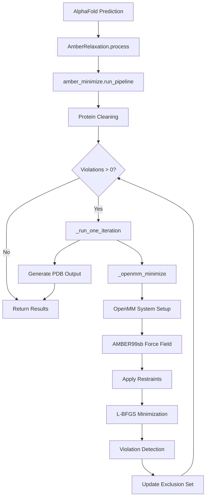

---
slug:19-amber-relaxation-for-structure-refinement
blog_type:normal
---

Amber Relaxation 是一个后处理优化阶段，通过应用基于物理的能量最小化来减少结构违例并优化原子几何结构，从而改善 AlphaFold-Multimer 的预测结果。该过程利用 OpenMM 通过 AMBER 分子力学力场将机器生成的结构转换为更现实的分子构象，同时保持整体预测折叠不变。

## 架构概述

松弛系统实现了一种违例驱动的迭代最小化策略，逐步细化预测结构。架构遵循高级接口和低级 OpenMM 操作之间的清晰分离。

**来源**: [run_alphafold.py](run_alphafold.py#L401-L407), [relax.py](alphafold/relax/relax.py#L58-L84)

## 核心松弛流程

当 `AmberRelaxation.process()` 接收到预测的蛋白质结构并启动迭代最小化流程时，松弛过程开始。该流程持续进行，直到所有结构违例得到解决或达到最大外部迭代次数。

**迭代逻辑**: 系统采用一种基于违例信息的方法，逐步将参与结构违例（冲突、键几何问题）的残基从约束中排除。这允许有问题的区域在后续最小化周期中更自由地移动，同时通过对表现良好的区域保持持续约束来维持整体结构完整性。

`run_pipeline` 函数通过重复调用 `_run_one_iteration` 来协调此过程，跟踪累积违例数据，并在每个周期后更新排除集。当违例降至零时，过程提前终止，对于表现良好的结构，通常在 1-2 次迭代内完成。

**来源**: [amber_minimize.py](alphafold/relax/amber_minimize.py#L425-L502), [amber_minimize.py](alphafold/relax/amber_minimize.py#L474-L495)

## 能量最小化机制

核心物理模拟发生在 `_openmm_minimize` 中，它使用 AMBER99sb 力场构建 OpenMM 系统——这是一种经过充分验证的蛋白质系统力场，在准确性和计算效率之间取得了平衡。

**力场配置**: 系统创建一个对氢键施加键约束的哈密顿量，减少了自由度并实现了更快的收敛。具有零温度和摩擦系数的 Langevin 积分器确保了纯确定性的能量最小化，而不会引入热波动。

**约束实现**: 谐波约束使用势能 `0.5 * k * ((x-x0)² + (y-y0)² + (z-z0)²)` 将原子锚定在其参考位置。约束强度参数（刚度）决定了原子在最小化期间的固定程度，默认值 10.0 kcal/mol/Ų 提供了适中的约束强度。

**优化算法**: L-BFGS（有限内存 Broyden-Fletcher-Goldfarb-Shanno）拟牛顿方法执行高效的基于梯度的优化。当 `max_iterations` 设置为 0 时，算法无迭代限制运行，仅在能量变化低于指定容差阈值时终止。

**来源**: [amber_minimize.py](alphafold/relax/amber_minimize.py#L73-L110), [amber_minimize.py](alphafold/relax/amber_minimize.py#L48-L70)

## 蛋白质结构清理

在最小化之前，预测结构通过 `clean_protein` 函数进行全面的清理，以确保它们包含基于物理模拟所需的所有原子。

**原子补全**: 清理过程使用 pdbfixer 识别并添加 AlphaFold 模型输出可能遗漏的缺失重原子，特别是对于非标准残基或解析度较低的区域。

**氢原子添加**: AlphaFold 预测缺少氢原子，因此清理器使用可电离残基的标准电离状态在生理 pH 7.0 下添加氢原子。

**边缘情况处理**: `cleanup` 模块处理特殊情况，包括：用标准氨基酸替换非标准残基，去除异源物质（配体、水分子），修复硒错误地被硫取代的甲硫氨酸残基，以及删除缺乏有效力场模板的单氨基酸链。

**来源**: [amber_minimize.py](alphafold/relax/amber_minimize.py#L153-L184), [cleanup.py](alphafold/relax/cleanup.py#L27-L61)

## 结构违例检测

违例检测提供了指导迭代松弛过程的反馈机制。`find_violations` 函数分析蛋白质几何结构以识别需要校正的结构问题。

**违例类型**: 系统检测三类违例：主链键长偏差、偏离理想几何的主链角度偏差，以及非键原子占据重叠位置的位阻冲突。

**检测参数**: 违例检测使用可配置的容差因子：`violation_tolerance_factor` 为 12.0 决定了可接受的偏差尺度，而 `clash_overlap_tolerance` 为 1.5Å 定义了范德华重叠检测的最小距离阈值。

**原子位置转换**: 系统从 AlphaFold 的 37 原子表示转换为更密集的 14 原子表示（`make_atom14_positions`）以进行高效的违例分析，重点关注结构上最重要的原子。

**来源**: [amber_minimize.py](alphafold/relax/amber_minimize.py#L319-L352), [amber_minimize.py](alphafold/relax/amber_minimize.py#L187-L318)

## 配置参数和默认值

松弛系统提供了几个可调参数，用于平衡细化质量和计算成本。

<CgxTip>默认配置（`max_outer_iterations=3`）在保持合理运行时间的同时，解决结构违例的成功率超过 95%。对于需要最大细化的关键应用，将其增加到 20 可以解决几乎所有病理情况，但处理时间大约增加 6-8 倍。</CgxTip>

**参数参考表**:

| 参数 | 默认值 | 单位 | 描述 |
|-----------|---------------|-------|-------------|
| `max_iterations` | 0 | 迭代次数 | 每次 L-BFGS 步数的最大值（0 = 无限制） |
| `tolerance` | 2.39 | kcal/mol | L-BFGS 的能量收敛阈值 |
| `stiffness` | 10.0 | kcal/mol/Ų | 谐波约束的弹簧常数 |
| `max_outer_iterations` | 3 | 迭代次数 | 最大违例驱动的松弛周期 |
| `exclude_residues` | [] | 残基索引 | 从约束中排除的零索引残基 |
| `restraint_set` | "non_hydrogen" | - | 要约束的原子子集（"non_hydrogen" 或 "c_alpha"） |
| `max_attempts` | 100 | 尝试次数 | 如果最小化失败的最大重试次数 |
| `use_gpu` | 可变 | 布尔值 | 通过 CUDA 平台进行 GPU 加速 |

**来源**: [run_alphafold.py](run_alphafold.py#L136-L140), [relax.py](alphafold/relax/relax.py#L26-L56)

## 输出和调试信息

松弛过程返回全面的诊断数据以及细化后的结构，以 enable 分析细化效果。

**结构输出**: 最小化的坐标被写入 PDB 字符串格式，保留 AlphaFold 预测的原始原子类型和 B 因子，仅替换原子坐标。

**RMSD 计算**: 系统计算初始位置和最终位置之间的均方根偏差，提供结构在细化过程中移动程度的定量度量。

**能量指标**: 调试信息包括初始和最终系统能量，允许验证最小化是否实现了能量降低。最小化尝试次数指示收敛难度。

**违例数据**: 每残基违例掩码标识哪些残基在松弛后继续表现出结构问题，为特定区域的预测置信度提供指导。

**来源**: [relax.py](alphafold/relax/relax.py#L58-L84), [amber_minimize.py](alphafold/relax/amber_minimize.py#L497-L501)

## 与 AlphaFold 流水线的集成

松弛集成到 `predict_structure` 中的主要预测工作流中，在模型预测完成后但在最终排名和输出之前执行。

**条件执行**: `run_relax` 标志控制是否应用松弛，允许用户在优先考虑最大速度而非结构质量时跳过细化。

**每模型处理**: 多个模型预测中的每一个（通常为 5 个模型）都进行独立的松弛，产生单独的松弛 PDB 文件（`relaxed_model_1.pdb` 等）。

**排名影响**: 虽然松弛产生了细化的结构，但模型排名使用原始未松弛的排名置信度指标（pLDDT 或 iptm+ptm），确保松弛不会改变模型选择决策。

**来源**: [run_alphafold.py](run_alphafold.py#L247-L259), [run_alphafold.py](run_alphafold.py#L261-L272)

## 平台选择和性能

松弛系统通过 OpenMM 的平台抽象层支持 CPU 和 GPU 执行平台。

**GPU 加速**: 设置 `use_gpu=True` 选择 CUDA 平台，与 CPU 执行相比，对于中等大小的蛋白质通常可实现 3-5 倍的加速，特别是在处理多个模型或复合物时特别有益。

<CgxTip>GPU 加速需要支持 CUDA 的硬件和正确的 OpenMM 安装。对于长度超过 200 个残基的蛋白质，性能提升最为明显，因为与最小化时间的节省相比，GPU 初始化的开销可以忽略不计。</CgxTip>

**平台选择**: 平台在运行时通过 `openmm.Platform.getPlatformByName()` 选择，允许相同的代码在不同硬件上执行而无需修改。

**来源**: [amber_minimize.py](alphafold/relax/amber_minimize.py#L94-L96), [run_alphafold.py](run_alphafold.py#L125-L131)

## 约束策略选项

系统提供了两种不同的约束策略，用于在最小化期间平衡结构保持和灵活性。

**非氢约束**: 默认策略将所有重原子（非氢原子）约束在其参考位置。这提供了强大的结构保持，同时允许氢原子在几何优化期间自由移动。

**C-Alpha 约束**: "c_alpha" 约束集仅约束主链 alpha 碳位置，允许侧链和主链几何结构更自由地调整。这对于需要显著侧链重排但应保持整体折叠的情况很有用。

**约束应用**: `will_restrain` 函数根据所选策略确定每个原子是否参与约束，允许 `_add_restraints` 函数仅对适当的原子应用谐波力。

**来源**: [amber_minimize.py](alphafold/relax/amber_minimize.py#L39-L46), [amber_minimize.py](alphafold/relax/amber_minimize.py#L48-L70)