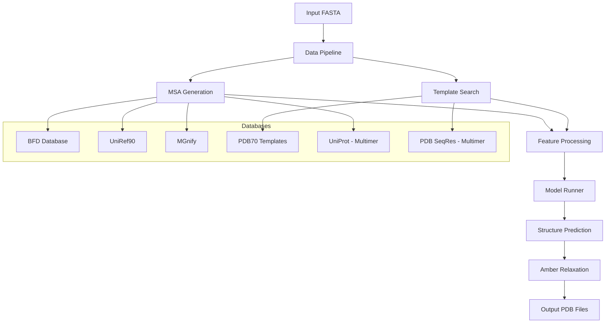
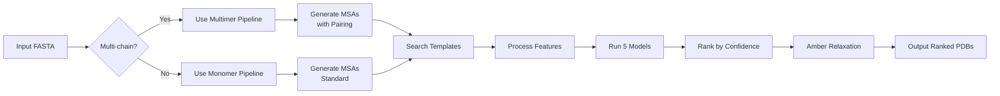
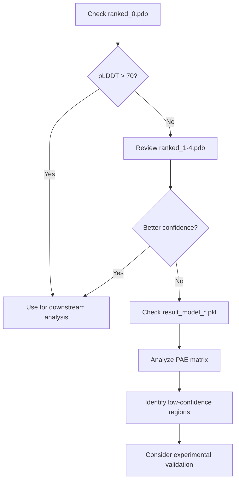

---
slug:2-quick-start
blog_type:normal
---


本快速入门指南提供了运行 AlphaFold-Multimer 进行蛋白质结构预测的简明介绍。无论你是预测单链蛋白质（单体）还是多链蛋白质复合物（多聚体），本指南都将引导你完成必要的设置步骤，并演示如何生成你的第一个预测结果。你将了解项目架构、环境要求、数据库设置以及如何解读输出结果。

## 理解 AlphaFold-Multimer 架构

AlphaFold-Multimer 是 AlphaFold v2.0 推理管道的实现，并扩展了预测蛋白质复合物的功能。该系统使用在蛋白质结构和多序列比对（MSA）上训练的深度学习模型，以显著的精度预测 3D 原子坐标。对于多聚体预测，系统采用了额外的数据库和专门的配对策略来建模蛋白质-蛋白质相互作用 [README.md](/README.md#L1-L20)。

项目遵循模块化架构，其中每个组件处理预测管道的特定阶段：



核心组件的组织结构如下：

- **run_alphafold.py**：协调预测管道的主入口点 [run_alphafold.py](/run_alphafold.py#L15-L446)
- **docker/run_docker.py**：基于 Docker 的执行包装器，用于简化部署 [docker/run_docker.py](/docker/run_docker.py#L15-L257)
- **alphafold/data/**：特征处理和 MSA 生成模块
- **alphafold/model/**：神经网络模型架构和推理逻辑
- **alphafold/relax/**：使用 Amber 弛豫进行结构优化
- **scripts/**：所需遗传数据的数据库下载工具

## 项目结构概述

该存储库遵循清晰的分层结构，旨在分离数据处理、模型推理和后处理之间的关注点：

```
alphafold-multimer/
├── alphafold/                    # 核心 Python 包
│   ├── common/                   # 共享工具（蛋白质解析、置信度）
│   ├── data/                     # 数据管道和特征处理
│   │   ├── pipeline.py          # 单体数据管道
│   │   └── pipeline_multimer.py # 多聚体专用管道
│   ├── model/                    # 神经网络模型
│   │   ├── model.py             # 核心模型运行器
│   │   └── config.py            # 模型配置
│   ├── relax/                    # Amber 弛豫用于结构优化
│   └── notebooks/               # Jupyter notebook 工具
├── docker/                       # Docker 容器化
│   ├── Dockerfile                # 包含依赖项的容器定义
│   ├── run_docker.py             # Docker 执行脚本
│   └── requirements.txt          # Python 依赖项
├── scripts/                      # 数据下载工具
│   ├── download_all_data.sh     # 完整数据库下载
│   └── download_*.sh            # 单个数据库脚本
├── run_alphafold.py              # 主推理脚本
├── run_alphafold.sh              # Shell 包装脚本
└── requirements.txt              # Python 依赖项
```

这种结构既支持基于 Docker 的部署（推荐大多数用户使用），也支持具有自定义环境的高级用户直接执行 Python [README.md](/README.md#L30-L45)。

## 先决条件和环境设置

在运行 AlphaFold-Multimer 之前，请确保你的系统满足以下要求：

| 资源类型 | 最低要求 | 推荐配置 |
|---------------|-------------------|-------------------------|
| **CPU 核心数** | 8 vCPUs (reduced_dbs) | 12+ vCPUs (full_dbs) |
| **内存** | 8 GB (reduced_dbs) | 85 GB+ (full_dbs) |
| **磁盘空间** | 600 GB (reduced_dbs) | 2.2 TB (full_dbs) |
| **GPU** | 显存 16+ GB 的 NVIDIA GPU | NVIDIA A100 或同等配置 |
| **操作系统** | 支持 Docker 的 Linux | Ubuntu 18.04+ |

### Docker 安装（推荐）

Docker 方案提供了一个环境一致且预配置了所有依赖项的环境。请按照以下步骤操作：

1. **安装 Docker 和 NVIDIA Container Toolkit** 以支持 GPU [README.md](/README.md#L26-L40)：
   ```bash
   # 安装 Docker
   sudo apt-get update && sudo apt-get install docker.io
   
   # 安装 NVIDIA Container Toolkit
   distribution=$(. /etc/os-release;echo $ID$VERSION_ID)
   curl -s -L https://nvidia.github.io/nvidia-docker/gpgkey | sudo apt-key add -
   curl -s -L https://nvidia.github.io/nvidia-docker/$distribution/nvidia-docker.list | \
     sudo tee /etc/apt/sources.list.d/nvidia-docker.list
   sudo apt-get update
   sudo apt-get install -y nvidia-container-toolkit
   sudo systemctl restart docker
   ```

2. **验证 Docker 中的 GPU 可用性**：
   ```bash
   docker run --rm --gpus all nvidia/cuda:11.0-base nvidia-smi
   ```
   
   这应该显示你的 GPU 信息。如果失败，请查看 [NVIDIA Container Toolkit 设置](https://docs.nvidia.com/datacenter/cloud-native/container-toolkit/install-guide.html) [README.md](/README.md#L41-L50)。

3. **克隆仓库**：
   ```bash
   git clone https://github.com/jcheongs/alphafold-multimer.git
   cd alphafold-multimer
   ```

4. **构建 Docker 镜像**：
   ```bash
   docker build -f docker/Dockerfile -t alphafold .
   ```
   
   Dockerfile 安装了所有必需的依赖项，包括 HHsuite、OpenMM 和 Python 包 [docker/Dockerfile](/docker/Dockerfile#L1-L89)。

5. **安装 Docker 脚本依赖项**：
   ```bash
   pip3 install -r docker/requirements.txt
   ```

有关详细的安装过程和故障排除，请参阅 [使用 Docker 安装 AlphaFold-Multimer](3-installing-alphafold-multimer-with-docker)。

## 下载遗传数据库和模型参数

AlphaFold 需要大型遗传数据库来进行 MSA 生成和预训练模型参数。下载过程是自动化的，但需要大量的磁盘空间和时间。

<CgxTip>重要提示：下载目录不应该是 AlphaFold 仓库内的子目录。这可以防止在镜像创建期间由于复制大型数据库而导致 Docker 构建缓慢。</CgxTip>

### 自动化数据库下载

`download_all_data.sh` 脚本下载并配置所有必需的数据 [scripts/download_all_data.sh](/scripts/download_all_data.sh#L1-L75)：

```bash
# 设置下载目录（在仓库之外）
DOWNLOAD_DIR=/path/to/your/data/directory

# 下载完整数据库（推荐以获得最佳精度）
bash scripts/download_all_data.sh $DOWNLOAD_DIR

# 或下载缩减数据库以加快运行速度，但精度稍低
bash scripts/download_all_data.sh $DOWNLOAD_DIR reduced_dbs
```

### 数据库结构概述

下载后，你的目录将包含大约 2.2 TB 的数据（full_dbs），其结构如下 [README.md](/README.md#L100-L135)：

| 目录 | 解压后大小 | 下载大小 | 描述 |
|-----------|----------------|---------------|-------------|
| **bfd/** | ~1.7 TB | ~271.6 GB | 用于 MSA 深度的 Big Fantastic Database |
| **mgnify/** | ~64 GB | ~32.9 GB | 宏基因组序列 |
| **pdb70/** | ~56 GB | ~19.5 GB | 用于结构指导的 PDB 模板 |
| **pdb_mmcif/** | ~206 GB | ~46 GB | mmCIF 格式的 PDB 结构 |
| **pdb_seqres/** | ~0.2 GB | ~0.2 GB | PDB 序列残基（仅多聚体） |
| **uniclust30/** | ~86 GB | ~24.9 GB | 用于 MSA 的聚类序列 |
| **uniprot/** | ~98.3 GB | ~49 GB | UniProt 数据库（仅多聚体） |
| **uniref90/** | ~58 GB | ~29.7 GB | 90% 一致性的非冗余序列 |
| **params/** | ~3.5 GB | ~3.5 GB | 模型参数（16 个文件） |
| **small_bfd/** | ~17 GB | ~9.6 GB | 缩减版 BFD（仅 reduced_dbs） |

### 模型参数

下载的参数包括 [README.md](/README.md#L137-L155)：
- **5 个 CASP14 模型**：经过广泛验证，用于结构预测质量
- **5 个 pTM 模型**：经过微调以生成 pTM（预测 TM 分数）和 PAE（预测对齐误差）
- **5 个 AlphaFold-Multimer 模型**：专门用于蛋白质复合物预测

这些参数在 CC BY 4.0 许可下授权，可从 Google Cloud Storage 获取 [README.md](/README.md#L136-L156)。

有关详细的数据库要求和替代下载策略，请参阅 [下载遗传数据库和模型参数](4-downloading-genetic-databases-and-model-parameters)。

## 运行你的第一个预测

环境和数据库准备就绪后，你现在可以运行你的第一个蛋白质结构预测。单体（单链）和多聚体（多链）预测的工作流程略有不同。

### 单体预测（单链蛋白质）

1. **准备你的输入 FASTA 文件**（例如 `monomer.fasta`）：
   ```fasta
   >my_protein
   ACDEFGHIKLMNPQRSTVWY
   ```

2. **使用 Docker 运行预测**：
   ```bash
   python3 docker/run_docker.py \
     --fasta_paths=monomer.fasta \
     --max_template_date=2021-11-01 \
     --model_preset=monomer \
     --db_preset=reduced_dbs \
     --data_dir=$DOWNLOAD_DIR
   ```
   
   该脚本会自动确定数据库路径并将其挂载到容器中 [docker/run_docker.py](/docker/run_docker.py#L112-L257)。

### 多聚体预测（蛋白质复合物）

对于多聚体预测，必须下载额外的数据库（UniProt 和 PDB SeqRes）[README.md](/README.md#L156-L176)。

1. **准备包含多个序列的输入 FASTA 文件**（例如 `heteromer.fasta`）：
   ```fasta
   >chain_A
   ACDEFGHIKLMNPQRSTVWY
   >chain_B
   YWVTSRQPONMLKIHGFEDCA
   ```

2. **运行多聚体预测**：
   ```bash
   python3 docker/run_docker.py \
     --fasta_paths=heteromer.fasta \
     --max_template_date=2021-11-01 \
     --model_preset=multimer \
     --is_prokaryote_list=false \
     --data_dir=$DOWNLOAD_DIR
   ```

### 模型预设和数据库选项

系统通过模型和数据库预设提供了灵活的配置 [run_alphafold.py](/run_alphafold.py#L97-L106)：

| 模型预设 | 描述 | 用例 |
|-------------|-------------|----------|
| **monomer** | 原始 CASP14 模型，无集成 | 标准单体预测 |
| **monomer_casp14** | 具有 8 倍集成的 CASP14 模型 | 再现性测试（慢 8 倍） |
| **monomer_ptm** | 带有 pTM 头的 CASP14 模型 | 每个残基的置信度预测 |
| **multimer** | AlphaFold-Multimer 模型 | 蛋白质复合物预测 |

| 数据库预设 | 要求 | 速度与精度 |
|----------------|-------------|-------------------|
| **reduced_dbs** | 8 CPU，8 GB RAM，600 GB 磁盘 | 更快，精度略低 |
| **full_dbs** | 12+ CPU，85 GB RAM，2.2 TB 磁盘 | 更慢，精度最高 |

### 示例工作流程

**折叠多个单体**：
```bash
python3 docker/run_docker.py \
  --fasta_paths=protein1.fasta,protein2.fasta \
  --max_template_date=2021-11-01 \
  --model_preset=monomer \
  --data_dir=$DOWNLOAD_DIR
```

**折叠原核同源寡聚体**：
```bash
python3 docker/run_docker.py \
  --fasta_paths=homomer.fasta \
  --is_prokaryote_list=true \
  --max_template_date=2021-11-01 \
  --model_preset=multimer \
  --data_dir=$DOWNLOAD_DIR
```

预测工作流程遵循以下顺序：



有关更全面的示例和高级使用模式，请参阅 [运行你的第一个预测](5-running-your-first-prediction)。

## 理解输出结果

AlphaFold 生成综合的输出文件，在输出目录中按目标名称组织 [README.md](/README.md#L410-L440)：

### 输出目录结构

```
<target_name>/
├── features.pkl                    # 输入特征（NumPy 数组）
├── ranked_0.pdb                    # 最高置信度的预测
├── ranked_1.pdb through ranked_4.pdb # 较低置信度的预测
├── ranking_debug.json              # pLDDT 分数和模型映射
├── relaxed_model_1.pdb through 5   # Amber 弛豫后的结构
├── result_model_1.pkl through 5    # 原始模型输出
├── timings.json                    # 管道时序信息
├── unrelaxed_model_1.pdb through 5 # 弛豫前的模型输出
└── msas/                           # MSA 搜索结果
    ├── bfd_uniclust_hits.a3m
    ├── mgnify_hits.sto
    └── uniref90_hits.sto
```

### 关键输出文件说明

| 文件 | 格式 | 内容 | 用途 |
|------|--------|---------|-------|
| **ranked_0.pdb** | PDB | 最佳预测，已进行 Amber 弛豫 | 下游分析的主要结构 |
| **unrelaxed_model_*.pdb** | PDB | 原始模型输出 | 优化前的比较 |
| **features.pkl** | Pickle | 输入特征数组 | 特征检查、调试 |
| **ranking_debug.json** | JSON | pLDDT 分数、模型名称 | 排名分析、质量评估 |
| **result_model_*.pkl** | Pickle | 完整模型输出 | 置信度指标、辅助预测 |

### 置信度指标

AlphaFold 提供多种置信度度量来评估预测质量 [README.md](/README.md#L440-L500)：

- **pLDDT (predicted LDDT)**：每个残基的置信度分数（0-100），存储在 PDB B-factor 字段中。数值越高表示置信度越高。对所有残基取平均值以获得整体目标质量。

- **pTM (predicted TM-score)**：用于域堆积的全局置信度指标（仅限 pTM 模型）。值范围为 0-1，>0.7 表示对整体折叠的高度置信。

- **PAE (Predicted Aligned Error)**：成对误差矩阵，显示残基对相对定位的置信度。用于识别柔性区域或域移动。

<CgxTip>当使用 pLDDT 作为 B-factor 可视化 PDB 文件时，请记住，与传统 B-factors（越低越好）不同，pLDDT 数值越高表示置信度越高。使用与典型 B-factor 可视化相反的色标。</CgxTip>

### 输出分析工作流程



有关置信度指标的详细解释和可视化技术，请参阅 [预测对齐误差 (PAE) 可视化](18-predicted-aligned-error-pae-visualization)。

## 后续步骤

既然你已经完成了第一个预测，可以考虑探索这些高级主题：

- **深入架构**：[AlphaFold-Multimer 架构概述](6-alphafold-multimer-architecture-overview) 解释了模型组件如何协同工作

- **了解多聚体功能**：[多序列比对 (MSA) 配对](9-multiple-sequence-alignment-msa-pairing) 涵盖了蛋白质复合物的专门策略

- **优化性能**：[数据库预设](22-database-presets-reduced_dbs-vs-full_dbs) 帮助你为你的用例选择正确的配置

- **自定义配置**：[模型配置和预设](8-model-configuration-and-presets) 展示了如何修改模型设置

- **API 集成**：[RunModel 类和预测接口](25-runmodel-class-and-prediction-interface) 提供对预测管道的编程访问

对于有兴趣部署到生产环境或高性能计算集群的用户，请参阅 [GPU 配置和资源管理](23-gpu-configuration-and-resource-management)。