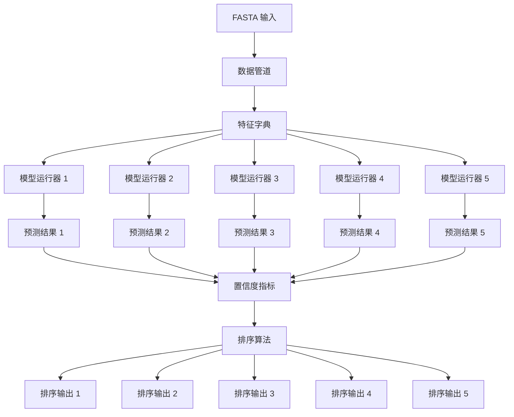
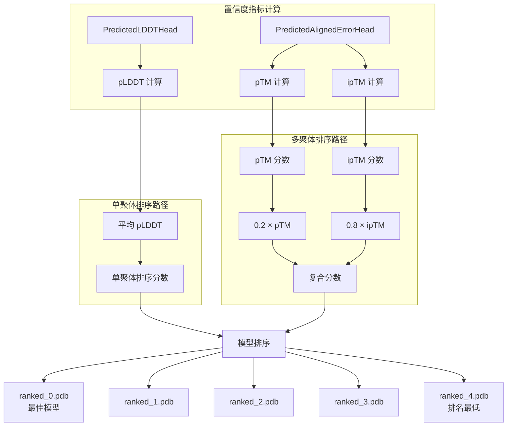

---
slug:20-model-ranking-and-selection
blog_type:normal
---

模型排序和选择是 AlphaFold-Multimer 预测流程中至关重要的最终阶段，在此阶段，系统会基于复杂的置信度指标对多个模型预测进行评估、比较和排序。该过程确保用户从五个训练模型的集成中获得最可靠的结构预测，并且针对单聚体和多聚体复合物优化了不同的排序策略。

## 模型集成架构

AlphaFold-Multimer 采用五模型集成方法，其中每个模型（`model_1` 至 `model_5`）代表一个具有不同超参数配置的独立训练神经网络。这些模型根据配置系统中定义的选定模型预设进行实例化。多聚体预设加载五个专用模型（`model_1_multimer` 至 `model_5_multimer`），而单聚体预设加载相应的单聚体变体，每个变体在模板使用、MSA 处理和嵌入策略方面继承了不同的架构选择 [Sources: alphafold/model/config.py#L39-L48](alphafold/model/config.py#L39-L48)。

集成评估框架在主执行脚本的 `predict_structure` 函数中编排所有五个模型的并行执行。每个模型接收相同的处理特征，但在多聚体模式下运行时应用不同的随机种子以确保 MSA 采样的变异性。系统捕获原始预测输出和计算的置信度指标，用于随后的排序决策 [Sources: run_alphafold.py#L195-L214](run_alphafold.py#L195-L214)。

## 置信度指标计算

排序系统依赖于三个主要的置信度指标，每个指标均由特定的神经网络头部计算，并在模型质量评估中服务于不同目的。

### 每残基 LDDT (pLDDT)

预测的局部距离差异测试（pLDDT）提供 0 到 100 范围内的每残基置信度估计，通过在 0 和 1 之间的 50 个等距区间上的 softmax 分布计算得出。`compute_plddt` 函数对 PredictedLDDTHead 输出的 logits 应用 softmax 归一化，然后通过概率和区间中心乘积的总和计算期望值，最后缩放 100 倍以提高可解释性。该指标代表模型对每个残基位置的局部结构准确性的置信度 [Sources: alphafold/common/confidence.py#L22-L38](alphafold/common/confidence.py#L22-L38)。

<CgxTip>pLDDT 值通常与实际局部结构准确性密切相关：pLDDT > 90 的残基表示非常高的置信度，70-90 表示中等置信度，50-70 需要谨慎，< 50 表示低置信度区域，这些区域可能不可靠。</CgxTip>

### 预测 TM-Score (pTM)

预测的 TM-score 将置信度评估扩展到全局结构质量，通过估算与真实结构比对时获得的模板建模分数。`predicted_tm_score` 函数从距离预测 logits 实现 TM-score 计算，使用 TM-score 公式计算期望值，其中距离归一化参数 d₀ 计算为 1.24 × (N - 15)^(1/3) - 1.8，N 代表残基数量。该指标提供了独立于局部错误的整体折叠正确性的见解 [Sources: alphafold/common/confidence.py#L111-L145](alphafold/common/confidence.py#L111-L145)。

### 预测界面 TM-Score (ipTM)

多聚体模型引入了界面 TM-score (ipTM)，专门评估蛋白质复合物内链间相互作用的准确性。计算利用与 pTM 相同的 TM-score 框架，但使用不对称单元标识符掩码将分析限制来自不同链的残基对。这种特定于界面的重点确保排序优先考虑具有正确链堆积和相互作用界面的模型，这对于多聚体预测质量至关重要 [Sources: alphafold/model/model.py#L48-L53](alphafold/model/model.py#L48-L53)。

## 排序算法策略

系统为单聚体和多聚体预测实施根本不同的排序策略，反映了它们不同的质量评估要求。

### 单聚体模型排序

对于单聚体预测，排序采用一种直接的方法，使用所有残基的平均 pLDDT 作为主要质量指标。`get_confidence_metrics` 函数在计算每残基 pLDDT 值后计算此平均值，提供一个代表整体模型置信度的单一标量。该策略优先考虑在整个序列中具有一致高局部准确性的模型，这与单链蛋白质的整体结构质量相关性良好 [Sources: alphafold/model/model.py#L60-L63](alphafold/model/model.py#L60-L63)。

### 多聚体模型排序

多聚体预测利用更复杂的复合评分机制，平衡界面准确性和整体折叠正确性。排序置信度使用加权公式结合 ipTM 和 pTM：**ranking_confidence = 0.8 × ipTM + 0.2 × pTM**。这种加权方案强调界面质量（80%），同时仍考虑全局折叠准确性（20%），认识到正确的链相互作用通常是多聚体预测中更大的挑战。复合评分提供了一个捕获复合物质量两个方面的稳健指标 [Sources: alphafold/model/model.py#L52-L56](alphafold/model/model.py#L52-L56)。

`predict_structure` 中的实际排序实现按降序对排序置信度值执行简单的排序操作，生成模型名称的排序列表。然后，根据此顺序将每个模型的预测写入输出文件（`ranked_0.pdb` 至 `ranked_4.pdb`），其中排名最高的模型代表系统根据置信度指标得出的最佳预测 [Sources: run_alphafold.py#L258-L272](run_alphafold.py#L258-L272)。

<CgxTip>ranking_debug.json 输出文件保留了所有模型的完整置信度分数，如果自动排序未能为特定用例选择最佳模型，则允许后续分析和手动检查。</CgxTip>

## 输出生成

排序过程生成几个关键的输出文件，使用户能够访问置信度信息并理解模型选择的基本原理。系统写入一个 JSON 文件（`ranking_debug.json`），其中包含多聚体预测的 `iptm+ptm` 分数或单聚体预测的 `plddts`，以及指定模型排序的 `order` 数组。此调试信息促进了选择过程的透明度，并允许用户在需要时手动检查置信度值 [Sources: run_alphafold.py#L274-L282](run_alphafold.py#L274-L282)。

每个模型的预测都保存为未松弛和可选的松弛状态，具体取决于 `run_relax` 标志配置。未松弛的预测代表直接模型输出，而松弛版本经过 Amber 最小化以提高立体化学质量。排序过程根据松弛配置从适当的预测类型中进行选择，确保排序输出反映用户选择的细化管道 [Sources: run_alphafold.py#L236-L256](run_alphafold.py#L236-L256)。

## 与松弛和质量控制的集成

排序系统在更广泛的质量控制框架内运行，该框架包括可选的 Amber 松弛和结构违规检测。虽然主要排序依赖于置信度指标而不是显式的结构违规检查，但 `find_structural_violations` 和 `compute_violation_metrics` 函数提供了对立体化学问题的全面评估，包括键长违规、角度违规、原子冲突和极端的 Cα-Cα 距离 [Sources: alphafold/model/folding_multimer.py#L888-L986](alphafold/model/folding_multimer.py#L888-L986)，[Sources: alphafold/model/folding_multimer.py#L979-L1009](alphafold/model/folding_multimer.py#L979-L1009)。

松弛过程（如果启用）在最终排序之前应用能量最小化来解决轻微的结构缺陷。此后处理步骤可以提高整体模型质量，并可能影响哪个模型获得最高排名，特别是当置信度指标的差异微乎其微时。系统为松弛和未松弛状态维护单独的预测字典，确保排序输出始终反映用户的质量偏好 [Sources: run_alphafold.py#L244-L256](run_alphafold.py#L244-L256)。

## 模型配置和预设选择

`MODEL_PRESETS` 字典定义了可用的模型配置，每个预设指定要评估的模型集。多聚体预设加载五个专用模型，而单聚体和 monomer_ptm 预设加载相应的单链变体。`model_config` 函数检索适当的配置字典，应用 `CONFIG_DIFFS` 中定义的任何模型特定参数差异 [Sources: alphafold/model/config.py#L26-L63](alphafold/model/config.py#L26-L63)。

在初始化期间，每个模型从模型参数目录接收其配置和预训练参数。`RunModel` 类包装 Haiku 神经网络，提供特征处理、预测执行和置信度指标计算的方法。这种抽象使得在统一的排序框架内能够一致地处理不同的模型类型 [Sources: run_alphafold.py#L368-L375](run_alphafold.py#L368-L375)。

| **模型预设** | **评估的模型** | **主要排序指标** | **附加指标** |
|------------------|----------------------|----------------------------|------------------------|
| monomer | model_1-5 | 平均 pLDDT | - |
| monomer_ptm | model_1_ptm 至 model_5_ptm | 平均 pLDDT | pTM, PAE |
| multimer | model_1_multimer 至 model_5_multimer | 0.8 × ipTM + 0.2 × pTM | pLDDT, PAE |
| monomer_casp14 | model_1-5 | 平均 pLDDT | - |

模型排序和选择系统提供了一种稳健的自动化机制，用于从 AlphaFold-Multimer 的集成架构中识别最高质量的预测。通过利用互补的置信度指标并针对特定预测模式定制排序策略，系统通过全面的输出生成提供可靠的结构预测和透明度。用户应检查 ranking_debug.json 文件以了解置信度分布，并考虑在顶部预测表现出模糊区域或意外特征时检查排名较低的模型。

## 后续步骤

- **每残基置信度**：深入了解不同蛋白质区域的每残基置信度分析和 pLDDT 分数的解释
- **预测 TM-Score (pTM)**：了解用于全局折叠评估的 TM-score 的数学基础和实际应用
- **预测对齐误差 (PAE) 可视化**：学习如何解释和可视化 PAE 矩阵以进行域级置信度评估