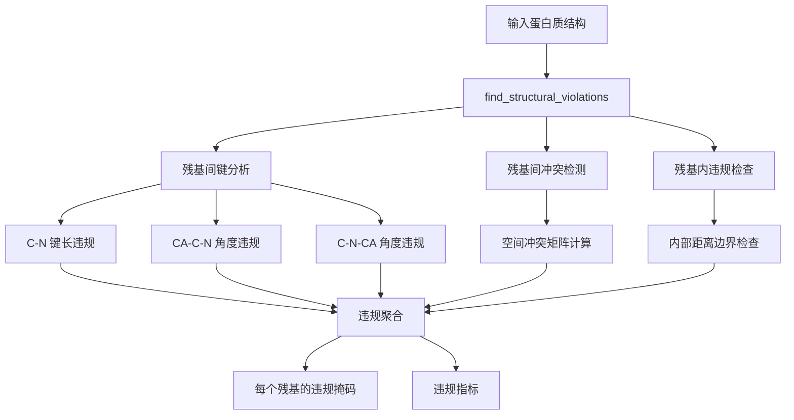

---
slug:21-structural-violation-detection
blog_type:normal
---

AlphaFold-Multimer 中的结构违规检测作为一种关键的质量控制机制，用于识别并量化预测蛋白质结构中的空间位阻和几何异常。该系统在多个尺度上运行——从单个键几何到残基间冲突——既为模型评估提供诊断信息，也为 Amber 弛豫过程中的迭代结构优化提供指导。

## 检测架构

违规检测系统通过分层分析管道运行，该管道检查三个不同类别的结构特征：残基间连接性、残基间空间位阻冲突以及残基内几何完整性。核心协调发生在折叠模块中的 `find_structural_violations()` 函数中，该函数协调多个专用检测函数并将其结果聚合为统一的违规配置文件。
来源：[folding.py](alphafold/model/folding.py#L734-L819)

## 残基间违规

残基间违规专注于连接连续氨基酸的肽键，检查键长和键角偏离已知统计分布的情况。`between_residue_bond_loss()` 函数使用平底损失函数执行此分析，该函数仅惩罚超过可配置容差阈值的违规。
来源：[all_atom.py](alphafold/model/all_atom.py#L609-L741)

键长违规专门针对 C-N 肽键，该键具有不同的几何参数，具体取决于接受残基是脯氨酸还是其他氨基酸。系统计算观测到的键长与预期键长之间的误差，然后应用带有软容差阈值的 ReLU 激活。当误差超过硬容差阈值时，会生成违规掩码。
来源：[all_atom.py](alphafold/model/all_atom.py#L662-L683)

键角违规检查肽键周围的几何约束，特别是以羰基碳为中心的 CA-C-N 角和以酰胺氮为中心的 C-N-CA 角。这些角度使用从相关原子位置导出的单位向量进行计算，并与从结构数据库导出的参考值进行比较。与键长违规类似，角度违规使用软容差进行损失计算，使用硬容差进行违规检测。
来源：[all_atom.py](alphafold/model/all_atom.py#L685-L717)

<CgxTip>
违规检测中软阈值和硬阈值的 12.0 标准差容差因子代表了模型对结构灵活性的允许范围。这种宽松的容差反映了预测结构可能需要在弛豫期间进行大幅重排，并且检测系统旨在识别仅需要纠正的最严重违规。
来源：[folding.py](alphafold/model/folding.py#L342-L345)
</CgxTip>

## 空间冲突检测

空间冲突代表非键合原子占据重叠空间的物理不可能性。检测系统采用基于范德华半径的分析来识别两个级别的冲突：不同残基之间和单个残基内部。这两种方法都使用重叠容差参数，允许在标记违规之前有轻微的相互渗透。
来源：[all_atom.py](alphafold/model/all_atom.py#L744-L850)

残基间冲突检测通过构建一个全面的距离矩阵来运行，该矩阵比较不同残基之间的所有原子。该函数首先计算所有原子对之间的成对距离，然后应用多个掩码操作以排除化学上有效的相互作用。这些排除包括距离矩阵中的重复对、同一残基内的原子（单独处理），特别是连续残基之间的主链 C-N 键以及半胱氨酸残基之间的二硫键。
来源：[all_atom.py](alphafold/model/all_atom.py#L781-L814)

冲突检测逻辑计算最小允许距离作为每个原子对的范德华半径之和。当实际距离低于此阈值减去重叠容差时，就会记录冲突。系统产生连续的损失值用于优化，以及指示哪些原子参与冲突的二进制掩码。
来源：[all_atom.py](alphafold/model/all_atom.py#L816-L850)

残基内违规检查每个氨基酸的内部几何结构，确保原子之间保持适当的距离。此函数使用针对每种残基类型预计算的距离边界，这些边界定义了残基内所有原子对之间允许的最小和最大距离。这些边界考虑了每种氨基酸的化学结构以及可旋转键允许的灵活性。
来源：[all_atom.py](alphafold/model/all_atom.py#L853-L926)

## 极端 CA-CA 距离违规

极端 CA-CA 距离违规通过检查连续残基之间的主链几何结构，提供全局连接性检查。系统测量相邻残基的α碳原子之间的距离，并标记超出预期 CA-CA 距离（约 3.8 Å）1.5 Å 的偏差。该指标作为严重结构碎片化或链断裂的早期预警系统，可能表明建模错误。
来源：[all_atom.py](alphafold/model/all_atom.py#L575-L606)

检测通过仅检查没有索引不连续性的连续残基来考虑序列间隙的可能性。该函数返回表现出违规的连续 CA-CA 对的分数，提供归一化指标，可以在不同长度的蛋白质之间进行比较。
来源：[all_atom.py](alphafold/model/all_atom.py#L599-L606)

## 违规聚合和指标

系统将所有违规类型聚合为一个全面的每个残基的违规掩码，该掩码指示任何结构异常是否影响每个氨基酸。这种聚合对三个主要违规类别使用逻辑或运算，确保任何表现出键违规、空间冲突或内部违规的残基都被标记以供注意。
来源：[folding.py](alphafold/model/folding.py#L786-L790)

`compute_violation_metrics()` 函数生成一套定量指标，用于总结整体结构质量。这些指标包括每个类别的平均违规率、表现出极端 CA-CA 距离违规的残基分数以及整体每个残基的违规率。这些指标支持自动模型排名并为手动检查提供诊断信息。
来源：[folding.py](alphafold/model/folding.py#L822-L851)

<CgxTip>
违规检测系统对 atom14 表示而不是 atom37 格式进行操作，每个残基仅使用 14 个最大重原子。这种选择反映了计算效率方面的考虑，同时保持检测准确性，因为 atom14 表示覆盖了标准氨基酸中存在的所有原子，而无需 atom37 格式中所需的稀疏填充。
来源：[amber_minimize.py](alphafold/relax/amber_minimize.py#L330-L337)
</CgxTip>

## 与 Amber 弛豫的集成

结构违规检测通过违规通知迭代弛豫机制在 Amber 弛豫管道中发挥核心作用。`AmberRelaxation` 类接受一个 `max_outer_iterations` 参数，该参数控制将执行多少次弛豫迭代，每次迭代后进行违规检测以确定是否需要进一步优化。
来源：[relax.py](alphafold/relax/relax.py#L43-L47)

当未检测到违规时，弛豫管道提前终止，从而能够高效处理格式良好的预测。对于需要多次迭代的有问题的结构，系统可以执行多达 20 次外部迭代，经验测试表明这解决了超过 95% 的存在结构违规的情况。这种迭代方法代表了相对于 CASP14 中使用的单次通过程序的改进。
来源：[relax.py](alphafold/relax/relax.py#L43-L47)

`run_pipeline()` 函数通过重复调用弛豫函数和违规检测来协调此过程，直到达到收敛或达到最大迭代次数。此过程返回的违规掩码暴露给调用代码，使得能够基于弛豫预测的结构完整性进行下游质量评估和模型排名。
来源：[amber_minimize.py](alphafold/relax/amber_minimize.py#L425-L504)

## 违规输出结构

违规检测系统返回一个结构化字典，其中包含多个粒度级别的详细信息。顶层结构将残基间违规与残基内违规分开，每个违规包含键长、角度和冲突的特定指标。
来源：[folding.py](alphafold/model/folding.py#L792-L819)

残基间部分包括每种几何类型的平均损失值，提供偏差幅度的连续度量。它还包括量化每个原子总违规贡献的每个原子损失总和，以及指示哪些残基表现出违规的二进制掩码。残基内部分为内部几何结构提供类似信息。`total_per_residue_violations_mask` 将这些组合为一个布尔数组，指示所有类别中有问题的残基。
来源：[folding.py](alphafold/model/folding.py#L792-L819)

这种详细的输出支持对结构问题进行细粒度分析，既支持自动质量过滤，也支持对特定结构特征的手动调查。将这些信息与其他质量指标（如 pLDDT 和 pTM 分数）相结合，可对预测可靠性进行全面评估。
来源：[relax.py](alphafold/relax/relax.py#L70-L84)

## 配置参数

违规检测系统的行为通过模型配置中定义的几个关键配置参数进行控制。`violation_tolerance_factor` 参数默认设置为 12.0，指定偏离预期值多少个标准差构成违规。`clash_overlap_tolerance` 参数设置为 1.5 Å，定义了在标记冲突之前允许的范德华半径渗透量。
来源：[folding.py](alphafold/model/folding.py#L342-L345)

这些参数代表了对结构问题的敏感性与对蛋白质结构自然灵活性的容差之间的平衡。可以针对特定应用调整容差值，更严格的容差会提高检测灵敏度，但代价是标记最终结构中可能可接受的微小偏差。
来源：[all_atom.py](alphafold/model/all_atom.py#L609-L616)

## 弛豫前结构清理

在将违规检测应用于预测结构之前，系统执行全面清理以解决可能混淆分析的常见问题。`fix_pdb()` 函数应用 pdbfixer 来替换非标准残基，去除包括水分子在内的异质原子，添加缺失的残基和原子，并假设 pH 值为 7.0 来添加氢。这种清理确保呈现给违规检测系统的结构代表化学上合理的蛋白质。
来源：[cleanup.py](alphafold/relax/cleanup.py#L27-L60)

`clean_structure()` 函数处理额外的边缘情况，该函数删除缺乏力场应用所需上下文的单残基链，并用硫替换甲硫氨酸残基中的硒原子。这些特定修复解决了标准清理过程可能不足以产生有效分析结构的情况。
来源：[cleanup.py](alphafold/relax/cleanup.py#L63-L127)

## 下一步

了解结构违规检测有助于深入理解 AlphaFold-Multimer 如何确保其预测的物理合理性。要全面了解利用这些违规的弛豫过程，请继续阅读 [Amber Relaxation for Structure Refinement](19-amber-relaxation-for-structure-refinement)。要探索如何将结构质量指标与其他置信度度量相结合以进行模型选择，请参阅 [Model Ranking and Selection](20-model-ranking-and-selection)。