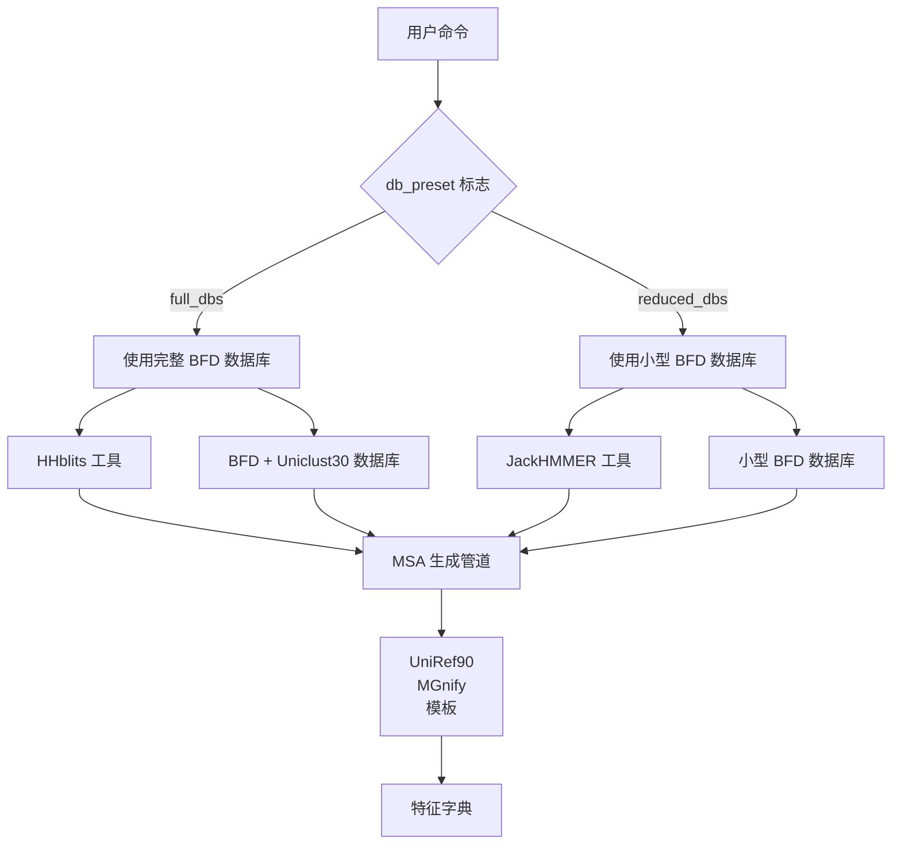
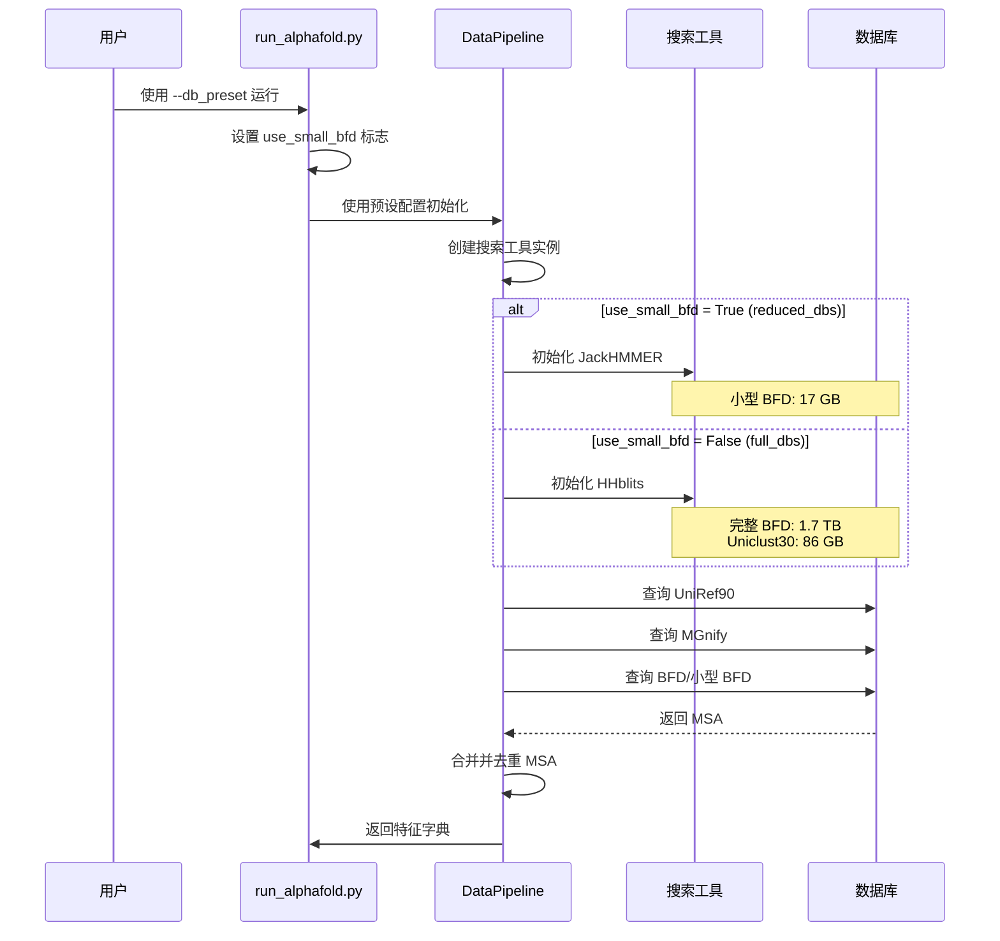

---
slug:22-database-presets-reduced_dbs-vs-full_dbs
blog_type:normal
---


AlphaFold-Multimer 提供了两种可配置的数据库预设，使你能够在预测质量和计算需求之间进行权衡。这些预设控制在多序列比对（MSA）生成阶段使用哪些遗传数据库——这是一个显著影响模型准确性和资源消耗的关键步骤。了解这些预设之间的差异，允许你根据可用硬件、时间限制和准确性要求来优化预测流程。


## 预设架构概述

数据库预设系统通过灵活的配置框架实现，该框架根据单个命令行标志选择适当的数据库搜索工具和数据集。核心架构围绕 `--db_preset` 标志展开，该标志接受 `full_dbs`（默认）或 `reduced_dbs`。该标志通过优化的决策树控制数据管道初始化、数据库选择逻辑和搜索工具配置，以最大化准确性或效率。



预设选择发生在 [run_alphafold.py](run_alphafold.py#L291-L293) 的主执行流程中，其中根据标志值设置 `use_small_bfd` 布尔值。该布尔值随后在系统中级联，触发相应的数据库路径验证检查，并确定在 `DataPipeline` 类中实例化哪些搜索工具。该架构通过全面的验证系统确保尽早检测到不兼容的配置，该系统会根据所选预设检查所需的数据库路径 [run_alphafold.py](run_alphafold.py#L294-L299)。

来源：[run_alphafold.py](run_alphafold.py#L97-L101), [alphafold/data/pipeline.py](alphafold/data/pipeline.py#L116-L154)

## 数据库配置比较

这两种预设之间的根本区别在于用于 MSA 构建的遗传数据库的范围和规模。`full_dbs` 预设复现了 CASP14 期间使用的配置，利用完整的 BFD (Big Fantastic Database) 以及通过 HHblits 搜索工具使用的 Uniclust30。相比之下，`reduced_dbs` 预设使用 BFD 中一个名为 "small_bfd" 的极小子集，并完全省略 Uniclust30，改用 JackHMMER 进行数据库搜索。

<CgxTip>数据库的选择从根本上影响 MSA 深度——full_dbs 通常生成包含数千到数万条序列的 MSA，而 reduced_dbs 通常生成数百到几千条序列的 MSA。这种 MSA 深度与预测准确性直接相关，特别是对于进化信息稀少的困难靶点。</CgxTip>

| **组件** | **full_dbs** | **reduced_dbs** | **搜索工具** |
|---------------|--------------|-----------------|-----------------|
| **主要 MSA 数据库** | BFD (1.7 TB) | Small BFD (17 GB) | HHblits / JackHMMER |
| **次要 MSA 数据库** | Uniclust30 (86 GB) | 未使用 | HHblits |
| **UniRef90 数据库** | ✓ 必需 | ✓ 必需 | JackHMMER |
| **MGnify 数据库** | ✓ 必需 | ✓ 必需 | JackHMMER |
| **总存储空间** | ~2.2 TB | ~600 GB | — |
| **下载大小** | ~438 GB | ~76 GB | — |
| **CPU 要求** | 建议使用 8+ 核心 | 最低 8 核心 | — |
| **RAM 要求** | 建议使用 16+ GB | 最低 8 GB | — |

来源：[README.md](README.md#L61-L137), [scripts/download_all_data.sh](scripts/download_all_data.sh#L1-L75)

## 数据管道实现

[alphafold/data/pipeline.py](alphafold/data/pipeline.py#L116-L154) 中的 `DataPipeline` 类通过其初始化和处理方法体现了依赖于预设的逻辑。当使用 `use_small_bfd=True` 实例化时，管道会创建一个配置为 small_bfd 数据库的 JackHMMER 运行器；否则，它会创建一个查询完整 BFD 和 Uniclust30 数据库的 HHblits 运行器。这一设计决策反映了每种搜索工具的计算特性：HHblits 针对大型数据库上的 profile HMM 搜索进行了优化，而 JackHMMER 在较小的数据集上提供高效的基于序列的搜索。

无论选择何种预设，处理管道都遵循确定的序列：首先查询 UniRef90（始终使用），然后是 MGnify，接着是依赖于预设的 BFD/small_bfd 数据库，最后搜索结构模板。来自所有遗传数据库的 MSA 结果会被合并和去重，以创建最终的特征字典 [alphafold/data/pipeline.py](alphafold/data/pipeline.py#L155-L249)。主要的区别出现在搜索策略和产生的 MSA 深度上，full_dbs 利用强大的 HHblits 算法在全面的数据库上进行搜索，而 reduced_dbs 使用 JackHMMER 在更紧凑的数据集上进行搜索。



来源：[alphafold/data/pipeline.py](alphafold/data/pipeline.py#L133-L154), [run_alphafold.py](run_alphafold.py#L322-L331)

## 下载和设置工作流程

数据库下载过程通过 [scripts/download_all_data.sh](scripts/download_all_data.sh#L1-L75) 脚本自动完成，该脚本接受下载目录和一个可选的模式参数（默认为 `full_dbs`）。根据此模式，脚本有条件地执行针对 reduced_dbs 的 [download_small_bfd.sh](scripts/download_small_bfd.sh#L1-L42) 或针对 full_dbs 的 [download_bfd.sh](scripts/download_bfd.sh#L1-L44)，以及仅在 full_dbs 模式下执行的 [download_uniclust30.sh](scripts/download_uniclust30.sh#L1-L44)。这种简化的方法确保用户仅下载他们实际需要的数据库，从而节省大量时间和存储空间。

下载脚本使用 `aria2c` 进行多线程下载，大幅减少大文件的下载时间。对于 full_dbs 模式，脚本下载大约 438 GB 的压缩数据，解压后扩展为 2.2 TB。对于 reduced_dbs 模式，下载大小缩减至大约 76 GB，解压后为 600 GB。两种模式始终都会下载 UniRef90、MGnify 和 PDB 数据库，这些是所有预测工作流程所必需的。

<CgxTip>在预设之间切换时，你无需重新下载公共数据库。如果你已经下载了 full_dbs 并想尝试 reduced_dbs，只需下载 small_bfd 数据库——共享数据库（UniRef90、MGnify、PDB）在预设之间是相同的。</CgxTip>

来源：[scripts/download_all_data.sh](scripts/download_all_data.sh#L12-L75), [scripts/download_small_bfd.sh](scripts/download_small_bfd.sh#L27-L42), [scripts/download_bfd.sh](scripts/download_bfd.sh#L27-L44)

## 性能与准确性权衡

在数据库预设之间进行选择代表了预测质量与资源效率之间的根本权衡。`full_dbs` 配置通常能够实现更高的准确性，特别是对于进化信号微弱或远同源序列稀少的困难靶点。完整 BFD 和 Uniclust30 提供的全面 MSA 覆盖使模型能够捕获微妙的进化约束，这些约束有助于结构预测，通常会带来更高的 pLDDT 分数和更可靠的置信度指标。

相反，`reduced_dbs` 配置在保持许多靶点合理准确性的同时，大幅减少了存储需求（600 GB 对比 2.2 TB）和计算开销。小型 BFD 数据库仅包含完整 BFD 中的非共识序列，提供了一种压缩但仍然具有信息量的进化信号。该预设对于快速原型设计、筛选大量候选者或在完整数据库占用空间不切实际的资源受限环境中操作特别有价值。

| **指标** | **full_dbs** | **reduced_dbs** | **影响** |
|------------|--------------|-----------------|------------|
| **存储占用** | 2.2 TB | 600 GB | 使用 reduced_dbs 减少 73% |
| **下载时间** | ~438 GB | ~76 GB | 使用 reduced_dbs 下载速度快 83% |
| **MSA 生成时间** | 可变（通常 1-3 小时） | 可变（通常 15-45 分钟） | 使用 reduced_dbs 快 2-4 倍 |
| **典型 MSA 大小** | 10,000+ 条序列 | 500-3,000 条序列 | 取决于靶点 |
| **平均 pLDDT 影响** | 基线 | -2 到 -5 分 | 取决于靶点 |
| **硬件要求** | 建议使用 16+ GB RAM, 12+ CPU 核心 | 8 GB RAM, 8 CPU 核心足够 | Reduced_dbs 适用于普通硬件 |

来源：[README.md](README.md#L261-L274), [run_alphafold.py](run_alphafold.py#L74-L101)

## 标志验证与配置

系统实施了健壮的验证，以确保为所选预设正确配置数据库路径。[run_alphafold.py](run_alphafold.py#L143-L151) 中的辅助函数 `_check_flag` 会根据 `db_preset` 值验证是否设置了适当的数据库路径标志。对于 `reduced_dbs`，系统需要 `small_bfd_database_path`，同时明确检查 `bfd_database_path` 和 `uniclust30_database_path` 是否未设置。相反，对于 `full_dbs`，系统需要 `bfd_database_path` 和 `uniclust30_database_path`，同时检查 `small_bfd_database_path` 是否未设置。

这种验证防止了可能指定不兼容数据库路径的配置错误，例如在仅有完整 BFD 数据库可用的情况下尝试使用 reduced_dbs 预设。验证发生在执行流程的早期，在任何资源密集型操作开始之前，并提供清晰的错误消息以指导用户进行正确的配置。

来源：[run_alphafold.py](run_alphafold.py#L143-L151), [run_alphafold.py](run_alphafold.py#L433-L443)

## 使用示例

两种数据库预设都可以与任何模型预设（monomer、monomer_ptm、multimer）一起使用。该选择与模型架构无关，应主要基于可用资源和准确性要求。以下演示预设选择的实际示例：

```bash
# 使用单体模型配合精简数据库以加快预测速度
python3 docker/run_docker.py \
  --fasta_paths=target.fasta \
  --max_template_date=2021-11-01 \
  --model_preset=monomer \
  --db_preset=reduced_dbs \
  --data_dir=$DOWNLOAD_DIR

# 使用多聚体模型配合完整数据库以获得最高准确性
python3 docker/run_docker.py \
  --fasta_paths=multimer.fasta \
  --is_prokaryote_list=true \
  --max_template_date=2021-11-01 \
  --model_preset=multimer \
  --db_preset=full_dbs \
  --data_dir=$DOWNLOAD_DIR
```

数据库预设的选择也会间接影响模板搜索配置。对于带有 `full_dbs` 的单体模型，系统使用 HHsearch 搜索 PDB70 数据库。对于多聚体模型，无论数据库预设如何，系统都会切换到针对 PDB seqres 数据库的 hmmsearch，该数据库专门针对复杂的模板识别进行了优化。这种分离确保了针对特定预测任务优化模板搜索。

来源：[README.md](README.md#L261-L274), [run_alphafold.py](run_alphafold.py#L309-L321)

## 后续步骤

了解数据库预设只是优化 AlphaFold-Multimer 性能的一个方面。为了获得最佳结果，建议探索以下相关主题：

- **[GPU 配置与资源管理](23-gpu-configuration-and-resource-management)** - 了解如何最大化 GPU 利用率并配置多 GPU 设置
- **[基准测试与性能分析](24-benchmarking-and-profiling)** - 系统性地测量和比较不同预设配置之间的性能
- **[模型排名与选择](20-model-ranking-and-selection)** - 了解如何从多次模型运行中选择最佳预测

数据库预设与模型性能之间的相互作用是复杂的，并且取决于靶点。对于准确性至上的生产级预测，请从 `full_dbs` 开始，仅在资源限制必要时才尝试 `reduced_dbs`。对于探索性工作或大规模筛选，`reduced_dbs` 在速度和预测能力之间提供了实用的平衡。