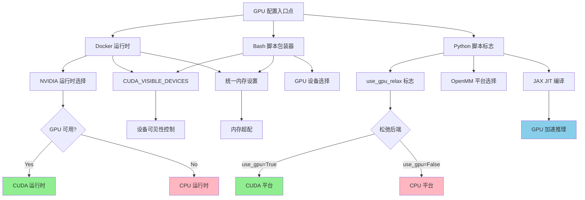

---
slug:23-gpu-configuration-and-resource-management
blog_type:normal
---


本页面说明了 AlphaFold-Multimer 如何管理 GPU 资源，并提供了针对不同硬件环境优化性能的配置选项。合理的 GPU 配置对于获得合理的预测时间至关重要，特别是在处理大型蛋白质复合物或运行多个预测任务时。

## GPU 资源架构

AlphaFold-Multimer 在预测流程的多个阶段利用 GPU 加速：基于 JAX 的神经网络推理和用于结构优化的可选 Amber 松弛步骤。该系统为单 GPU 和多 GPU 设置提供了灵活的配置选项，并具备自动内存管理功能，可处理超出可用 GPU 内存容量的蛋白质。



该架构展示了三个不同的配置层：用于容器化部署的 Docker 运行时管理、用于原生安装的 bash 脚本包装器，以及用于精细控制的 Python 级标志。每一层最终都会影响 CUDA 设备可见性、内存管理策略或特定计算阶段的执行后端。

来源：[docker/run_docker.py](docker/run_docker.py#L29-L41), [run_alphafold.sh](run_alphafold.sh#L28-L73), [run_alphafold.py](run_alphafold.py#L128-L133)

## GPU 设备配置

### Docker 部署

通过 Docker 运行 AlphaFold-Multimer 时，GPU 访问权限通过 NVIDIA 运行时和环境变量进行控制。Docker 包装器脚本在容器启动级别配置 GPU 可见性：

```python
command_args.extend([
    f'--output_dir={output_target_path}',
    f'--max_template_date={FLAGS.max_template_date}',
    f'--db_preset={FLAGS.db_preset}',
    f'--model_preset={FLAGS.model_preset}',
    f'--benchmark={FLAGS.benchmark}',
    f'--use_precomputed_msas={FLAGS.use_precomputed_msas}',
    f'--run_relax={FLAGS.run_relax}',
    f'--use_gpu_relax={use_gpu_relax}',
    '--logtostderr',
])

client = docker.from_env()
container = client.containers.run(
    image=FLAGS.docker_image_name,
    command=command_args,
    runtime='nvidia' if FLAGS.use_gpu else None,
    remove=True,
    detach=True,
    mounts=mounts,
    user=FLAGS.docker_user,
    environment={
        'NVIDIA_VISIBLE_DEVICES': FLAGS.gpu_devices,
        'TF_FORCE_UNIFIED_MEMORY': '1',
        'XLA_PYTHON_CLIENT_MEM_FRACTION': '4.0',
    })
```

`runtime='nvidia'` 指令启用了 GPU 直通至容器，而 `NVIDIA_VISIBLE_DEVICES` 控制进程可见的特定 GPU。默认值 `'all'` 使所有可用的 GPU 均可被访问。

来源：[docker/run_docker.py](docker/run_docker.py#L225-L240)

### 原生安装

对于非 Docker 安装，bash 脚本包装器通过环境变量提供类似的 GPU 配置：

```bash
# 导出环境变量并设置要使用的 CUDA 设备
# CUDA GPU 控制
export CUDA_VISIBLE_DEVICES=-1
if [[ "$use_gpu" == true ]] ; then
    export CUDA_VISIBLE_DEVICES=0
    
    if [[ "$gpu_devices" ]] ; then
        export CUDA_VISIBLE_DEVICES=$gpu_devices
    fi
fi
```

该脚本默认将 `CUDA_VISIBLE_DEVICES` 设置为 `-1`（不使用 GPU），如果启用 GPU，则将其覆盖为设备 `0`；如果指定了自定义设备列表，则使用该列表。这允许对多 GPU 系统的 GPU 选择进行精细控制。

来源：[run_alphafold.sh](run_alphafold.sh#L131-L140)

### GPU 设备选择标志

| 标志 | 类型 | 默认值 | 描述 | 示例用法 |
|------|------|---------|-------------|---------------|
| `use_gpu` | boolean | `True` (Docker), `true` (bash) | 启用 GPU 运行时进行执行 | `--use_gpu=False` |
| `gpu_devices` | string | `'all'` (Docker), `'0'` (bash) | 逗号分隔的 GPU 设备 ID 列表 | `--gpu_devices=0,1,3` |
| `use_gpu_relax` | boolean | `None` (必填标志) | 是否在 GPU 上运行 Amber 松弛 | `--use_gpu_relax=True` |

来源：[docker/run_docker.py](docker/run_docker.py#L29-L41), [run_alphafold.sh](run_alphafold.sh#L14-L23), [run_alphafold.py](run_alphafold.py#L128-L133)

## 内存管理配置

AlphaFold-Multimer 采用先进的内存管理技术来处理通常超出 GPU 内存容量的蛋白质预测。该系统使用统一内存分配，允许根据需要在 CPU 和 GPU 内存之间透明地移动数据。

### 统一内存设置

Docker 和原生部署都配置了两个关键的环境变量：

```bash
# TensorFlow 控制
export TF_FORCE_UNIFIED_MEMORY='1'

# JAX 控制
export XLA_PYTHON_CLIENT_MEM_FRACTION='4.0'
```

这些设置启用了内存超配：

- **TF_FORCE_UNIFIED_MEMORY='1'**：启用 TensorFlow 的统一内存分配器，允许系统根据需要自动在 GPU 和 CPU 内存之间交换数据。这对于预测大型蛋白质复合物或 GPU 内存有限时至关重要。

- **XLA_PYTHON_CLIENT_MEM_FRACTION='4.0'**：指示 JAX 的 XLA 编译器请求高达可用 GPU 内存 400% 的空间。虽然这看似违反直觉，但实际上它使 JAX 的内存分配器能够在 GPU 内存耗尽时使用 CPU 内存作为后备存储，从而实现对任意大小蛋白质的预测。

<CgxTip>
统一内存和超配的结合使 AlphaFold-Multimer 能够预测远大于 GPU 物理内存容量的蛋白质。然而，这会带来性能代价，因为 CPU 和 GPU 之间的数据传输会引入延迟。对于能够装入 GPU 内存的蛋白质，为了获得最佳性能，建议监控内存使用情况并考虑禁用超配。
</CgxTip>

来源：[docker/run_docker.py](docker/run_docker.py#L234-L239), [run_alphafold.sh](run_alphafold.sh#L147-L151)

## Amber 松弛 GPU 配置

Amber 松弛阶段用于优化预测结构以解决立体化学冲突，可以在 CPU 或 GPU 上运行。此配置独立于主模型推理的 GPU 使用进行控制。

### OpenMM 平台选择

松弛实现使用 OpenMM，这是一个支持多种计算后端的分子模拟工具包。平台选择根据 `use_gpu` 参数动态进行：

```python
def _openmm_minimize(
    pdb_str: str,
    max_iterations: int,
    tolerance: unit.Unit,
    stiffness: unit.Unit,
    restraint_set: str,
    exclude_residues: Sequence[int],
    use_gpu: bool):
  """通过 openmm 最小化能量。"""

  pdb_file = io.StringIO(pdb_str)
  pdb = openmm_app.PDBFile(pdb_file)

  force_field = openmm_app.ForceField("amber99sb.xml")
  constraints = openmm_app.HBonds
  system = force_field.createSystem(
      pdb.topology, constraints=constraints)
  if stiffness > 0 * ENERGY / (LENGTH**2):
    _add_restraints(system, pdb, stiffness, restraint_set, exclude_residues)

  integrator = openmm.LangevinIntegrator(0, 0.01, 0.0)
  platform = openmm.Platform.getPlatformByName("CUDA" if use_gpu else "CPU")
  simulation = openmm_app.Simulation(
      pdb.topology, system, integrator, platform)
```

平台通过 `openmm.Platform.getPlatformByName("CUDA" if use_gpu else "CPU")` 进行选择，如果启用 GPU 加速则选择 CUDA 平台，如果 GPU 不可用或被明确禁用，则回退到 CPU。

来源：[alphafold/relax/amber_minimize.py](alphafold/relax/amber_minimize.py#L73-L96)

### 松弛性能特征

| 配置 | 典型加速比 | 内存需求 | 用例 |
|--------------|-----------------|-------------------|----------|
| CPU 松弛 | 基准 (1x) | 低 RAM (~2-4GB) | 小型蛋白质，无可用 GPU |
| GPU 松弛 | 快 5-20 倍 | 中等 GPU 显存 (~1-2GB) | 大型蛋白质，批量预测，对时间敏感的工作流 |

<CgxTip>
GPU 松弛提供了显著的性能改进，但需要兼容 CUDA 的硬件。对于处理大量预测的生产环境，请在可用时启用 GPU 松弛。如果遇到 OpenMM CUDA 初始化错误，请尝试暂时回退到 CPU 松弛，以诊断问题是特定于松弛阶段还是影响整个流程。
</CgxTip>

来源：[alphafold/relax/amber_minimize.py](alphafold/relax/amber_minimize.py#L425-L505)

## JAX 模型推理加速

AlphaFold-Multimer 的核心神经网络使用 JAX 进行 GPU 加速推理。RunModel 类封装了 JAX 计算并利用即时编译：

```python
class RunModel:
  """JAX 模型的容器。"""

  def __init__(self,
               config: ml_collections.ConfigDict,
               params: Optional[Mapping[str, Mapping[str, np.ndarray]]] = None):
    self.config = config
    self.params = params
    self.multimer_mode = config.model.global_config.multimer_mode

    if self.multimer_mode:
      def _forward_fn(batch):
        model = modules_multimer.AlphaFold(self.config.model)
        return model(
            batch,
            is_training=False)
    else:
      def _forward_fn(batch):
        model = modules.AlphaFold(self.config.model)
        return model(
            batch,
            is_training=False,
            compute_loss=False,
            ensemble_representations=True)

    self.apply = jax.jit(hk.transform(_forward_fn).apply)
    self.init = jax.jit(hk.transform(_forward_fn).init)
```

`jax.jit()` 装饰器将模型的前向传播编译为优化的 GPU 内核，在初始编译后显著提高推理速度。这种编译开销正是存在 `--benchmark` 标志的原因——它允许进行多次迭代以获取排除编译时间的计时测量。

来源：[alphafold/model/model.py](alphafold/model/model.py#L64-L91)

## GPU 性能基准测试

`--benchmark` 标志通过运行多次 JAX 模型评估并从计时中排除第一次编译运行来启用性能测量：

```python
flags.DEFINE_boolean('benchmark', False, '运行多次 JAX 模型评估 '
                     '以获取排除编译时间的时间测量值，'
                     '这应更能代表推理许多蛋白质所需的时间。')
```

当启用基准测试模式时，系统会多次运行模型推理并报告平均执行时间，从而更准确地表示批处理场景下的推理吞吐量。这特别适用于：

- 在生产部署前评估硬件配置
- 比较不同 GPU 型号的性能
- 性能分析以识别瓶颈
- 估算批处理工作流的吞吐量

来源：[run_alphafold.py](run_alphafold.py#L107-L110)

## 配置示例

### 单 GPU 启用所有功能

```bash
python3 run_alphafold.py \
  --fasta_paths=target.fasta \
  --output_dir=/output \
  --data_dir=/data \
  --model_preset=multimer \
  --db_preset=full_dbs \
  --use_gpu_relax=True \
  --max_template_date=2020-05-14
```

此配置使用第一个可用的 GPU 进行模型推理和 Amber 松弛，提供最大的加速。

来源：[run_alphafold.py](run_alphafold.py#L432-L443)

### 多 GPU 部署

```bash
# 具有特定 GPU 选择的 Docker 部署
python3 docker/run_docker.py \
  --use_gpu=True \
  --gpu_devices=0,2,4 \
  --enable_gpu_relax=True \
  --fasta_paths=target.fasta \
  --data_dir=/data \
  --max_template_date=2020-05-14
```

此配置使用 GPU 0、2 和 4（这对于拥有多个 GPU 的系统是一种常见模式，旨在留出部分 GPU 供其他任务使用）。

来源：[docker/run_docker.py](docker/run_docker.py#L29-L41)

### 仅 CPU 部署

```bash
# 禁用所有 GPU 功能的原生安装
./run_alphafold.sh \
  -d /data \
  -o /output \
  -f target.fasta \
  -t 2020-05-14 \
  -g false \
  -h false
```

此配置在 CPU 上运行所有内容，适用于不支持 GPU 的系统或 GPU 资源受限的情况。

来源：[run_alphafold.sh](run_alphafold.sh#L14-L23)

## GPU 故障排除

### 常见问题与解决方案

| 症状 | 可能原因 | 解决方案 |
|---------|--------------|----------|
| "CUDA out of memory" | 蛋白质对于 GPU 内存过大 | 确保 `TF_FORCE_UNIFIED_MEMORY='1'` 和 `XLA_PYTHON_CLIENT_MEM_FRACTION='4.0'` 已设置 |
| OpenMM CUDA 初始化失败 | 不兼容的 CUDA/驱动程序版本 | 设置 `use_gpu_relax=False` 以改用 CPU 松弛 |
| Docker 中无可见 GPU | 缺少 nvidia-docker 运行时 | 安装 nvidia-docker2 运行时并使用 `runtime='nvidia'` |
| 大型蛋白质性能缓慢 | CPU/GPU 之间的数据传输开销 | 考虑升级到内存更大的 GPU 或处理较小的蛋白质 |

### 调试 GPU 可见性

要验证 GPU 配置，您可以运行以下检查：

```bash
# 检查可见的 GPU
echo $CUDA_VISIBLE_DEVICES

# 列出可用的 GPU
nvidia-smi

# 检查 JAX GPU 检测
python3 -c "import jax; print(jax.devices())"
```

来源：[docker/run_docker.py](docker/run_docker.py#L225-L240), [run_alphafold.sh](run_alphafold.sh#L131-L140)

## 后续步骤

要进行全面的性能优化，请探索 **[Benchmarking and Profiling](24-benchmarking-and-profiling)** 页面，该页面提供了在不同硬件配置下测量和改进预测吞吐量的详细方法。此外，**[Database Presets](22-database-presets-reduced_dbs-vs-full_dbs)** 页面解释了数据库选择如何影响计算资源需求，这可以为你的 GPU 资源分配策略提供参考。

如果你在配置 GPU 后遇到性能问题，**[Model Configuration and Presets](8-model-configuration-and-presets)** 页面详细说明了不同的模型预设（单体 vs 多聚体，CASP14 vs pTM）如何影响计算需求，这可以帮助你选择适合硬件限制的模型变体。