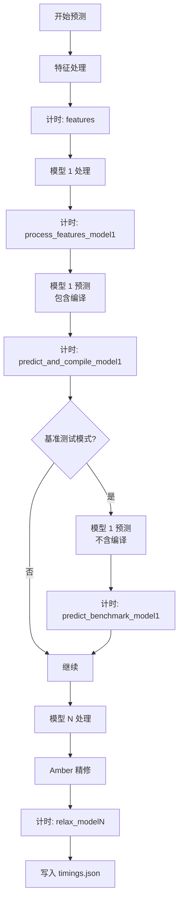
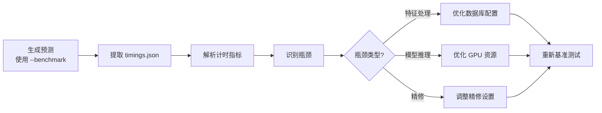

---
slug:24-benchmarking-and-profiling
blog_type:normal
---


理解 AlphaFold-Multimer 的性能特征对于优化吞吐量、资源利用率和部署规划至关重要。本文档涵盖了 AlphaFold-Multimer 实现中内置的基准测试功能、计时测量基础设施以及性能优化策略。

## 性能测量基础设施

AlphaFold-Multimer 提供了直接内置在推理管道中的全面计时检测功能。该基准测试系统覆盖了从特征提取、模型推理到最终结构精修等所有主要计算阶段的性能指标。

核心的基准测试功能通过 `--benchmark` 命令行标志启用，该标志指示系统执行多次 JAX 模型评估，以便将推理时间与编译开销分离开来。这种方法为生产场景（模型编译一次并重复用于多次预测）提供了更准确的时间统计。

```bash
python3 docker/run_docker.py \
  --fasta_paths=target.fasta \
  --max_template_date=2021-11-01 \
  --model_preset=multimer \
  --data_dir=$DOWNLOAD_DIR \
  --benchmark
```

来源：[run_alphafold.py](/run_alphafold.py#L107-L110)

### 计时捕获架构

基准测试实现在单个模型运行层级上操作，跟踪管道中每个阶段的性能：



`predict_structure` 函数捕获每个计算阶段的计时数据，并将结果存储在一个最终序列化为 JSON 格式的字典中。这提供了详细的可见性，帮助了解计算资源在整个管道中的消耗情况。

来源：[run_alphafold.py](/run_alphafold.py#L152-L285)

### JAX 特有的计时考虑

JAX 的即时编译引入了独特的计时考虑因素。首次模型调用包含编译开销，其时长根据模型复杂度和序列长度从几秒到几分钟不等。基准测试标志通过使用已编译的模型执行第二次预测运行来解决此问题：

```python
if benchmark:
  t_0 = time.time()
  model_runner.predict(processed_feature_dict,
                       random_seed=model_random_seed)
  t_diff = time.time() - t_0
  timings[f'predict_benchmark_{model_name}'] = t_diff
```

为了确保测量准确，实现使用了 JAX 的 `block_until_ready()` 机制，该机制强制在计时结束前同步完成所有 GPU 操作：

```python
jax.tree_map(lambda x: x.block_until_ready(), result)
```

这种阻塞确保了所有异步 GPU 操作都包含在计时测量中，防止在计算完成之前过早终止计时。

来源：[alphafold/model/model.py](/alphafold/model/model.py#L161-L165)

## 计时输出结构

基准测试系统在每个预测输出目录中生成一个 `timings.json` 文件，其中包含全面的性能指标。该 JSON 文件提供了结构化的计时数据，可以通过编程方式进行分析或手动审查以识别性能瓶颈。

### 计时字典结构

计时字典捕获每个模型的以下指标：

| 指标键 | 描述 | 单位 |
|------------|-------------|-------|
| `features` | 处理特征的时间，包括 MSA 生成 | 秒 |
| `process_features_{model}` | 为特定模型处理特征的时间 | 秒 |
| `predict_and_compile_{model}` | 包含编译的总模型预测时间 | 秒 |
| `predict_benchmark_{model}` | 不包含编译的模型预测时间 | 秒 |
| `relax_{model}` | Amber 精修的时间 | 秒 |

示例 `timings.json` 输出：
```json
{
  "features": 45.2,
  "process_features_model_1_multimer_v2": 0.3,
  "predict_and_compile_model_1_multimer_v2": 180.5,
  "predict_benchmark_model_1_multimer_v2": 85.3,
  "relax_model_1_multimer_v2": 120.7,
  "process_features_model_2_multimer_v2": 0.3,
  "predict_and_compile_model_2_multimer_v2": 182.1,
  "predict_benchmark_model_2_multimer_v2": 87.2,
  "relax_model_2_multimer_v2": 118.9
}
```

这种结构能够直接比较不同模型之间的性能，并识别跨不同模型预设或输入序列的性能差异。

来源：[run_alphafold.py](/run_alphafold.py#L278-L285)

### 性能分析工作流

计时数据支持通过以下流程进行系统性的性能分析：



<CgxTip>在分析性能时，应关注 `predict_benchmark_*` 指标而不是 `predict_and_compile_*`，以便进行生产规划。编译时间是一次性成本，不会影响包含大量连续预测的场景下的吞吐量。</CgxTip>

## 性能优化选项

AlphaFold-Multimer 提供了多种显著影响性能特征的配置选项。理解这些选项能够针对特定的部署场景进行系统性优化。

### 数据库预设配置

在 `full_dbs` 和 `reduced_dbs` 预设之间的选择代表了主要的性能与质量权衡：

| 方面 | full_dbs | reduced_dbs |
|--------|----------|-------------|
| **MSA 数据库大小** | 未压缩约 2.2 TB | 未压缩约 400 GB |
| **特征处理时间** | 30-60+ 分钟 | 5-15 分钟 |
| **预测精度** | 更高（MSA 深度更深） | 略微降低 |
| **内存需求** | 更高 | 更低 |
| **适用场景** | 生产级质量预测 | 快速原型设计、测试 |

数据库预设通过 `--db_preset` 标志控制：

```bash
# 使用完整数据库以获得最高精度
python3 docker/run_docker.py \
  --db_preset=full_dbs \
  --fasta_paths=target.fasta \
  ...

# 使用缩减数据库以加快迭代速度
python3 docker/run_docker.py \
  --db_preset=reduced_dbs \
  --fasta_paths=target.fasta \
  ...
```

该标志确定需要哪些数据库路径，并激活相应的验证检查以确保配置一致性。

来源：[run_alphafold.py](/run_alphafold.py#L97-L101)

### 模型预设选择

不同的模型预设提供不同的计算特征：

| 预设 | 模型数量 | 集成 | 典型运行时间 |
|--------|------------------|------------|-----------------|
| `monomer` | 5 | 1 | 基线 |
| `monomer_casp14` | 5 | 8 | 慢约 2-3 倍 |
| `monomer_ptm` | 5 | 1 | 基线 + pTM/PAE |
| `multimer` | 5 | 1 | 复合物基线 |

CASP14 预设使用集成（每次预测 8 次模型评估），这显著提高了精度，但运行时间增加了约 2-3 倍。此配置对于高精度单体预测特别有价值，但可能并非对所有用例都是必要的。

来源：[run_alphafold.py](/run_alphafold.py#L102-L106)

### GPU 精修配置

Amber 精修阶段通常占总运行时间的 20-30%，但在 GPU 上加速时可显著提速：

```bash
# GPU 加速精修（推荐）
python3 docker/run_docker.py \
  --use_gpu_relax=true \
  ...

# 仅 CPU 精修（后备方案）
python3 docker/run_docker.py \
  --use_gpu_relax=false \
  ...
```

GPU 精修可以将每个模型的精修时间从 2-5 分钟（CPU）减少到 10-30 秒，这为生产部署代表了显著的吞吐量提升。

来源：[run_alphafold.py](/run_alphafold.py#L128-L132)

### 预计算 MSA 缓存

对于相同序列的重复预测或在测试不同模型配置时，预计算的 MSA 可以消除冗余的数据库搜索：

```bash
python3 docker/run_docker.py \
  --use_precomputed_msas=true \
  --fasta_paths=target.fasta \
  ...
```

启用后，系统会检查输出目录中是否存在现有的 MSA 文件并重新使用它们，而不是重新运行 JackHMMER 和 HHblits 搜索。在使用 `full_dbs` 配置工作时，这可以为每次预测节省 30-60 分钟。

**警告**：系统不验证预计算的 MSA 是否使用兼容的数据库版本或配置生成。不一致的 MSA 可能导致错误的预测。

来源：[run_alphafold.py](/run_alphafold.py#L116-L122)

## 分析不同管道阶段

计时数据支持分阶段的性能分析，以识别优化机会。

### 特征处理分析

特征处理包括 MSA 生成和模板搜索，通常主要由数据库搜索时间主导：

```mermaid
gantt
    title 特征处理时间线 (full_dbs)
    dateFormat s
    axisFormat %L
    
    section MSA 生成
    "JackHMMER (UniRef90)"       :m1, 0, 1200
    "HHblits (BFD/Uniclust30)"   :m2, 1200, 3000
    "JackHMMER (MGnify)"         :m3, 3000, 3600

    section 模板搜索
    "HHSearch/Hmmsearch"         :m4, 3600, 4500
    "模板特征化"     :m5, 4500, 4800
```



`features` 计时指标汇总了所有这些操作。此指标的较大变化通常表明 I/O 瓶颈或数据库配置问题。

### 模型推理分析

模型推理时间主要随序列长度缩放，其次随模型预设缩放：

| 序列长度 | 单个模型时间（已编译） |
|----------------|------------------------------|
| < 100 个残基 | 10-30 秒 |
| 100-300 个残基 | 30-90 秒 |
| 300-500 个残基 | 90-180 秒 |
| > 500 个残基 | 180-400+ 秒 |

多聚体预测增加了随链数缩放的复杂性。典型的多链复合物可能需要比等效总长度的单体长 1.5-3 倍的推理时间。

<CgxTip>对于生产部署，模型推理时间通常主导吞吐量计算。由于编译成本在许多预测中分摊，因此在容量规划时应关注 `predict_benchmark_*` 时间。</CgxTip>

### 精修阶段分析

Amber 精修阶段表现出可预测的性能特征：

| 配置 | 每个模型时间 | 备注 |
|--------------|----------------|-------|
| CPU 精修 | 120-300 秒 | 通常 2-5 分钟 |
| GPU 精修 | 10-30 秒 | 比 CPU 快约 5-10 倍 |
| 无精修 | 0 秒 | 可能包含立体化学违规 |

可以通过 `--run_relax=false` 完全禁用精修阶段以进行快速原型设计，但这不推荐用于生产预测。

来源：[run_alphafold.py](/run_alphafold.py#L123-L127)

## 性能测试和验证

AlphaFold-Multimer 包含支持性能验证和回归测试的测试基础设施。

### 端到端测试框架

`run_alphafold_test.py` 模块提供了一个参数化测试框架，用于验证完整的管道：

```python
@parameterized.named_parameters(
    ('relax', True),
    ('no_relax', False),
)
def test_end_to_end(self, do_relax):
  # 模拟数据管道、模型运行器和 amber 精修器
  # 执行完整的预测管道
  # 验证输出文件的生成
  # 验证 B-factor 列中的 pLDDT 编码
```

这种测试方法通过比较代码更改之间的计时输出，在验证功能正确性的同时，能够检测性能回归。

来源：[run_alphafold_test.py](/run_alphafold_test.py#L29-L91)

### 基准测试最佳实践

为了获得可靠的性能测量结果，请遵循以下准则：

1.  **预热运行**：在基准测试之前至少执行一次预测，以确保所有系统都已初始化且缓存已填充
2.  **条件一致**：使用相同的输入序列、数据库版本和硬件配置进行比较测量
3.  **多样本**：使用不同的序列运行 3-5 次预测，以考虑自然变化
4.  **资源隔离**：确保基准测试系统不与其他进程争夺计算资源
5.  **编译分摊**：在测量生产吞吐量时，使用 `--benchmark` 排除一次性编译成本

### 生产容量规划

基于典型的性能特征，容量规划可以估算为：

**对于 GPU 系统（V100/A100 等效）：**
- 小型蛋白质（< 150 个残基）：使用 `full_dbs` 每小时约 2-4 次预测
- 中型蛋白质（150-300 个残基）：使用 `full_dbs` 每小时约 1-2 次预测
- 大型蛋白质（300+ 个残基）：使用 `full_dbs` 每小时约 0.5-1 次预测

**吞吐量乘数：**
- `reduced_dbs`：比 `full_dbs` 快约 3-5 倍
- GPU 精修：整体加速约 1.2-1.3 倍
- 无精修：整体加速约 1.3-1.5 倍
- 预计算的 MSA：可变（使用 `full_dbs` 可节省 30-60 分钟）

在做出最终容量规划决定之前，应使用目标硬件上的实际基准测试数据验证这些估算值。

## 性能问题故障排除

了解常见的性能瓶颈有助于快速诊断和解决问题。

### 特征处理缓慢

**症状**：`features` 计时 > 60 分钟

**潜在原因和解决方案**：
1.  **I/O 瓶颈**：数据库存储在慢速存储上
    -   解决方案：将数据库移动到 NVMe/SSD 存储
    -   验证：在数据库搜索期间监控磁盘 I/O
2.  **数据库配置**：不必要地使用 `full_dbs`
    -   解决方案：评估使用 `reduced_dbs` 进行快速原型设计
    -   参考：[数据库预设](22-database-presets-reduced_dbs-vs-full_dbs)
3.  **CPU 限制**：并行搜索的 CPU 核心不足
    -   解决方案：分配更多 CPU 资源
    -   验证：在 MSA 生成期间监控 CPU 利用率

### 模型推理缓慢

**症状**：`predict_benchmark_*` 计时显著高于预期

**潜在原因和解决方案**：
1.  **GPU 内存压力**：内存使用过多导致交换
    -   解决方案：减少批次大小或使用更小的模型
    -   参考：[GPU 配置](23-gpu-configuration-and-resource-management)
2.  **序列长度**：意外的长序列
    -   解决方案：如果合适，分解为结构域
    -   验证：检查输入序列长度
3.  **多聚体复杂性**：许多链或大型复合物
    -   解决方案：考虑子复合物预测
    -   验证：分析复合物架构

### 精修缓慢

**症状**：启用 GPU 精修时 `relax_*` 计时 > 5 分钟

**潜在原因和解决方案**：
1.  **GPU 不可用**：回退到 CPU
    -   解决方案：验证 GPU 可用性和配置
    -   检查：确保 CUDA 和 NVIDIA Container Toolkit 已正确安装
2.  **收敛问题**：多次精修迭代
    -   解决方案：检查未精修预测中的结构违规
    -   验证：检查调试数据中的迭代计数
3.  **大型复合物**：需要精修的残基很多
    -   解决方案：大型系统的预期行为
    -   参考：[Amber 精修](19-amber-relaxation-for-structure-refinement)

## 与持续性能监控集成

结构化的 `timings.json` 输出支持自动化的性能监控和警报：

```python
import json
import matplotlib.pyplot as plt

# 加载计时数据
with open('output/timings.json') as f:
    timings = json.load(f)

# 提取关键指标
features_time = timings['features']
inference_time = sum([v for k, v in timings.items() 
                      if 'predict_benchmark' in k])
relax_time = sum([v for k, v in timings.items() 
                   if 'relax' in k])

# 可视化性能细分
labels = ['Features', 'Inference', 'Relax']
sizes = [features_time, inference_time, relax_time]
plt.pie(sizes, labels=labels, autopct='%1.1f%%')
plt.title('Performance Breakdown')
plt.savefig('performance_profile.png')
```

这种方法能够跨代码更改、硬件配置或输入特征进行系统性的性能跟踪。

## 后续步骤

为了进行全面的性能优化，请考虑这些相关主题：

- **数据库配置**：了解数据库预设之间的详细权衡，参见 [数据库预设](22-database-presets-reduced_dbs-vs-full_dbs)
- **GPU 管理**：优化 GPU 利用率和资源分配，参见 [GPU 配置和资源管理](23-gpu-configuration-and-resource-management)
- **预测接口**：有关 `RunModel` 预测接口的详细文档，参见 [RunModel 类和预测接口](25-runmodel-class-and-prediction-interface)

有效的基准测试和分析能够做出数据驱动的优化决策，从而在特定的部署场景中平衡预测质量、计算成本和吞吐量要求。