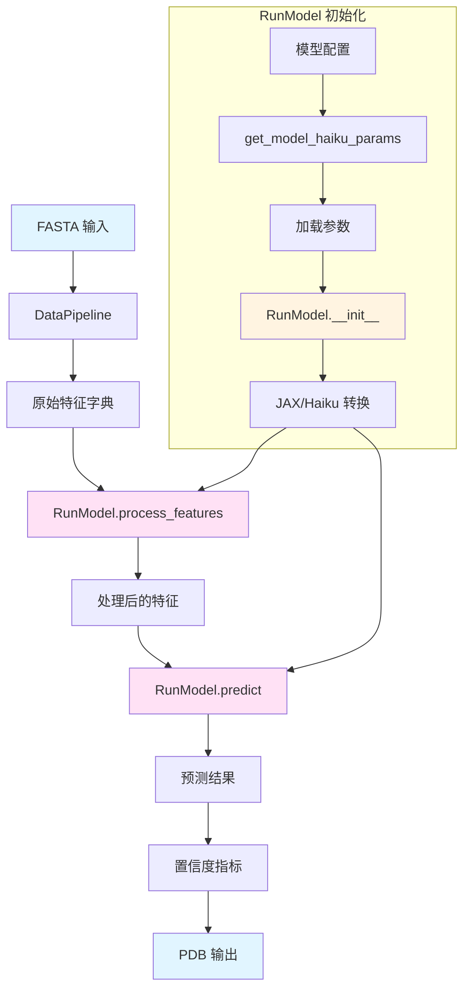
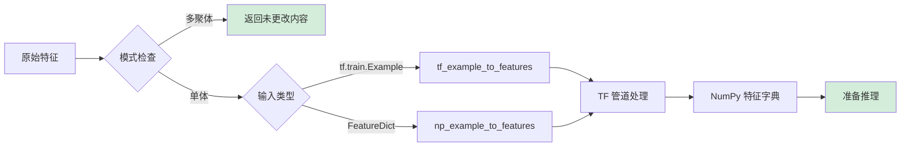
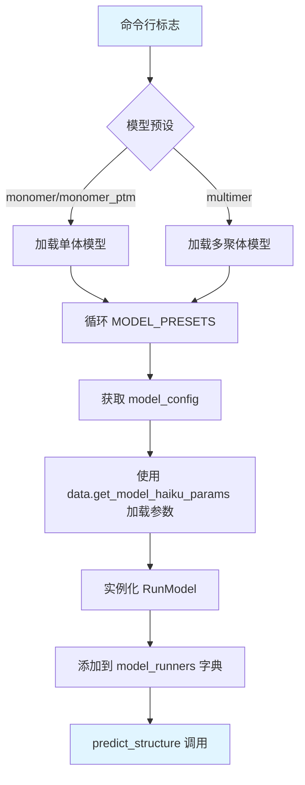

---
slug:25-runmodel-class-and-prediction-interface
blog_type:normal
---


RunModel 类作为执行 AlphaFold 和 AlphaFold-Multimer 预测的主要接口，为底层的 JAX 神经网络架构提供了统一的抽象层。该接口连接了数据管道输出和结构预测，管理模型初始化、特征处理和推理执行，并支持单链和多聚体预测模式。

来源：[alphafold/model/model.py](alphafold/model/model.py#L64-L172), [run_alphafold.py](run_alphafold.py#L152-L285)

## 架构概述

预测接口遵循模块化设计，将模型初始化、特征处理和推理执行的关注点分离开来。RunModel 类作为一个容器，封装了经过 Haiku 转换的 JAX 模型，并针对单体 (`modules.AlphaFold`) 和多聚体 (`modules_multimer.AlphaFold`) 场景有专门的实现。



这种架构通过 JAX 即时编译实现了高效的资源利用，同时为执行预测的用户提供了简洁的 API。

来源：[alphafold/model/model.py](alphafold/model/model.py#L67-L91), [alphafold/model/data.py](alphafold/model/data.py#L31-L40)

## RunModel 类结构

### 初始化与配置

RunModel 构造函数接受一个配置字典和可选的预加载参数，基于模型类型建立预测管道：

**构造函数参数：**
- `config`：包含模型架构规范的 ml_collections.ConfigDict
- `params`：来自训练运行的可选预加载模型参数

初始化过程通过检查 `config.model.global_config.multimer_mode` 来确定运行模式，然后创建相应的前向函数包装器。对于单体模型，它启用集成表示并禁用损失计算，而多聚体模型则使用专注于推理期间 MSA 采样的精简配置。

**关键初始化步骤：**
1. 存储配置和参数
2. 检测多聚体与单体模式
3. 使用适当的模型类定义前向函数
4. 使用 `hk.transform()` 应用 JAX 转换
5. 对 `apply` 和 `init` 函数应用 JIT 编译

来源：[alphafold/model/model.py](alphafold/model/model.py#L67-L91), [alphafold/model/config.py](alphafold/model/config.py#L26-L65)

### 方法参考

| 方法 | 目的 | 关键参数 | 返回类型 |
|--------|---------|----------------|-------------|
| `__init__` | 初始化模型容器 | config, params | None |
| `init_params` | 初始化模型参数 | feat, random_seed | None (填充 self.params) |
| `process_features` | 为推理预处理特征 | raw_features, random_seed | FeatureDict |
| `eval_shape` | 计算输出张量形状 | feat | jax.ShapeDtypeStruct |
| `predict` | 执行模型推理 | feat, random_seed | Mapping[str, Any] |

来源：[alphafold/model/model.py](alphafold/model/model.py#L64-L172)

### 参数初始化

`init_params` 方法通过两种场景处理参数管理：使用提供的预训练参数或随机初始化新参数。如果在实例化时未提供参数，该方法会创建一个 PRNG 密钥并调用转换后的 init 函数来生成参数形状，将其转换为可变字典以供后续操作使用。

<CgxTip>
随机初始化会产生具有未学习权重的参数，应仅用于调试或自定义训练工作流。生产环境中的预测始终需要从已发布的 AlphaFold 模型加载预训练参数。</CgxTip>

来源：[alphafold/model/model.py](alphafold/model/model.py#L92-L110)

## 特征处理管道

### 多聚体与单体处理

`process_features` 方法根据预测模式实现不同的逻辑：

**多聚体模式：**
- 特征从数据管道传递过来保持不变
- MSA 采样在模型前向传递期间内部进行
- 无需额外的预处理

**单体模式：**
- 将特征从 tf.train.Example 或 FeatureDict 格式转换
- 应用基于 TensorFlow 的预处理管道
- 处理删除矩阵转换和随机裁剪
- 支持序列化的 TF 示例和 NumPy 字典

单体预处理利用 TensorFlow 进行随机裁剪、增强和张量操作等操作，确保与训练数据准备管道的一致性。

来源：[alphafold/model/model.py](alphafold/model/model.py#L111-L140), [alphafold/model/features.py](alphafold/model/features.py#L26-L105)

### 特征处理流程



来源：[alphafold/model/model.py](alphafold/model/model.py#L111-L140), [alphafold/model/features.py](alphafold/model/features.py#L26-L105)

## 推理执行

### 预测方法

`predict` 方法协调整个推理工作流程：

1. **参数验证**：确保通过 `init_params` 初始化了参数
2. **执行**：使用 PRNG 密钥将参数应用于转换后的模型
3. **同步**：阻塞所有输出以确保 GPU/CPU 完成
4. **返回**：包含结构预测和置信度分数的字典

该方法记录特征维度以进行调试和验证，有助于在繁重计算开始之前识别潜在的内存或形状不匹配。

<CgxTip>
`block_until_ready()` 调用通过强制异步 GPU 操作与主机 CPU 之间同步来确保准确的计时测量。这对于基准测试至关重要，同时也能防止生产管道中的竞态条件。</CgxTip>

来源：[alphafold/model/model.py](alphafold/model/model.py#L149-L172)

### 形状评估工具

`eval_shape` 方法在不执行完整计算图的情况下提供形状推断。这特别适用于：
- 昂贵的推理之前的内存估计
- 调试维度不匹配
- 验证特征预处理正确性
- 规划 GPU 资源分配

它利用 JAX 的 `eval_shape` 使用抽象值而非实际数据来计算输出形状。

来源：[alphafold/model/model.py](alphafold/model/model.py#L141-L147)

## 与主预测管道的集成

### 模型运行器初始化

`run_alphafold.py` 脚本展示了生产环境中典型的 RunModel 使用模式：



初始化过程遍历预设的模型名称（例如 model_1, model_2 等），从数据目录加载相应的参数，并为集成预测实例化 RunModel 实例。

来源：[run_alphafold.py](run_alphafold.py#L380-L432), [alphafold/model/config.py](alphafold/model/config.py#L39-L65)

### 预测执行流程

`predict_structure` 函数展示了完整的预测工作流程：

1. **特征生成**：DataPipeline 处理 FASTA 输入
2. **特征处理**：每个模型运行器处理特征
3. **推理**：Model.predict() 生成结构预测
4. **后处理**：计算置信度指标，生成 PDB 文件
5. **松弛**：可选的 Amber 松弛以进行立体化学优化
6. **排名**：模型按置信度分数排名

对于集成中的每个模型，唯一的随机种子确保 MSA 采样和 dropout 等随机操作的变化，从而为共识构建实现预测的多样性。

来源：[run_alphafold.py](run_alphafold.py#L152-L285)

## 预测输出格式

### 结果字典结构

predict 方法返回一个包含以下内容的综合字典：

| 键 | 描述 | 形状 | 模式 |
|-----|-------------|-------|------|
| `structure_module` | 预测的原子坐标 | (num_res, 37, 3) | 两者 |
| `predicted_lddt` | 每个残基的置信度 logits | (num_res, 50) | 两者 |
| `predicted_aligned_error` | 对齐误差预测 | (num_res, num_res, 64) | PTM/多聚体 |
| `ranking_confidence` | 模型排名分数 | 标量 | 后验计算 |

单体模型仅输出 pLDDT 预测，而 PTM 和多聚体模型包括用于 TM-score 计算的对齐误差预测。

来源：[alphafold/model/model.py](alphafold/model/model.py#L31-L63), [alphafold/model/modules.py](alphafold/model/modules.py#L1004-L1063)

### 置信度指标计算

`get_confidence_metrics` 函数将原始模型输出转换为可解释的置信度分数：

**pLDDT（预测的 LDDT）：**
- 从每个残基的 logits 计算
- 范围：0-100（越高越好）
- 用于单体模型排名

**pTM（预测的 TM-score）：**
- 从对齐误差 logits 派生
- 范围：0-1（越高越好）
- 反映整体模型质量

**ipTM（界面 pTM）：**
- 多聚体特定的界面质量指标
- 仅针对链间接触计算
- 与 pTM 结合用于排名：`0.8 * ipTM + 0.2 * ptm`

**排名置信度：**
- 单体：pLDDT 值的平均值
- 多聚体：ipTM 和 pTM 的加权组合

来源：[alphafold/model/model.py](alphafold/model/model.py#L31-L63), [alphafold/common/confidence.py](alphafold/common/confidence.py)

## 配置和参数加载

### 模型预设

配置系统支持针对不同用例优化的多个模型预设：

| 预设 | 模型 | 集成大小 | 用例 |
|--------|--------|---------------|----------|
| `monomer` | model_1-5 | 1 | 标准单链预测 |
| `monomer_casp14` | model_1-5 | 8 | 高精度 CASP14 竞赛模式 |
| `monomer_ptm` | model_1-5_ptm | 1 | 带有 TM-score 预测的单链 |
| `multimer` | model_1-5_multimer | 1 | 蛋白质复合物预测 |

CASP14 预设以计算成本为代价增加集成大小以提高准确性，而 PTM 变体支持 TM-score 估计以用于模型选择。

来源：[alphafold/model/config.py](alphafold/model/config.py#L39-L65)

### 参数加载

参数通过扁平化到分层的转换从数据目录中的 NumPy 归档文件加载：

```python
# 路径结构: <data_dir>/params/params_<model_name>.npz
# 示例: /data/params/params_model_1_multimer.npz
model_params = data.get_model_haiku_params(
    model_name='model_1_multimer',
    data_dir='/path/to/data'
)
```

加载器处理从训练期间使用的扁平化参数数组到推理所需的嵌套 Haiku 参数结构的转换。

来源：[alphafold/model/data.py](alphafold/model/data.py#L31-L40)

## 操作注意事项

### 随机种子管理

随机种子在多个层面控制随机行为：
- **数据管道**：MSA 采样、数据增强
- **特征处理**：随机裁剪、打乱
- **模型推理**：Dropout、MSA 子采样（多聚体）

每个模型接收从基础种子和模型索引派生的唯一种子，确保集成多样性，同时保持可重现性。

### 基准模式

`run_alphafold.py` 中的基准标志通过以下方式启用准确的性能测量：
1. 运行预测两次（第一次包括编译开销）
2. 仅计时第二次执行
3. 从测量中排除 JIT 编译时间

这种区别对于生产能力规划至关重要，因为由于 XLA 编译，每个模型的第一次预测可能需要长得多的时间。

来源：[run_alphafold.py](run_alphafold.py#L107-L110)

### 内存和性能

高效预测执行的关键考虑因素：
- **编译开销**：每个模型的首次预测需要 2-5 分钟
- **GPU 内存**：随序列长度和 MSA 深度缩放
- **批量大小**：推理始终为 1（不支持批处理）
- **循环**：迭代优化增加与配置成正比的计算时间

<CgxTip>
对于大型蛋白质复合物，考虑使用 `reduced_dbs` 预设，它使用较小的遗传数据库来减少 MSA 生成时间和内存需求，以最小的准确性损失换取更快的预测。</CgxTip>

来源：[run_alphafold.py](run_alphafold.py#L97-L101), [alphafold/model/config.py](alphafold/model/config.py#L39-L65)

## 后续步骤

要加深您对 AlphaFold-Multimer 架构和用法的理解：

- **数据管道**：在 [DataPipeline Class for Multimer Processing](26-datapipeline-class-for-multimer-processing) 中了解特征生成和 MSA 处理
- **特征详情**：在 [Feature Dictionary Structure](27-feature-dictionary-structure) 中了解输入特征的结构
- **配置**：在 [Model Configuration and Presets](8-model-configuration-and-presets) 中探索模型配置选项
- **置信度指标**：在 [Per-Residue Confidence (pLDDT)](16-per-residue-confidence-plddt) 中深入了解 pLDDT、pTM 和 PAE
- **多聚体特征**：在 [Chain Feature Merging and Assembly](10-chain-feature-merging-and-assembly) 中了解链特征处理