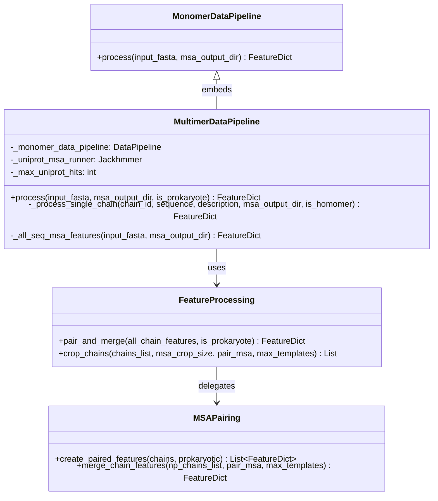
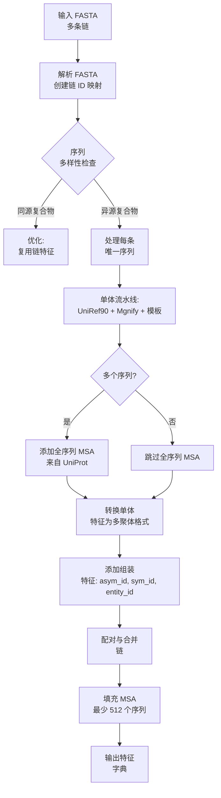

---
slug:26-datapipeline-class-for-multimer-processing
blog_type:normal
---

用于多聚体处理的 DataPipeline 类是核心编排引擎，负责将多链蛋白质序列转换为 AlphaFold-Multimer 模型所需的特征张量。与单体版本不同，该类处理同时处理多个蛋白质链的复杂性，执行链间 MSA 配对，并组装编码链间关系和组装信息的多聚体特定特征。

来源：[pipeline_multimer.py](/alphafold/data/pipeline_multimer.py#L170-L289)

## 架构与设计原则

多聚体 DataPipeline 采用**组合模式**运行，将单体 DataPipeline 嵌入为组件并扩展多聚体特定功能。该设计利用成熟单体验证过的单体处理流程生成每条链的 MSA，同时引入专门的逻辑用于异源复合物的链协调、特征组装和跨链 MSA 配对。该流水线区分同源复合物（相同链）和异源复合物（不同序列），应用不同的处理策略以优化计算效率和预测准确性。

来源：[pipeline_multimer.py](/alphafold/data/pipeline_multimer.py#L170-L196)

## 类初始化与参数

多聚体 DataPipeline 构造函数需要一个预配置的单体 DataPipeline 实例，该实例使用标准数据库处理每条链的 MSA 生成。此外，它初始化一个专用的 Jackhmmer 运行器，用于查询非聚类 UniProt 数据库，该数据库提供跨链 MSA 配对所需的全序列多样性。该流水线支持预计算的 MSA，以便在开发期间进行调试和加快迭代速度。

来源：[pipeline_multimer.py](/alphafold/data/pipeline_multimer.py#L173-L196)

| 参数 | 类型 | 默认值 | 描述 |
|-----------|------|---------|-------------|
| `monomer_data_pipeline` | `DataPipeline` | 必需 | 处理单个链的实例 |
| `jackhmmer_binary_path` | `str` | 必需 | jackhmmer 可执行文件的路径，用于 UniProt 搜索 |
| `uniprot_database_path` | `str` | 必需 | 非聚类 UniProt 序列数据库的路径 |
| `max_uniprot_hits` | `int` | 50000 | 从 UniProt 返回用于配对的最大序列数 |
| `use_precomputed_msas` | `bool` | False | 如果文件存在则跳过 MSA 生成 |

## 核心处理方法

### `process()` 方法

主要的入口点编排整个多聚体特征生成工作流。它首先解析输入的 FASTA 文件（可能包含多个蛋白质序列），并构建从 PDB 格式链 ID（A、B、C 等）到相应序列和描述的映射。该映射被序列化为 JSON 以便复现和调试。然后该方法遍历每条链，应用缓存策略以避免对同源复合物或具有相同亚基的复合物中的重复序列进行冗余处理。

来源：[pipeline_multimer.py](/alphafold/data/pipeline_multimer.py#L241-L288)

### `_process_single_chain()` 方法

此私有方法封装了每条链的处理逻辑。它创建一个包含单条链序列的临时 FASTA 文件，并委托给嵌入的单体 DataPipeline 进行 MSA 生成和模板搜索。对于异源复合物（具有不同序列的链），它还通过查询非聚类 UniProt 数据库生成“全序列”MSA 特征。这些全序列特征提供了更广泛的序列上下文，有助于在配对阶段识别跨不同链的同源关系。

来源：[pipeline_multimer.py](/alphafold/data/pipeline_multimer.py#L197-L222)

### `_all_seq_msa_features()` 方法

此方法针对非聚类 UniProt 数据库执行 jackhmmer 搜索，该数据库包含完整的序列多样性而未经冗余缩减。生成的 MSA 被截断为指定的最大命中数并转换为特征格式。仅保留与 MSA 配对相关的特征，包括 MSA 本身、缺失矩阵以及能够实现跨链匹配的登录号/物种标识符。特征被重命名并加上 `_all_seq` 后缀，以区别于单体流水线使用的聚类 MSA。

来源：[pipeline_multimer.py](/alphafold/data/pipeline_multimer.py#L224-L239)

## 特征转换与组装

### `convert_monomer_features()`

通过单体流水线处理每条链后，必须转换特征以匹配多聚体模型的期望。此函数从标量特征中删除不必要的先导维度，将独热编码的氨基酸类型转换回整数索引（多聚体模型在内部处理独热编码），并将模板氨基酸类型从 HHblits 重新映射到 AlphaFold 残基类型系统。链 ID 作为 `auth_chain_id` 特征存储以便追踪。

来源：[pipeline_multimer.py](/alphafold/data/pipeline_multimer.py#L72-L94)

### `add_assembly_features()`

此函数注入组装级别的元数据，用于区分不同的链并跟踪对称关系。它按序列对链进行分组以识别实体（唯一的多肽类型），并为每条链分配不对称单元 ID、对称 ID 和实体 ID。链 ID 使用电子表格风格的命名约定重命名（例如，同源二聚体为 A_1、A_2；异源二聚体为 A_1、B_1），其中第一个字符代表实体，数字代表对称副本。

来源：[pipeline_multimer.py](/alphafold/data/pipeline_multimer.py#L119-L155)

## 处理工作流集成

在组装单个链特征后，流水线委托 `feature_processing.pair_and_merge()` 执行关键的多聚体特定操作。该函数确定是否需要 MSA 配对（对同源复合物跳过），调用 `msa_pairing.create_paired_features()` 基于物种和登录号匹配跨链对齐同源序列，去重未配对的序列，将 MSA 裁剪到最大大小（2048 个序列），并将所有链特征合并为单个特征字典。最后一步应用 MSA 填充以确保至少有 512 个序列，防止模型推理期间出现空的 extra_msa 张量。

来源：[pipeline_multimer.py](/alphafold/data/pipeline_multimer.py#L278-L288), [feature_processing.py](/alphafold/data/feature_processing.py#L48-L81)

## 与单体 DataPipeline 的比较

多聚体 DataPipeline 扩展而非替换单体实现，共享核心的 MSA 生成和模板搜索基础设施，同时增加了多链协调层。单体流水线处理单个序列并直接返回特征，而多聚体流水线管理链迭代、序列缓存、跨链 MSA 生成和特征合并。两个流水线使用相同的底层数据库生成单体 MSA，但多聚体流水线还查询非聚类 UniProt 以获取配对信息。

来源：[pipeline.py](/alphafold/data/pipeline.py#L116-L163), [pipeline_multimer.py](/alphafold/data/pipeline_multimer.py#L170-L196)

| 方面 | 单体 DataPipeline | 多聚体 DataPipeline |
|--------|---------------------|----------------------|
| **输入** | 单序列 FASTA | 多序列 FASTA |
| **MSA 数据库** | UniRef90, Mgnify, BFD/Uniclust30 | 相同 + 非聚类 UniProt |
| **链处理** | 不适用 | 带缓存的多链迭代 |
| **MSA 配对** | 不适用 | 基于物种/登录号的配对 |
| **特征组装** | 直接返回 | 转换、添加组装特征、配对、合并 |
| **输出** | 单链特征 | 多链合并特征 |

## 辅助工具

### `_make_chain_id_map()`

此实用工具函数在 PDB 风格链 ID（A、B、C 等）与从输入 FASTA 解析的序列/描述对之间创建双向映射。它验证序列数不超过 PDB 格式的链限制（72 条链），并且序列和描述列表的长度匹配。

来源：[pipeline_multimer.py](/alphafold/data/pipeline_multimer.py#L45-L61)

### `int_id_to_str_id()`

此函数使用反向电子表格列命名（1 → A, 2 → B, ..., 27 → AA, 28 → BA 等）将数字实体 ID 转换为 PDB mmCIF 风格链标识符。此编码方案支持超过 26 个唯一实体，这对于大型复合物是必需的。

来源：[pipeline_multimer.py](/alphafold/data/pipeline_multimer.py#L97-L116)

### `temp_fasta_file()`

一个上下文管理器，用于创建每条链处理的临时 FASTA 文件，确保使用后正确清理。此抽象允许流水线独立处理链，而无需手动管理临时文件生命周期。

来源：[pipeline_multimer.py](/alphafold/data/pipeline_multimer.py#L64-L69)

<CgxTip>该流水线通过缓存序列首次出现的特征并在所有后续相同链中复用它们来优化同源复合物处理，从而减少同源二聚体或同源三聚体等对称复合物的冗余 MSA 生成。</CgxTip>

## 与模型推理的集成

来自多聚体 DataPipeline 的输出特征字典作为 AlphaFold-Multimer 模型的直接输入。特征组织为 NumPy 数组，其形状适应所有链的残基总数。关键的组装特征（如 `asym_id`、`sym_id` 和 `entity_id`）使模型能够在结构生成期间保持链边界并应用对称约束。配对的 MSA 特征包含配对序列（跨链对齐的同源物）和未配对序列（单个链独有），为准确的链间界面预测提供必要的进化上下文。

来源：[feature_processing.py](/alphafold/data/feature_processing.py#L48-L81)

## 后续步骤

要深入了解多聚体数据流水线架构，请探索这些相关主题：

- [多序列比对 (MSA) 配对](9-multiple-sequence-alignment-msa-pairing) 了解跨链序列比对的详细机制
- [链特征合并与组装](10-chain-feature-merging-and-assembly) 了解完整的特征转换工作流
- [RunModel 类和预测接口](25-runmodel-class-and-prediction-interface) 了解特征如何流入模型推理
- [特征字典结构](27-feature-dictionary-structure) 了解输出特征的完整架构