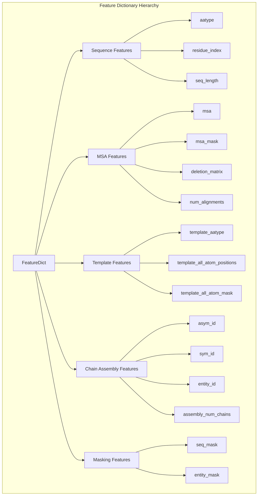
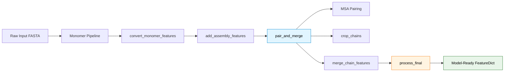

---
slug:27-feature-dictionary-structure
blog_type:normal
---


特征字典是编码 AlphaFold-Multimer 模型所需的所有生物和结构信息的基础数据结构。这种从特征名称到 NumPy 数组的全面映射，作为数据处理流水线和神经网络架构之间的统一接口，支持单体和多聚体预测工作流。

来源：[alphafold/model/features.py](alphafold/model/features.py#L26), [alphafold/data/pipeline.py](alphafold/data/pipeline.py#L32)

## 核心特征字典定义

特征字典实现为一种类型化映射，其中字符串键对应特征名称，值是具有适合特征语义含义维度的 NumPy 数组。类型定义同时出现在模型和数据流水线模块中，在整个系统中建立一致的契约。

```python
FeatureDict = Mapping[str, np.ndarray]  # 模型级定义
FeatureDict = MutableMapping[str, np.ndarray]  # 流水线级定义
```

这种双重定义反映了不同的需求：模型需要不可变的读取访问，而流水线在特征构建和转换阶段需要可变字典。

来源：[alphafold/model/features.py](alphafold/model/features.py#L26), [alphafold/data/pipeline.py](alphafold/data/pipeline.py#L32)

## 特征架构概述

特征字典遵循反映蛋白质复合物生物复杂性的分层组织。这种架构能够高效地表示序列、多序列比对、模板和链组装信息。



来源：[alphafold/data/feature_processing.py](alphafold/data/feature_processing.py#L24-L33), [alphafold/data/pipeline.py](alphafold/data/pipeline.py#L36-L50)

## 序列级特征

序列特征编码基本的氨基酸信息和结构定位。这些特征是构建所有其他表示的基础。

| 特征名称 | 形状 | 数据类型 | 目的 |
|--------------|-------|-----------|---------|
| `aatype` | `[num_res]` | int32 | 氨基酸类型编码（独热或索引） |
| `residue_index` | `[num_res]` | int32 | 顺序残基位置索引 |
| `seq_length` | `[num_res]` | int32 | 每个残基重复的总序列长度 |
| `sequence` | `[1]` | object | 原始序列字符串（UTF-8 编码） |
| `between_segment_residues` | `[num_res]` | int32 | 结构域边界标志 |

当从单体模式转换为多聚体模式时，`aatype` 特征会经历关键转换。在单体预测中，它存储为独热编码向量，但多聚体模型期望整数索引，这些索引由模型内部进行独热编码。

来源：[alphafold/data/pipeline.py](alphafold/data/pipeline.py#L36-L50), [alphafold/data/pipeline_multimer.py](alphafold/data/pipeline_multimer.py#L84-L86)

## 多序列比对特征

MSA 特征通过比对的同源序列捕获进化信息，为识别跨物种的保守和可变位置提供主要信号。

| 特征名称 | 形状 | 数据类型 | 目的 |
|--------------|-------|-----------|---------|
| `msa` | `[num_alignments, num_res]` | int32 | MSA 序列索引（HHBLITS 编码） |
| `msa_mask` | `[num_alignments, num_res]` | float32 | MSA 位置的有效性掩码 |
| `deletion_matrix` | `[num_alignments, num_res]` | float32 | MSA 位置的缺失计数 |
| `num_alignments` | `[num_res]` | int32 | MSA 序列总数 |

多聚体流水线实现了复杂的 MSA 配对策略，连接来自不同链的配对 MSA 序列，同时维护 `num_alignments` 元数据。MSA 裁剪大小配置为最多 2048 个序列，平衡信息内容和计算约束。

来源：[alphafold/data/pipeline.py](alphafold/data/pipeline.py#L53-L89), [alphafold/data/feature_processing.py](alphafold/data/feature_processing.py#L36)

## 链组装特征

多聚体特定特征区分链，使模型能够学习复合物内不同多肽链之间的空间关系。这些特征通过 `add_assembly_features()` 函数生成，该函数基于序列分组分配标识符。

| 特征名称 | 形状 | 数据类型 | 目的 |
|--------------|-------|-----------|---------|
| `asym_id` | `[num_res]` | float32 | 每个链的唯一标识符（非对称） |
| `sym_id` | `[num_res]` | float32 | 相同链的对称标识符 |
| `entity_id` | `[num_res]` | float32 | 基于序列一致性的实体标识符 |
| `assembly_num_chains` | 标量 | int32 | 组装中的链总数 |
| `all_chains_entity_ids` | `[num_res]` | int32 | 所有链的实体 ID |

实体分配逻辑按序列一致性对链进行分组：相同的序列接收相同的 entity_id。对于同源二聚体，这导致两条链共享 entity_id=1，而异源二聚体接收不同的 entity_id。asym_id 为每条链提供全局唯一标识符，无论序列相似性如何。

来源：[alphafold/data/pipeline_multimer.py](alphafold/data/pipeline_multimer.py#L119-L155)

## 模板特征

模板特征整合来自已知同源结构的结构信息，为预测提供几何先验。

| 特征名称 | 形状 | 数据类型 | 目的 |
|--------------|-------|-----------|---------|
| `template_aatype` | `[num_templates, num_res]` | int32 | 模板残基类型索引 |
| `template_all_atom_positions` | `[num_templates, num_res, 37, 3]` | float32 | 所有原子的 3D 坐标 |
| `template_all_atom_mask` | `[num_templates, num_res, 37]` | float32 | 原子位置的有效性掩码 |
| `num_templates` | 标量 | int32 | 使用的模板数量 |

多聚体配置支持最多 4 个模板。模板特征经历与序列特征相同的单体到多聚体转换，其中 template_aatype 从独热转换为整数索引。

来源：[alphafold/data/feature_processing.py](alphafold/data/feature_processing.py#L35), [alphafold/data/pipeline_multimer.py](alphafold/data/pipeline_multimer.py#L87-L90)

## 掩码和验证特征

掩码特征确保模型在推理和训练期间正确处理填充、缺失数据和链边界。

| 特征名称 | 形状 | 数据类型 | 目的 |
|--------------|-------|-----------|---------|
| `seq_mask` | `[num_res]` | float32 | 序列有效性掩码 |
| `entity_mask` | `[num_res]` | float32 | 实体有效性掩码 |
| `all_atom_mask` | `[num_res, 37]` | float32 | 全原子位置有效性 |
| `bert_mask` | `[num_res]` | int32 | 用于 BERT 风格 MSA 掩码的掩码 |

`seq_mask` 从 entity_id 生成，其中 `entity_id > 0` 表示有效残基。这种机制通过将填充位置的 entity_id 设置为 0 来有效处理填充。

来源：[alphafold/data/feature_processing.py](alphafold/data/feature_processing.py#L182-L195)

## 所需特征集

多聚体流水线通过 `REQUIRED_FEATURES` 不可变集合强制执行严格的一组必需特征。最终处理阶段过滤特征字典，以确保只有这些特征传递给模型。

<CgxTip>在模型推理之前，务必验证所有 32 个必需特征是否存在。缺失的特征将在 TensorFlow 图执行期间导致运行时错误。</CgxTip>

```python
REQUIRED_FEATURES = frozenset({
    'aatype', 'all_atom_mask', 'all_atom_positions', 'all_chains_entity_ids',
    'all_crops_all_chains_mask', 'all_crops_all_chains_positions',
    'all_crops_all_chains_residue_ids', 'assembly_num_chains', 'asym_id',
    'bert_mask', 'cluster_bias_mask', 'deletion_matrix', 'deletion_mean',
    'entity_id', 'entity_mask', 'mem_peak', 'msa', 'msa_mask', 'num_alignments',
    'num_templates', 'queue_size', 'residue_index', 'resolution',
    'seq_length', 'seq_mask', 'sym_id', 'template_aatype',
    'template_all_atom_mask', 'template_all_atom_positions'
})
```

来源：[alphafold/data/feature_processing.py](alphafold/data/feature_processing.py#L24-L33)

## 特征转换流水线

特征字典从原始序列数据到模型就绪特征经历系统的转换过程。此流水线确保一致性和多聚体特定信息的正确编码。



`process_final()` 函数应用关键转换：
1. **MSA 残基类型校正**：将 HHBLITS 氨基酸编码转换为模型的内部编码
2. **序列掩码生成**：从实体边界创建 `seq_mask`
3. **MSA 掩码生成**：为批处理期间的零填充初始化掩码
4. **特征过滤**：移除非必需特征以减少内存占用

来源：[alphafold/data/feature_processing.py](alphafold/data/feature_processing.py#L165-L201), [alphafold/data/feature_processing.py](alphafold/data/feature_processing.py#L48-L81)

## 单体到多聚体特征转换

当使单体特征适应多聚体预测时，必须进行特定转换以确保与多聚体架构的兼容性。

| 特征 | 单体形式 | 多聚体形式 | 转换 |
|---------|--------------|---------------|----------------|
| `aatype` | `[num_res, 20]` 独热 | `[num_res]` int32 | `np.argmax(axis=-1)` |
| `template_aatype` | `[num_templates, num_res, 20]` | `[num_templates, num_res]` | `np.argmax()` + 映射 |
| `sequence` | `[1]` 前导维度 | 标量 | 移除维度 |
| `num_alignments` | `[num_res]` 重复 | 标量 | 提取单个值 |
| `seq_length` | `[num_res]` 重复 | 标量 | 提取单个值 |

`convert_monomer_features()` 函数系统地处理这些转换，包括从 HHBLITS 编码到模型内部编码系统的关键氨基酸类型映射。

来源：[alphafold/data/pipeline_multimer.py](alphafold/data/pipeline_multimer.py#L72-L94)

## 配置集成

特征字典结构与模型配置参数紧密耦合。多聚体配置指定特征必须满足的预期张量维度和通道大小。

```python
CONFIG_MULTIMER = {
    'embeddings_and_evoformer': {
        'num_msa': 252,              # 预期的 MSA 序列
        'num_extra_msa': 1152,       # 额外 MSA 通道
        'seq_channel': 384,          # 序列嵌入维度
        'msa_channel': 256,          # MSA 嵌入维度
        'pair_channel': 128,         # 配对表示维度
        'template': {
            'max_templates': 4,      # 最大模板计数
            'num_channels': 64       # 模板嵌入维度
        }
    }
}
```

这些配置值决定了必须提供给模型的批处理维度和特征通道大小。特征字典最终在模型执行期间根据这些规范进行批处理。