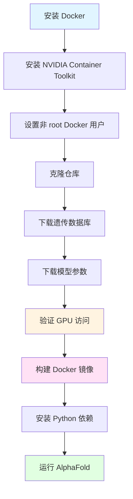

---
slug:3-installing-alphafold-multimer-with-docker
blog_type:normal
---


本指南将带你完成 AlphaFold-Multimer 的完整 Docker 安装过程，从初始设置到运行你的第一个蛋白质结构预测。Docker 提供了一个容器化环境，确保了不同系统间的可复现性，因此它是初学者和高级用户的推荐安装方法。


来源：[README.md](README.md#L1-L10), [Dockerfile](docker/Dockerfile#L1-L89)

## 前置条件与系统要求

在使用 Docker 安装 AlphaFold-Multimer 之前，请确保你的系统满足以下要求。Docker 方案简化了依赖管理，但需要对环境进行仔细的准备。

### 系统规格

| 组件 | 最低要求 | 推荐配置 |
|-----------|-------------------|-------------------------|
| **CPU** | 8 核 | 12+ 核 (用于 full_dbs 预设) |
| **RAM** | 8 GB (reduced_dbs) / 85 GB (full_dbs) | 128 GB (full_dbs) |
| **GPU** | 支持 CUDA 11.0+ 的 NVIDIA GPU | NVIDIA A100 或 V100 |
| **磁盘空间** | 600 GB (reduced_dbs) / 2.2 TB (full_dbs) | 3 TB SSD (用于 full_dbs) |
| **OS** | 带 Docker 的 Linux | Ubuntu 18.04+ |

### 必需软件

在继续之前，你必须安装 Docker 和 NVIDIA Container Toolkit。NVIDIA Container Toolkit 对于从容器内访问 GPU 至关重要。

```bash
# 示例 GPU 验证命令
docker run --rm --gpus all nvidia/cuda:11.0-base nvidia-smi
```

来源：[README.md](README.md#L32-L52), [Dockerfile](docker/Dockerfile#L18-L22)

## Docker 安装工作流

完整的安装过程遵循从系统准备到执行的结构化顺序。理解此工作流有助于识别每个阶段的潜在问题。



来源：[README.md](README.md#L29-L52), [run_docker.py](docker/run_docker.py#L1-L257)

## 步骤 1：安装 Docker 和 GPU 支持

首先，按照你的 Linux 发行版的官方文档安装 Docker。然后配置 NVIDIA Container Toolkit 以在容器内启用 GPU 访问。

<CgxTip>
NVIDIA Container Toolkit 的设置对于 GPU 利用至关重要。如果没有它，AlphaFold 将退回到仅 CPU 模式，导致预测速度显著变慢（对于典型蛋白质，需要数小时而不是数天）。
</CgxTip>

### Docker 安装命令

```bash
# 安装 Docker Engine (以 Ubuntu 为例)
sudo apt-get update
sudo apt-get install -y docker.io

# 安装 NVIDIA Container Toolkit
distribution=$(. /etc/os-release;echo $ID$VERSION_ID)
curl -s -L https://nvidia.github.io/nvidia-docker/gpgkey | sudo apt-key add -
curl -s -L https://nvidia.github.io/nvidia-docker/$distribution/nvidia-docker.list | \
  sudo tee /etc/apt/sources.list.d/nvidia-docker.list

sudo apt-get update
sudo apt-get install -y nvidia-container-toolkit

# 配置 Docker 使用 NVIDIA 运行时
sudo nvidia-ctk runtime configure --runtime=docker
sudo systemctl restart docker

# 设置 Docker 为非 root 用户
sudo usermod -aG docker $USER
```

来源：[README.md](README.md#L29-L43)

## 步骤 2：克隆并准备仓库

克隆 AlphaFold-Multimer 仓库并导航到其根目录。

```bash
# 克隆仓库
git clone https://github.com/jcheongs/alphafold-multimer.git
cd alphafold-multimer
```

来源：[README.md](README.md#L198-L200)

## 步骤 3：下载遗传数据库和模型参数

AlphaFold-Multimer 需要大量的遗传数据库和模型参数。下载过程可能需要相当长的时间，具体取决于你的网络连接。

### 数据库下载选项

你有两种数据库下载选项：

| 数据库预设 | 下载大小 | 磁盘大小 | 用例 |
|----------------|--------------|-----------|----------|
| **reduced_dbs** | ~138 GB | ~600 GB | 测试、较小的蛋白质、有限的硬件 |
| **full_dbs** | ~438 GB | ~2.2 TB | 生产、研究发表、最佳精度 |

```bash
# 下载完整数据库 (推荐用于生产环境)
./scripts/download_all_data.sh /path/to/download/directory

# 下载精简数据库 (用于测试)
./scripts/download_all_data.sh /path/to/download/directory reduced_dbs
```

<CgxTip>
确保你的下载目录不是 AlphaFold 仓库内的子目录。将数据库放在仓库内会导致 Docker 构建变慢，因为所有数据都会在镜像创建期间被复制。
</CgxTip>

### 下载后的目录结构

完成下载后，你的数据目录应包含以下内容：

```
/path/to/download/directory/
├── bfd/                    # 1.7 TB (仅 full_dbs)
├── mgnify/                 # 64 GB
├── params/                 # 3.5 GB (模型参数)
├── pdb70/                  # 56 GB
├── pdb_mmcif/              # 206 GB
├── pdb_seqres/             # 0.2 GB (Multimer 必需)
├── small_bfd/              # 17 GB (仅 reduced_dbs)
├── uniclust30/             # 86 GB
├── uniprot/                # 98.3 GB (Multimer 必需)
└── uniref90/               # 58 GB
```

来源：[README.md](README.md#L54-L135), [download_all_data.sh](scripts/download_all_data.sh#L1-L75)

## 步骤 4：验证 GPU 访问

在构建 Docker 镜像之前，请验证 Docker 是否能正确访问你的 GPU。

```bash
# 测试 GPU 访问
docker run --rm --gpus all nvidia/cuda:11.0-base nvidia-smi
```

此命令应显示你的 GPU 规格。如果失败，请重新检查你的 NVIDIA Container Toolkit 安装。

来源：[README.md](README.md#L43-L51)

## 步骤 5：构建 Docker 镜像

Dockerfile 定义了一个完整的运行时环境，其中预装了所有依赖项，包括 CUDA、HHsuite、Miniconda、OpenMM 和 AlphaFold 本身。

```bash
# 从 Dockerfile 构建 Docker 镜像
docker build -f docker/Dockerfile -t alphafold .
```

构建过程包括几个关键步骤：

```mermaid
flowchart LR
    A["基础镜像<br/>NVIDIA CUDA 11.1"] --> B["安装系统工具<br/>build-essential, cmake, etc."]
    B --> C["从源码编译<br/>HHsuite v3.3.0"]
    C --> D["安装 Miniconda<br/>包管理器"]
    D --> E["安装 Conda 包<br/>OpenMM, pdbfixer, etc."]
    E --> F["复制 AlphaFold 源代码"]
    F --> G["安装 Python 包<br/>JAX, TensorFlow, etc."]
    G --> H["应用 OpenMM 补丁<br/>以实现兼容性"]
    H --> I["配置入口点<br/>run_alphafold.sh"]
    
    style A fill:#e1f5ff
    style I fill:#e1ffe1
```



来源：[Dockerfile](docker/Dockerfile#L14-L89)

### Docker 镜像组件

Docker 镜像安装了以下关键组件：

| 组件 | 版本 | 用途 |
|-----------|---------|---------|
| **CUDA** | 11.1 | GPU 加速 |
| **cuDNN** | 8 | 深度学习原语 |
| **HHsuite** | 3.3.0 | 序列比对工具 |
| **OpenMM** | 7.5.1 | 分子力学模拟 |
| **JAX/JAXlib** | 0.2.14/0.1.69 | 神经网络框架 |
| **Python** | 3.7 | 运行时环境 |

来源：[Dockerfile](docker/Dockerfile#L14-L89)

## 步骤 6：安装 Python 依赖

`run_docker.py` 脚本需要宿主机系统上的 Python 依赖来编排 Docker 容器。

```bash
# 安装依赖 (可选：使用虚拟环境)
pip3 install -r docker/requirements.txt
```

必需的依赖包括：
- `absl-py==0.13.0` - 命令行标志解析
- `docker==5.0.0` - Docker Python SDK

来源：[docker/requirements.txt](docker/requirements.txt#L1-L4), [run_docker.py](docker/run_docker.py#L1-L48)

## 步骤 7：准备输出目录

在运行预测之前，请创建一个具有适当权限的输出目录。

```bash
# 创建输出目录
mkdir -p /tmp/alphafold

# 设置写入权限
chmod 770 /tmp/alphafold
```

来源：[README.md](README.md#L206-L212)

## 步骤 8：运行 AlphaFold-Multimer 预测

现在你已准备好运行蛋白质结构预测。`run_docker.py` 脚本为 Docker 容器提供了便捷的接口。

### 基础单体预测示例

```bash
python3 docker/run_docker.py \
  --fasta_paths=T1050.fasta \
  --max_template_date=2020-05-14 \
  --model_preset=monomer \
  --db_preset=reduced_dbs \
  --data_dir=/path/to/download/directory
```

### 多聚体预测示例

对于多聚体预测，请提供包含多个序列的 FASTA 文件并指定 `multimer` 模型预设。

```bash
python3 docker/run_docker.py \
  --fasta_paths=multimer.fasta \
  --is_prokaryote_list=true \
  --max_template_date=2021-11-01 \
  --model_preset=multimer \
  --data_dir=/path/to/download/directory
```

来源：[README.md](README.md#L213-L290), [run_docker.py](docker/run_docker.py#L48-L257)

## 配置选项

了解可用的配置选项允许你针对特定用例优化性能。

### 模型预设

| 预设 | 描述 | 用例 | 精度与速度 |
|--------|-------------|----------|------------------|
| **monomer** | 原始 CASP14 模型，无集成 | 通用单体预测 | 均衡 |
| **monomer_casp14** | CASP14 配置，num_ensemble=8 | 复现 CASP14 结果 | 慢 8 倍，+0.1 GDT |
| **monomer_ptm** | 带有 pTM 头的模型，用于置信度指标 | 需要成对置信度 | 精度略低 |
| **multimer** | AlphaFold-Multimer 模型 | 蛋白质复合物、低聚物 | 专为多链优化 |

### 数据库预设

| 预设 | 描述 | 硬件要求 |
|--------|-------------|---------------------|
| **reduced_dbs** | 较小的遗传数据库配置 | 8 CPU，8 GB RAM，600 GB 磁盘 |
| **full_dbs** | 完整的 CASP14 数据库 | 12+ CPU，85 GB RAM，2.2 TB 磁盘 |

### GPU 设备配置

使用 `--gpu_devices` 标志控制 GPU 使用：

```bash
# 使用所有可用的 GPU (默认)
python3 docker/run_docker.py --fasta_paths=test.fasta --data_dir=$DATA_DIR

# 通过索引使用特定 GPU
python3 docker/run_docker.py --fasta_paths=test.fasta --gpu_devices=0,1 --data_dir=$DATA_DIR

# 通过 UUID 使用特定 GPU
python3 docker/run_docker.py --fasta_paths=test.fasta --gpu_devices=GPU-abc123,GPU-def456 --data_dir=$DATA_DIR
```

来源：[run_docker.py](docker/run_docker.py#L48-L95), [README.md](README.md#L243-L288)

## 高级选项

### 优化控制

AlphaFold 包含一个 Amber 优化步骤以优化结构。你可以控制此行为：

```bash
# 禁用优化 (更快，但可能有立体化学违规)
python3 docker/run_docker.py \
  --fasta_paths=test.fasta \
  --run_relax=false \
  --data_dir=$DATA_DIR

# 启用基于 GPU 的优化 (比 CPU 更快)
python3 docker/run_docker.py \
  --fasta_paths=test.fasta \
  --enable_gpu_relax=true \
  --data_dir=$DATA_DIR
```

### 预计算的 MSA

为了测试或速度优化，你可以重用之前计算的 MSA：

```bash
python3 docker/run_docker.py \
  --fasta_paths=test.fasta \
  --use_precomputed_msas=true \
  --data_dir=$DATA_DIR
```

<CgxTip>
`use_precomputed_msas` 选项不会验证序列或配置是否未更改。请谨慎使用并确保你的数据完整性。
</CgxTip>

来源：[run_docker.py](docker/run_docker.py#L48-L95), [run_alphafold.sh](run_alphafold.sh#L1-L195)

## 故障排除指南

常见问题及其解决方案：

| 问题 | 症状 | 解决方案 |
|-------|---------|----------|
| **未检测到 GPU** | "CUDA_VISIBLE_DEVICES=-1" 或访问 GPU 出错 | 验证 NVIDIA Container Toolkit 安装；在容器内使用 `nvidia-smi` 测试 |
| **数据库挂载错误** | "Failed to find source directory to mount" | 确保 `--data_dir` 中使用绝对路径；验证宿主机上目录是否存在 |
| **权限被拒绝** | 无法写入输出目录 | 使用 `mkdir` 创建输出目录并使用 `chmod 770` 设置权限 |
| **Docker 构建缓慢** | 构建需要数小时 | 确保 `data_dir` 不是仓库的子目录；将数据库移出仓库外 |
| **内存不足** | CUDA OOM 或进程被杀死 | 将 `--db_preset` 减少为 `reduced_dbs`；使用更少的 GPU 设备；增加系统 RAM |
| **OpenMM 错误** | 优化阶段失败 | 尝试 `--run_relax=false`；确保 CUDA 运行时与 OpenMM 版本兼容 |

### 调试模式

如需详细日志，你可以交互式运行容器：

```bash
# 使用交互式 shell 启动容器
docker run -it --gpus all \
  --volume /path/to/data:/data \
  --volume /path/to/output:/output \
  alphafold \
  /bin/bash

# 在容器内，手动运行预测
python /app/alphafold/run_alphafold.py \
  --fasta_paths=/data/test.fasta \
  --output_dir=/output \
  --data_dir=/data
```

来源：[Dockerfile](docker/Dockerfile#L80-L89), [README.md](README.md#L43-L51)

## Docker 挂载架构

了解 Docker 挂载的工作原理有助于排除数据访问问题：

```mermaid
graph LR
    A[宿主机系统] -->|bind mount| B[Docker 容器]
    C[/path/to/databases] -->|挂载为 /mnt/data_dir| D[/app/alphafold/data]
    E[/path/to/fasta] -->|挂载为 /mnt/fasta_path_0| F[/app/alphafold/input.fasta]
    G[/tmp/alphafold] -->|挂载为 /mnt/output_dir| H[/app/alphafold/output]
    
    style A fill:#e1f5ff
    style B fill:#ffe1f5
    style D fill:#e1ffe1
    style F fill:#e1ffe1
    style H fill:#e1ffe1
```

`run_docker.py` 脚本根据你的输入路径自动创建这些挂载点。

来源：[run_docker.py](docker/run_docker.py#L96-L130)

## 后续步骤

现在你已经通过 Docker 安装了 AlphaFold-Multimer，你可以继续进行以下操作：

1. **[下载遗传数据库和模型参数](4-downloading-genetic-databases-and-model-parameters)** - 如果你尚未完成此步骤，请详细了解数据库结构
2. **[运行你的第一个预测](5-running-your-first-prediction)** - 学习如何构建 FASTA 文件并解读结果
3. **[数据库预设 (reduced_dbs vs full_dbs)](22-database-presets-reduced_dbs-vs-full_dbs)** - 了解数据库配置之间的权衡
4. **[GPU 配置和资源管理](23-gpu-configuration-and-resource-management)** - 针对你的硬件优化性能
5. **[AlphaFold-Multimer 架构概述](6-alphafold-multimer-architecture-overview)** - 深入研究多聚体预测系统