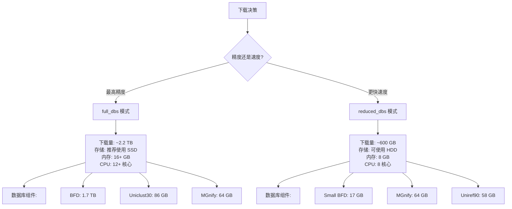

---
slug:4-downloading-genetic-databases-and-model-parameters
blog_type:normal
---


本指南介绍了如何下载和配置运行 AlphaFold-Multimer 所需的基因数据库和神经网络模型参数。在预测蛋白质结构之前，你必须下载几个大型基因序列数据库（总计约 2.2 TB）和预训练模型参数（约 3.5 GB）。此设置是一次性过程，旨在使 AlphaFold 能够执行多序列比对搜索并生成结构预测。


## 理解下载架构

AlphaFold 的数据需求分为两大类：用于多序列比对 (MSA) 和模板搜索的**基因数据库**，以及包含预训练神经网络权重的**模型参数**。下载过程通过一组 bash 脚本自动化完成，这些脚本负责处理这些资源的下载、解压和组织。

主要的编排脚本 `scripts/download_all_data.sh` 管理整个下载工作流，并根据你的计算资源和精度要求支持两种操作模式。该脚本协调每个数据库组件的独立下载脚本的执行，确保正确的目录结构和文件组织。

下载架构使用 `aria2c` 作为主要下载工具，利用其多线程下载功能，显著加速从远程服务器检索大文件的过程。每个数据库组件都有其专用脚本，用于处理该特定数据源所需的特定下载 URL、压缩格式和解压过程。

来源: [scripts/download_all_data.sh](scripts/download_all_data.sh#L23-L75), [README.md](README.md#L90-L110)

## 数据库先决条件和工具

在启动下载过程之前，请确保你的系统具有所需的依赖项。这些脚本依赖 `aria2c` 进行高效的多线程下载，并依赖 `rsync` 同步大型目录结构。可以在基于 Ubuntu 的系统上使用以下命令安装这些工具：

```bash
sudo apt update
sudo apt install aria2 rsync
```

此外，你需要充足的磁盘空间和可靠的互联网连接。**完整数据库配置**需要大约 438 GB 的压缩下载空间，解压后约为 2.2 TB。**精简数据库配置**所需的空间要少得多（解压后约 600 GB），适合存储空间有限的系统。

**重要的放置注意事项**：你的下载目录不应是 AlphaFold 代码库中的子目录。如果将数据库放在代码库目录内，Docker 将在镜像构建期间复制这些大文件，导致构建时间极慢。相反，请选择一个单独的位置，例如 `/data/alphafold` 或其他专用数据目录。

来源: [scripts/download_all_data.sh](scripts/download_all_data.sh#L18-L24), [README.md](README.md#L112-L120)

## 下载模式：完整数据库与精简数据库

AlphaFold 提供了两种数据库预设，可以在预测精度和资源需求之间进行权衡。理解这些选项可以帮助你为你的用例选择适当的配置。



`full_dbs` 模式下载 CASP14 竞赛中使用的所有基因数据库，为结构预测提供最高的精度。此模式包括完整的 BFD 数据库 (1.7 TB)，这是最大的组件，提供了对蛋白质序列空间的广泛覆盖。

`reduced_dbs` 模式使用较小的 17 GB 版本 (Small BFD) 代替大型 BFD 数据库，显著减少了存储和计算需求，同时为许多预测保持合理的精度。推荐将此模式用于初始测试、教育目的或计算资源有限的情况。

来源: [README.md](README.md#L121-L145), [run_alphafold.py](run_alphafold.py#L97-L101)

## 完整下载过程

### 第 1 步：执行主下载脚本

最简单的方法是使用 `download_all_data.sh` 脚本，该脚本可自动化整个下载和设置过程。该脚本接受两个参数：下载目录路径和可选的下载模式。

对于完整数据库（推荐用于生产环境）：

```bash
bash scripts/download_all_data.sh /path/to/your/data/directory full_dbs
```

对于精简数据库（适合测试和资源有限的情况）：

```bash
bash scripts/download_all_data.sh /path/to/your/data/directory reduced_dbs
```

该脚本按顺序执行以下操作：
1. 下载 AlphaFold 模型参数（约 3.5 GB）
2. 根据模式下载完整 BFD 或 Small BFD 数据库
3. 下载 MGnify 宏基因组数据库（压缩后 32.9 GB）
4. 下载用于 HHsearch 的 PDB70 模板数据库（压缩后 19.5 GB）
5. 下载并组织所有 PDB mmCIF 结构文件（压缩后 46 GB）
6. 下载 Uniclust30 数据库（压缩后 24.9 GB）
7. 下载 Uniref90 数据库（压缩后 29.7 GB）
8. 下载 UniProt 数据库（压缩后 49 GB）- 多聚体预测所需
9. 下载 PDB SeqRes 数据库（0.2 GB）- 多聚体预测所需

来源: [scripts/download_all_data.sh](scripts/download_all_data.sh#L37-L74), [README.md](README.md#L146-L180)

### 第 2 步：验证目录结构

下载脚本成功完成后，你的数据目录应包含以下有组织的结构。此结构至关重要，因为 AlphaFold 在运行预测时期望特定的路径。

```
$DOWNLOAD_DIR/
├── params/                          # 模型参数 (~3.5 GB)
│   ├── model_1/
│   ├── model_2/
│   ├── model_3/
│   ├── model_4/
│   ├── model_5/
│   ├── model_1_ptm/
│   ├── model_2_ptm/
│   ├── model_3_ptm/
│   ├── model_4_ptm/
│   ├── model_5_ptm/
│   ├── model_1_multimer/
│   ├── model_2_multimer/
│   ├── model_3_multimer/
│   ├── model_4_multimer/
│   ├── model_5_multimer/
│   └── LICENSE
├── bfd/                             # 完整 BFD (1.7 TB) 或
├── small_bfd/                       # Small BFD (17 GB)
├── mgnify/                          # MGnify 数据库 (64 GB)
├── pdb70/                           # PDB70 模板数据库 (56 GB)
├── pdb_mmcif/                       # PDB 结构文件 (206 GB)
│   ├── mmcif_files/                 # ~180,000 .cif 文件
│   └── obsolete.dat                 # 过时的 PDB ID 映射
├── pdb_seqres/                      # PDB 序列残基 (0.2 GB)
├── uniclust30/                      # Uniclust30 数据库 (86 GB)
├── uniprot/                         # UniProt 数据库 (98 GB)
└── uniref90/                        # Uniref90 数据库 (58 GB)
```

<CgxTip>始终验证目录结构与此布局匹配。`run_alphafold.py` 脚本和 `run_alphafold.sh` 包装器使用相对于数据目录的硬编码路径。丢失或放错位置的目录将导致运行时错误。</CgxTip>

来源: [README.md](README.md#L181-L220), [run_alphafold.sh](run_alphafold.sh#L117-L130)

## 基因数据库组件及其作用

每个基因数据库在 AlphaFold 流程中都有特定的用途。了解这些角色有助于你排查问题并优化设置。

| 数据库 | 大小 (解压后) | 主要用途 | 搜索工具 | 用于 |
|----------|---------------------|-----------------|-------------|--------------|
| BFD | 1.7 TB | 广泛的序列多样性覆盖 | HHblits | 完整单体精度 |
| Small BFD | 17 GB | 减少的序列多样性 | HHblits | 精简模式预测 |
| Uniref90 | 58 GB | 高质量蛋白质簇 | JackHMMER | 所有预测 |
| MGnify | 64 GB | 宏基因组序列 | JackHMMER | 所有预测 |
| Uniclust30 | 86 GB | 额外的序列多样性 | HHblits | 完整模式预测 |
| UniProt | 98 GB | 综合蛋白质序列 | JackHMMER | **仅多聚体** |
| PDB70 | 56 GB | 模板结构搜索 | HHsearch | 仅单体 |
| PDB mmCIF | 206 GB | 用于穿线的结构模板 | 自定义解析 | 所有预测 |
| PDB SeqRes | 0.2 GB | 序列到结构的映射 | HMMsearch | **仅多聚体** |

从这些数据库生成的 MSA 提供了进化信息，使 AlphaFold 能够仅从序列推断 3D 结构。**模板数据库** (PDB70 和 mmCIF 文件) 提供已知的蛋白质结构，当蛋白质结构库中存在相似结构时，这些结构可用作预测的起点。

来源: [scripts/download_bfd.sh](scripts/download_bfd.sh#L23-L32), [scripts/download_small_bfd.sh](scripts/download_small_bfd.sh#L23-L32), [scripts/download_uniref90.sh](scripts/download_uniref90.sh#L23-L32)

## 多聚体专用数据库要求

AlphaFold-Multimer 需要两个单体预测不需要的额外数据库：**UniProt** 和 **PDB SeqRes**。这些数据库使多聚体系统能够在不同的蛋白质链之间准确配对多序列比对。

UniProt 数据库将 SwissProt（手动策划的高质量序列）和 TrEMBL（自动注释的序列）组合成一个综合的蛋白质序列资源。下载脚本获取这两个组件并将它们合并为一个 `uniprot.fasta` 文件。

PDB SeqRes 数据库包含从所有 PDB 结构中提取的序列信息，提供序列与其实验确定的结构之间的映射。此信息对于识别复合物中不同蛋白质链之间潜在的模板相互作用至关重要。

<CgxTip>将现有的 AlphaFold 安装更新为支持多聚体预测时，必须删除旧的 PDB mmCIF 目录并重新下载 PDB mmCIF 和 PDB SeqRes，以确保它们同步自同一日期。版本不匹配可能导致模板搜索失败。</CgxTip>

来源: [scripts/download_uniprot.sh](scripts/download_uniprot.sh#L1-L56), [scripts/download_pdb_seqres.sh](scripts/download_pdb_seqres.sh#L1-L39), [README.md](README.md#L231-L250)

## 模型参数

预训练神经网络权重从 Google Cloud Storage 下载，包含针对不同用例优化的三组模型。这些参数在 CC BY 4.0 许可证下发布，如果在已发表的作品中使用，需要署名。

| 模型集 | 模型数量 | 用途 | 输出特征 |
|-----------|-----------------|---------|-----------------|
| CASP14 模型 | 5 (model_1 到 model_5) | CASP14 竞赛中的原始单体模型 | 仅 3D 坐标 |
| pTM 模型 | 5 (model_1_ptm 到 model_5_ptm) | 使用预测的 TM-score 头进行微调 | 3D 坐标 + pTM + PAE |
| 多聚体模型 | 5 (model_1_multimer 到 model_5_multimer) | 专用于蛋白质复合物预测 | 3D 坐标 + pTM + PAE |

**pTM（预测的 TM-score）** 模型提供了相对于实验结构的预测全局精度估计，而 **PAE（预测对齐误差）** 提供残基对误差估计，有助于识别预测的可靠区域。对于多聚体预测，PAE 对于评估链间相互作用的置信度特别有价值。

模型参数下载到 `params/` 子目录中，总大小约为 3.5 GB。每个模型目录包含定义神经网络架构权重的 TensorFlow 检查点文件。

来源: [scripts/download_alphafold_params.sh](scripts/download_alphafold_params.sh#L1-L42), [README.md](README.md#L222-L230)

## 选择性数据库下载

虽然 `download_all_data.sh` 脚本提供了一个方便的一体化解决方案，但你可能希望单独下载各个数据库组件。当出现以下情况时，此方法很有用：
- 你想替换单个数据库而无需重新下载所有内容
- 你的带宽有限，更希望分多个会话下载组件
- 你需要排查特定的数据库问题

每个数据库都有其专用脚本，可以独立执行：

```bash
# 下载单个组件
bash scripts/download_alphafold_params.sh /path/to/data/dir
bash scripts/download_bfd.sh /path/to/data/dir
bash scripts/download_small_bfd.sh /path/to/data/dir
bash scripts/download_mgnify.sh /path/to/data/dir
bash scripts/download_pdb70.sh /path/to/data/dir
bash scripts/download_pdb_mmcif.sh /path/to/data/dir
bash scripts/download_pdb_seqres.sh /path/to/data/dir
bash scripts/download_uniclust30.sh /path/to/data/dir
bash scripts/download_uniprot.sh /path/to/data/dir
bash scripts/download_uniref90.sh /path/to/data/dir
```

请注意，PDB mmCIF 下载脚本使用 `rsync` 与 RCSB 蛋白质结构库同步，由于文件数量众多（约 180,000 个 mmCIF 文件），这可能需要几个小时。如果主服务器速度慢，该脚本会提供备用镜像 URL。

来源: [scripts/download_pdb_mmcif.sh](scripts/download_pdb_mmcif.sh#L40-L66)

## 与 Docker 和运行脚本集成

下载后，必须在运行 AlphaFold 时正确引用数据库。`run_alphafold.sh` 脚本根据你指定的数据目录自动映射数据库路径，而基于 Docker 的工作流需要将数据目录挂载到容器中。

对于非 Docker 使用，请在运行预测时指定数据目录：

```bash
./run_alphafold.sh \
  -d /path/to/data/dir \
  -o /path/to/output \
  -f input.fasta \
  -t 2021-11-01 \
  -m multimer \
  -c reduced_dbs
```

对于 Docker 使用，使用 `--data_dir` 标志挂载数据目录：

```bash
python3 docker/run_docker.py \
  --fasta_paths=input.fasta \
  --max_template_date=2021-11-01 \
  --model_preset=multimer \
  --db_preset=reduced_dbs \
  --data_dir=/path/to/data/dir
```

`db_preset` 标志决定使用哪些数据库：`reduced_dbs` 使用 Small BFD 并排除 Uniclust30，而 `full_dbs` 使用完整的 BFD 数据库和 Uniclust30。该脚本根据此标志自动选择适当的数据库路径。

来源: [run_alphafold.sh](run_alphafold.sh#L147-L195), [README.md](README.md#L271-L295)

## 常见下载问题故障排除

**下载不完整**：如果下载过程中断，你可以安全地重新运行下载脚本。这些脚本使用支持断点续传功能的 `aria2c`，但对于像 BFD 这样的大型存档，你可能需要删除部分文件并从头开始重新启动。

**权限错误**：确保下载目录和所有子目录对于运行 AlphaFold 的用户是可读和可写的。脚本会创建具有适当权限的目录，但如果手动移动文件，请使用 `ls -la` 验证权限。

**磁盘空间**：在下载过程中监控可用磁盘空间，尤其是在解压压缩存档时。解压过程在删除压缩文件之前，暂时需要同时存在压缩和解压版本。

**网络超时**：对于非常大的下载（特别是 1.7 TB 的 BFD），请考虑使用稳定的连接，并可能在多个会话中下载。可以按顺序运行单个数据库脚本以避免超时。

**验证**：下载完成后，验证关键文件是否存在，特别是带有模型文件的 `params/` 目录和模板目录。丢失或损坏的模型参数将在运行预测时立即导致错误。

来源: [scripts/download_all_data.sh](scripts/download_all_data.sh#L18-L24)

## 后续步骤

下载并验证了你的基因数据库和模型参数后，你就可以运行你的第一次蛋白质结构预测了。下一步是准备你的输入序列并使用适当的配置执行 AlphaFold。

有关运行第一次预测的指导，请继续阅读 **[运行你的第一次预测](5-running-your-first-prediction)**。该指南将向你展示如何准备 FASTA 文件、选择适当的模型预设以及解释预测结果。

要了解模型预设和数据库配置如何影响你的预测，你可能需要查看 **[模型配置和预设](8-model-configuration-and-presets)** 以获取有关不同可用模型的更深入的技术细节。

如果你有兴趣了解基因数据库在预测过程中是如何使用的，**[数据流水线和特征处理](7-data-pipeline-and-feature-processing)** 解释了使用这些下载的数据库的 MSA 生成和模板搜索工作流。