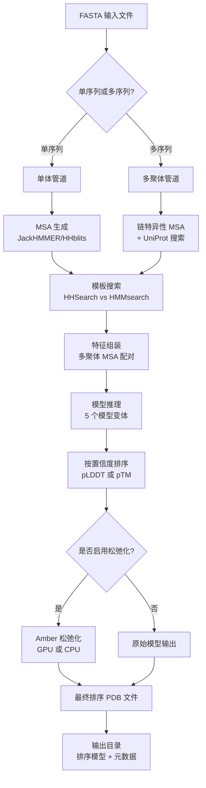

---
slug:5-running-your-first-prediction
blog_type:normal
---


本页面将指导你使用 AlphaFold-Multimer 执行你的首次蛋白质结构预测。无论是预测单链单体还是多链蛋白质复合物，你都将学习如何配置参数、准备输入序列以及解读结构输出。

假设你已经完成了 [使用 Docker 安装 AlphaFold-Multimer](3-installing-alphafold-multimer-with-docker) 和 [下载遗传数据库与模型参数](4-downloading-genetic-databases-and-model-parameters) 的步骤，我们将完全专注于预测执行工作流。

## 预测工作流架构

AlphaFold-Multimer 预测管道遵循从输入序列到验证结构模型的系统化过程。理解这一架构有助于你预估计算需求和中间输出。



核心预测引擎通过 [run_alphafold.py](run_alphafold.py#L152-L280) 中的 `predict_structure` 函数编排此工作流，该函数处理特征、运行模型推理、执行可选的松弛化，并根据置信度指标对结果进行排序。

来源：[run_alphafold.py](run_alphafold.py#L152-L280)，[README.md](README.md#L205-L240)

## 使用 Docker 运行预测

Docker 为 AlphaFold-Multimer 提供了最精简的执行方法。`run_docker.py` 脚本封装了容器管理，同时通过命令行标志暴露所有关键的预测参数。

### 必要命令参数

最小化的 Docker 调用需要指定输入 FASTA 文件、模板日期截止以及包含已下载数据库和模型参数的数据目录：

```bash
python3 docker/run_docker.py \
  --fasta_paths=T1050.fasta \
  --max_template_date=2020-05-14 \
  --data_dir=$DOWNLOAD_DIR
```

该命令会编译模型（仅在首次运行时）、通过序列比对工具生成 MSA、运行所有 5 个模型预设、按置信度对预测进行排序、应用 Amber 松弛化，并将输出写入默认目录（`/tmp/alphafold/`）。

Docker 脚本 ([run_docker.py](docker/run_docker.py#L112-L160)) 会自动构建相对于你的 `--data_dir` 的数据库路径，确保能正确访问 UniRef90、MGnify、BFD、PDB70 和模板 mmCIF 文件。

来源：[README.md](README.md#L205-L240)，[run_docker.py](docker/run_docker.py#L112-L160)

## 使用 Shell 脚本运行预测

对于倾向于不使用 Docker 进行原生执行的用户，`run_alphafold.sh` 脚本提供了同等功能，并允许直接控制二进制路径和 GPU 配置。

### Shell 脚本执行

Shell 脚本需要显式指定数据库路径和工具二进制文件，为自定义安装提供了更大的灵活性：

```bash
./run_alphafold.sh \
  -d /path/to/data/dir \
  -o /path/to/output/dir \
  -f T1050.fasta \
  -t 2020-05-14 \
  -m monomer \
  -c full_dbs
```

该脚本会验证参数、设置 GPU 和线程控制的环境变量、为 Python 预测脚本构建适当的命令参数，并执行工作流。它会根据模型预设智能选择 PDB70（单体）和 PDB seqres（多聚体）数据库 [run_alphafold.sh](run_alphafold.sh#L132-L148)。

来源：[run_alphafold.sh](run_alphafold.sh#L1-L195)，[run_alphafold.py](run_alphafold.py#L286-L430)

## 准备输入 FASTA 文件

你的 FASTA 文件结构决定了 AlphaFold 是执行单体还是多聚体预测。正确的序列格式对于准确推理至关重要。

### 单体输入格式

单链预测需要一个简单的、包含单个序列条目的 FASTA 文件：

```fasta
>sequence_name
MKTLLILAVFATAFLVNASSVNGFEAVVDIGKLVQSAVDYITNENIAGHDAVV
```

当 FASTA 包含单个序列时，管道会检测到单体模式，并应用针对单体的模板搜索策略，即使用 HHSearch 针对 PDB70 数据库进行搜索 [run_alphafold.py](run_alphafold.py#L335-L346)。

### 多聚体输入格式

蛋白质复合物需要在同一个 FASTA 文件中包含多个序列条目。序列的数量和排列定义了预测复合物的化学计量比。

**同源寡聚体示例**（具有 3 条相同链的原核蛋白）：

```fasta
>sequence_1
MKTLLILAVFATAFLVNASSVNGFEAVVDIGKLVQSAVDYITNENIAGHDAVV
>sequence_2
MKTLLILAVFATAFLVNASSVNGFEAVVDIGKLVQSAVDYITNENIAGHDAVV
>sequence_3
MKTLLILAVFATAFLVNASSVNGFEAVVDIGKLVQSAVDYITNENIAGHDAVV
```

**异源寡聚体示例**（来源未知的 A2B3 复合物）：

```fasta
>sequence_1
MKTLLILAVFATAFLVNASSVNGFEAVVDIGKLVQSAVDYITNENIAGHDAVV
>sequence_2
MKTLLILAVFATAFLVNASSVNGFEAVVDIGKLVQSAVDYITNENIAGHDAVV
>sequence_3
GILQTVVTIYNPGGNTGQYAPNGTTRVYYTATVTPSVATGTLTS
>sequence_4
GILQTVVTIYNPGGNTGQYAPNGTTRVYYTATVTPSVATGTLTS
>sequence_5
GILQTVVTIYNPGGNTGQYAPNGTTRVYYTATVTPSVATGTLTS
```

对于多聚体预测，`--is_prokaryote_list` 标志控制 MSA 配对策略，由于基于操纵子的基因共表达，原核复合物可以从更激进的配对中受益 [README.md](README.md#L300-L370)。

来源：[README.md](README.md#L300-L370)，[run_alphafold.py](run_alphafold.py#L46-L57)

## 模型预设配置

AlphaFold-Multimer 提供了四种针对不同预测场景优化的独特模型预设。选择合适的预设可以在计算成本和预测准确性之间取得平衡。

| 模型预设 | 描述 | 使用场景 | 计算成本 |
|--------------|-------------|----------|-------------------|
| `monomer` | 无集成的原始 CASP14 模型 | 标准单体预测 | 基线 |
| `monomer_casp14` | 具有 8 倍集成的 CASP14 模型 | 复现 CASP14 结果 | 约基线 8 倍 |
| `monomer_ptm` | 带有成对置信度 pTM 头的单体模型 | 需要评估结构域堆积的单体 | 基线 |
| `multimer` | 用于蛋白质复合物的 AlphaFold-Multimer | 蛋白质-蛋白质相互作用、寡聚体 | 基线 |

<CgxTip>`monomer_casp14` 预设在 8 倍计算成本下仅提供微小的精度提升（CASP14 上 +0.1 GDT），因此它主要用于基准测试而非常规预测。</CgxTip>

主函数 ([run_alphafold.py](run_alphafold.py#L365-L375)) 根据选定的预设实例化模型运行器，加载相应的参数和配置。多聚体模式会自动触发多聚体特有的数据管道 ([run_alphafold.py](run_alphafold.py#L377-L382))。

来源：[run_alphafold.py](run_alphafold.py#L102-L106)，[README.md](README.md#L240-L270)

## 数据库预设配置

数据库预设控制 MSA 生成过程，在预测速度与从遗传数据库中捕获的进化信息深度之间进行权衡。

| 数据库预设 | 使用的数据库 | 硬件要求 | 速度与质量 |
|-----------------|----------------|------------------------|------------------|
| `full_dbs` | BFD, UniClust30, UniRef90, MGnify | 12 个 vCPU，85 GB RAM，3 TB 磁盘 | 较慢，质量较高 |
| `reduced_dbs` | 小型 BFD, UniRef90, MGnify | 8 个 vCPU，8 GB RAM，600 GB 磁盘 | 较快，质量降低 |

`reduced_dbs` 预设使用紧凑的 BFD 子集 ([small_bfd_database_path](run_alphafold.py#L80-L81)) 代替完整的 BFD 数据库，将存储需求从 2.7 TB 大幅降低至 600 GB。此模式非常适合初步探索性预测或资源受限的环境。

主函数 ([run_alphafold.py](run_alphafold.py#L291-L304)) 会根据预设验证数据库路径选择，确保所选配置具有相应的数据库。

来源：[run_alphafold.py](run_alphafold.py#L97-L101)，[README.md](README.md#L270-L290)

## 批量处理多个目标

AlphaFold-Multimer 支持在单次执行中处理多个预测目标，在保持独立输出目录的同时自动处理顺序预测。

### 多单体处理

用逗号分隔单体 FASTA 路径进行顺序处理：

```bash
python3 docker/run_docker.py \
  --fasta_paths=monomer1.fasta,monomer2.fasta,monomer3.fasta \
  --max_template_date=2021-11-01 \
  --model_preset=monomer \
  --data_dir=$DOWNLOAD_DIR
```

每个 FASTA 文件必须具有唯一的基本文件名，因为这决定了输出子目录的名称 ([run_alphafold.py](run_alphafold.py#L317-L320))。

### 多多聚体处理

使用并行的原核生物标志处理多个复合物：

```bash
python3 docker/run_docker.py \
  --fasta_paths=multimer1.fasta,multimer2.fasta \
  --is_prokaryote_list=true,true \
  --max_template_date=2021-11-01 \
  --model_preset=multimer \
  --data_dir=$DOWNLOAD_DIR
```

`is_prokaryote_list` 必须与 `fasta_paths` 的长度匹配，为每个目标提供一个布尔值 ([run_alphafold.py](run_alphafold.py#L323-L332))。

<CgxTip>对于批量处理大量目标，考虑使用 `--use_precomputed_msas` 标志来缓存 MSA 结果。这通过跳过昂贵的序列比对步骤，可以显著加快重新运行的速度。</CgxTip>

来源：[README.md](README.md#L398-L420)，[run_alphafold.py](run_alphafold.py#L116-L122)

## 理解预测输出

AlphaFold-Multimer 为每个预测目标生成一套全面的输出，这些输出组织在你指定的输出路径内以目标命名的子目录中。

### 输出目录结构

```
target_name/
├── features.pkl              # 模型推理的输入特征
├── ranked_0.pdb             # 置信度最高的预测
├── ranked_1.pdb             # 置信度第二高
├── ranked_2.pdb
├── ranked_3.pdb
├── ranked_4.pdb             # 置信度最低的预测
├── ranking_debug.json       # 置信度分数和模型映射
├── relaxed_model_1.pdb     # Amber 松弛化后的结构
├── relaxed_model_2.pdb
├── relaxed_model_3.pdb
├── relaxed_model_4.pdb
├── relaxed_model_5.pdb
├── result_model_1.pkl       # 原始模型输出（距离图，pLDDT）
├── result_model_2.pkl
├── result_model_3.pkl
├── result_model_4.pkl
├── result_model_5.pkl
├── timings.json             # 各部分执行时间
├── unrelaxed_model_1.pdb    # 原始模型结构
├── unrelaxed_model_2.pdb
├── unrelaxed_model_3.pdb
├── unrelaxed_model_4.pdb
├── unrelaxed_model_5.pdb
└── msas/                    # MSA 比对文件
    ├── bfd_uniclust_hits.a3m
    ├── mgnify_hits.sto
    └── uniref90_hits.sto
```

### 关键输出文件说明

**ranked_0.pdb**：这是你的主要预测结果——经过可选 Amber 松弛化后置信度最高的模型。排序使用预测的 LDDT (pLDDT) 分数作为单体模型，以及预测的 TM-score (pTM) + 界面 TM-score (ipTM) 作为多聚体模型 ([run_alphafold.py](run_alphafold.py#L265-L275))。

**ranking_debug.json**：包含用于模型排序的置信度分数，并将排序位置映射回原始模型名称。对于单体，它显示 `plddts`；对于多聚体，它显示 `iptm+ptm` 复合分数 ([run_alphafold.py](run_alphafold.py#L277-L280))。

**result_model_*.pkl**：这些 pickle 文件包含超出原子坐标的详细模型输出，包括距离图（距离预测）、每个残基的置信度分数以及用于 pTM 模型的成对比对误差矩阵 ([run_alphafold.py](run_alphafold.py#L244-L250))。

### 置信度指标

pLDDT 分数（预测的 LDDT）范围从 0 到 100，数值越高表示置信度越高。这些分数嵌入在输出 PDB 文件的 B-factor 列中，以便在分子图形工具中进行可视化。pLDDT > 90 的区域通常是高置信度的，而 < 50 的数值则表示不确定性。

对于多聚体模型，`iptm+ptm` 分数结合了界面 TM-score（结构域堆积）和整体 TM-score（全局折叠），为蛋白质复合物提供了更全面的置信度评估。

来源：[run_alphafold.py](run_alphafold.py#L244-L280)，[README.md](README.md#L428-L510)

## 完整工作流示例

让我们通过 Docker 来演示使用真核生物的异源二聚体蛋白质复合物进行完整预测的过程。

### 步骤 1：准备输入 FASTA

创建包含两条链序列的 `heterodimer.fasta`：

```fasta
>chain_A_receptor
MKTLLILAVFATAFLVNASSVNGFEAVVDIGKLVQSAVDYITNENIAGHDAVV
>chain_B_ligand
GILQTVVTIYNPGGNTGQYAPNGTTRVYYTATVTPSVATGTLTS
```

### 步骤 2：配置参数

我们将使用多聚体模型、简化的数据库预设以加快执行速度，并指定该复合物为真核生物来源：

```bash
python3 docker/run_docker.py \
  --fasta_paths=heterodimer.fasta \
  --is_prokaryote_list=false \
  --max_template_date=2021-11-01 \
  --model_preset=multimer \
  --db_preset=reduced_dbs \
  --data_dir=$DOWNLOAD_DIR \
  --output_dir=/path/to/output
```

### 步骤 3：监控执行

管道会记录每个阶段的进度：

1. **MSA 生成**：JackHMMER 搜索 UniRef90 和 MGnify；HHblits 搜索小型 BFD
2. **多聚体特定处理**：用于配对的 UniProt 搜索，链特征合并
3. **模板搜索**：针对模板的 PDB seqres 进行 HMMsearch
4. **特征组装**：MSA 配对和链组装特征
5. **模型推理**：5 个使用不同随机种子的模型预测
6. **Amber 松弛化**：结构优化（如果启用）
7. **排序**：按 `iptm+ptm` 复合分数排序

### 步骤 4：检查结果

导航到输出目录并检查顶级预测：

```bash
cd /path/to/output/heterodimer
# 查看置信度最高的预测
less ranked_0.pdb
# 检查置信度指标
cat ranking_debug.json
```

使用 PyMOL 或 ChimeraX 通过 pLDDT 着色的残基可视化结构，以识别高置信度区域与柔性环状结构的对比。

来源：[README.md](README.md#L300-L440)，[run_alphafold.py](run_alphafold.py#L152-L280)

## 常见故障排除

### MSA 生成期间内存不足

症状：JackHMMER 或 HHblits 在比对过程中失败。

解决方案：切换到 `--db_preset=reduced_dbs` 以使用紧凑的 BFD 数据库，将内存需求从 85 GB 降低到 8 GB [README.md](README.md#L270-L290)。

### 松弛化失败

症状：Amber 松弛化崩溃或无限期挂起。

解决方案：使用 `--run_relax=false` 禁用松弛化以获取原始模型预测。或者，如果可用，尝试使用 `--use_gpu_relax=true` 进行 GPU 松弛化，因为 GPU 加速的松弛化显著更快且更稳定 [run_alphafold.py](run_alphafold.py#L123-L131)。

### FASTA 基本文件名重复

症状：错误 "All FASTA paths must have a unique basename."

解决方案：确保 `--fasta_paths` 中的每个 FASTA 文件都有一个不同的文件名（不带路径扩展名）。基本文件名用于输出目录命名 [run_alphafold.py](run_alphafold.py#L317-L320)。

### 原核生物标志计数不正确

症状：错误 "--is_prokaryote_list must either be omitted or match length of --fasta_paths."

解决方案：为每个 FASTA 文件提供一个布尔值，用逗号分隔。对于真核生物或未知来源，默认为 false [run_alphafold.py](run_alphafold.py#L323-L332)。

### 未检测到 GPU

症状：TensorFlow/JAX 无法初始化 GPU 设备。

解决方案：使用 `--gpu_devices` 标志验证 GPU 可见性，并确保正确安装了 CUDA 驱动程序。脚本会设置 `CUDA_VISIBLE_DEVICES` 环境变量 [run_alphafold.sh](run_alphafold.sh#L131-L141)。

## 后续步骤

成功运行你的首次预测后，你可以加深对 AlphaFold-Multimer 架构和优化策略的理解：

- 探索 [AlphaFold-Multimer 架构概述](6-alphafold-multimer-architecture-overview) 以了解多聚体模型与单体预测的区别
- 了解 [多序列比对 (MSA) 配对](9-multiple-sequence-alignment-msa-pairing) 以改进复合物预测
- 理解 [每个残基的置信度 (pLDDT)](16-per-residue-confidence-plddt) 和 [预测 TM-Score (pTM)](17-predicted-tm-score-ptm) 以更好地解释预测质量
- 查看 [数据库预设](22-database-presets-reduced_dbs-vs-full_dbs) 以针对你的工作流优化速度与准确性的权衡