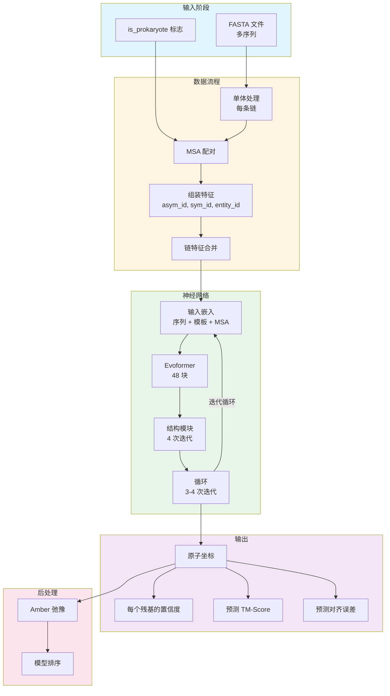
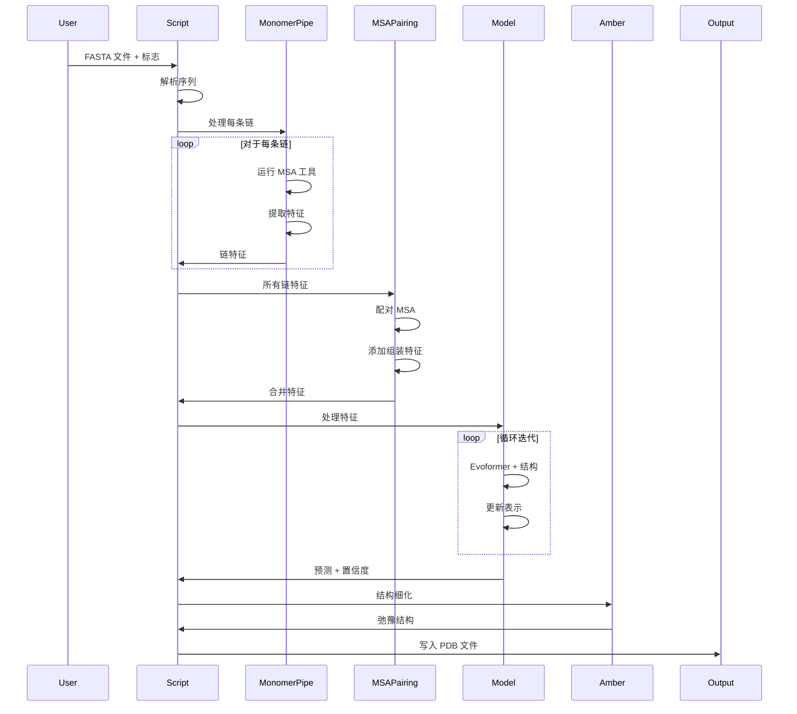

---
slug:6-alphafold-multimer-architecture-overview
blog_type:normal
---


AlphaFold-Multimer 代表了 AlphaFold v2.0 架构的复杂扩展，专门设计用于预测蛋白质复合物结构。该系统解决了预测多个蛋白质链如何组装和相互作用的基本挑战，引入了用于异源和同源复合物预测的新颖架构组件，同时保持与单体预测流程的兼容性。该架构利用来自成对多序列比对（MSA）的进化信息、链特异性编码和专门的神经网络模块来捕获对准确多聚体结构预测至关重要的链间相互作用。

来源：[run_alphafold.py](run_alphafold.py#L1-L50), [README.md](README.md#L1-L30)

## 系统架构

AlphaFold-Multimer 系统遵循模块化架构，通过多个阶段处理输入序列，最终生成蛋白质复合物的 3D 原子坐标和置信度指标。该系统将新颖的多聚体特定组件与经过验证的 AlphaFold 骨干相结合，创建了一个能够处理单体和多聚体预测任务的统一流程。




来源：[run_alphafold.py](run_alphafold.py#L286-L350), [pipeline_multimer.py](alphafold/data/pipeline_multimer.py#L241-L289)

## 核心架构组件

### 多聚体数据流程

多聚体数据流程扩展了单体流程，增加了专门用于处理多条蛋白质链的处理逻辑。主要创新包括每条链的特征提取、MSA 配对算法和组装特征生成。该流程通过单体流程独立处理每条链，然后通过复杂的配对逻辑合并特征，该逻辑保留了跨链的进化耦合信息。

`pipeline_multimer.py` 中的 `DataPipeline` 类协调整个过程，管理原始序列到神经网络输入的转换。它使用适当的特征编码策略处理同源物（相同链）和异源物（不同链），包括用于区分链及其关系的不对称链 ID（`asym_id`）、对称 ID（`sym_id`）和实体 ID（`entity_id`）。

来源：[pipeline_multimer.py](alphafold/data/pipeline_multimer.py#L170-L246), [pipeline_multimer.py](alphafold/data/pipeline_multimer.py#L119-L160)

### MSA 配对模块

AlphaFold-Multimer 的一个关键创新是 MSA 配对系统，它基于进化关系对齐来自不同链的序列。`msa_pairing.py` 模块实现了复杂的算法，使用两种主要策略跨链配对序列：

1. **原核配对**：通过基因组邻近性（基于操纵子的配对）匹配序列
2. **真核配对**：通过物种和遗传相似性匹配序列

配对算法识别来自不同链且可能共进化的序列，保留对准确复合物结构预测至关重要的链间约束。此信息被编码为输入神经网络的成对 MSA 特征。

来源：[msa_pairing.py](alphafold/data/msa_pairing.py#L325-L394), [msa_pairing.py](alphafold/data/msa_pairing.py#L574-L607)

### 神经网络架构

神经网络架构基于 AlphaFold v2.0 基础，并进行了多聚体特定的增强。核心组件包括：

- **嵌入和 Evoformer**：通过 48 个处理 MSA、单链和成对表示的 Evoformer 块，将原始特征转换为丰富的表示。多聚体版本包括捕获链间位置关系的链相对编码。

- **结构模块**：使用不变点注意力（IPA）通过迭代细化将表示转换为 3D 原子坐标。多聚体版本通过适当的坐标变换支持多条链。

- **循环机制**：通过将输出作为输入反馈来迭代细化预测，通常进行 3-4 次迭代，允许模型逐步提高结构准确性。

来源：[modules_multimer.py](alphafold/model/modules_multimer.py#L294-L410), [modules_multimer.py](alphafold/model/modules_multimer.py#L411-L495), [folding_multimer.py](alphafold/model/folding_multimer.py#L556-L631)

### 链相对编码

多聚体架构引入了复杂的位置编码，用于捕获链关系。`EmbeddingsAndEvoformer` 类中的 `_relative_encoding` 方法生成区分链内残基对与链间残基对的特征，包括：

- **同链指示符**：识别两个残基是否属于同一条链的二进制特征
- **相对链索引**：复合物中链的编码相对位置
- **同实体类型**：指示链是否代表相同蛋白质实体的特征

这些编码对于网络学习正确的链堆积和界面几何结构至关重要。

来源：[modules_multimer.py](alphafold/model/modules_multimer.py#L507-L577)

## 模型预设和配置

AlphaFold-Multimer 提供了针对不同用例优化的不同模型预设。该系统支持四种具有不同配置的主要模型预设：

| 预设 | 模型 | 用例 | 主要特性 |
|--------|--------|----------|--------------|
| **monomer** | model_1-5 | 单链预测 | 5 个集成，标准配置 |
| **monomer_casp14** | model_1-5 | CASP14 竞赛 | 8 个集成，增强多样性 |
| **monomer_ptm** | model_1_ptm-5_ptm | 带置信度指标的单体 | pTM 和 PAE 输出头 |
| **multimer** | model_1_multimer-5_multimer | 蛋白质复合物 | 链编码，成对 MSA，专用结构模块 |

多聚体配置使用 48 个 Evoformer 块（与单体模型中的 48 个相比），并具有专门用于处理多链输入的注意力机制。主要的配置差异包括 `use_chain_relative` 标志和多聚体特定的模板处理。

来源：[config.py](alphafold/model/config.py#L39-L124), [config.py](alphafold/model/config.py#L435-L500)

## 流程中的数据流

完整的预测流程遵循从原始输入到细化结构的系统流程：



来源：[run_alphafold.py](run_alphafold.py#L152-L286), [run_alphafold.py](run_alphafold.py#L286-L432)

## 多聚体特定创新

### 组装特征生成

`add_assembly_features` 函数生成对于模型理解链组织至关重要的链识别特征：

- **asym_id**：复合物中每条链的唯一标识符
- **sym_id**：同源复合物的对称标识符
- **entity_id**：将代表相同蛋白质序列的链分组

这些特征使模型能够区分不同的链并学习适当的界面几何结构。

来源：[pipeline_multimer.py](alphafold/data/pipeline_multimer.py#L119-L158)

### 链特征合并

系统采用复杂的合并策略来组合来自多条链的特征。`msa_pairing.py` 中的 `merge_chain_features` 函数为未配对的特征创建块对角线表示，并连接配对的特征，在保留链间约束的同时允许灵活处理异源复合物。

<CgxTip>链特征合并对未配对的 MSA 使用块对角线连接，对配对的 MSA 使用直接连接，确保在有效表示链之间稀疏成对关系的同时保留进化耦合信息。</CgxTip>

来源：[msa_pairing.py](alphafold/data/msa_pairing.py#L498-L561), [msa_pairing.py](alphafold/data/msa_pairing.py#L574-L607)

### 结构模块适配

`folding_multimer.py` 中的多聚体结构模块扩展了单体版本，支持多链坐标系。主要差异包括：

- **多链 Rigid3 变换**：处理跨多条链的坐标系
- **链感知注意力**：不变点注意力（IPA）在所有残基上操作，并进行适当的掩码处理
- **统一损失计算**：跨所有链计算损失，并进行适当的加权

这些适配确保结构模块能够同时优化所有链的坐标，同时遵守物理约束和界面几何结构。

来源：[folding_multimer.py](alphafold/model/folding_multimer.py#L188-L378), [folding_multimer.py](alphafold/model/folding_multimer.py#L556-L631)

## 架构对比：单体 vs 多聚体

| 方面 | 单体 | 多聚体 |
|--------|---------|----------|
| **输入** | 单条序列 | 多条序列 |
| **MSA 处理** | 单个 MSA | 跨链的成对 MSA |
| **特征编码** | 基于残基 | 残基 + 链识别 |
| **位置编码** | 相对残基索引 | 链相对 + 实体编码 |
| **模板搜索** | PDB70 | PDB seqres (hmmsearch) |
| **Evoformer 块** | 48 | 48 个带链感知注意力 |
| **结构输出** | 单链坐标系 | 多链坐标系 |
| **置信度指标** | pLDDT | pLDDT + 界面特定指标 |

<CgxTip>多聚体架构重用了单体经过验证的 Evoformer 和结构模块实现，但增加了用于链合并的预处理和用于界面特定指标的后处理，确保了代码效率同时保持了架构一致性。</CgxTip>

来源：[modules_multimer.py](alphafold/model/modules_multimer.py#L15-L30), [config.py](alphafold/model/config.py#L39-L124)

## 项目结构和组织

AlphaFold-Multimer 代码库遵循模块化组织，分离关注点并实现高效开发：

```
alphafold/
├── common/           # 共享工具和常量
├── data/             # 数据处理和 MSA 处理
│   ├── pipeline_multimer.py  # 多聚体特定流程
│   └── msa_pairing.py        # MSA 配对算法
├── model/            # 神经网络架构
│   ├── modules_multimer.py   # 多聚体模型组件
│   ├── folding_multimer.py   # 多聚体结构模块
│   └── config.py             # 模型配置
└── relax/            # 使用 Amber 进行结构细化
```

这种组织方式促进了多聚体特定组件的独立开发，同时利用了强大的单体基础设施。

来源：[get_repo_structure](.), [modules_multimer.py](alphafold/model/modules_multimer.py#L15-L30)

## 技术实现亮点

多聚体实现展示了几种先进的软件工程实践：

1. **配置驱动设计**：所有模型变体共享相同的代码库，通过配置字典（`CONFIG_DIFFS` 和 `CONFIG_MULTIMER`）进行区分

2. **模块化组件**：每个主要组件（数据流程、模型、结构模块）都可独立测试和重用

3. **高效数据结构**：使用块对角线矩阵和稀疏表示来处理大型 MSA 数据集

4. **JAX/Haiku 框架**：具有自动微分和即时编译的纯函数式编程模型

5. **向后兼容性**：多聚体流程可以处理单体输入，提供统一接口

来源：[config.py](alphafold/model/config.py#L65-L124), [modules_multimer.py](alphafold/model/modules_multimer.py#L411-L495)

## 性能和可扩展性

多聚体架构在处理蛋白质复合物日益增加的复杂性时保持了计算效率：

- **MSA 采样**：在 JAX 模型内实现，以实现高效的循环和集成

- **GPU 加速**：针对 GPU 执行优化的完整流程，可选择基于 GPU 的 Amber 弛豫

- **批处理**：支持处理多个序列并优化内存使用

- **数据库预设**：针对简化版与完整版基因数据库的灵活配置

系统通过数据库预设（`reduced_dbs` vs `full_dbs`）和模型集成大小提供了速度和准确性之间的权衡。

来源：[run_alphafold.py](run_alphafold.py#L97-L124), [modules_multimer.py](alphafold/model/modules_multimer.py#L253-L286)

## 后续步骤

此架构概述为理解 AlphaFold-Multimer 的设计原则奠定了基础。有关详细的实现细节：

- 通过 [数据流程和特征处理](7-data-pipeline-and-feature-processing) 深入了解数据流程
- 在 [多序列比对 (MSA) 配对](9-multiple-sequence-alignment-msa-pairing) 中探索创新的 MSA 配对算法
- 在 [Evoformer 和嵌入模块](12-evoformer-and-embedding-modules) 中了解神经网络内部原理
- 在 [结构模块和不变点注意力](13-structure-module-and-invariantpointattention) 中学习结构生成
- 在 [每个残基的置信度 (pLDDT)](16-per-residue-confidence-plddt) 中查看置信度指标