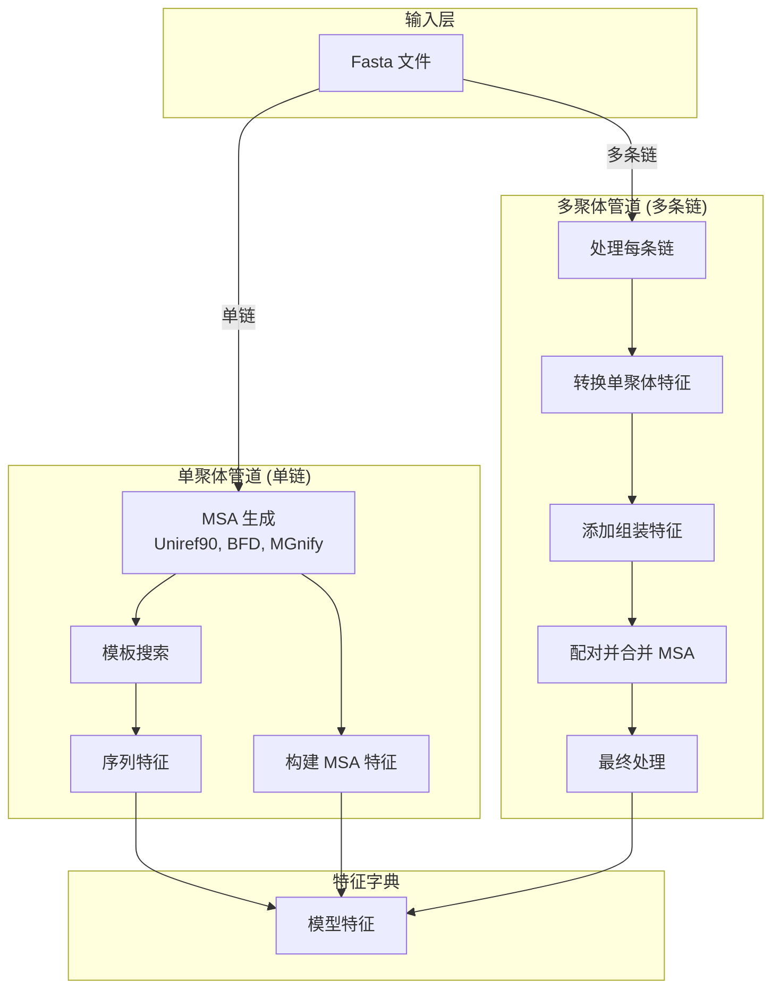
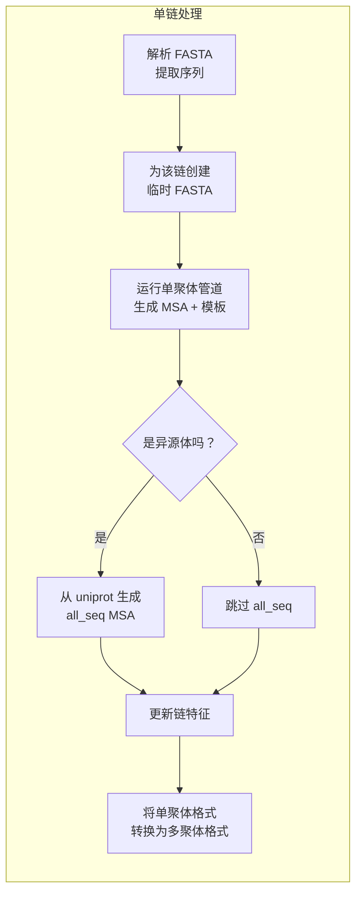
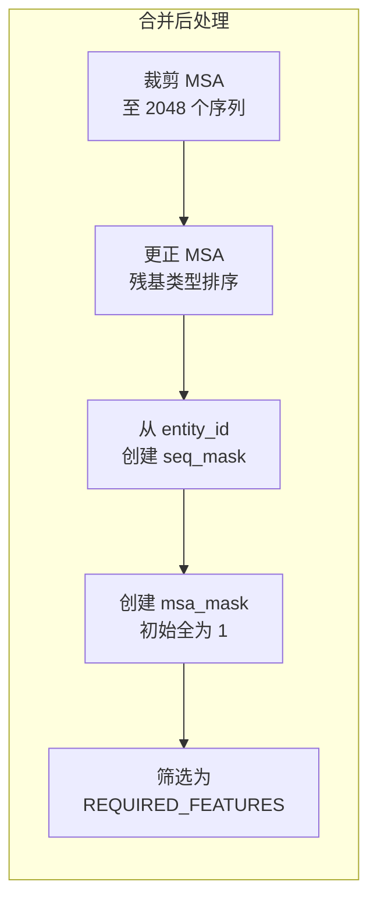
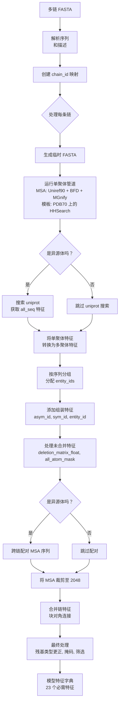

---
slug:7-data-pipeline-and-feature-processing
blog_type:normal
---

AlphaFold-Multimer 中的数据管道和特征处理架构将原始蛋白质序列输入转换为深度学习模型所需的结构化特征张量。本文详细检查了从序列输入，经多序列比对（MSA）生成、模板搜索和多聚体特异性处理，到最终特征组装的完整数据流。对于寻求优化预测性能或将系统扩展到新用例的开发者来说，理解此管道至关重要。

来源：[pipeline.py](alphafold/data/pipeline.py#L15), [pipeline_multimer.py](alphafold/data/pipeline_multimer.py#L15)

## 整体架构

数据管道遵循分阶段架构，在单聚体和多聚体处理路径之间进行分支。多聚体管道建立在单聚体基础之上，增加了对多条链、链间 MSA 配对和组装级特征的专门处理。主要的架构区别在于，多聚体管道如何通过单聚体管道独立处理每条链，然后合并并增强特征以捕获链间关系。

这种架构实现了代码复用——多聚体预测中的每条链都利用成熟的单聚体管道进行 MSA 生成和模板搜索——同时允许多聚体特异性增强，以捕获蛋白质-蛋白质相互作用的独特挑战。

来源：[pipeline.py#L116](alphafold/data/pipeline.py#L116), [pipeline_multimer.py#L170](alphafold/data/pipeline_multimer.py#L170)

## 单聚体数据管道

`pipeline.py` 中的 `DataPipeline` 类负责编排单链蛋白质的 MSA 生成和模板搜索。它针对多个序列数据库（Uniref90、BFD/UniClust30、MGnify）初始化比对工具，以及模板搜索器（HHSearch 或 HMMsearch）以识别同源结构。管道按顺序执行这些工具，对 MSA 序列进行去重，并构建包含独热编码的氨基酸类型、残基索引、跟踪比对中缺口的删除矩阵以及模板特征的特征字典。

process 方法编排了三个主要的计算步骤：针对多个数据库的 MSA 生成、使用 HHSearch 针对 PDB70 数据库的模板搜索，以及将序列级特征与比对数据结合的特征构建。关键的资源管理决策包括根据 `use_small_bfd` 标志使用完整的 BFD/UniClust30 数据库还是缩减的 small_bfd 数据库，这在预测质量和计算成本之间进行权衡。

来源：[pipeline.py#L155](alphafold/data/pipeline.py#L155), [pipeline.py#L232](alphafold/data/pipeline.py#L232-L248)

### 数据库来源和功能

| 数据库 | 工具 | 目的 | 最大命中数 (默认) |
|----------|------|---------|-------------------|
| Uniref90 | Jackhmmer | 多样化、高质量序列 | 10,000 |
| BFD | HHBlits/Jackhmmer | 宏基因组序列 (完整) | 可变 |
| Small BFD | Jackhmmer | 宏基因组序列 (缩减) | 可变 |
| MGnify | Jackhmmer | 环境序列 | 501 |
| PDB70 | HHSearch | 结构模板 | 可变 |

每个数据库都有不同的用途：Uniref90 提供多样化、高质量的序列，BFD 增加了宏基因组多样性，MGnify 贡献环境序列，而模板数据库识别用于基于模板的建模的结构同源物。管道连接来自所有三个来源的 MSA，去除重复序列以创建模型使用的最终比对。

来源：[pipeline.py#L119](alphafold/data/pipeline.py#L119-L153), [pipeline.py#L237](alphafold/data/pipeline.py#L237-L243)

## 多聚体数据管道

`pipeline_multimer.py` 中的多聚体 `DataPipeline` 类扩展了单聚体架构以处理包含多条链的蛋白质复合物。构造函数接受一个单聚体数据管道实例，将其委托用于每条链的处理，以及用于 uniprot 数据库搜索的额外参数。关键的创新在于能够通过同一个统一的管道处理异源复合物（不同序列）和同源复合物（相同序列）。

process 方法解析多序列 FASTA 文件，创建链 ID 映射，并遍历每条链。对于每个唯一序列，它在仅包含该链的临时 FASTA 文件上调用单聚体管道的 process 方法。对于异源体（不同序列），它还会从 uniprot 数据库生成 "all_seq" MSA 特征，这有助于在配对阶段实现跨链的更复杂的序列配对。每条链的特征从单聚体格式转换为多聚体格式，然后添加组装特征以区分复合物内的链。

来源：[pipeline_multimer.py#L173](alphafold/data/pipeline_multimer.py#L173-L179), [pipeline_multimer.py#L241](alphafold/data/pipeline_multimer.py#L241-L288)

### 链处理流程

对于输入 FASTA 中的每条链，管道执行多阶段转换：

异源体检测在过程早期发生（检查唯一序列是否 > 1），这决定了是否投入计算资源进行额外的 uniprot 搜索。这种优化确保同源体和单聚体跳过不必要的工作。

来源：[pipeline_multimer.py#L197](alphafold/data/pipeline_multimer.py#L197-L222), [pipeline_multimer.py#L260](alphafold/data/pipeline_multimer.py#L260)

## 单聚体到多聚体特征转换

`convert_monomer_features` 函数连接了单聚体和多聚体特征表示。单聚体特征对氨基酸类型使用独热编码，并包含用于类似批处理的前导维度。多聚体模型期望不同的编码：整数氨基酸索引（而不是独热编码）、删除不必要的前导维度，以及不同的特征命名约定。

关键的转换包括使用 `np.argmax` 将独热编码的 `aatype` 转换回整数索引，从 `sequence`、`domain_name`、`num_alignments` 和 `seq_length` 等特征中删除前导维度，并将 `template_all_atom_masks` 重命名为 `template_all_atom_mask`。转换还应用了从 HHBlits 氨基酸类型排序到 AlphaFold 内部排序的映射，用于模板特征。

来源：[pipeline_multimer.py#L72](alphafold/data/pipeline_multimer.py#L72-L94)

### 特征转换摘要

| 特征类型 | 单聚体格式 | 多聚体格式 | 转换 |
|--------------|----------------|-----------------|----------------|
| aatype | 独热编码 (N_res, 20) | 整数 (N_res,) | argmax + 转换为 int32 |
| template_aatype | 独热编码 | 整数 | argmax + 重映射 |
| sequence | (1,) bytes | bytes | 删除前导维度 |
| domain_name | (1,) bytes | bytes | 删除前导维度 |
| num_alignments | (N_res,) int32 | int | 删除前导维度 |
| seq_length | (N_res,) int32 | int | 删除前导维度 |

这些转换确保与多聚体模型架构的兼容性，同时保留单聚体管道输出的所有相关信息。

来源：[pipeline_multimer.py#L78](alphafold/data/pipeline_multimer.py#L78-L93)

## 组装特征和链标识

`add_assembly_features` 函数建立了区分链、实体和复合物内对称性的层次结构。这对于模型理解哪些残基属于哪些链，以及哪些链代表相同的多肽序列（同源体）或不同序列（异源体）至关重要。

该函数按序列身份对链进行分组，为每个唯一序列分配一个 entity_id。在每个实体内，链接收 sym_id 值（1, 2, 3...）表示对称副本。每条链还在整个复合物中接收一个唯一的 asym_id。这种三层命名系统（entity_id、sym_id、asym_id）使模型能够推理结构对称性，并区分异源体内的不同多肽类型。

<CgxTip>entity_id 系统是多聚体预测的基础——它决定了模型在推理期间将哪些链视为相同，直接影响结构生成期间应用的对称约束。</CgxTip>

来源：[pipeline_multimer.py#L119](alphafold/data/pipeline_multimer.py#L119-L155)

## MSA 配对策略

AlphaFold-Multimer 的核心创新在于它能够在链之间配对 MSA 序列，识别在其他物种中作为复合物存在的同源蛋白质。`feature_processing.py` 中的 `pair_and_merge` 函数编排此过程，调用 `msa_pairing` 模块中的函数基于遗传距离和序列相似性匹配序列。

配对仅针对异源体（而非同源体/单聚体）发生。该过程检查所有链的 MSA，并识别可能代表不同物种中相同直系同源蛋白质复合物的序列。这是通过两种互补策略实现的：基于登录号的匹配（比较 UniProt 标识符以检测直系同源物）和序列相似性匹配（当登录号 ID 不可用时比较比对的序列）。原核和真核复合物使用不同的配对策略，这是由于基因组组织和操纵子结构的差异。

来源：[feature_processing.py#L48](alphafold/data/feature_processing.py#L48-L81), [msa_pairing.py#L325](alphafold/data/msa_pairing.py#L325-L393)

### 配对机制

MSA 配对模块实现了两种主要的匹配算法：

| 机制 | 输入 | 逻辑 | 适用性 |
|-----------|-------|-------|---------------|
| 登录号 ID 匹配 | UniProt 登录号 | 对 ID 编码，匹配具有相同或相似 ID 的序列 | 当 UniProt 登录号可用时 |
| 遗传距离匹配 | MSA 序列 | 计算序列比对，配对低于相似性阈值的序列 | 当登录号不可用时的回退方案 |
| 序列相似性 | MSA 序列 | 在比对位置直接比较序列 | 原核生物特异性增强 |

基于登录号的方法使用编码映射，其中相似的 UniProt ID（例如 `P12345` 和 `P12346`）被配对，从而捕获进化关系。遗传距离方法计算 MSA 序列的差异，配对低于 `SEQUENCE_SIMILARITY_CUTOFF` (0.9) 的序列。原核复合物受益于基于操纵子的推断，其中共定位基因更有可能形成复合物。

来源：[msa_pairing.py#L183](alphafold/data/msa_pairing.py#L183-L226), [msa_pairing.py#L289](alphafold/data/msa_pairing.py#L289-L323)

## 特征处理管道

在 MSA 配对之后，`pair_and_merge` 函数编排几个最终处理步骤，然后将特征字典返回给模型。这包括裁剪 MSA 以适应内存限制，将链特征合并为统一的表示，以及应用模型架构所需的最终转换。

process_unmerged_features 函数在合并之前准备每条链的特征，将删除矩阵从整数转换为浮点数，计算删除均值，基于氨基酸类型添加虚拟的 all_atom_positions 和掩码，以及添加组装级元数据。然后，crop_chains 函数将每条链的 MSA 减少到 MSA_CROP_SIZE (2048) 个序列，平衡信息密度与内存限制。对于配对的异源体，此裁剪保留配对结构。

merge_chain_features 函数将所有链组合成单个特征字典，沿适当的维度连接特征，并为不应跨链混合的特征（如删除矩阵）创建块对角结构。最终的 process_final 函数应用基本转换：更正 MSA 残基类型排序，创建序列和 MSA 掩码，并筛选以仅包含 REQUIRED_FEATURES 中的特征。

来源：[feature_processing.py#L48](alphafold/data/feature_processing.py#L48-L81), [feature_processing.py#L203](alphafold/data/feature_processing.py#L203-L232)

### 最终特征处理步骤

`process_final` 函数确保特征字典与模型期望的完全匹配。MSA 残基类型更正使用 `residue_constants.MAP_HHBLITS_AATYPE_TO_OUR_AATYPE` 从 HHBlits 氨基酸排序映射到 AlphaFold 内部排序。序列掩码使用 entity_id 字段（填充为 0）来创建指示有效残基的二进制掩码。最终筛选步骤删除模型不需要的任何中间特征，仅保留 REQUIRED_FEATURES 中的 23 个特征。

来源：[feature_processing.py#L165](alphafold/data/feature_processing.py#L165-L201)

## 所需特征集

模型恰好需要 23 个特征，每个特征在架构中都有特定用途。这些特征分为序列级特征、MSA 级特征、模板特征和元数据特征。REQUIRED_FEATURES 常量定义了此集合，确保数据管道和模型之间的兼容性。

| 特征类别 | 特征 | 目的 |
|------------------|----------|---------|
| 序列 | aatype, residue_index, seq_length, seq_mask | 主要序列信息 |
| MSA | msa, msa_mask, deletion_matrix, deletion_mean, num_alignments | 进化信息 |
| 模板 | template_aatype, template_all_atom_mask, template_all_atom_positions | 结构模板 |
| 组装 | entity_id, entity_mask, asym_id, sym_id, assembly_num_chains | 链标识和组织 |
| 训练 | bert_mask, cluster_bias_mask, mem_peak, queue_size | 训练特定（推理中未使用） |

all_atom_mask 和 all_atom_positions 特征是输入的虚拟占位符（零和残基类型特定掩码），因为模型在前向传播期间预测实际的原子坐标。

来源：[feature_processing.py#L24](alphafold/data/feature_processing.py#L24-L33)

## 关键配置参数

几个参数控制数据管道的行为，影响计算资源使用和预测质量：

| 参数 | 默认值 | 位置 | 影响 |
|-----------|---------|----------|--------|
| MSA_CROP_SIZE | 2048 | feature_processing.py | 每条链的最大 MSA 序列数 |
| MAX_TEMPLATES | 4 | feature_processing.py | 使用的最大模板结构数 |
| mgnify_max_hits | 501 | pipeline.py | MGnify 数据库搜索限制 |
| uniref_max_hits | 10000 | pipeline.py | Uniref90 数据库搜索限制 |
| SEQUENCE_SIMILARITY_CUTOFF | 0.9 | msa_pairing.py | 配对序列的阈值 |
| SEQUENCE_GAP_CUTOFF | 0.5 | msa_pairing.py | 配对的最大缺口分数 |

MSA_CROP_SIZE 参数对于多聚体预测尤为重要，因为每条链贡献多达 2048 个序列，对于大型复合物，连接后的 MSA 可能变得非常大。4 的模板限制在结构信息和计算成本之间取得平衡，因为模板处理涉及全原子坐标等昂贵的特征。

来源：[feature_processing.py#L35](alphafold/data/feature_processing.py#L35-L36), [pipeline.py#L130](alphafold/data/pipeline.py#L130-L131)

## 数据流摘要

完整的多聚体数据管道执行从原始序列到模型就绪特征的复杂转换：

<CgxTip>管道的设计实现了渐进式特征丰富：从每条链的进化信息开始，通过 MSA 配对添加链间关系，然后使用适当的链标识元数据组装所有内容。这种分阶段方法允许独立测试和调试每个阶段。</CgxTip>

该架构成功处理了多聚体预测的关键挑战：维护每条链的进化信息，通过序列配对识别链间关系，以及组织特征以捕获结构对称性和链标识。结果是综合的特征表示，使 AlphaFold-Multimer 模型能够推理多条多肽链如何折叠和相互作用以形成功能性蛋白质复合物。