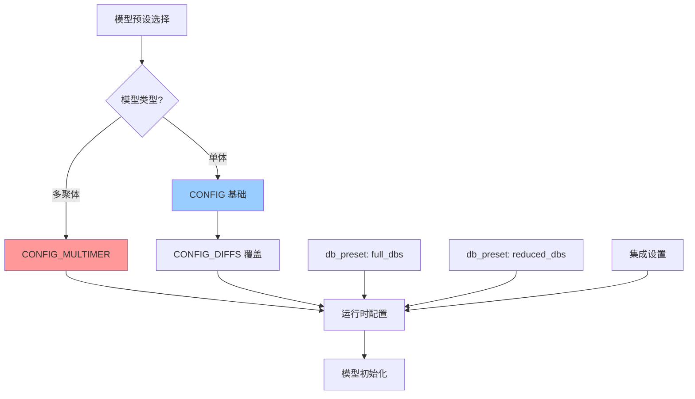

---
slug:8-model-configuration-and-presets
blog_type:normal
---


AlphaFold-Multimer 模型配置系统提供了一个灵活的框架，通过预定义的预设和细粒度的配置选项，针对不同的使用场景定制预测。该架构实现了单体和多聚体预测模式之间的无缝切换，同时允许对模型行为、数据处理管道和推理参数进行精细控制。

## 配置架构概述

配置系统围绕三个核心组件构建：**模型预设**、**配置字典**和**运行时覆盖**。模型预设定义了具有特定架构特征的训练模型集合，而配置字典指定了数据处理、模型架构和推理行为的详细超参数。运行时覆盖允许在执行过程中动态调整关键参数，而无需修改基础配置。

配置架构遵循分层继承模型，其中基础配置通过差异补丁进行扩展。`CONFIG_MULTIMER` 字典提供了针对多聚体特定预测的完整配置，而单体模型使用 `CONFIG` 作为基础，并在 `CONFIG_DIFFS` 中指定了针对特定模型的修改 [alphafold/model/config.py](alphafold/model/config.py#L124-L434)。



## 模型预设

AlphaFold-Multimer 提供了四种不同的模型预设，每种预设都针对特定的预测场景进行了优化。每个预设包含五个训练模型（model_1 至 model_5），可以在集成模式下运行以提高预测的鲁棒性。

### 可用预设

`MODEL_PRESETS` 字典将预设名称映射到应为预测而加载的模型标识符列表 [alphafold/model/config.py](alphafold/model/config.py#L39-L62)：

| 预设 | 模型 | 使用场景 | 主要特性 |
|--------|--------|----------|--------------|
| `monomer` | model_1-5 | 标准单链预测 | 通用单体折叠 |
| `monomer_ptm` | model_1-5_ptm | 带置信度预测的单体 | 包含用于 pTM 和 PAE 的预测对齐误差头 |
| `multimer` | model_1-5_multimer | 多链复合物预测 | 链相对特征、专门的模板处理 |
| `monomer_casp14` | model_1-5 | CASP14 基准测试 | 使用 8 集成以提高准确性 |

多聚体预设引入了专为蛋白质复合物预测设计的架构修改。该配置通过 `use_chain_relative` 设置启用链相对位置编码，并将 `max_relative_chain` 设置为 2，`max_relative_idx` 设置为 32，允许模型学习链间空间关系 [alphafold/model/config.py](alphafold/model/config.py#L508-L511)。

<CgxTip>就模型架构而言，monomer_casp14 预设在功能上与 monomer 预设完全相同，但使用 8 次集成迭代而不是默认的 1 次，以增加计算时间为代价提供更高的准确性。这是通过运行时的 `num_ensemble` 参数配置的，而不是通过配置差异。</CgxTip>

### 特定模型的配置差异

在每个预设中，各个模型在训练期间探索了细微的架构差异。这些差异编码在 `CONFIG_DIFFS` 字典中 [alphafold/model/config.py](alphafold/model/config.py#L65-L123)：

- **模型 1**：使用带有扭转角嵌入的模板，并通过最大模板数量减少 MSA 聚类，具有扩展的额外 MSA（5120 个序列）
- **模型 2**：类似于模型 1，但没有扩展的额外 MSA（默认为 1024 个序列）
- **模型 3-5**：不使用模板的更简单配置，主要探索不同的训练初始化和正则化策略

PTM 变体（monomer_ptm）为所有模型添加了一个权重为 0.1 的 `predicted_aligned_error` 头，从而能够计算 pTM 分数和 PAE 可视化以评估预测质量 [alphafold/model/config.py](alphafold/model/config.py#L95-L100)。

## 多聚体配置架构

`CONFIG_MULTIMER` 配置代表了对单体配置的完全背离，包含了用于处理多个蛋白质链及其相互作用的专门组件。

### 数据处理配置

多聚体配置定义了针对复合物预测量身定制的 MSA 和模板处理特定参数 [alphafold/model/config.py](alphafold/model/config.py#L492-L521)：

- **MSA 维度**：`num_msa: 252` 和 `num_extra_msa: 1152` 定义了处理的最大 MSA 序列，在计算效率和生物信息之间取得平衡
- **通道维度**：
  - `seq_channel: 384` - 序列表示维度
  - `msa_channel: 256` - MSA 表示维度
  - `pair_channel: 128` - 用于残基间相互作用的配对表示维度
- **额外 MSA 堆栈**：带有 `extra_msa_channel: 64` 的 `extra_msa_stack_num_block: 4` 通过一个较小的类 Evoformer 堆栈处理额外的 MSA 序列

<CgxTip>链相对编码系统（`use_chain_relative: True`）是多聚体预测准确性的基础。它允许模型通过相对于链边界而不是使用绝对残基索引来编码残基位置，从而区分链内和链间关系。</CgxTip>

### 模板处理配置

多聚体模型使用专门的模板处理管道，具有独特的注意机制和特征提取。模板配置与单体实现有显著不同 [alphafold/model/config.py](alphafold/model/config.py#L522-L575)：

- **模板注意力**：使用 4 头注意力且无门控（`gating: False`）进行模板特征集成
- **模板配对堆栈**：包含 2 个带有三角形注意力和乘法运算的块，用于处理模板成对信息
- **距离网格**：使用 39 个跨越 3.25Å 到 50.75Å 的箱（`dgram_features`）进行模板距离表示
- **最大模板数**：每次预测最多处理 4 个模板

### 全局配置设置

`global_config` 部分控制基本的推理行为和执行模式 [alphafold/model/config.py](alphafold/model/config.py#L576-L583)：

- **确定性模式**：设置为 `False` 以允许推理期间的随机行为，这可以提高预测的多样性
- **多聚体模式**：`multimer_mode: True` 激活多聚体特定的架构组件
- **子批次大小**：`subbatch_size: 4` 控制内存高效的批处理
- **重计算**：`use_remat: False` 禁用梯度检查点以提高内存效率
- **零初始化**：`zero_init: True` 对最后一层使用零初始化以提高训练稳定性

## 头配置和损失函数

模型包含多个预测头，每个头计算特定的结构或置信度指标，并具有相关的损失权重。

### 距离分布头

预测残基间距离的分布，提供一种在训练中使用的粗粒度结构表示 [alphafold/model/config.py](alphafold/model/config.py#L585-L591)：

- **箱数**：64 个距离箱，跨越 2.3125Å 到 21.6875Å
- **损失权重**：0.3，表明其在整体损失函数中的重要性

### 预测对齐误差头

对于多聚体预测中的置信度评估至关重要，该头预测将预测残基对齐到真实结构时的预期误差 [alphafold/model/config.py](alphafold/model/config.py#L605-L614)：

- **箱数**：64 个误差箱，最大至 31.0Å
- **通道数**：128 个中间表示
- **损失权重**：0.1，平衡置信度预测与结构准确性
- **分辨率过滤**：通过分辨率（0.1Å 到 3.0Å）过滤训练样本

### 结构模块头

结构模块负责生成最终的 3D 坐标，并为单体和多聚体预测提供专门的损失函数 [alphafold/model/config.py](alphafold/model/config.py#L615-L646)：

- **不变点注意力**：使用 12 个注意力头，具有 8 个点值查询和 4 个点查询-键查询
- **层数**：8 个结构模块层，具有 3 个过渡层
- **通道维度**：384 个通道用于表示处理
- **界面 FAPE 损失**：特定于多聚体预测，使用 `atom_clamp_distance: 1000.0` 和 `loss_unit_distance: 20.0` 进行界面评估
- **链内 FAPE 损失**：对单链结构使用更严格的参数（`atom_clamp_distance: 10.0`，`loss_unit_distance: 10.0`）

### 预测 LDDT 头

计算每残基置信度分数作为预测局部距离差异测试（pLDDT）值 [alphafold/model/config.py](alphafold/model/config.py#L596-L604)：

- **箱数**：50 个箱用于 LDDT 分数分布
- **通道数**：128 个中间表示
- **损失权重**：0.01，表明与结构准确性相比，它是次要目标
- **分辨率过滤**：在高分辨率结构上训练（0.1Å 到 3.0Å）

## 运行时配置和集成

配置系统通过 `alphafold/model/model.py` 中的 `RunModel` 类与主推理管道集成，该类根据加载的配置调整模型架构 [alphafold/model/model.py](alphafold/model/model.py#L64-L95)。

### 模型加载和初始化

`RunModel.__init__` 方法根据全局配置中的 `multimer_mode` 设置配置前向函数：

```python
if self.multimer_mode:
    def _forward_fn(batch):
        model = modules_multimer.AlphaFold(self.config.model)
        return model(batch, is_training=False)
else:
    def _forward_fn(batch):
        model = modules.AlphaFold(self.config.model)
        return model(batch, is_training=False, compute_loss=False, ensemble_representations=True)
```

这种条件加载确保为预测任务实例化适当的架构组件 [alphafold/model/model.py](alphafold/model/model.py#L72-L86)。

### 通过命令行选择预设

主推理脚本（`run_alphafold.py`）提供命令行标志用于选择模型和数据库预设 [run_alphafold.py](run_alphafold.py#L97-L106)：

- **`--model_preset`**：从 `monomer`、`monomer_casp14`、`monomer_ptm` 或 `multimer` 中选择
- **`--db_preset`**：在 `full_dbs` 或 `reduced_dbs` 之间选择用于 MSA 生成

该脚本根据选定的模型预设验证数据库要求。例如，多聚体预测需要 `pdb_seqres_database_path` 和 `uniprot_database_path`，而单体预测需要 `pdb70_database_path` [run_alphafold.py](run_alphafold.py#L307-L318)。

### 集成配置

集成迭代次数根据选定的预设动态配置：

- **monomer_casp14**：使用 8 次集成迭代以提高准确性
- **其他预设**：使用 1 次集成迭代以加快推理速度

此配置在运行时应用于模型配置 [run_alphafold.py](run_alphafold.py#L334-L340)：

```python
if run_multimer_system:
    model_config.model.num_ensemble_eval = num_ensemble
else:
    model_config.data.eval.num_ensemble = num_ensemble
```

## 高级配置场景

### 自定义模型配置

开发者可以通过扩展基础配置或在 `CONFIG_DIFFS` 中创建新条目来创建自定义模型配置。`model_config()` 函数提供了一个简洁的配置检索接口 [alphafold/model/config.py](alphafold/model/config.py#L26-L37)：

```python
def model_config(name: str) -> ml_collections.ConfigDict:
    """获取 CASP14 模型的 ConfigDict。"""
    if 'multimer' in name:
        return CONFIG_MULTIMER
    if name not in CONFIG_DIFFS:
        raise ValueError(f'无效的模型名称 {name}。')
    cfg = copy.deepcopy(CONFIG)
    cfg.update_from_flattened_dict(CONFIG_DIFFS[name])
    return cfg
```

### 特征处理集成

配置系统通过 `RunModel` 中的 `process_features()` 方法与特征处理集成。多聚体模式直接传递特征，而单体模式通过 `np_example_to_features()` 或 `tf_example_to_features()` 应用额外的处理 [alphafold/model/model.py](alphafold/model/model.py#L111-L139)。

### 循环配置

单体和多聚体配置都指定了控制预测迭代优化的循环参数：

- **循环迭代次数**：CONFIG_MULTIMER 中为 `num_recycle: 3`，`resample_msa_in_recycling: True` 允许在循环期间重新采样 MSA
- **位置循环**：`recycle_pos: True` 在多聚体模式下启用位置循环
- **特征循环**：`recycle_features: True` 在多聚体模式下启用特征循环

这些循环机制通过将模型输出作为后续迭代的输入反馈回来，逐步改进预测 [alphafold/model/config.py](alphafold/model/config.py#L648-L651)。

## 配置最佳实践

### 预设选择指南

- **使用 `monomer_ptm`**：当单链预测需要置信度指标（pLDDT、pTM、PAE）时
- **使用 `multimer`**：对于涉及多条链的任何预测，即使链是相同的（同源寡聚体）
- **使用 `monomer_casp14`**：仅用于基准测试或需要最高准确性且计算资源充足时
- **使用 `reduced_dbs`**：用于快速原型设计或数据库存储有限时

### 内存和性能调优

- 调整全局配置中的 `subbatch_size` 以权衡内存使用量和吞吐量
- 减少 `num_recycle` 以加快推理速度，但可能会降低准确性
- 降低 `num_msa` 和 `num_extra_msa` 以减少大型复合物的内存占用

### 配置问题故障排除

常见的配置相关问题包括：

1. **内存错误**：减少 `subbatch_size` 或 MSA 序列限制
2. **推理缓慢**：减少 `num_recycle` 或使用 `reduced_dbs` 预设
3. **多聚体准确性差**：确保在输入序列中正确指定了链边界，并且适当的数据库可用

有关模型架构的详细实现以及如何在推理期间应用配置，请参阅 [Evoformer 和嵌入模块](12-evoformer-and-embedding-modules)。有关这些配置如何与 MSA 配对和链组装过程交互的信息，请参阅 [多序列比对 (MSA) 配对](9-multiple-sequence-alignment-msa-pairing) 和 [链特征合并和组装](10-chain-feature-merging-and-assembly)。