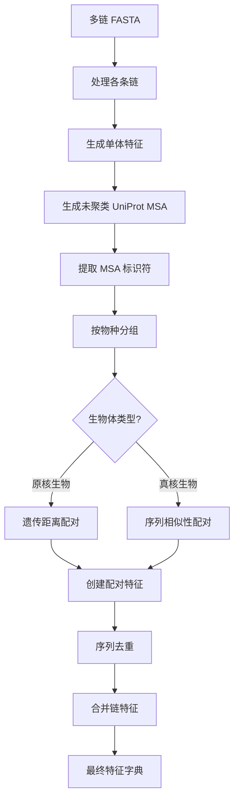
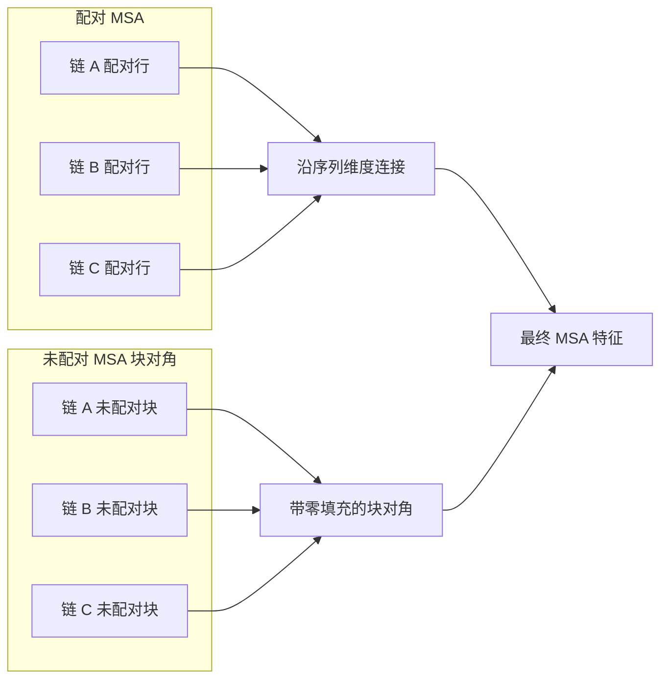

---
slug:9-multiple-sequence-alignment-msa-pairing
blog_type:normal
---

MSA 配对是 AlphaFold-Multimer 中的一项关键创新，它使模型能够同时利用多个蛋白质链之间的共进化信号。与独立处理每个 MSA 的单体 AlphaFold 不同，多聚体配对策略性地对齐来自不同链的同源序列，以捕获链间的进化约束。这一过程对于准确预测蛋白质-蛋白质相互作用和四级结构形成至关重要。

配对系统根据原核生物和真核生物独特的基因组组织结构对它们进行区分。原核蛋白质通常位于操作子中，相互作用的基因共定位，允许通过遗传距离度量进行配对。由于旁系同源物普遍存在和基因组排列分散，真核蛋白质需要基于序列相似性的配对。

来源：[msa_pairing.py](/alphafold/data/msa_pairing.py#L15-L98), [pipeline_multimer.py](/alphafold/data/pipeline_multimer.py#L241-L289)

## 核心架构

MSA 配对架构通过定义明确的编排模式集成到多聚体数据流水线中。该流水线首先使用单体流水线生成各个链的特征，然后在合并到统一的特征字典之前应用配对逻辑。

架构流程始于 `DataPipeline.process()` 接收多链 FASTA 文件。每个链通过单体流水线独立进行 MSA 生成，产生聚类 MSA（用于标准特征）和未聚类的 UniProt 命中（用于配对）。然后，配对逻辑对这些未聚类的 MSA 进行操作，根据共享的物种信息识别应在各链之间配对的序列。

核心配对入口是 `feature_processing.py` 中的 `pair_and_merge()`，它协调整个过程。该函数首先调用 `create_paired_features()` 从 `_all_seq` MSA 特征中识别并提取配对行，然后在合并所有链之前应用去重。

来源：[feature_processing.py](/alphafold/data/feature_processing.py#L48-L84), [msa_pairing.py](/alphafold/data/msa_pairing.py#L60-L98)

## MSA 标识符提取

有效的配对需要从原始 MSA 序列描述中提取结构化元数据。`msa_identifiers.py` 模块实现了针对 UniProtKB 格式标识符的解析逻辑，该格式遵循 `db|UniqueIdentifier|EntryName` 模式（例如，分别为 TrEMBL/Swiss-Prot 的 `tr|A0A146SKV9|A0A146SKV9_FUNHE` 或 `sp|P0C2L1|A3X1_LOXLA`）。

`get_identifiers()` 函数提取两个关键组件：

- **UniProt 登录号**：主要登录号（6-10 个字母数字字符）
- **物种 ID**：1-5 个字符的助记符物种识别代码

这些标识符能够按物种对 MSA 序列进行分组，并计算登录号之间的遗传距离。物种分组至关重要，因为配对仅发生在不同链的同一物种内——其潜在的生物学原理是，来自同一生物体的直系同源序列更有可能保留共进化信号。

来源：[msa_identifiers.py](/alphafold/data/msa_identifiers.py#L15-L93), [pipeline_multimer.py](/alphafold/data/pipeline_multimer.py#L224-L242)

## 配对策略选择

AlphaFold-Multimer 实现了两种不同的配对算法，根据 `is_prokaryote` 参数进行选择：

| 策略 | 生物学原理 | 距离度量 | 典型用例 |
|----------|---------------------|-----------------|------------------|
| **遗传距离** | 原核生物中的操作子共定位 | UniProt 登录号差值 | 细菌复合物，古菌蛋白 |
| **序列相似性** | 真核生物中存在旁系同源物 | 与目标序列的相似性 (0-1) | 真核异聚体，哺乳动物复合物 |

`pair_sequences()` 函数实现了此选择逻辑。对于各链之间每个共同的物种，它创建一个包含该物种序列的 MSA 数据框列表。然后，该函数根据生物体类型应用适当的匹配算法。

一个关键的优化是跳过仅存在于一条链中的物种（无法配对）或具有过多序列（>600）的物种，这会导致计算开销而不会带来成比例的收益。

来源：[msa_pairing.py](/alphafold/data/msa_pairing.py#L325-L395), [msa_pairing.py](/alphafold/data/msa_pairing.py#L232-L288)

## 原核生物配对：遗传距离

原核生物配对策略利用了操作子的基因组邻近性。在细菌和古菌中，功能相关的基因通常一起转录，这意味着它们的 UniProt 登录号是按顺序分配的。这为基因组距离创建了一个可靠的代理。

两个序列之间的遗传距离使用 `_calc_id_diff()` 函数计算，该函数：

1. 使用 `encode_accession()` 将每个 UniProt 登录号编码为数值
2. 计算编码值之间的绝对差值
3. 与可配置的截断值（默认值：20）进行比较

编码算法遵循 UniProt 登录号格式约定，该约定因长度和起始字符而异。以 O、P 或 Q 开头的登录号使用 6 个字符的模式，而其他登录号可能使用具有不同基数表示的 6 或 10 个字符。

`_match_rows_by_genetic_distance()` 函数通过深度优先搜索算法执行实际配对，该算法在所有链的距离截断值内找到登录号的最大元组。这确保来自同一操作子（或类似操作子的排列）的序列配对在一起，保留共进化约束。

来源：[msa_pairing.py](/alphafold/data/msa_pairing.py#L183-L228), [msa_pairing.py](/alphafold/data/msa_pairing.py#L232-L288)

## 真核生物配对：序列相似性

真核基因组缺乏操作子组织结构且包含许多旁系同源物，使得遗传距离无效。相反，序列相似性策略根据序列相对于目标序列的保守性进行配对。

`_match_rows_by_sequence_similarity()` 函数实现了此方法：

1. 对于每个物种，按 `msa_similarity`（降序）对所有 MSA 序列进行排序
2. 取所有链中序列数量的最小值以确保平衡配对
3. 逐索引配对序列（最相似的与最相似的配对，第二与第二配对，依此类推）

这种贪心方法将各链间最保守的序列配对，假设强保守信号表明功能重要性和潜在的共进化。该方法通过专注于与查询最相似的序列而不是依赖基因组组织，本质性地处理了旁系同源物问题。

一个关键的过滤器排除相似性得分高于 0.9 或空位比例高于 0.5 的序列，防止与过于相似于目标或过于破碎而无法提供信息的序列进行配对。

来源：[msa_pairing.py](/alphafold/data/msa_pairing.py#L289-L324), [msa_pairing.py](/alphafold/data/msa_pairing.py#L34-L37)

## 特征创建与填充

一旦识别出配对序列索引，`create_paired_features()` 函数将从每条链的 `_all_seq` MSA 特征中提取相应的行。这些配对特征包括标准 MSA 特征集：`msa`、`msa_mask`、`deletion_matrix` 和 `deletion_matrix_int`。

该函数通过填充处理各链间不同的 MSA 大小：

- MSA 序列用空位字符（`MSA_GAP_IDX`）填充
- MSA 掩码用 1 填充
- 缺失矩阵用 0 填充

这确保了所有链之间具有统一的维度，从而能够进行后续的连接操作。配对特征替换原始的 `_all_seq` 特征，而原始未配对的 MSA 特征保留用于后续的块对角合并。

输出保持配对和未配对序列之间的分离，这对于模型区分强约束（配对）和弱约束（未配对）位置至关重要。

来源：[msa_pairing.py](/alphafold/data/msa_pairing.py#L60-L98), [msa_pairing.py](/alphafold/data/msa_pairing.py#L38-L56)

## 去重

在合并之前，`deduplicate_unpaired_sequences()` 移除重复配对序列的未配对序列。这可以防止进化信号的重复计算并减少计算开销。

去重过程：

1. 创建配对 MSA（`msa_all_seq`）中存在的所有序列的集合
2. 遍历未配对的 MSA 序列
3. 仅保留尚未存在于配对集合中的行
4. 更新 `num_alignments` 以反映减少的计数

此步骤确保每个唯一的同源序列对最终输入仅贡献一次，作为配对或未配对特征，但绝不会同时作为两者。

来源：[msa_pairing.py](/alphafold/data/msa_pairing.py#L604-L625)

## 链合并策略

所有链特征的最终集成发生在 `merge_chain_features()` 中，它实现了一种复杂的合并策略，保留了配对和未配对序列之间的区别。

合并过程遵循以下顺序：

1. **模板填充**：使用 `_pad_templates()` 对齐各链的模板计数
2. **同源聚体合并**：使用 `_merge_homomers_dense_msa()` 合并具有相同序列的链
3. **未配对块对角**：使用块对角化合并未配对的 MSA 特征
4. **配对连接**：使用 `_concatenate_paired_and_unpaired_features()` 连接配对特征
5. **合并后修正**：使用 `_correct_post_merged_feats()` 更新衍生特征

未配对序列的块对角化确保不同链的 MSA 行不会错误关联——每条链的未配对序列占据单独的对角块，其他地方用零填充。相比之下，配对序列沿序列维度连接，保持各链之间的对齐。

这种双重方法允许 Evoformer 以不同方式处理配对和未配对序列，配对序列受到特别关注以进行链间共进化分析。

来源：[msa_pairing.py](/alphafold/data/msa_pairing.py#L574-L607), [msa_pairing.py](/alphafold/data/msa_pairing.py#L498-L559)

## 配对后的特征结构

配对和合并后的最终特征字典包含连接的配对序列和块对角未配对序列：

合并字典中的关键特征：

- `msa`：形状 `[num_sequences, total_residues]`，包含连接的配对 + 块对角未配对
- `msa_mask`：匹配 MSA 维度的二进制掩码
- `deletion_matrix`：每个位置的缺失概率
- `num_alignments`：MSA 序列总数
- `asym_id`、`sym_id`、`entity_id`：链识别特征

<CgxTip>`entity_id` 特征将具有相同序列的链分组，使模型能够在推理过程中将同源聚体链视为对称副本。这对于准确预测如同源二聚体等对称复合物至关重要。</CgxTip>

来源：[msa_pairing.py](/alphafold/data/msa_pairing.py#L429-L476), [pipeline_multimer.py](/alphafold/data/pipeline_multimer.py#L119-L158)

## 配置参数

几个可配置的常量控制 MSA 配对行为：

| 参数 | 默认值 | 目的 | 影响 |
|-----------|---------|---------|--------|
| `SEQUENCE_GAP_CUTOFF` | 0.5 | 有效序列的最大空位比例 | 过滤碎片化序列 |
| `SEQUENCE_SIMILARITY_CUTOFF` | 0.9 | 配对的最大目标相似度 | 防止近乎相同的序列配对 |
| 遗传距离截断值 | 20 | 原核生物配对的最大登录号差值 | 调整操作子检测的严格程度 |
| 物种大小限制 | 600 | 每个物种配对的最大序列数 | 防止过度计算 |

这些参数可以根据目标生物体特征或特定预测要求进行调整。例如，增加遗传距离截断值可能会在原核生物中捕获更远的操作子关系，但会增加假阳性率。

来源：[msa_pairing.py](/alphafold/data/msa_pairing.py#L34-L37), [msa_pairing.py](/alphafold/data/msa_pairing.py#L232-L235)

## 与模型流水线的集成

MSA 配对系统通过 `pipeline_multimer.py` 中的 `DataPipeline` 类无缝集成到更广泛的 AlphaFold-Multimer 流水线中。`process()` 方法编排完整的工作流程：

1. 解析多链 FASTA 并创建链 ID 映射
2. 使用单体流水线独立处理每条链
3. 添加组装特征以区分链
4. 通过 `feature_processing.pair_and_merge()` 应用 MSA 配对
5. 将最终 MSA 填充至最小大小（512 个序列）以防止空张量

这种架构在保持模块化的同时，启用了准确的多聚体预测所需的专门配对逻辑。