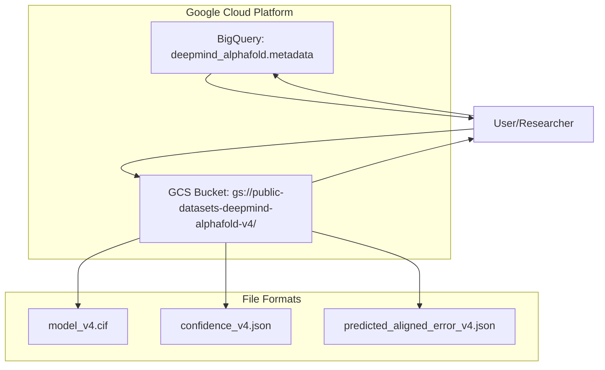
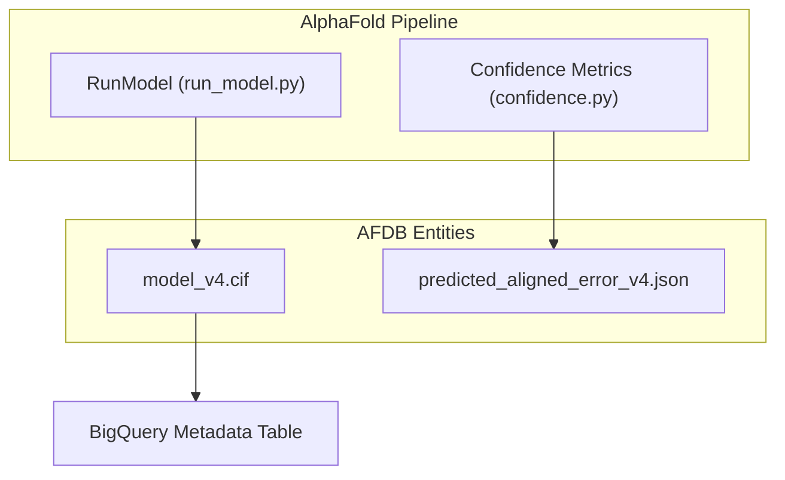

# AlphaFold Protein Structure Database

> **Relevant source files**
> * [afdb/README.md](https://github.com/google-deepmind/alphafold/blob/c77e5d2a/afdb/README.md?plain=1)

The AlphaFold Protein Structure Database (AFDB) is a collaborative project between DeepMind and EMBL-EBI that provides open access to over 214 million protein structure predictions [afdb/README.md L5-L9](https://github.com/google-deepmind/alphafold/blob/c77e5d2a/afdb/README.md?plain=1#L5-L9)

 The database covers nearly all cataloged proteins in UniProt and is hosted on Google Cloud Public Datasets [afdb/README.md L5-L6](https://github.com/google-deepmind/alphafold/blob/c77e5d2a/afdb/README.md?plain=1#L5-L6)

## Data Architecture and Hosting

The AFDB infrastructure is split between raw data storage and metadata indexing to facilitate both bulk access and granular filtering.

### Data Storage (Google Cloud Storage)

The primary data is stored in a Cloud Storage bucket. The dataset is approximately 23 TiB in size, consisting of roughly 642 million files (3 files per 214 million predictions) [afdb/README.md L19-L20](https://github.com/google-deepmind/alphafold/blob/c77e5d2a/afdb/README.md?plain=1#L19-L20)

* **Bucket Location:** `gs://public-datasets-deepmind-alphafold-v4/`
* **Access Method:** Google Cloud CLI (`gcloud storage`) or `gsutil` [afdb/README.md L140-L144](https://github.com/google-deepmind/alphafold/blob/c77e5d2a/afdb/README.md?plain=1#L140-L144)
* **Naming Convention:** Files follow the pattern `AF-[UniProt accession]-F[fragment number]` [afdb/README.md L65-L66](https://github.com/google-deepmind/alphafold/blob/c77e5d2a/afdb/README.md?plain=1#L65-L66)

### Metadata Indexing (BigQuery)

Metadata for the entire 214M prediction set is hosted on Google BigQuery, allowing users to perform SQL queries to identify subsets of data before downloading [afdb/README.md L9-L152](https://github.com/google-deepmind/alphafold/blob/c77e5d2a/afdb/README.md?plain=1#L9-L152)

| Feature | Description |
| --- | --- |
| **Dataset ID** | `bigquery-public-data.deepmind_alphafold` |
| **Primary Table** | `metadata` |
| **Key Columns** | UniProt accession, pLDDT, organism, sequence length [afdb/README.md L92-L99](https://github.com/google-deepmind/alphafold/blob/c77e5d2a/afdb/README.md?plain=1#L92-L99) |

### Data Flow Diagram

The following diagram illustrates the relationship between the AFDB storage components and the end-user workflow.

**AFDB Access Workflow**



**Sources:** [afdb/README.md L5-L152](https://github.com/google-deepmind/alphafold/blob/c77e5d2a/afdb/README.md?plain=1#L5-L152)

---

## File Formats and Content

For every UniProt entry, the database provides three primary files representing the structural prediction and its associated confidence metrics.

### 1. Structure (mmCIF)

The file `model_v4.cif` contains the atomic coordinates. It adheres to the **ModelCIF** extension of the PDBx/mmCIF standard [afdb/README.md L70-L73](https://github.com/google-deepmind/alphafold/blob/c77e5d2a/afdb/README.md?plain=1#L70-L73)

* Includes coordinates for all predicted atoms.
* Contains pLDDT scores in the `_atom_site.B_iso_or_equiv` field.

### 2. Local Confidence (pLDDT)

The file `confidence_v4.json` contains the **Predicted Local Distance Difference Test (pLDDT)** [afdb/README.md L74-L78](https://github.com/google-deepmind/alphafold/blob/c77e5d2a/afdb/README.md?plain=1#L74-L78)

* **Range:** 0 to 100.
* **Interpretation:** High values (>70) indicate reliable backbone prediction; very high (>90) indicate high confidence in side-chain orientations.

### 3. Global Confidence (PAE)

The file `predicted_aligned_error_v4.json` contains the **Predicted Aligned Error (PAE)** matrix [afdb/README.md L79-L83](https://github.com/google-deepmind/alphafold/blob/c77e5d2a/afdb/README.md?plain=1#L79-L83)

* **Data Structure:** A 2D array of size $N_{res} \times N_{res}$.
* **Interpretation:** Represents the expected error in the position of residue $i$ if the predicted and true structures were aligned on residue $j$.
* **Utility:** Essential for determining the confidence in the relative orientation of different domains [afdb/README.md L82-L83](https://github.com/google-deepmind/alphafold/blob/c77e5d2a/afdb/README.md?plain=1#L82-L83)

**Sources:** [afdb/README.md L68-L85](https://github.com/google-deepmind/alphafold/blob/c77e5d2a/afdb/README.md?plain=1#L68-L85)

---

## Access and Subset Selection

Due to the 23 TiB size, users are encouraged to use specific access patterns rather than full bulk downloads.

### Bulk Download via Proteomes

Predictions are grouped by NCBI taxonomy ID into tar shards for easier transfer of entire proteomes [afdb/README.md L87-L88](https://github.com/google-deepmind/alphafold/blob/c77e5d2a/afdb/README.md?plain=1#L87-L88)

* **Path:** `gs://public-datasets-deepmind-alphafold-v4/proteomes/`
* **Format:** `proteome-tax_id-[TAX_ID]-[SHARD_ID]_v4.tar`

### Metadata Files

Two summary files are provided in the root of the bucket for quick reference without BigQuery [afdb/README.md L90-L104](https://github.com/google-deepmind/alphafold/blob/c77e5d2a/afdb/README.md?plain=1#L90-L104)

:

* `accession_ids.csv`: Mapping of UniProt accessions to AlphaFold DB identifiers and residue ranges.
* `sequences.fasta`: All protein sequences in the database.

### BigQuery Subset Selection Example

To download structure files for a specific organism (e.g., *Escherichia coli*, TaxID 83333), users can generate a manifest:

```sql
SELECT  uniprot_accession,  fraction_plddt_above_70FROM  `bigquery-public-data.deepmind_alphafold.metadata`WHERE  ncbi_taxonomy_id = 83333
```

**Sources:** [afdb/README.md L87-L152](https://github.com/google-deepmind/alphafold/blob/c77e5d2a/afdb/README.md?plain=1#L87-L152)

---

## Technical Integration with AlphaFold Codebase

The AFDB is the "output" of the AlphaFold pipeline described in other sections of this wiki. The metadata and structures generated here are produced by the execution of the `RunModel` class and subsequent processing.

**Code Entity Mapping**



**Sources:** [afdb/README.md L70-L85](https://github.com/google-deepmind/alphafold/blob/c77e5d2a/afdb/README.md?plain=1#L70-L85)

 [alphafold/model/model.py L44-L60](https://github.com/google-deepmind/alphafold/blob/c77e5d2a/alphafold/model/model.py#L44-L60)

 [alphafold/common/confidence.py L1-L20](https://github.com/google-deepmind/alphafold/blob/c77e5d2a/alphafold/common/confidence.py#L1-L20)

---

## Licensing and Attribution

The dataset is licensed under **CC-BY-4.0** [afdb/README.md L34-L35](https://github.com/google-deepmind/alphafold/blob/c77e5d2a/afdb/README.md?plain=1#L34-L35)

 Users must cite:

1. **Jumper et al. (2021)** for the AlphaFold model architecture [afdb/README.md L43-L45](https://github.com/google-deepmind/alphafold/blob/c77e5d2a/afdb/README.md?plain=1#L43-L45)
2. **Varadi et al. (2021)** for the AlphaFold Database [afdb/README.md L46-L49](https://github.com/google-deepmind/alphafold/blob/c77e5d2a/afdb/README.md?plain=1#L46-L49)

**Sources:** [afdb/README.md L32-L52](https://github.com/google-deepmind/alphafold/blob/c77e5d2a/afdb/README.md?plain=1#L32-L52)