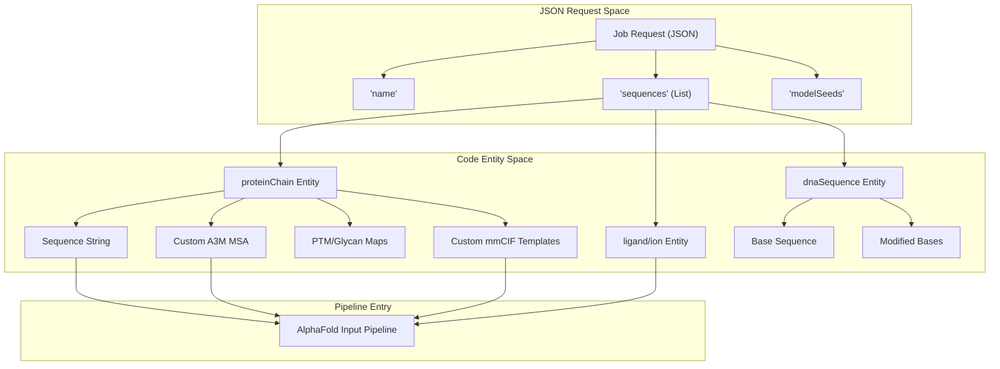
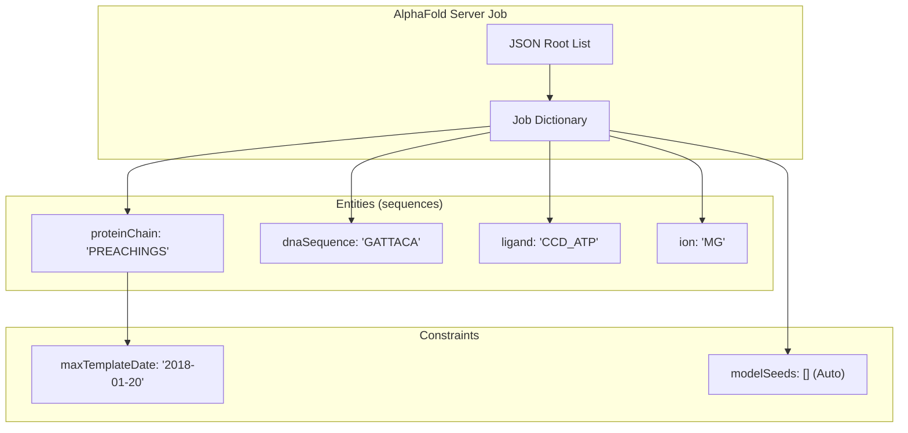

# AlphaFold Server API

> **Relevant source files**
> * [server/README.md](https://github.com/google-deepmind/alphafold/blob/c77e5d2a/server/README.md?plain=1)
> * [server/example.json](https://github.com/google-deepmind/alphafold/blob/c77e5d2a/server/example.json)

The AlphaFold Server API provides a standardized JSON-based job submission format for structural modeling. This interface allows users to programmatically define complex biomolecular systems—including proteins, nucleic acids, ligands, and ions—along with experimental constraints like custom Multiple Sequence Alignments (MSAs) and structural template overrides.

## Job Submission Overview

A submission consists of a JSON list of job dictionaries, allowing for batch processing within a single file `[server/README.md:7-9]`. Each job specifies a name, random seeds for the model's stochastic components, and a list of molecular entities `[server/README.md:11-13]`.

### Top-Level Schema

| Field | Type | Description |
| --- | --- | --- |
| `name` | `string` | Identifier for the job in the history table `[server/README.md:29-30]`. |
| `modelSeeds` | `list[string]` | List of `uint32` seeds. An empty list `[]` triggers random seed assignment `[server/README.md:31-34]`. |
| `sequences` | `list[dict]` | List of entity definitions (chains, ligands, etc.) `[server/README.md:35-36]`. |
| `dialect` | `string` | Must be set to `"alphafoldserver"` `[server/README.md:57-58]`. |
| `version` | `integer` | Version of the schema (currently `1`) `[server/README.md:59-60]`. |

**Sources:** `[server/README.md:7-60]`, `[server/example.json:1-5]`

---

## Entity Schemas

The `sequences` list contains dictionaries where each key defines the entity type. Supported types include `proteinChain`, `dnaSequence`, `rnaSequence`, `ligand`, and `ion` `[server/README.md:50-56]`.

### Protein Chains

Protein entities support complex modifications including glycosylation, post-translational modifications (PTMs), and custom alignment data.

* **`sequence`**: IUPAC amino acid string `[server/README.md:74-76]`.
* **`count`**: Stoichiometry of the chain `[server/README.md:78]`.
* **`glycans`**: List of dictionaries containing `residues` (e.g., `NAG(NAG)(BMA)`) and 1-based `position` `[server/README.md:80-88]`.
* **`modifications`**: List of PTMs using [CCD codes](https://www.wwpdb.org/data/ccd) (e.g., `CCD_SEP` for phosphoserine) and 1-based `position` `[server/README.md:89-99]`.
* **`unpairedMsa`**: Optional A3M formatted string to guide prediction or cluster structural states `[server/README.md:111-116]`.

### Nucleic Acids

* **`dnaSequence` / `rnaSequence`**: Single-stranded sequences. Double-stranded DNA requires two separate `dnaSequence` entries (sequence and reverse complement) `[server/README.md:182-185]`.
* **`modifications`**: Support for modified bases like `CCD_6OG` (6-Oxoguanine) using `modificationType` and `basePosition` `[server/example.json:51-60]`.

### Ligands and Ions

* **`ligand`**: Defined by a CCD code (e.g., `CCD_ATP`) and `count` `[server/example.json:87-90]`.
* **`ion`**: Defined by element symbol (e.g., `MG`, `NA`) and `count` `[server/example.json:99-108]`.

**Sources:** `[server/README.md:72-117]`, `[server/example.json:7-110]`

---

## Template and MSA Customization

AlphaFold Server Version 1 introduced fields for fine-grained control over structural templates.

### Template Overrides

Users can provide manual structural templates by embedding mmCIF data directly into the JSON.

* **`useStructureTemplate`**: Boolean to enable/disable PDB template search (default `true`) `[server/README.md:101-102]`.
* **`maxTemplateDate`**: ISO 8601 string (YYYY-MM-DD). Restricts templates to those released on or before this date `[server/README.md:104-109]`.
* **`templates`**: A list of custom template objects `[server/README.md:118-119]`: * **`mmcif`**: The raw string content of an mmCIF file `[server/README.md:121]`. * **`queryIndices`**: 0-based indices in the query sequence `[server/README.md:122-123]`. * **`templateIndices`**: 0-based indices in the template (mmCIF) sequence `[server/README.md:124-127]`.

### Data Flow: JSON to Model Input

The following diagram illustrates how the JSON request is decomposed into entities that the AlphaFold pipeline processes.

**Entity Decomposition Logic**

**Sources:** `[server/README.md:101-131]`, `[server/example.json:30-38]`

---

## Example Job Configuration

A typical multi-entity job involves defining various chains and environmental constraints. The following structure represents a protein-DNA-ligand complex with a template date cutoff.

**Job Configuration Mapping**

**Sources:** `[server/example.json:1-113]`, `[server/README.md:27-46]`

### Key Constraints and Limits

* **Date Bounds**: `maxTemplateDate` must be between `1976-01-01` and the latest database update (e.g., `2025-02-03`) `[server/README.md:107-109]`.
* **Indexing**: `queryIndices` and `templateIndices` are parallel arrays using 0-based indexing `[server/README.md:129-130]`.
* **Format**: Comments are strictly prohibited in the JSON file `[server/README.md:25]`.

**Sources:** `[server/README.md:101-131]`, `[server/example.json:114-135]`