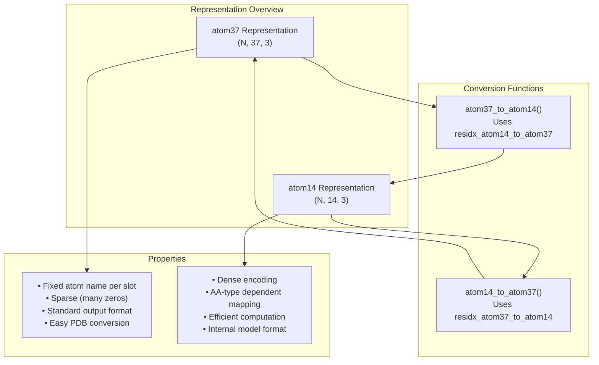
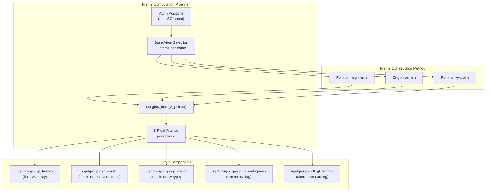
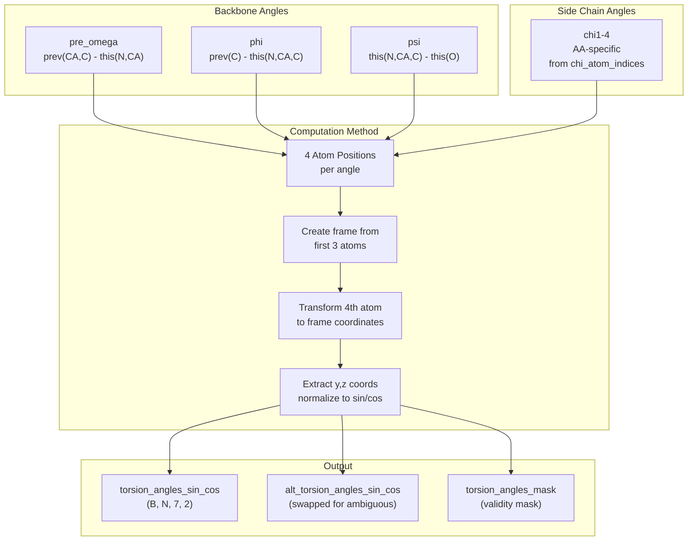
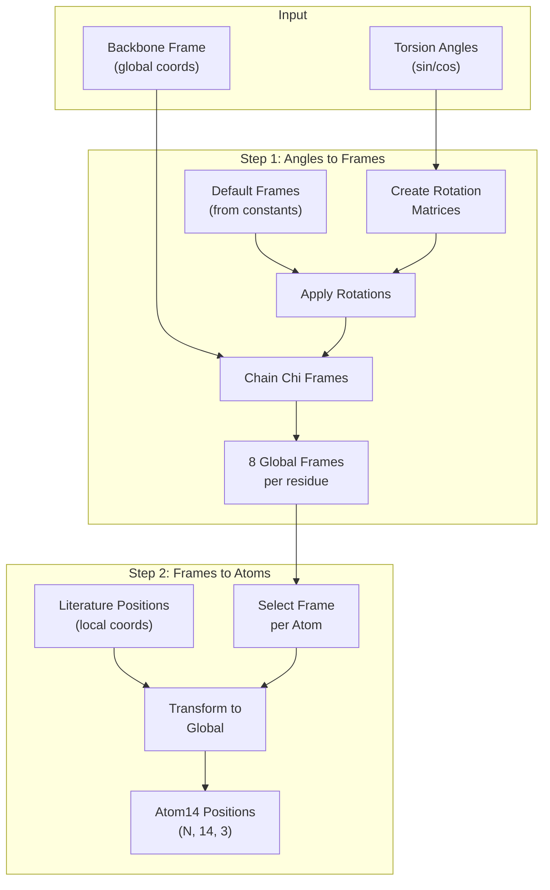
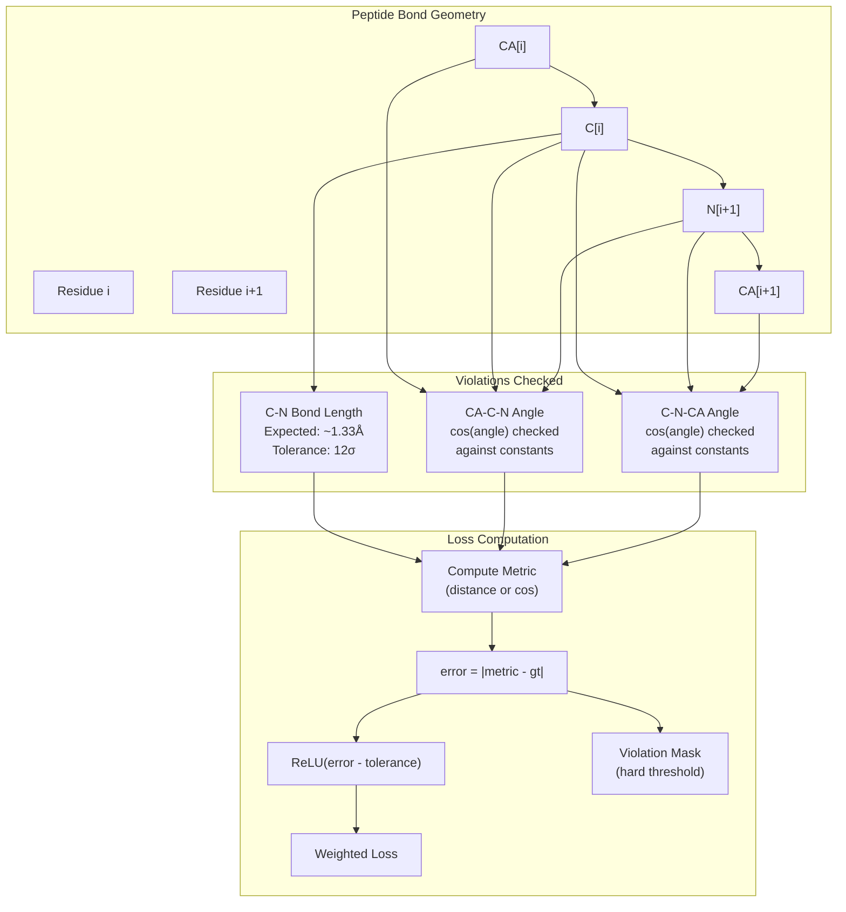
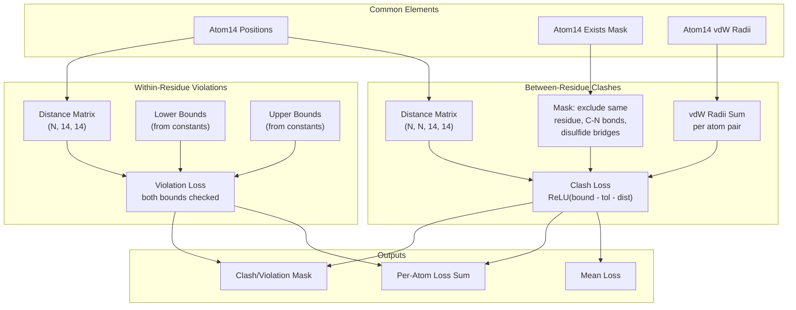
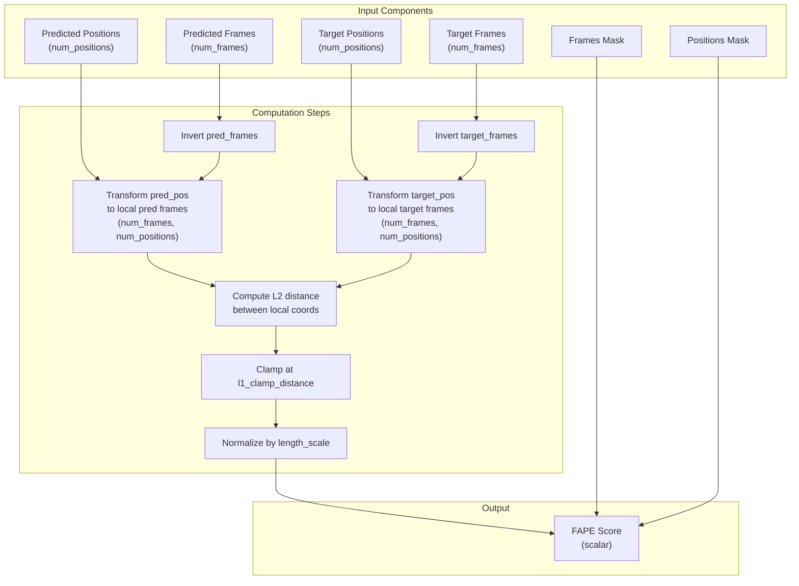
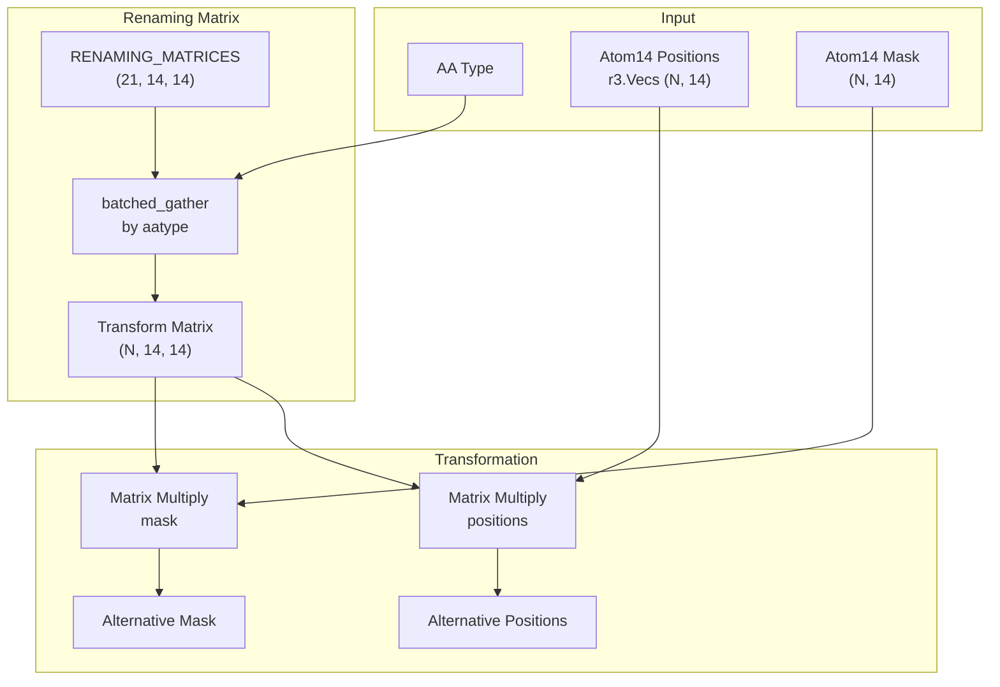

# Atom Representations and Geometry

> **Relevant source files**
> * [alphafold/common/residue_constants_test.py](https://github.com/google-deepmind/alphafold/blob/c77e5d2a/alphafold/common/residue_constants_test.py)
> * [alphafold/model/all_atom.py](https://github.com/google-deepmind/alphafold/blob/c77e5d2a/alphafold/model/all_atom.py)
> * [alphafold/model/all_atom_multimer.py](https://github.com/google-deepmind/alphafold/blob/c77e5d2a/alphafold/model/all_atom_multimer.py)
> * [alphafold/model/all_atom_test.py](https://github.com/google-deepmind/alphafold/blob/c77e5d2a/alphafold/model/all_atom_test.py)
> * [alphafold/model/folding_multimer.py](https://github.com/google-deepmind/alphafold/blob/c77e5d2a/alphafold/model/folding_multimer.py)
> * [alphafold/model/geometry/rigid_matrix_vector.py](https://github.com/google-deepmind/alphafold/blob/c77e5d2a/alphafold/model/geometry/rigid_matrix_vector.py)
> * [alphafold/model/geometry/rotation_matrix.py](https://github.com/google-deepmind/alphafold/blob/c77e5d2a/alphafold/model/geometry/rotation_matrix.py)
> * [alphafold/model/geometry/vector.py](https://github.com/google-deepmind/alphafold/blob/c77e5d2a/alphafold/model/geometry/vector.py)
> * [alphafold/model/r3.py](https://github.com/google-deepmind/alphafold/blob/c77e5d2a/alphafold/model/r3.py)

## Purpose and Scope

This page documents the atom representation systems and geometric operations used throughout AlphaFold for manipulating protein structures. The modules [alphafold/model/all_atom.py](https://github.com/google-deepmind/alphafold/blob/c77e5d2a/alphafold/model/all_atom.py)

 and [alphafold/model/all_atom_multimer.py](https://github.com/google-deepmind/alphafold/blob/c77e5d2a/alphafold/model/all_atom_multimer.py)

 provide the core functionality for converting between different atom representations, computing structural properties like torsion angles and rigid frames, and detecting geometric violations.

For information about the underlying amino acid properties and constants, see [Residue Constants](/google-deepmind/alphafold/5.1-residue-constants). For how these representations are used during structure relaxation, see [Structure Relaxation](/google-deepmind/alphafold/6.2-structure-relaxation).

---

## Dual Representation System

AlphaFold employs two primary representations for atom coordinates: **atom37** and **atom14**. These representations serve different purposes and are used in different parts of the pipeline.

### atom37 Representation

The atom37 representation maps each heavy atom to a fixed position in a 37-dimensional array. This mapping is **non-amino-acid-specific**: each slot always corresponds to the same atom name across all amino acid types. For example, slot 12 always represents 'C delta 1', regardless of whether that atom exists for a given residue [alphafold/model/all_atom.py L17-L22](https://github.com/google-deepmind/alphafold/blob/c77e5d2a/alphafold/model/all_atom.py#L17-L22)

* **Purpose**: Facilitates easy conversion to standard protein data structures (PDB, mmCIF) [alphafold/model/all_atom.py L32-L34](https://github.com/google-deepmind/alphafold/blob/c77e5d2a/alphafold/model/all_atom.py#L32-L34)
* **Usage**: Network output format.
* **Characteristics**: Sparse representation with many zero entries for atoms not present in certain amino acids.

### atom14 Representation

The atom14 representation is a **dense encoding** with 14 slots per residue. Here, each slot corresponds to different atom types depending on the amino acid. For instance, slot 5 represents 'N delta 2' for Asparagine but 'C delta 1' for Isoleucine [alphafold/model/all_atom.py L23-L28](https://github.com/google-deepmind/alphafold/blob/c77e5d2a/alphafold/model/all_atom.py#L23-L28)

* **Purpose**: Computationally more efficient internal representation [alphafold/model/all_atom.py L30-L31](https://github.com/google-deepmind/alphafold/blob/c77e5d2a/alphafold/model/all_atom.py#L30-L31)
* **Usage**: Model internal calculations and Structure Module.
* **Characteristics**: Maximum of 14 heavy atoms for any standard amino acid (Tryptophan).
* **Mapping**: Defined in `residue_constants.residue_atoms` [alphafold/model/all_atom.py L29](https://github.com/google-deepmind/alphafold/blob/c77e5d2a/alphafold/model/all_atom.py#L29-L29)

**Sources**: [alphafold/model/all_atom.py L15-L34](https://github.com/google-deepmind/alphafold/blob/c77e5d2a/alphafold/model/all_atom.py#L15-L34)

### Conversion Between Representations

Two functions handle bidirectional conversion between these representations:

**atom14_to_atom37**: [alphafold/model/all_atom.py L75-L92](https://github.com/google-deepmind/alphafold/blob/c77e5d2a/alphafold/model/all_atom.py#L75-L92)

* Requires `batch['residx_atom37_to_atom14']` and `batch['atom37_atom_exists']`.
* Uses `utils.batched_gather` to map atom14 indices to atom37 positions [alphafold/model/all_atom.py L83-L85](https://github.com/google-deepmind/alphafold/blob/c77e5d2a/alphafold/model/all_atom.py#L83-L85)
* Applies existence mask to zero out non-existent atoms [alphafold/model/all_atom.py L86-L91](https://github.com/google-deepmind/alphafold/blob/c77e5d2a/alphafold/model/all_atom.py#L86-L91)

**atom37_to_atom14**: [alphafold/model/all_atom.py L95-L112](https://github.com/google-deepmind/alphafold/blob/c77e5d2a/alphafold/model/all_atom.py#L95-L112)

* Requires `batch['residx_atom14_to_atom37']` and `batch['atom14_atom_exists']`.
* Reverse operation using the inverse mapping [alphafold/model/all_atom.py L103-L105](https://github.com/google-deepmind/alphafold/blob/c77e5d2a/alphafold/model/all_atom.py#L103-L105)
* Preserves only atoms that exist for the given amino acid type.

Both functions support 2D (mask/scalar) and 3D (positions) arrays as input.

**Sources**: [alphafold/model/all_atom.py L75-L112](https://github.com/google-deepmind/alphafold/blob/c77e5d2a/alphafold/model/all_atom.py#L75-L112)

---

## Rigid Frames and Transformations

Protein geometry is represented using rigid body transformations (frames) defined by the `r3.Rigids` [alphafold/model/r3.py L53](https://github.com/google-deepmind/alphafold/blob/c77e5d2a/alphafold/model/r3.py#L53-L53)

 or `geometry.Rigid3Array` [alphafold/model/geometry/rigid_matrix_vector.py L32](https://github.com/google-deepmind/alphafold/blob/c77e5d2a/alphafold/model/geometry/rigid_matrix_vector.py#L32-L32)

 classes. These frames capture the local coordinate systems for different parts of the protein structure.

### Computing Frames from Atom Positions

The function `atom37_to_frames` computes up to 8 rigid group frames per residue based on atom positions [alphafold/model/all_atom.py L115-L285](https://github.com/google-deepmind/alphafold/blob/c77e5d2a/alphafold/model/all_atom.py#L115-L285)

 These frames correspond to:

| Frame Index | Description | Base Atoms |
| --- | --- | --- |
| 0 | Backbone group | C, CA, N |
| 1 | Pre-omega group | (empty) |
| 2 | Phi group | (currently empty, defines hydrogens) |
| 3 | Psi group | CA, C, O |
| 4-7 | Chi1-4 groups | Depends on amino acid side chain |

The algorithm:

1. **Select base atoms** for each rigid group based on residue type [alphafold/model/all_atom.py L161-L192](https://github.com/google-deepmind/alphafold/blob/c77e5d2a/alphafold/model/all_atom.py#L161-L192)
2. **Construct frames** using three points defining the local coordinate system [alphafold/model/all_atom.py L206-L210](https://github.com/google-deepmind/alphafold/blob/c77e5d2a/alphafold/model/all_atom.py#L206-L210)
3. **Apply conventions**: Mirror x-axis and z-axis for backbone frame [alphafold/model/all_atom.py L224-L228](https://github.com/google-deepmind/alphafold/blob/c77e5d2a/alphafold/model/all_atom.py#L224-L228)
4. **Handle ambiguity**: Create alternative frames for symmetric residues [alphafold/model/all_atom.py L230-L255](https://github.com/google-deepmind/alphafold/blob/c77e5d2a/alphafold/model/all_atom.py#L230-L255)

**Sources**: [alphafold/model/all_atom.py L115-L285](https://github.com/google-deepmind/alphafold/blob/c77e5d2a/alphafold/model/all_atom.py#L115-L285)

### Torsion Angle Computation

The function `atom37_to_torsion_angles` extracts 7 torsion angles per residue from atom positions [alphafold/model/all_atom.py L288-L492](https://github.com/google-deepmind/alphafold/blob/c77e5d2a/alphafold/model/all_atom.py#L288-L492)

:

**Torsion Angle Order**: `[pre_omega, phi, psi, chi_1, chi_2, chi_3, chi_4]`

**Key Details**:

* Chi angle atoms are determined by `get_chi_atom_indices()` [alphafold/model/all_atom.py L48-L72](https://github.com/google-deepmind/alphafold/blob/c77e5d2a/alphafold/model/all_atom.py#L48-L72)
* Angles are encoded as (sin, cos) pairs for differentiability [alphafold/model/all_atom.py L438-L444](https://github.com/google-deepmind/alphafold/blob/c77e5d2a/alphafold/model/all_atom.py#L438-L444)
* Psi angle is mirrored because it's computed from oxygen [alphafold/model/all_atom.py L454-L457](https://github.com/google-deepmind/alphafold/blob/c77e5d2a/alphafold/model/all_atom.py#L454-L457)
* Alternative angles provided for ambiguous residues (7 amino acids with 180° rotation symmetry) [alphafold/model/all_atom.py L459-L468](https://github.com/google-deepmind/alphafold/blob/c77e5d2a/alphafold/model/all_atom.py#L459-L468)

**Sources**: [alphafold/model/all_atom.py L288-L492](https://github.com/google-deepmind/alphafold/blob/c77e5d2a/alphafold/model/all_atom.py#L288-L492)

### Frames to Atom Positions

The reverse process converts torsion angles back to 3D atom positions through two steps:

**Step 1: torsion_angles_to_frames** [alphafold/model/all_atom.py L495-L596](https://github.com/google-deepmind/alphafold/blob/c77e5d2a/alphafold/model/all_atom.py#L495-L596)

Converts torsion angles to rigid group frames:

1. Gather default frames from `residue_constants.restype_rigid_group_default_frame` [alphafold/model/all_atom.py L534-L535](https://github.com/google-deepmind/alphafold/blob/c77e5d2a/alphafold/model/all_atom.py#L534-L535)
2. Create rotation matrices from sin/cos of torsion angles (rotation around x-axis) [alphafold/model/all_atom.py L541-L550](https://github.com/google-deepmind/alphafold/blob/c77e5d2a/alphafold/model/all_atom.py#L541-L550)
3. Apply rotations to default frames [alphafold/model/all_atom.py L554-L555](https://github.com/google-deepmind/alphafold/blob/c77e5d2a/alphafold/model/all_atom.py#L554-L555)
4. Chain chi2-4 frames to their parent frames (hierarchical composition) [alphafold/model/all_atom.py L563-L587](https://github.com/google-deepmind/alphafold/blob/c77e5d2a/alphafold/model/all_atom.py#L563-L587)
5. Transform all frames to global coordinate system [alphafold/model/all_atom.py L589-L591](https://github.com/google-deepmind/alphafold/blob/c77e5d2a/alphafold/model/all_atom.py#L589-L591)

**Step 2: frames_and_literature_positions_to_atom14_pos** [alphafold/model/all_atom.py L599-L644](https://github.com/google-deepmind/alphafold/blob/c77e5d2a/alphafold/model/all_atom.py#L599-L644)

Places atoms using literature positions:

1. Select appropriate rigid group for each atom based on `restype_atom14_to_rigid_group` [alphafold/model/all_atom.py L619-L620](https://github.com/google-deepmind/alphafold/blob/c77e5d2a/alphafold/model/all_atom.py#L619-L620)
2. Gather literature atom positions from `restype_atom14_rigid_group_positions` [alphafold/model/all_atom.py L623-L624](https://github.com/google-deepmind/alphafold/blob/c77e5d2a/alphafold/model/all_atom.py#L623-L624)
3. Transform positions using the corresponding rigid frame [alphafold/model/all_atom.py L633-L634](https://github.com/google-deepmind/alphafold/blob/c77e5d2a/alphafold/model/all_atom.py#L633-L634)
4. Apply existence mask to zero out non-existent atoms [alphafold/model/all_atom.py L638-L642](https://github.com/google-deepmind/alphafold/blob/c77e5d2a/alphafold/model/all_atom.py#L638-L642)

**Sources**: [alphafold/model/all_atom.py L495-L644](https://github.com/google-deepmind/alphafold/blob/c77e5d2a/alphafold/model/all_atom.py#L495-L644)

---

## Structural Violations Detection

AlphaFold includes several functions to detect and penalize geometric violations in predicted structures. These violations are used during training and for quality assessment.

### Between-Residue Bond Violations

The function `between_residue_bond_loss` detects violations in the peptide bond geometry between consecutive residues [alphafold/model/all_atom.py L685-L827](https://github.com/google-deepmind/alphafold/blob/c77e5d2a/alphafold/model/all_atom.py#L685-L827)

**Checked Violations**:

| Violation Type | Metric | Ground Truth | Reference |
| --- | --- | --- | --- |
| C-N bond length | Distance(C[i], N[i+1]) | 1.329Å (1.341Å for proline) | `between_res_bond_length_c_n` |
| CA-C-N angle | cos(∠CA-C-N) | Cosine value from constants | `between_res_cos_angles_ca_c_n` |
| C-N-CA angle | cos(∠C-N-CA) | Cosine value from constants | `between_res_cos_angles_c_n_ca` |

**Loss Calculation** [alphafold/model/all_atom.py L830-L844](https://github.com/google-deepmind/alphafold/blob/c77e5d2a/alphafold/model/all_atom.py#L830-L844)

:

1. Compute error: `sqrt(1e-6 + (metric - gt_metric)²)` [alphafold/model/all_atom.py L831-L832](https://github.com/google-deepmind/alphafold/blob/c77e5d2a/alphafold/model/all_atom.py#L831-L832)
2. Apply soft tolerance: `ReLU(error - tolerance_factor_soft * gt_stddev)` [alphafold/model/all_atom.py L834-L835](https://github.com/google-deepmind/alphafold/blob/c77e5d2a/alphafold/model/all_atom.py#L834-L835)
3. Sum losses weighted by mask.
4. Compute hard violation mask: `error > tolerance_factor_hard * gt_stddev` [alphafold/model/all_atom.py L840-L841](https://github.com/google-deepmind/alphafold/blob/c77e5d2a/alphafold/model/all_atom.py#L840-L841)

**Output Dictionary**:

* `c_n_loss_mean`: Average C-N bond violation.
* `ca_c_n_loss_mean`: Average CA-C-N angle violation.
* `c_n_ca_loss_mean`: Average C-N-CA angle violation.
* `per_residue_loss_sum`: Total loss per residue (shape N).
* `per_residue_violation_mask`: Binary mask for violations (shape N).

**Sources**: [alphafold/model/all_atom.py L685-L844](https://github.com/google-deepmind/alphafold/blob/c77e5d2a/alphafold/model/all_atom.py#L685-L844)

### Clash Detection

Two functions detect steric clashes (atoms too close together):

**between_residue_clash_loss** [alphafold/model/all_atom.py L847-L971](https://github.com/google-deepmind/alphafold/blob/c77e5d2a/alphafold/model/all_atom.py#L847-L971)

Detects clashes between atoms in different residues:

* Creates pairwise distance matrix (N, N, 14, 14) [alphafold/model/all_atom.py L910-L911](https://github.com/google-deepmind/alphafold/blob/c77e5d2a/alphafold/model/all_atom.py#L910-L911)
* Computes lower bound: sum of van der Waals radii [alphafold/model/all_atom.py L922-L923](https://github.com/google-deepmind/alphafold/blob/c77e5d2a/alphafold/model/all_atom.py#L922-L923)
* Excludes: same residue, C-N peptide bonds, disulfide bridges [alphafold/model/all_atom.py L930-L951](https://github.com/google-deepmind/alphafold/blob/c77e5d2a/alphafold/model/all_atom.py#L930-L951)
* Penalizes distances below: `lower_bound - overlap_tolerance` [alphafold/model/all_atom.py L954-L955](https://github.com/google-deepmind/alphafold/blob/c77e5d2a/alphafold/model/all_atom.py#L954-L955)

**within_residue_violations** [alphafold/model/all_atom.py L974-L1055](https://github.com/google-deepmind/alphafold/blob/c77e5d2a/alphafold/model/all_atom.py#L974-L1055)

Detects clashes within a single residue:

* Uses pre-computed distance bounds from `residue_constants` [alphafold/model/all_atom.py L1008-L1011](https://github.com/google-deepmind/alphafold/blob/c77e5d2a/alphafold/model/all_atom.py#L1008-L1011)
* Checks both lower bounds (clashes) and upper bounds (stretched) [alphafold/model/all_atom.py L1030-L1036](https://github.com/google-deepmind/alphafold/blob/c77e5d2a/alphafold/model/all_atom.py#L1030-L1036)
* Diagonal excluded (atom with itself) [alphafold/model/all_atom.py L1027-L1028](https://github.com/google-deepmind/alphafold/blob/c77e5d2a/alphafold/model/all_atom.py#L1027-L1028)

**Sources**: [alphafold/model/all_atom.py L847-L1055](https://github.com/google-deepmind/alphafold/blob/c77e5d2a/alphafold/model/all_atom.py#L847-L1055)

### CA-CA Distance Violations

The function `extreme_ca_ca_distance_violations` checks for excessive CA-CA distances between consecutive residues [alphafold/model/all_atom.py L647-L682](https://github.com/google-deepmind/alphafold/blob/c77e5d2a/alphafold/model/all_atom.py#L647-L682)

* Expected CA-CA distance: `residue_constants.ca_ca` (~3.8Å) [alphafold/model/all_atom.py L666](https://github.com/google-deepmind/alphafold/blob/c77e5d2a/alphafold/model/all_atom.py#L666-L666)
* Violation threshold: `max_angstrom_tolerance` (default 1.5Å) [alphafold/model/all_atom.py L650](https://github.com/google-deepmind/alphafold/blob/c77e5d2a/alphafold/model/all_atom.py#L650-L650)
* Only checks residues with consecutive `residue_index` (no gaps) [alphafold/model/all_atom.py L663-L664](https://github.com/google-deepmind/alphafold/blob/c77e5d2a/alphafold/model/all_atom.py#L663-L664)
* Returns fraction of violated pairs.

**Sources**: [alphafold/model/all_atom.py L647-L682](https://github.com/google-deepmind/alphafold/blob/c77e5d2a/alphafold/model/all_atom.py#L647-L682)

---

## Frame Aligned Point Error (FAPE)

The `frame_aligned_point_error` function computes error between predicted and target structures under multiple frame alignments [alphafold/model/all_atom.py L1159-L1228](https://github.com/google-deepmind/alphafold/blob/c77e5d2a/alphafold/model/all_atom.py#L1159-L1228)

 This is a key loss component described in Jumper et al. (2021) Suppl. Alg. 28.

**Algorithm**:

1. Transform positions to local coordinates of each frame (creates matrix of size `num_frames × num_positions`) [alphafold/model/all_atom.py L1189-L1194](https://github.com/google-deepmind/alphafold/blob/c77e5d2a/alphafold/model/all_atom.py#L1189-L1194)
2. Compute L2 distance between corresponding local positions [alphafold/model/all_atom.py L1196-L1202](https://github.com/google-deepmind/alphafold/blob/c77e5d2a/alphafold/model/all_atom.py#L1196-L1202)
3. Optionally clamp distances at `l1_clamp_distance` [alphafold/model/all_atom.py L1204-L1205](https://github.com/google-deepmind/alphafold/blob/c77e5d2a/alphafold/model/all_atom.py#L1204-L1205)
4. Normalize by `length_scale` [alphafold/model/all_atom.py L1210-L1211](https://github.com/google-deepmind/alphafold/blob/c77e5d2a/alphafold/model/all_atom.py#L1210-L1211)
5. Apply masks and compute mean [alphafold/model/all_atom.py L1213-L1225](https://github.com/google-deepmind/alphafold/blob/c77e5d2a/alphafold/model/all_atom.py#L1213-L1225)

**Key Properties**:

* **Invariant to global transformations**: Perfectly aligned structures (up to global rotation/translation) score 0.0 [alphafold/model/all_atom_test.py L96-L138](https://github.com/google-deepmind/alphafold/blob/c77e5d2a/alphafold/model/all_atom_test.py#L96-L138)
* **Multi-frame evaluation**: Error computed under all frame alignments simultaneously.
* **Masked averaging**: Only evaluates unmasked frames and positions.

**Sources**: [alphafold/model/all_atom.py L1159-L1228](https://github.com/google-deepmind/alphafold/blob/c77e5d2a/alphafold/model/all_atom.py#L1159-L1228)

 [alphafold/model/all_atom_test.py L96-L190](https://github.com/google-deepmind/alphafold/blob/c77e5d2a/alphafold/model/all_atom_test.py#L96-L190)

---

## Symmetry and Ambiguity Handling

Seven amino acids have naming ambiguity due to 180° rotation symmetry around certain bonds. AlphaFold handles this by computing alternative ground truth positions and selecting the best match.

### Ambiguous Residues

Residues with symmetric atoms (from `residue_constants.residue_atom_renaming_swaps`):

* **ASP**: OD1 ↔ OD2
* **GLU**: OE1 ↔ OE2
* **PHE**: CD1 ↔ CD2, CE1 ↔ CE2
* **TYR**: CD1 ↔ CD2, CE1 ↔ CE2
* **ARG**: NH1 ↔ NH2
* **VAL**: CG1 ↔ CG2
* **LEU**: CD1 ↔ CD2

### Alternative Position Computation

The function `get_alt_atom14` generates swapped atom positions for ambiguous residues [alphafold/model/all_atom.py L1264-L1296](https://github.com/google-deepmind/alphafold/blob/c77e5d2a/alphafold/model/all_atom.py#L1264-L1296)

**Process**:

1. Gather renaming transformation matrix (14×14) based on `aatype` [alphafold/model/all_atom.py L1278-L1280](https://github.com/google-deepmind/alphafold/blob/c77e5d2a/alphafold/model/all_atom.py#L1278-L1280)
2. Apply matrix multiplication to swap symmetric atom positions [alphafold/model/all_atom.py L1284-L1289](https://github.com/google-deepmind/alphafold/blob/c77e5d2a/alphafold/model/all_atom.py#L1284-L1289)
3. Create alternative mask (differs if only one atom of pair is resolved) [alphafold/model/all_atom.py L1291-L1293](https://github.com/google-deepmind/alphafold/blob/c77e5d2a/alphafold/model/all_atom.py#L1291-L1293)

**Sources**: [alphafold/model/all_atom.py L1231-L1296](https://github.com/google-deepmind/alphafold/blob/c77e5d2a/alphafold/model/all_atom.py#L1231-L1296)

 [alphafold/model/all_atom_multimer.py L57-L83](https://github.com/google-deepmind/alphafold/blob/c77e5d2a/alphafold/model/all_atom_multimer.py#L57-L83)

### Optimal Renaming Selection

The function `find_optimal_renaming` determines which naming convention (original or alternative) produces better LDDT score [alphafold/model/all_atom.py L1058-L1156](https://github.com/google-deepmind/alphafold/blob/c77e5d2a/alphafold/model/all_atom.py#L1058-L1156)

**Algorithm** (Jumper et al. 2021 Suppl. Alg. 26):

1. Compute pairwise distance matrices for predicted positions [alphafold/model/all_atom.py L1095-L1097](https://github.com/google-deepmind/alphafold/blob/c77e5d2a/alphafold/model/all_atom.py#L1095-L1097)
2. Compute distance matrices for both ground truth namings (original and alternative) [alphafold/model/all_atom.py L1099-L1104](https://github.com/google-deepmind/alphafold/blob/c77e5d2a/alphafold/model/all_atom.py#L1099-L1104)
3. Calculate LDDT-like metric comparing predicted distances to ground truth distances [alphafold/model/all_atom.py L1106-L1123](https://github.com/google-deepmind/alphafold/blob/c77e5d2a/alphafold/model/all_atom.py#L1106-L1123)
4. For each residue, compare LDDT with original vs. alternative naming [alphafold/model/all_atom.py L1140-L1144](https://github.com/google-deepmind/alphafold/blob/c77e5d2a/alphafold/model/all_atom.py#L1140-L1144)
5. Select naming with lower distance error (better LDDT) [alphafold/model/all_atom.py L1152-L1153](https://github.com/google-deepmind/alphafold/blob/c77e5d2a/alphafold/model/all_atom.py#L1152-L1153)

**Comparison Strategy**:

* Ambiguous atoms (rows) compared to non-ambiguous atoms (columns) [alphafold/model/all_atom.py L1133-L1135](https://github.com/google-deepmind/alphafold/blob/c77e5d2a/alphafold/model/all_atom.py#L1133-L1135)
* Aggregates distances across all non-ambiguous atoms.
* Per-residue decision: use alternative if `alt_per_res_lddt < per_res_lddt`.

**Output**: Binary array (N,) with 1.0 where alternative naming is better, 0.0 otherwise.

**Sources**: [alphafold/model/all_atom.py L1058-L1156](https://github.com/google-deepmind/alphafold/blob/c77e5d2a/alphafold/model/all_atom.py#L1058-L1156)

---

## Summary of Key Functions

| Function | Purpose | Input Format | Output Format |
| --- | --- | --- | --- |
| `atom14_to_atom37` | Convert dense to sparse | (N, 14, ...) | (N, 37, ...) |
| `atom37_to_atom14` | Convert sparse to dense | (N, 37, ...) | (N, 14, ...) |
| `atom37_to_frames` | Extract rigid frames | atom37 positions | 8 frames/residue |
| `atom37_to_torsion_angles` | Extract angles | atom37 positions | 7 angles/residue |
| `torsion_angles_to_frames` | Angles to frames | torsion sin/cos | 8 frames/residue |
| `frames_and_literature_positions_to_atom14_pos` | Frames to positions | frames + aatype | atom14 positions |
| `between_residue_bond_loss` | Peptide bond violations | atom37/14 positions | Loss dict |
| `between_residue_clash_loss` | Inter-residue clashes | atom14 positions | Loss dict |
| `within_residue_violations` | Intra-residue violations | atom14 positions | Loss dict |
| `frame_aligned_point_error` | Multi-frame alignment error | frames + positions | Scalar loss |
| `find_optimal_renaming` | Resolve symmetric naming | atom14 positions | Binary mask (N,) |

**Sources**: [alphafold/model/all_atom.py L1-L1297](https://github.com/google-deepmind/alphafold/blob/c77e5d2a/alphafold/model/all_atom.py#L1-L1297)

 [alphafold/model/all_atom_multimer.py L1-L170](https://github.com/google-deepmind/alphafold/blob/c77e5d2a/alphafold/model/all_atom_multimer.py#L1-L170)