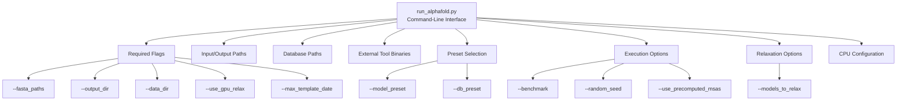
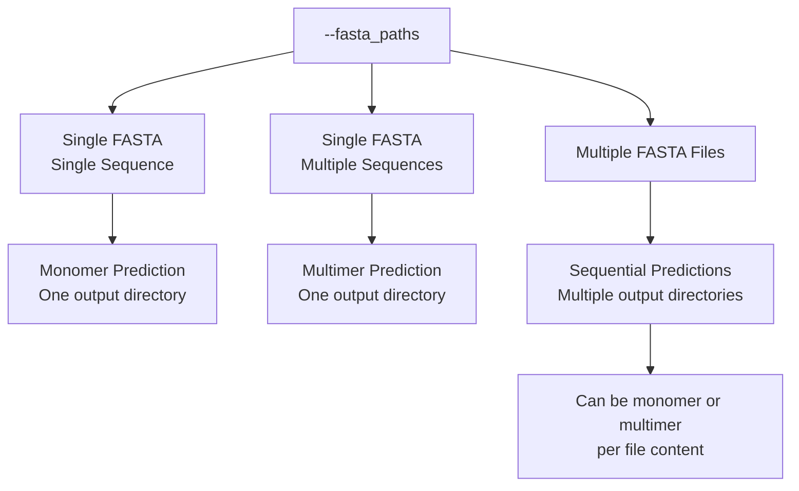
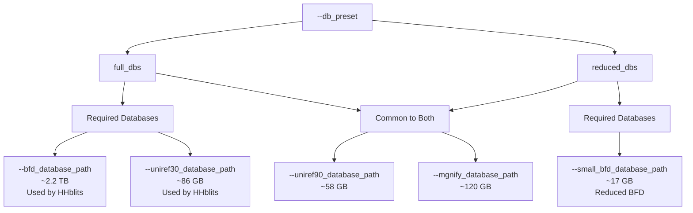
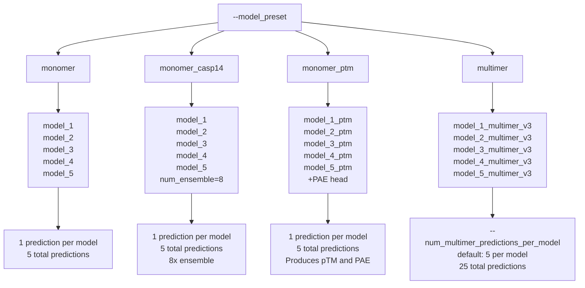
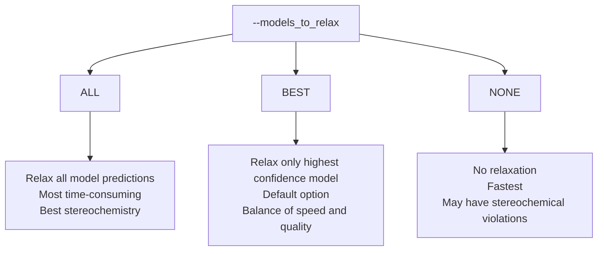
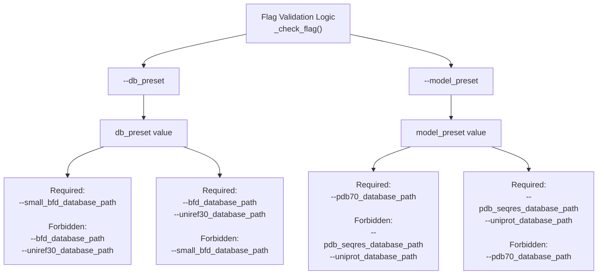

# Command-Line Interface

> **Relevant source files**
> * [README.md](https://github.com/google-deepmind/alphafold/blob/c77e5d2a/README.md?plain=1)
> * [docker/run_docker.py](https://github.com/google-deepmind/alphafold/blob/c77e5d2a/docker/run_docker.py)
> * [run_alphafold.py](https://github.com/google-deepmind/alphafold/blob/c77e5d2a/run_alphafold.py)
> * [run_alphafold_test.py](https://github.com/google-deepmind/alphafold/blob/c77e5d2a/run_alphafold_test.py)

This document provides a comprehensive reference for the command-line interface of AlphaFold's main execution script. It covers all available flags, their purposes, validation rules, and how they interact with model and database presets.

For information about the overall execution pipeline and workflow, see [Running AlphaFold](/google-deepmind/alphafold/2.3-running-alphafold). For details about model configuration beyond command-line presets, see [Configuration System](/google-deepmind/alphafold/4.1-configuration-system).

## Overview

AlphaFold is executed via the `run_alphafold.py` script, which uses the Abseil flags library (`absl.flags`) to define and parse command-line arguments. The script validates flag combinations and orchestrates the entire prediction pipeline from data processing through model execution to structure relaxation.

**Sources:** [run_alphafold.py L15-L733](https://github.com/google-deepmind/alphafold/blob/c77e5d2a/run_alphafold.py#L15-L733)

## Flag Organization

The command-line interface is organized into several categories:

**CLI Flag Categories**



**Sources:** [run_alphafold.py L57-L258](https://github.com/google-deepmind/alphafold/blob/c77e5d2a/run_alphafold.py#L57-L258)

 [run_alphafold.py L720-L731](https://github.com/google-deepmind/alphafold/blob/c77e5d2a/run_alphafold.py#L720-L731)

## Required Flags

The following flags must be specified for every AlphaFold run:

| Flag | Type | Description |
| --- | --- | --- |
| `--fasta_paths` | list | Comma-separated paths to FASTA files. Each file represents one prediction target. Multiple sequences in a single FASTA file trigger multimer prediction. All basenames must be unique. [run_alphafold.py L57-L65](https://github.com/google-deepmind/alphafold/blob/c77e5d2a/run_alphafold.py#L57-L65) |
| `--output_dir` | string | Directory where all results will be stored. Per-target subdirectories are created automatically. [run_alphafold.py L68-L70](https://github.com/google-deepmind/alphafold/blob/c77e5d2a/run_alphafold.py#L68-L70) |
| `--data_dir` | string | Path to directory containing pre-trained model parameters (`.npz` files). [run_alphafold.py L67](https://github.com/google-deepmind/alphafold/blob/c77e5d2a/run_alphafold.py#L67-L67) |
| `--uniref90_database_path` | string | Path to UniRef90 database for Jackhmmer MSA generation. [run_alphafold.py L101-L105](https://github.com/google-deepmind/alphafold/blob/c77e5d2a/run_alphafold.py#L101-L105) |
| `--mgnify_database_path` | string | Path to MGnify database for Jackhmmer MSA generation. [run_alphafold.py L106-L110](https://github.com/google-deepmind/alphafold/blob/c77e5d2a/run_alphafold.py#L106-L110) |
| `--template_mmcif_dir` | string | Directory containing template mmCIF structures, named `<pdb_id>.cif`. [run_alphafold.py L141-L146](https://github.com/google-deepmind/alphafold/blob/c77e5d2a/run_alphafold.py#L141-L146) |
| `--max_template_date` | string | Maximum template release date (format: YYYY-MM-DD). Critical for evaluating historical test sets. [run_alphafold.py L147-L152](https://github.com/google-deepmind/alphafold/blob/c77e5d2a/run_alphafold.py#L147-L152) |
| `--obsolete_pdbs_path` | string | Path to mapping file from obsolete PDB IDs to their replacements. [run_alphafold.py L153-L159](https://github.com/google-deepmind/alphafold/blob/c77e5d2a/run_alphafold.py#L153-L159) |
| `--use_gpu_relax` | boolean | Whether to use GPU for Amber relaxation. Must be explicitly set. [run_alphafold.py L226-L233](https://github.com/google-deepmind/alphafold/blob/c77e5d2a/run_alphafold.py#L226-L233) |

**Sources:** [run_alphafold.py L57-L233](https://github.com/google-deepmind/alphafold/blob/c77e5d2a/run_alphafold.py#L57-L233)

 [run_alphafold.py L720-L731](https://github.com/google-deepmind/alphafold/blob/c77e5d2a/run_alphafold.py#L720-L731)

## Input and Output Flags

### FASTA Input

The `--fasta_paths` flag determines both the targets to predict and whether to use monomer or multimer mode:

**Input Flow Logic**



**Sources:** [run_alphafold.py L57-L65](https://github.com/google-deepmind/alphafold/blob/c77e5d2a/run_alphafold.py#L57-L65)

 [run_alphafold.py L606-L609](https://github.com/google-deepmind/alphafold/blob/c77e5d2a/run_alphafold.py#L606-L609)

### Output Structure

Each FASTA file creates a subdirectory in `--output_dir` named after the FASTA basename. The prediction logic in `predict_structure` generates the following file structure [run_alphafold_test.py L98-L127](https://github.com/google-deepmind/alphafold/blob/c77e5d2a/run_alphafold_test.py#L98-L127)

:

```markdown
output_dir/
├── target1/
│   ├── msas/              # MSA output files
│   ├── features.pkl       # Processed features
│   ├── result_model_*.pkl # Raw model outputs
│   ├── unrelaxed_*.pdb    # Unrelaxed structures
│   ├── relaxed_*.pdb      # Amber-relaxed structures
│   ├── ranked_*.pdb       # Ranked by confidence
│   ├── *.cif              # mmCIF format outputs
│   ├── confidence_*.json  # pLDDT per residue
│   ├── pae_*.json         # PAE matrices (if available)
│   ├── ranking_debug.json # Ranking information
│   └── timings.json       # Performance metrics
```

**Sources:** [run_alphafold.py L360-L556](https://github.com/google-deepmind/alphafold/blob/c77e5d2a/run_alphafold.py#L360-L556)

 [run_alphafold_test.py L98-L127](https://github.com/google-deepmind/alphafold/blob/c77e5d2a/run_alphafold_test.py#L98-L127)

## Database and Binary Paths

### External Tool Binaries

All external bioinformatics tools must be accessible. Default values use `shutil.which()` to locate binaries in the system PATH [run_alphafold.py L71-L100](https://github.com/google-deepmind/alphafold/blob/c77e5d2a/run_alphafold.py#L71-L100)

:

| Flag | Tool | Purpose |
| --- | --- | --- |
| `--jackhmmer_binary_path` | Jackhmmer | Sequence search for MSA generation (UniRef90, MGnify, Uniprot) |
| `--hhblits_binary_path` | HHblits | Sequence search for MSA generation (BFD, UniRef30) |
| `--hhsearch_binary_path` | HHsearch | Template search for monomers (PDB70) |
| `--hmmsearch_binary_path` | HMMsearch | Template search for multimers (PDB seqres) |
| `--hmmbuild_binary_path` | HMMbuild | HMM profile building for multimers |
| `--kalign_binary_path` | Kalign | Multiple sequence alignment for template processing |

**Sources:** [run_alphafold.py L71-L100](https://github.com/google-deepmind/alphafold/blob/c77e5d2a/run_alphafold.py#L71-L100)

 [run_alphafold.py L562-L574](https://github.com/google-deepmind/alphafold/blob/c77e5d2a/run_alphafold.py#L562-L574)

### Genetic Database Paths

Database requirements depend on the `--db_preset` flag [run_alphafold.py L160-L167](https://github.com/google-deepmind/alphafold/blob/c77e5d2a/run_alphafold.py#L160-L167)

:

**Database Selection Logic**



**Sources:** [run_alphafold.py L102-L127](https://github.com/google-deepmind/alphafold/blob/c77e5d2a/run_alphafold.py#L102-L127)

 [run_alphafold.py L160-L167](https://github.com/google-deepmind/alphafold/blob/c77e5d2a/run_alphafold.py#L160-L167)

 [run_alphafold.py L576-L583](https://github.com/google-deepmind/alphafold/blob/c77e5d2a/run_alphafold.py#L576-L583)

### Template Database Paths

Template database requirements depend on the `--model_preset` flag [run_alphafold.py L168-L175](https://github.com/google-deepmind/alphafold/blob/c77e5d2a/run_alphafold.py#L168-L175)

:

| Model Preset | Template Database | Flag |
| --- | --- | --- |
| `monomer`, `monomer_casp14`, `monomer_ptm` | PDB70 | `--pdb70_database_path` |
| `multimer` | PDB seqres | `--pdb_seqres_database_path` |
| All | mmCIF files | `--template_mmcif_dir` |
| All (multimer only) | Uniprot | `--uniprot_database_path` |

**Sources:** [run_alphafold.py L129-L140](https://github.com/google-deepmind/alphafold/blob/c77e5d2a/run_alphafold.py#L129-L140)

 [run_alphafold.py L585-L599](https://github.com/google-deepmind/alphafold/blob/c77e5d2a/run_alphafold.py#L585-L599)

 [run_alphafold.py L611-L639](https://github.com/google-deepmind/alphafold/blob/c77e5d2a/run_alphafold.py#L611-L639)

## Preset Selection

### Model Presets

The `--model_preset` flag determines which trained models to use and their configuration [run_alphafold.py L168-L175](https://github.com/google-deepmind/alphafold/blob/c77e5d2a/run_alphafold.py#L168-L175)

:

**Model Preset Configuration**



**Model Preset Details:**

| Preset | Models Used | Templates | pTM/PAE | Ensemble | Description |
| --- | --- | --- | --- | --- | --- |
| `monomer` | model_1-5 | Varies by model | No | 1 | Standard monomer prediction |
| `monomer_casp14` | model_1-5 | Varies by model | No | 8 | CASP14 configuration with increased ensembling |
| `monomer_ptm` | model_1_ptm-5_ptm | Varies by model | Yes | 1 | Monomer with pTM scores and PAE |
| `multimer` | model_1_multimer_v3-5_multimer_v3 | Yes | Yes | 1 | Protein complex prediction |

**Sources:** [run_alphafold.py L168-L175](https://github.com/google-deepmind/alphafold/blob/c77e5d2a/run_alphafold.py#L168-L175)

 [alphafold/model/config.py L30-L53](https://github.com/google-deepmind/alphafold/blob/c77e5d2a/alphafold/model/config.py#L30-L53)

 [run_alphafold.py L601-L605](https://github.com/google-deepmind/alphafold/blob/c77e5d2a/run_alphafold.py#L601-L605)

 [run_alphafold.py L656-L682](https://github.com/google-deepmind/alphafold/blob/c77e5d2a/run_alphafold.py#L656-L682)

### Database Presets

The `--db_preset` flag controls which genetic databases are used [run_alphafold.py L160-L167](https://github.com/google-deepmind/alphafold/blob/c77e5d2a/run_alphafold.py#L160-L167)

:

| Preset | Description | Total Size | Use Case |
| --- | --- | --- | --- |
| `full_dbs` | Complete genetic databases | ~2.6 TB | Highest accuracy, requires substantial storage |
| `reduced_dbs` | Reduced genetic databases | ~600 GB | Faster with reduced storage, slight accuracy trade-off |

**Database Composition:**

| Database | `full_dbs` | `reduced_dbs` |
| --- | --- | --- |
| UniRef90 | Required (~58 GB) | Required (~58 GB) |
| MGnify | Required (~120 GB) | Required (~120 GB) |
| BFD | Required (~2.2 TB) | Not used |
| UniRef30 | Required (~86 GB) | Not used |
| Small BFD | Not used | Required (~17 GB) |

**Sources:** [run_alphafold.py L160-L167](https://github.com/google-deepmind/alphafold/blob/c77e5d2a/run_alphafold.py#L160-L167)

 [run_alphafold.py L576-L583](https://github.com/google-deepmind/alphafold/blob/c77e5d2a/run_alphafold.py#L576-L583)

## Execution Options

### Performance and Reproducibility

| Flag | Type | Default | Description |
| --- | --- | --- | --- |
| `--benchmark` | boolean | False | Run model prediction twice: first includes JIT compilation time, second excludes it. [run_alphafold.py L176-L183](https://github.com/google-deepmind/alphafold/blob/c77e5d2a/run_alphafold.py#L176-L183) |
| `--random_seed` | integer | Random | Seed for the data pipeline. Does not guarantee full determinism due to GPU non-determinism. [run_alphafold.py L184-L192](https://github.com/google-deepmind/alphafold/blob/c77e5d2a/run_alphafold.py#L184-L192) |
| `--num_multimer_predictions_per_model` | integer | 5 | Number of predictions per model for multimer mode. Each uses a different random seed. [run_alphafold.py L193-L201](https://github.com/google-deepmind/alphafold/blob/c77e5d2a/run_alphafold.py#L193-L201) |
| `--use_precomputed_msas` | boolean | False | Read MSAs from disk instead of running search tools. MSAs must be in the output directory. [run_alphafold.py L202-L212](https://github.com/google-deepmind/alphafold/blob/c77e5d2a/run_alphafold.py#L202-L212) |

**Sources:** [run_alphafold.py L176-L212](https://github.com/google-deepmind/alphafold/blob/c77e5d2a/run_alphafold.py#L176-L212)

 [run_alphafold.py L697-L700](https://github.com/google-deepmind/alphafold/blob/c77e5d2a/run_alphafold.py#L697-L700)

### CPU Configuration

Control the number of CPUs used by external tools [run_alphafold.py L234-L257](https://github.com/google-deepmind/alphafold/blob/c77e5d2a/run_alphafold.py#L234-L257)

:

| Flag | Default | Description |
| --- | --- | --- |
| `--jackhmmer_n_cpu` | min(cpu_count, 8) | CPUs for Jackhmmer. Limited to 8 as higher values provide minimal speedup. |
| `--hmmsearch_n_cpu` | min(cpu_count, 8) | CPUs for HMMsearch. Limited to 8 as higher values provide minimal speedup. |
| `--hhsearch_n_cpu` | min(cpu_count, 8) | CPUs for HHsearch. Limited to 8 as higher values provide minimal speedup. |

**Sources:** [run_alphafold.py L234-L257](https://github.com/google-deepmind/alphafold/blob/c77e5d2a/run_alphafold.py#L234-L257)

## Relaxation Options

### Models to Relax

The `--models_to_relax` flag determines which predicted structures undergo Amber energy minimization [run_alphafold.py L213-L225](https://github.com/google-deepmind/alphafold/blob/c77e5d2a/run_alphafold.py#L213-L225)

:

**Relaxation Selection**



The `ModelsToRelax` enum is defined at [run_alphafold.py L50-L54](https://github.com/google-deepmind/alphafold/blob/c77e5d2a/run_alphafold.py#L50-L54)

:

```python
@enum.uniqueclass ModelsToRelax(enum.Enum):  ALL = 0  BEST = 1  NONE = 2
```

**Relaxation Parameters:**

These constants control the Amber relaxation process [run_alphafold.py L261-L266](https://github.com/google-deepmind/alphafold/blob/c77e5d2a/run_alphafold.py#L261-L266)

:

| Parameter | Value | Description |
| --- | --- | --- |
| `RELAX_MAX_ITERATIONS` | 0 | Maximum iterations (0 = unlimited) |
| `RELAX_ENERGY_TOLERANCE` | 2.39 | Energy tolerance in kJ/mol |
| `RELAX_STIFFNESS` | 10.0 | Restraint stiffness |
| `RELAX_EXCLUDE_RESIDUES` | [] | Residues to exclude from restraints |
| `RELAX_MAX_OUTER_ITERATIONS` | 3 | Maximum outer loop iterations |

**Sources:** [run_alphafold.py L50-L54](https://github.com/google-deepmind/alphafold/blob/c77e5d2a/run_alphafold.py#L50-L54)

 [run_alphafold.py L213-L233](https://github.com/google-deepmind/alphafold/blob/c77e5d2a/run_alphafold.py#L213-L233)

 [run_alphafold.py L261-L266](https://github.com/google-deepmind/alphafold/blob/c77e5d2a/run_alphafold.py#L261-L266)

 [run_alphafold.py L482-L515](https://github.com/google-deepmind/alphafold/blob/c77e5d2a/run_alphafold.py#L482-L515)

## Flag Validation

AlphaFold validates flag combinations to ensure consistency using `_check_flag()` [run_alphafold.py L269-L275](https://github.com/google-deepmind/alphafold/blob/c77e5d2a/run_alphafold.py#L269-L275)

:

**Flag Dependency Validation**



The validation function `_check_flag()` at [run_alphafold.py L269-L275](https://github.com/google-deepmind/alphafold/blob/c77e5d2a/run_alphafold.py#L269-L275)

 enforces these relationships:

```python
def _check_flag(flag_name: str, other_flag_name: str, should_be_set: bool):  if should_be_set != bool(FLAGS[flag_name].value):    verb = 'be' if should_be_set else 'not be'    raise ValueError(        f'{flag_name} must {verb} set when running with '        f'"--{other_flag_name}={FLAGS[other_flag_name].value}".'    )
```

**Sources:** [run_alphafold.py L269-L275](https://github.com/google-deepmind/alphafold/blob/c77e5d2a/run_alphafold.py#L269-L275)

 [run_alphafold.py L562-L599](https://github.com/google-deepmind/alphafold/blob/c77e5d2a/run_alphafold.py#L562-L599)

## Model Configuration Details

The `MODEL_PRESETS` dictionary maps preset names to lists of model names [alphafold/model/config.py L30-L53](https://github.com/google-deepmind/alphafold/blob/c77e5d2a/alphafold/model/config.py#L30-L53)

:

```
MODEL_PRESETS = {    'monomer': ('model_1', 'model_2', 'model_3', 'model_4', 'model_5'),    'monomer_ptm': ('model_1_ptm', 'model_2_ptm', 'model_3_ptm', 'model_4_ptm', 'model_5_ptm'),    'multimer': ('model_1_multimer_v3', 'model_2_multimer_v3', 'model_3_multimer_v3',                  'model_4_multimer_v3', 'model_5_multimer_v3'),    'monomer_casp14': ('model_1', 'model_2', 'model_3', 'model_4', 'model_5'),}
```

### Monomer Model Differences

Model-specific configuration is handled via `CONFIG_DIFFS` [alphafold/model/config.py L55-L118](https://github.com/google-deepmind/alphafold/blob/c77e5d2a/alphafold/model/config.py#L55-L118)

:

| Model | Templates | Max Extra MSA | Reduce MSA by Templates | Embed Torsion Angles |
| --- | --- | --- | --- | --- |
| model_1 | Yes | 5120 | Yes | Yes |
| model_2 | Yes | 1024 (default) | Yes | Yes |
| model_3 | No | 5120 | No | No |
| model_4 | No | 5120 | No | No |
| model_5 | No | 1024 (default) | No | No |

**Sources:** [alphafold/model/config.py L30-L118](https://github.com/google-deepmind/alphafold/blob/c77e5d2a/alphafold/model/config.py#L30-L118)

 [alphafold/model/config.py L670-L682](https://github.com/google-deepmind/alphafold/blob/c77e5d2a/alphafold/model/config.py#L670-L682)

## Usage Examples

### Basic Monomer Prediction

```
python run_alphafold.py \  --fasta_paths=/path/to/sequence.fasta \  --output_dir=/path/to/output \  --data_dir=/path/to/params \  --uniref90_database_path=/path/to/uniref90 \  --mgnify_database_path=/path/to/mgnify \  --bfd_database_path=/path/to/bfd \  --uniref30_database_path=/path/to/uniref30 \  --pdb70_database_path=/path/to/pdb70 \  --template_mmcif_dir=/path/to/mmcif \  --max_template_date=2021-11-01 \  --obsolete_pdbs_path=/path/to/obsolete.dat \  --model_preset=monomer \  --db_preset=full_dbs \  --use_gpu_relax=true
```

### Multimer Prediction with Reduced Databases

```
python run_alphafold.py \  --fasta_paths=/path/to/complex.fasta \  --output_dir=/path/to/output \  --data_dir=/path/to/params \  --uniref90_database_path=/path/to/uniref90 \  --mgnify_database_path=/path/to/mgnify \  --small_bfd_database_path=/path/to/small_bfd \  --pdb_seqres_database_path=/path/to/pdb_seqres \  --uniprot_database_path=/path/to/uniprot \  --template_mmcif_dir=/path/to/mmcif \  --max_template_date=2021-11-01 \  --obsolete_pdbs_path=/path/to/obsolete.dat \  --model_preset=multimer \  --db_preset=reduced_dbs \  --num_multimer_predictions_per_model=5 \  --use_gpu_relax=true
```

**Sources:** [run_alphafold.py L558-L717](https://github.com/google-deepmind/alphafold/blob/c77e5d2a/run_alphafold.py#L558-L717)