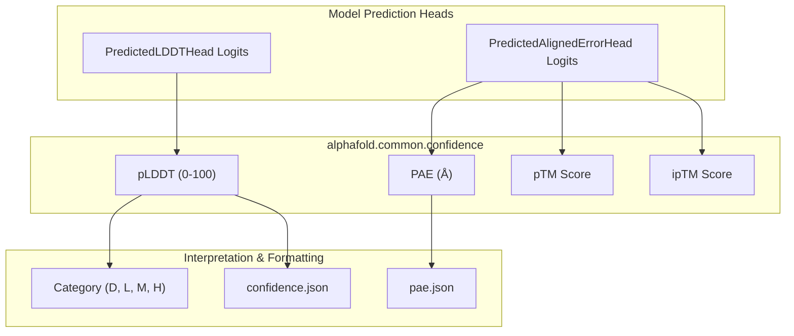
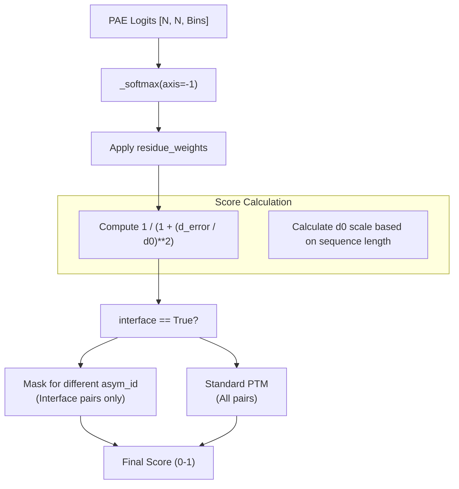

# Confidence Metrics

> **Relevant source files**
> * [alphafold/common/confidence.py](https://github.com/google-deepmind/alphafold/blob/c77e5d2a/alphafold/common/confidence.py)
> * [alphafold/common/confidence_test.py](https://github.com/google-deepmind/alphafold/blob/c77e5d2a/alphafold/common/confidence_test.py)
> * [alphafold/model/lddt.py](https://github.com/google-deepmind/alphafold/blob/c77e5d2a/alphafold/model/lddt.py)
> * [alphafold/model/lddt_test.py](https://github.com/google-deepmind/alphafold/blob/c77e5d2a/alphafold/model/lddt_test.py)
> * [alphafold/notebooks/notebook_utils.py](https://github.com/google-deepmind/alphafold/blob/c77e5d2a/alphafold/notebooks/notebook_utils.py)

This page describes the confidence metrics used in AlphaFold to evaluate the reliability of protein structure predictions. These metrics help users assess different aspects of prediction quality, from per-residue accuracy to pairwise residue position confidence and overall model quality.

## Overview of Confidence Metrics

AlphaFold provides several complementary confidence metrics to help assess prediction quality:

* **pLDDT** (predicted Local Distance Difference Test): Per-residue confidence score (0-100).
* **PAE** (Predicted Aligned Error): Pairwise residue position confidence (in Ångstroms).
* **pTM** (predicted TM-score): Overall fold quality assessment (0-1).
* **ipTM** (predicted interface TM-score): Interface quality in multimers (0-1).

### Confidence Metric Flow

The following diagram illustrates how raw model logits are transformed into human-interpretable confidence scores within the `alphafold/common/confidence.py` module.

Sources: [alphafold/common/confidence.py L15-L205](https://github.com/google-deepmind/alphafold/blob/c77e5d2a/alphafold/common/confidence.py#L15-L205)

 [alphafold/model/lddt.py L19-L25](https://github.com/google-deepmind/alphafold/blob/c77e5d2a/alphafold/model/lddt.py#L19-L25)

---

## pLDDT (predicted Local Distance Difference Test)

The pLDDT score is a per-residue confidence metric ranging from 0 to 100. It is a predictor of the lDDT-Cα metric, which measures local structure accuracy without requiring global superposition.

### Calculation Logic

The function `compute_plddt` [alphafold/common/confidence.py L30-L44](https://github.com/google-deepmind/alphafold/blob/c77e5d2a/alphafold/common/confidence.py#L30-L44)

 implements the logic:

1. **Input**: Logits of shape `[num_res, num_bins]` from the model's LDDT head.
2. **Softmax**: Logits are converted to probabilities using a custom `_softmax` implementation [alphafold/common/confidence.py L23-L27](https://github.com/google-deepmind/alphafold/blob/c77e5d2a/alphafold/common/confidence.py#L23-L27)
3. **Bin Centers**: The range [0, 1] is divided into bins. The center of each bin is calculated as `(0.5 * bin_width)`.
4. **Expectation**: The final score is the expected value (probability-weighted sum of bin centers) multiplied by 100.

### Confidence Categories

The internal helper `_confidence_category` [alphafold/common/confidence.py L47-L58](https://github.com/google-deepmind/alphafold/blob/c77e5d2a/alphafold/common/confidence.py#L47-L58)

 maps scores to qualitative labels:

* **H (High)**: 90-100
* **M (Medium)**: 70-90
* **L (Low)**: 50-70
* **D (Disordered)**: 0-50

Sources: [alphafold/common/confidence.py L23-L58](https://github.com/google-deepmind/alphafold/blob/c77e5d2a/alphafold/common/confidence.py#L23-L58)

 [alphafold/model/lddt.py L19-L101](https://github.com/google-deepmind/alphafold/blob/c77e5d2a/alphafold/model/lddt.py#L19-L101)

---

## PAE (Predicted Aligned Error)

PAE measures the expected distance error (in Ångstroms) between residue $i$ and residue $j$ when the structures are aligned on residue $i$.

### Implementation Details

The `compute_predicted_aligned_error` function [alphafold/common/confidence.py L127-L155](https://github.com/google-deepmind/alphafold/blob/c77e5d2a/alphafold/common/confidence.py#L127-L155)

 processes the logits from the `PredictedAlignedErrorHead`:

1. **Probability Calculation**: Softmax is applied across the bin dimension of the `[num_res, num_res, num_bins]` logit tensor.
2. **Bin Center Mapping**: `_calculate_bin_centers` [alphafold/common/confidence.py L84-L99](https://github.com/google-deepmind/alphafold/blob/c77e5d2a/alphafold/common/confidence.py#L84-L99)  derives centers from the `breaks` array (the edges of the error bins).
3. **Expected Error**: `_calculate_expected_aligned_error` [alphafold/common/confidence.py L102-L124](https://github.com/google-deepmind/alphafold/blob/c77e5d2a/alphafold/common/confidence.py#L102-L124)  computes the sum of probabilities multiplied by bin centers.

### JSON Export

The `pae_json` function [alphafold/common/confidence.py L158-L181](https://github.com/google-deepmind/alphafold/blob/c77e5d2a/alphafold/common/confidence.py#L158-L181)

 formats the square PAE matrix for storage, rounding values to one decimal place to match the AlphaFold Database (AFDB) style.

Sources: [alphafold/common/confidence.py L84-L181](https://github.com/google-deepmind/alphafold/blob/c77e5d2a/alphafold/common/confidence.py#L84-L181)

---

## pTM and ipTM (predicted TM-scores)

The `predicted_tm_score` function [alphafold/common/confidence.py L184-L205](https://github.com/google-deepmind/alphafold/blob/c77e5d2a/alphafold/common/confidence.py#L184-L205)

 calculates global quality scores based on the PAE distribution.

### Algorithm Flow

The function supports both standard pTM and interface-specific ipTM:

* **pTM**: Uses all residue pairs to estimate the Template Modeling score (TM-score).
* **ipTM**: Only considers pairs of residues that belong to different chains (asymmetric units), identified by the `asym_id` array [alphafold/common/confidence.py L199-L201](https://github.com/google-deepmind/alphafold/blob/c77e5d2a/alphafold/common/confidence.py#L199-L201)

Sources: [alphafold/common/confidence.py L184-L212](https://github.com/google-deepmind/alphafold/blob/c77e5d2a/alphafold/common/confidence.py#L184-L212)

---

## Data Structures and Testing

### Confidence JSON Format

The `confidence_json` function [alphafold/common/confidence.py L61-L81](https://github.com/google-deepmind/alphafold/blob/c77e5d2a/alphafold/common/confidence.py#L61-L81)

 produces a serialized dictionary containing:

* `residueNumber`: 1-based index of residues.
* `confidenceScore`: pLDDT values rounded to 2 decimal places.
* `confidenceCategory`: The D/L/M/H classification.

### Validation

Confidence calculations are verified in `alphafold/common/confidence_test.py`:

* `test_pae_json`: Ensures rounding and JSON structure for PAE [alphafold/common/confidence_test.py L25-L32](https://github.com/google-deepmind/alphafold/blob/c77e5d2a/alphafold/common/confidence_test.py#L25-L32)
* `test_confidence_json`: Validates pLDDT categorization and indexing [alphafold/common/confidence_test.py L34-L48](https://github.com/google-deepmind/alphafold/blob/c77e5d2a/alphafold/common/confidence_test.py#L34-L48)
* `alphafold/model/lddt_test.py` provides ground-truth comparisons for the underlying lDDT metric implementation [alphafold/model/lddt_test.py L21-L90](https://github.com/google-deepmind/alphafold/blob/c77e5d2a/alphafold/model/lddt_test.py#L21-L90)

Sources: [alphafold/common/confidence.py L61-L81](https://github.com/google-deepmind/alphafold/blob/c77e5d2a/alphafold/common/confidence.py#L61-L81)

 [alphafold/common/confidence_test.py L15-L52](https://github.com/google-deepmind/alphafold/blob/c77e5d2a/alphafold/common/confidence_test.py#L15-L52)

 [alphafold/model/lddt_test.py L21-L90](https://github.com/google-deepmind/alphafold/blob/c77e5d2a/alphafold/model/lddt_test.py#L21-L90)