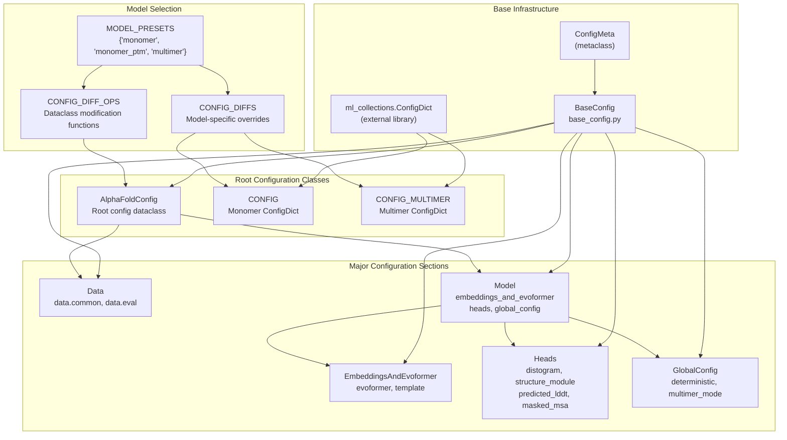
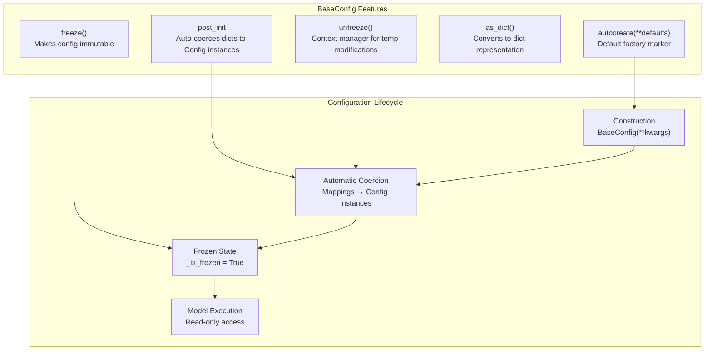
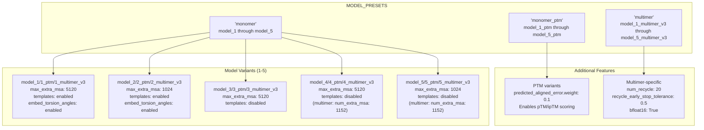
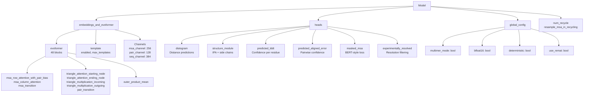

# Configuration System

> **Relevant source files**
> * [alphafold/model/base_config.py](https://github.com/google-deepmind/alphafold/blob/c77e5d2a/alphafold/model/base_config.py)
> * [alphafold/model/base_config_test.py](https://github.com/google-deepmind/alphafold/blob/c77e5d2a/alphafold/model/base_config_test.py)
> * [alphafold/model/config.py](https://github.com/google-deepmind/alphafold/blob/c77e5d2a/alphafold/model/config.py)
> * [alphafold/model/config_test.py](https://github.com/google-deepmind/alphafold/blob/c77e5d2a/alphafold/model/config_test.py)

## Purpose and Scope

The Configuration System manages all hyperparameters and architectural settings for AlphaFold models. It provides a flexible preset-based system that supports both monomer and multimer predictions with different model variants. The system uses two complementary configuration formats: legacy `ml_collections.ConfigDict` objects and modern frozen dataclass-based configurations.

For information about how configurations are used during model execution, see [Model Execution](/google-deepmind/alphafold/4.4-model-execution). For details on the neural network architecture defined by these configurations, see [Evoformer Stack](/google-deepmind/alphafold/4.2-evoformer-stack) and [Structure Module](/google-deepmind/alphafold/4.3-structure-module).

**Sources:** [alphafold/model/config.py L1-L23](https://github.com/google-deepmind/alphafold/blob/c77e5d2a/alphafold/model/config.py#L1-L23)

## Configuration Architecture Overview

The configuration system is built on a hierarchical class structure with two parallel representations: mutable dictionary-based configs and immutable dataclass-based configs.



**Sources:** [alphafold/model/base_config.py L69-L131](https://github.com/google-deepmind/alphafold/blob/c77e5d2a/alphafold/model/base_config.py#L69-L131)

 [alphafold/model/config.py L689-L993](https://github.com/google-deepmind/alphafold/blob/c77e5d2a/alphafold/model/config.py#L689-L993)

## Configuration Formats

### ml_collections.ConfigDict Format

The legacy configuration format uses `ml_collections.ConfigDict`, a mutable dictionary-based configuration object. Two base configurations are defined:

| Configuration | Purpose | Key Features |
| --- | --- | --- |
| `CONFIG` | Monomer predictions | Single chain, optional templates, 3 recycles [alphafold/model/config.py L136-L168](https://github.com/google-deepmind/alphafold/blob/c77e5d2a/alphafold/model/config.py#L136-L168) |
| `CONFIG_MULTIMER` | Multimer predictions | Multi-chain, always uses templates, 20 recycles, early stopping [alphafold/model/config.py L460-L686](https://github.com/google-deepmind/alphafold/blob/c77e5d2a/alphafold/model/config.py#L460-L686) |

The `model_config()` function returns a `ConfigDict` by applying model-specific overrides from `CONFIG_DIFFS`:

```python
def model_config(name: str) -> ml_collections.ConfigDict
```

This function:

1. Validates the model name exists in `CONFIG_DIFFS` [alphafold/model/config.py L996-L997](https://github.com/google-deepmind/alphafold/blob/c77e5d2a/alphafold/model/config.py#L996-L997)
2. Selects base config (`CONFIG` or `CONFIG_MULTIMER`) based on name [alphafold/model/config.py L998-L1001](https://github.com/google-deepmind/alphafold/blob/c77e5d2a/alphafold/model/config.py#L998-L1001)
3. Applies flattened overrides using `update_from_flattened_dict()` [alphafold/model/config.py L1004-L1005](https://github.com/google-deepmind/alphafold/blob/c77e5d2a/alphafold/model/config.py#L1004-L1005)

**Sources:** [alphafold/model/config.py L136-L457](https://github.com/google-deepmind/alphafold/blob/c77e5d2a/alphafold/model/config.py#L136-L457)

 [alphafold/model/config.py L460-L686](https://github.com/google-deepmind/alphafold/blob/c77e5d2a/alphafold/model/config.py#L460-L686)

 [alphafold/model/config.py L995-L1005](https://github.com/google-deepmind/alphafold/blob/c77e5d2a/alphafold/model/config.py#L995-L1005)

### BaseConfig Dataclass Format

The modern configuration format uses frozen dataclasses derived from `BaseConfig`. This provides:

* **Type safety**: Field types are enforced at construction [alphafold/model/base_config.py L132-L138](https://github.com/google-deepmind/alphafold/blob/c77e5d2a/alphafold/model/base_config.py#L132-L138)
* **Immutability**: Configs can be frozen to prevent modification via `freeze()` [alphafold/model/base_config.py L186-L188](https://github.com/google-deepmind/alphafold/blob/c77e5d2a/alphafold/model/base_config.py#L186-L188)
* **Automatic coercion**: Dictionary values are automatically converted to nested config objects in `__post_init__` [alphafold/model/base_config.py L94-L128](https://github.com/google-deepmind/alphafold/blob/c77e5d2a/alphafold/model/base_config.py#L94-L128)
* **Default factories**: Fields can use `autocreate()` for automatic initialization [alphafold/model/base_config.py L48-L50](https://github.com/google-deepmind/alphafold/blob/c77e5d2a/alphafold/model/base_config.py#L48-L50)



The `get_model_config()` function returns a frozen `AlphaFoldConfig` dataclass:

```python
@functools.lru_cachedef get_model_config(name: str, frozen: bool = True) -> AlphaFoldConfig
```

This function:

1. Validates the model name [alphafold/model/config.py L1009-L1010](https://github.com/google-deepmind/alphafold/blob/c77e5d2a/alphafold/model/config.py#L1009-L1010)
2. Constructs `AlphaFoldConfig` from appropriate base dict [alphafold/model/config.py L1011-L1015](https://github.com/google-deepmind/alphafold/blob/c77e5d2a/alphafold/model/config.py#L1011-L1015)
3. Applies model-specific modifications via functions in `CONFIG_DIFF_OPS` [alphafold/model/config.py L1017-L1018](https://github.com/google-deepmind/alphafold/blob/c77e5d2a/alphafold/model/config.py#L1017-L1018)
4. Optionally freezes the configuration [alphafold/model/config.py L1020-L1021](https://github.com/google-deepmind/alphafold/blob/c77e5d2a/alphafold/model/config.py#L1020-L1021)

**Sources:** [alphafold/model/base_config.py L42-L200](https://github.com/google-deepmind/alphafold/blob/c77e5d2a/alphafold/model/base_config.py#L42-L200)

 [alphafold/model/config.py L1008-L1022](https://github.com/google-deepmind/alphafold/blob/c77e5d2a/alphafold/model/config.py#L1008-L1022)

## Model Presets System

The preset system defines three categories of models with five variants each:



### Configuration Override Details

| Model | max_extra_msa | Templates | embed_torsion_angles | PAE Weight | Notes |
| --- | --- | --- | --- | --- | --- |
| model_1 | 5120 | ✓ | ✓ | 0.0 | Full template pipeline [alphafold/model/config.py L56-L63](https://github.com/google-deepmind/alphafold/blob/c77e5d2a/alphafold/model/config.py#L56-L63) |
| model_2 | 1024 | ✓ | ✓ | 0.0 | Reduced extra MSA [alphafold/model/config.py L64-L70](https://github.com/google-deepmind/alphafold/blob/c77e5d2a/alphafold/model/config.py#L64-L70) |
| model_3 | 5120 | ✗ | ✗ | 0.0 | Template-free, large MSA [alphafold/model/config.py L71-L74](https://github.com/google-deepmind/alphafold/blob/c77e5d2a/alphafold/model/config.py#L71-L74) |
| model_4 | 5120 | ✗ | ✗ | 0.0 | Template-free, large MSA [alphafold/model/config.py L75-L78](https://github.com/google-deepmind/alphafold/blob/c77e5d2a/alphafold/model/config.py#L75-L78) |
| model_5 | 1024 | ✗ | ✗ | 0.0 | Template-free, default MSA [alphafold/model/config.py L79-L81](https://github.com/google-deepmind/alphafold/blob/c77e5d2a/alphafold/model/config.py#L79-L81) |
| *_ptm variants | Same | Same | Same | 0.1 | Adds PAE head weight [alphafold/model/config.py L85-L108](https://github.com/google-deepmind/alphafold/blob/c77e5d2a/alphafold/model/config.py#L85-L108) |
| *_multimer_v3 | N/A | ✓ | N/A | 0.1 | 20 recycles, early stopping [alphafold/model/config.py L460-L686](https://github.com/google-deepmind/alphafold/blob/c77e5d2a/alphafold/model/config.py#L460-L686) |

**Sources:** [alphafold/model/config.py L30-L53](https://github.com/google-deepmind/alphafold/blob/c77e5d2a/alphafold/model/config.py#L30-L53)

 [alphafold/model/config.py L55-L118](https://github.com/google-deepmind/alphafold/blob/c77e5d2a/alphafold/model/config.py#L55-L118)

## Configuration Construction Flow

```mermaid
flowchart TD

model_name_dc["model_name<br>(e.g., 'model_3_ptm')"]
get_model_config_func["get_model_config(name, frozen=True)<br>config.py:1008-1022"]
lru_cache["@functools.lru_cache<br>Cache per model"]
select_base_dc["Select base:<br>CONFIG or CONFIG_MULTIMER"]
construct_dc["AlphaFoldConfig(**base.to_dict())"]
apply_diff_ops["CONFIG_DIFF_OPSUnsupported markdown: link<br>Modify dataclass in-place"]
freeze_dc["cfg.freeze()<br>Make immutable"]
result_dc["AlphaFoldConfig<br>Frozen dataclass"]
model_name_dict["model_name<br>(e.g., 'model_3_ptm')"]
model_config_func["model_config(name)<br>config.py:995-1005"]
select_base_dict["Select base:<br>CONFIG or CONFIG_MULTIMER"]
deep_copy_dict["copy.deepcopy()"]
apply_diffs_dict["update_from_flattened_dict()<br>CONFIG_DIFFS[name]"]
result_dict["ml_collections.ConfigDict<br>Mutable configuration"]

subgraph subGraph1 ["Dataclass-Based Path"]
    model_name_dc
    get_model_config_func
    lru_cache
    select_base_dc
    construct_dc
    apply_diff_ops
    freeze_dc
    result_dc
    model_name_dc --> get_model_config_func
    get_model_config_func --> lru_cache
    lru_cache --> select_base_dc
    select_base_dc --> construct_dc
    construct_dc --> apply_diff_ops
    apply_diff_ops --> freeze_dc
    freeze_dc --> result_dc
end

subgraph subGraph0 ["Dictionary-Based Path"]
    model_name_dict
    model_config_func
    select_base_dict
    deep_copy_dict
    apply_diffs_dict
    result_dict
    model_name_dict --> model_config_func
    model_config_func --> select_base_dict
    select_base_dict --> deep_copy_dict
    deep_copy_dict --> apply_diffs_dict
    apply_diffs_dict --> result_dict
end
```



### Dataclass Modification Functions

The `CONFIG_DIFF_OPS` dictionary maps model names to functions that modify `AlphaFoldConfig` instances [alphafold/model/config.py L1155-L1185](https://github.com/google-deepmind/alphafold/blob/c77e5d2a/alphafold/model/config.py#L1155-L1185)

:

* **Template models** (1, 2): Enable template processing and set `embed_torsion_angles` via `_apply_model_1_diff` and `_apply_model_2_diff` [alphafold/model/config.py L1025-L1044](https://github.com/google-deepmind/alphafold/blob/c77e5d2a/alphafold/model/config.py#L1025-L1044)
* **Template-free models** (3, 4, 5): Modify `max_extra_msa` if needed via `_apply_model_3_diff` etc. [alphafold/model/config.py L1047-L1061](https://github.com/google-deepmind/alphafold/blob/c77e5d2a/alphafold/model/config.py#L1047-L1061)
* **PTM variants**: Set `predicted_aligned_error.weight = 0.1` via `_apply_ptm_diff` [alphafold/model/config.py L1064-L1066](https://github.com/google-deepmind/alphafold/blob/c77e5d2a/alphafold/model/config.py#L1064-L1066)
* **Multimer v1/v2**: Apply `_common_updates()` for numerical optimizations in Triangle Multiplication [alphafold/model/config.py L1082-L1094](https://github.com/google-deepmind/alphafold/blob/c77e5d2a/alphafold/model/config.py#L1082-L1094)
* **Multimer v3**: Minimal changes (models 4 and 5 modify `num_extra_msa`) [alphafold/model/config.py L1097-L1111](https://github.com/google-deepmind/alphafold/blob/c77e5d2a/alphafold/model/config.py#L1097-L1111)

**Sources:** [alphafold/model/config.py L1025-L1185](https://github.com/google-deepmind/alphafold/blob/c77e5d2a/alphafold/model/config.py#L1025-L1185)

## Configuration Structure

### Top-Level Structure

The `AlphaFoldConfig` class contains two major sections:

```
AlphaFoldConfig
├── model: Model                    (required)
│   ├── embeddings_and_evoformer
│   ├── global_config
│   ├── heads
│   ├── num_recycle
│   └── resample_msa_in_recycling
└── data: Data                      (optional, used during training)
    ├── common
    └── eval
```

**Sources:** [alphafold/model/config.py L990-L993](https://github.com/google-deepmind/alphafold/blob/c77e5d2a/alphafold/model/config.py#L990-L993)

### Data Configuration Section

The `data` section controls feature processing and training data preparation:

| Field | Type | Purpose |
| --- | --- | --- |
| `data.common.masked_msa` | `MaskedMsa` | BERT-style MSA masking probabilities [alphafold/model/config.py L139-L143](https://github.com/google-deepmind/alphafold/blob/c77e5d2a/alphafold/model/config.py#L139-L143) |
| `data.common.max_extra_msa` | `int` | Maximum extra MSA sequences (1024 or 5120) [alphafold/model/config.py L144](https://github.com/google-deepmind/alphafold/blob/c77e5d2a/alphafold/model/config.py#L144-L144) |
| `data.common.use_templates` | `bool` | Enable/disable template processing [alphafold/model/config.py L167](https://github.com/google-deepmind/alphafold/blob/c77e5d2a/alphafold/model/config.py#L167-L167) |
| `data.common.num_recycle` | `int` | Number of recycling iterations [alphafold/model/config.py L146](https://github.com/google-deepmind/alphafold/blob/c77e5d2a/alphafold/model/config.py#L146-L146) |
| `data.eval.max_msa_clusters` | `int` | Maximum clustered MSA sequences (512) [alphafold/model/config.py L214](https://github.com/google-deepmind/alphafold/blob/c77e5d2a/alphafold/model/config.py#L214-L214) |
| `data.eval.max_templates` | `int` | Maximum template structures (4) [alphafold/model/config.py L215](https://github.com/google-deepmind/alphafold/blob/c77e5d2a/alphafold/model/config.py#L215-L215) |
| `data.eval.feat` | `Dict[str, Any]` | Expected feature shapes with placeholders [alphafold/model/config.py L170-L211](https://github.com/google-deepmind/alphafold/blob/c77e5d2a/alphafold/model/config.py#L170-L211) |

The `data.eval.feat` dictionary defines expected tensor shapes using placeholders:

* `NUM_RES`: Number of residues [alphafold/model/config.py L25](https://github.com/google-deepmind/alphafold/blob/c77e5d2a/alphafold/model/config.py#L25-L25)
* `NUM_MSA_SEQ`: Clustered MSA sequences [alphafold/model/config.py L26](https://github.com/google-deepmind/alphafold/blob/c77e5d2a/alphafold/model/config.py#L26-L26)
* `NUM_EXTRA_SEQ`: Extra MSA sequences [alphafold/model/config.py L27](https://github.com/google-deepmind/alphafold/blob/c77e5d2a/alphafold/model/config.py#L27-L27)
* `NUM_TEMPLATES`: Template structures [alphafold/model/config.py L28](https://github.com/google-deepmind/alphafold/blob/c77e5d2a/alphafold/model/config.py#L28-L28)

**Sources:** [alphafold/model/config.py L137-L238](https://github.com/google-deepmind/alphafold/blob/c77e5d2a/alphafold/model/config.py#L137-L238)

 [alphafold/model/config.py L696-L722](https://github.com/google-deepmind/alphafold/blob/c77e5d2a/alphafold/model/config.py#L696-L722)

### Model Configuration Section



**Key Configuration Classes:**

| Class | Purpose | Key Fields |
| --- | --- | --- |
| `EmbeddingsAndEvoformer` | Evoformer stack configuration | `evoformer_num_block` (48), `evoformer`, `template` [alphafold/model/config.py L858-L872](https://github.com/google-deepmind/alphafold/blob/c77e5d2a/alphafold/model/config.py#L858-L872) |
| `Evoformer` | Single Evoformer block config | Attention and triangle operation configs [alphafold/model/config.py L796-L815](https://github.com/google-deepmind/alphafold/blob/c77e5d2a/alphafold/model/config.py#L796-L815) |
| `Template` | Template processing config | `enabled`, `max_templates`, `template_pair_stack` [alphafold/model/config.py L843-L855](https://github.com/google-deepmind/alphafold/blob/c77e5d2a/alphafold/model/config.py#L843-L855) |
| `GlobalConfig` | Cross-cutting concerns | `multimer_mode`, `bfloat16`, `use_remat` [alphafold/model/config.py L881-L890](https://github.com/google-deepmind/alphafold/blob/c77e5d2a/alphafold/model/config.py#L881-L890) |
| `Heads` | Output head configurations | `structure_module`, `distogram`, `predicted_lddt`, etc. [alphafold/model/config.py L978-L988](https://github.com/google-deepmind/alphafold/blob/c77e5d2a/alphafold/model/config.py#L978-L988) |

**Sources:** [alphafold/model/config.py L239-L457](https://github.com/google-deepmind/alphafold/blob/c77e5d2a/alphafold/model/config.py#L239-L457)

 [alphafold/model/config.py L858-L988](https://github.com/google-deepmind/alphafold/blob/c77e5d2a/alphafold/model/config.py#L858-L988)

### Structure Module Configuration

The `structure_module` head contains settings for 3D structure prediction:

```yaml
structure_module:  num_layer: 8                          # IPA iterations [alphafold/model/config.py:934]  num_head: 12                          # Attention heads [alphafold/model/config.py:935]  num_channel: 384                      # Hidden dimension [alphafold/model/config.py:936]    # Invariant Point Attention  num_point_qk: 4                       # Point query/key pairs [alphafold/model/config.py:937]  num_point_v: 8                        # Point value pairs [alphafold/model/config.py:938]  num_scalar_qk: 16                     # Scalar query/key dim [alphafold/model/config.py:939]  num_scalar_v: 16                      # Scalar value dim [alphafold/model/config.py:940]    # Loss configurations  fape:                                 # Frame Aligned Point Error    clamp_distance: 10.0                # [alphafold/model/config.py:945]    loss_unit_distance: 10.0            # [alphafold/model/config.py:946]
```

**Monomer vs Multimer Differences:**

| Feature | Monomer | Multimer |
| --- | --- | --- |
| `position_scale` | 10.0 | 20.0 [alphafold/model/config.py L643](https://github.com/google-deepmind/alphafold/blob/c77e5d2a/alphafold/model/config.py#L643-L643) |
| FAPE type | Single `fape` config | `interface_fape` + `intra_chain_fape` [alphafold/model/config.py L654-L665](https://github.com/google-deepmind/alphafold/blob/c77e5d2a/alphafold/model/config.py#L654-L665) |
| `num_recycle` | 3 | 20 [alphafold/model/config.py L603](https://github.com/google-deepmind/alphafold/blob/c77e5d2a/alphafold/model/config.py#L603-L603) |
| `recycle_early_stop_tolerance` | N/A | 0.5 [alphafold/model/config.py L604](https://github.com/google-deepmind/alphafold/blob/c77e5d2a/alphafold/model/config.py#L604-L604) |

**Sources:** [alphafold/model/config.py L413-L443](https://github.com/google-deepmind/alphafold/blob/c77e5d2a/alphafold/model/config.py#L413-L443)

 [alphafold/model/config.py L642-L674](https://github.com/google-deepmind/alphafold/blob/c77e5d2a/alphafold/model/config.py#L642-L674)

 [alphafold/model/config.py L931-L955](https://github.com/google-deepmind/alphafold/blob/c77e5d2a/alphafold/model/config.py#L931-L955)

### Global Configuration

The `global_config` section contains settings that affect the entire model:

| Field | Monomer | Multimer | Purpose |
| --- | --- | --- | --- |
| `multimer_mode` | `False` | `True` | Enables multi-chain logic [alphafold/model/config.py L609](https://github.com/google-deepmind/alphafold/blob/c77e5d2a/alphafold/model/config.py#L609-L609) |
| `bfloat16` | N/A | `True` | Use bfloat16 precision [alphafold/model/config.py L601](https://github.com/google-deepmind/alphafold/blob/c77e5d2a/alphafold/model/config.py#L601-L601) |
| `deterministic` | `False` | `False` | Disable dropout/randomness [alphafold/model/config.py L882](https://github.com/google-deepmind/alphafold/blob/c77e5d2a/alphafold/model/config.py#L882-L882) |
| `use_remat` | `False` | `False` | Gradient checkpointing [alphafold/model/config.py L884](https://github.com/google-deepmind/alphafold/blob/c77e5d2a/alphafold/model/config.py#L884-L884) |
| `zero_init` | `True` | `True` | Zero-initialize linear layers [alphafold/model/config.py L886](https://github.com/google-deepmind/alphafold/blob/c77e5d2a/alphafold/model/config.py#L886-L886) |
| `subbatch_size` | 4 | 4 | Subbatching for memory [alphafold/model/config.py L883](https://github.com/google-deepmind/alphafold/blob/c77e5d2a/alphafold/model/config.py#L883-L883) |

**Sources:** [alphafold/model/config.py L379-L386](https://github.com/google-deepmind/alphafold/blob/c77e5d2a/alphafold/model/config.py#L379-L386)

 [alphafold/model/config.py L601-L610](https://github.com/google-deepmind/alphafold/blob/c77e5d2a/alphafold/model/config.py#L601-L610)

 [alphafold/model/config.py L881-L890](https://github.com/google-deepmind/alphafold/blob/c77e5d2a/alphafold/model/config.py#L881-L890)

## Configuration Consistency Testing

Both configuration formats are tested to ensure consistency in `alphafold/model/config_test.py`:

```python
@parameterized.parameters(config.CONFIG_DIFFS.keys())def test_config_dict_and_dataclass_agree(self, model_name):    """Ensures model_config() and get_model_config() return same values."""    config_dict_json = json.dumps(config.model_config(model_name).to_dict())    config_dataclass_json = json.dumps(        config.get_model_config(model_name).as_dict(include_none=False)    )    self.assertJsonEqual(config_dict_json, config_dataclass_json)
```

This test runs for all models in `CONFIG_DIFFS.keys()` to ensure both construction paths produce equivalent configurations.

**Sources:** [alphafold/model/config_test.py L22-L35](https://github.com/google-deepmind/alphafold/blob/c77e5d2a/alphafold/model/config_test.py#L22-L35)