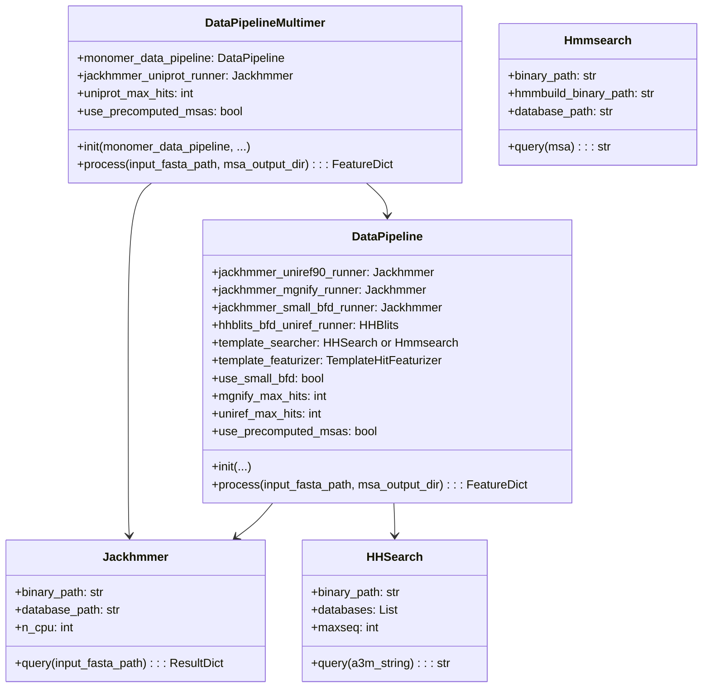
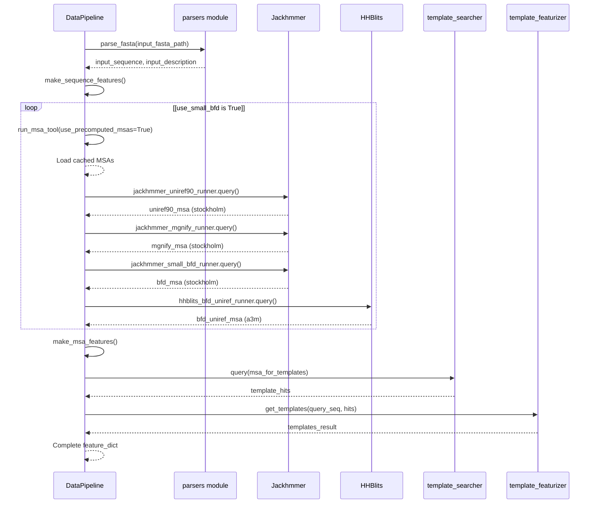

# Data Pipeline

> **Relevant source files**
> * [alphafold/common/protein.py](https://github.com/google-deepmind/alphafold/blob/c77e5d2a/alphafold/common/protein.py)
> * [alphafold/data/msa_pairing.py](https://github.com/google-deepmind/alphafold/blob/c77e5d2a/alphafold/data/msa_pairing.py)
> * [alphafold/data/pipeline.py](https://github.com/google-deepmind/alphafold/blob/c77e5d2a/alphafold/data/pipeline.py)
> * [alphafold/data/pipeline_multimer.py](https://github.com/google-deepmind/alphafold/blob/c77e5d2a/alphafold/data/pipeline_multimer.py)
> * [alphafold/data/templates.py](https://github.com/google-deepmind/alphafold/blob/c77e5d2a/alphafold/data/templates.py)
> * [alphafold/data/tools/hhsearch.py](https://github.com/google-deepmind/alphafold/blob/c77e5d2a/alphafold/data/tools/hhsearch.py)
> * [alphafold/data/tools/hmmbuild.py](https://github.com/google-deepmind/alphafold/blob/c77e5d2a/alphafold/data/tools/hmmbuild.py)
> * [alphafold/data/tools/hmmsearch.py](https://github.com/google-deepmind/alphafold/blob/c77e5d2a/alphafold/data/tools/hmmsearch.py)
> * [alphafold/model/tf/protein_features.py](https://github.com/google-deepmind/alphafold/blob/c77e5d2a/alphafold/model/tf/protein_features.py)

The Data Pipeline transforms raw FASTA protein sequences into model-ready feature dictionaries containing multiple sequence alignments (MSAs), template structural information, and sequence-derived features. This page provides a technical overview of the pipeline architecture and processing stages.

The pipeline consists of two main implementations:

* `pipeline.DataPipeline`: Monomer protein processing [alphafold/data/pipeline.py L123](https://github.com/google-deepmind/alphafold/blob/c77e5d2a/alphafold/data/pipeline.py#L123-L123)
* `pipeline_multimer.DataPipeline`: Multi-chain complex processing [alphafold/data/pipeline_multimer.py L184](https://github.com/google-deepmind/alphafold/blob/c77e5d2a/alphafold/data/pipeline_multimer.py#L184-L184)

For detailed information on specific pipeline components, see:

* [MSA Generation](/google-deepmind/alphafold/3.1-msa-generation) for sequence alignment details
* [Template Processing](/google-deepmind/alphafold/3.2-template-processing) for structural template handling
* [Multimer MSA Pairing](/google-deepmind/alphafold/3.3-multimer-msa-pairing) for protein complex processing
* [Feature Processing](/google-deepmind/alphafold/3.4-feature-processing) for final feature preparation

## Overview

The Data Pipeline executes the following stages:

1. **FASTA Parsing**: Extract target sequences from input files [alphafold/data/pipeline.py L176-L185](https://github.com/google-deepmind/alphafold/blob/c77e5d2a/alphafold/data/pipeline.py#L176-L185)
2. **MSA Generation**: Query sequence databases using `Jackhmmer` and `HHBlits` [alphafold/data/pipeline.py L146-L167](https://github.com/google-deepmind/alphafold/blob/c77e5d2a/alphafold/data/pipeline.py#L146-L167)
3. **Template Search**: Identify structural templates via `HHSearch` or `Hmmsearch` [alphafold/data/pipeline.py L168-L169](https://github.com/google-deepmind/alphafold/blob/c77e5d2a/alphafold/data/pipeline.py#L168-L169)
4. **Feature Extraction**: Generate sequence features, MSA features, and template features [alphafold/data/pipeline.py L231-L243](https://github.com/google-deepmind/alphafold/blob/c77e5d2a/alphafold/data/pipeline.py#L231-L243)
5. **Feature Assembly**: Combine all features into a dictionary for model input [alphafold/data/pipeline.py L243](https://github.com/google-deepmind/alphafold/blob/c77e5d2a/alphafold/data/pipeline.py#L243-L243)

### Data Pipeline Architecture Diagram

```mermaid
flowchart TD

fasta["FASTA File"]
process["process()"]
parse["parsers.parse_fasta()"]
seq_feat["make_sequence_features()"]
jack_uni["jackhmmer_uniref90_runner"]
jack_mgn["jackhmmer_mgnify_runner"]
jack_bfd["jackhmmer_small_bfd_runner"]
hhblits["hhblits_bfd_uniref_runner"]
parse_sto["parsers.parse_stockholm()"]
parse_a3m["parsers.parse_a3m()"]
msa_feat["make_msa_features()"]
temp_search["template_searcher"]
temp_feat["template_featurizer"]
hhsearch_class["hhsearch.HHSearch"]
hmmsearch_class["hmmsearch.Hmmsearch"]
jackhmmer_bin["jackhmmer"]
hhblits_bin["hhblits"]
hhsearch_bin["hhsearch"]
hmmsearch_bin["hmmsearch"]
kalign_bin["kalign"]
uniref90_db["uniref90_database_path"]
mgnify_db["mgnify_database_path"]
bfd_db["bfd_database_path"]
small_bfd_db["small_bfd_database_path"]
uniref30_db["uniref30_database_path"]
pdb70_db["pdb70_database_path"]
pdb_seqres["pdb_seqres_database_path"]
template_mmcif["template_mmcif_dir"]
feature_dict["feature_dict"]

fasta --> process
jack_uni --> jackhmmer_bin
jack_mgn --> jackhmmer_bin
jack_bfd --> jackhmmer_bin
hhblits --> hhblits_bin
jackhmmer_bin --> uniref90_db
jackhmmer_bin --> mgnify_db
jackhmmer_bin --> small_bfd_db
hhblits_bin --> bfd_db
hhblits_bin --> uniref30_db
hhsearch_class --> hhsearch_bin
hmmsearch_class --> hmmsearch_bin
hhsearch_bin --> pdb70_db
hmmsearch_bin --> pdb_seqres
temp_feat --> template_mmcif
temp_feat --> kalign_bin
seq_feat --> feature_dict
msa_feat --> feature_dict
temp_feat --> feature_dict

subgraph Output ["Output Features"]
    feature_dict
end

subgraph Databases ["Sequence Databases"]
    uniref90_db
    mgnify_db
    bfd_db
    small_bfd_db
    uniref30_db
    pdb70_db
    pdb_seqres
    template_mmcif
end

subgraph ExternalTools ["External Binaries"]
    jackhmmer_bin
    hhblits_bin
    hhsearch_bin
    hmmsearch_bin
    kalign_bin
end

subgraph Pipeline ["pipeline.DataPipeline"]
    process
    process --> parse
    process --> jack_uni
    process --> jack_mgn
    process --> jack_bfd
    process --> hhblits
    process --> temp_search

subgraph TemplateProcessing ["Template Processing"]
    temp_search
    temp_feat
    hhsearch_class
    hmmsearch_class
    temp_search --> hhsearch_class
    temp_search --> hmmsearch_class
    temp_search --> temp_feat
end

subgraph MSAGeneration ["MSA Generation"]
    jack_uni
    jack_mgn
    jack_bfd
    hhblits
    parse_sto
    parse_a3m
    msa_feat
    jack_uni --> parse_sto
    jack_mgn --> parse_sto
    jack_bfd --> parse_sto
    hhblits --> parse_a3m
    parse_sto --> msa_feat
    parse_a3m --> msa_feat
end

subgraph SeqProcessing ["Sequence Processing"]
    parse
    seq_feat
    parse --> seq_feat
end
end

subgraph Input ["Input Layer"]
    fasta
end
```

Sources:

* [alphafold/data/pipeline.py L123-L243](https://github.com/google-deepmind/alphafold/blob/c77e5d2a/alphafold/data/pipeline.py#L123-L243)
* [alphafold/data/pipeline_multimer.py L184-L206](https://github.com/google-deepmind/alphafold/blob/c77e5d2a/alphafold/data/pipeline_multimer.py#L184-L206)

## Pipeline Initialization

The `DataPipeline` class is instantiated with configuration for various genetic databases and search tools. For multimer predictions, a `pipeline_multimer.DataPipeline` wraps a monomer pipeline instance to process individual chains before pairing.

### DataPipeline Class Structure

### Initialization Parameters

The pipeline is initialized with the following key parameters:

| Parameter | Type | Description |
| --- | --- | --- |
| `jackhmmer_binary_path` | str | Path to jackhmmer executable [alphafold/data/pipeline.py L129](https://github.com/google-deepmind/alphafold/blob/c77e5d2a/alphafold/data/pipeline.py#L129-L129) |
| `hhblits_binary_path` | str | Path to hhblits executable [alphafold/data/pipeline.py L130](https://github.com/google-deepmind/alphafold/blob/c77e5d2a/alphafold/data/pipeline.py#L130-L130) |
| `uniref90_database_path` | str | UniRef90 FASTA database [alphafold/data/pipeline.py L131](https://github.com/google-deepmind/alphafold/blob/c77e5d2a/alphafold/data/pipeline.py#L131-L131) |
| `mgnify_database_path` | str | MGnify FASTA database [alphafold/data/pipeline.py L132](https://github.com/google-deepmind/alphafold/blob/c77e5d2a/alphafold/data/pipeline.py#L132-L132) |
| `template_searcher` | TemplateSearcher | `HHSearch` or `Hmmsearch` instance [alphafold/data/pipeline.py L136](https://github.com/google-deepmind/alphafold/blob/c77e5d2a/alphafold/data/pipeline.py#L136-L136) |
| `template_featurizer` | TemplateHitFeaturizer | Template feature extractor [alphafold/data/pipeline.py L137](https://github.com/google-deepmind/alphafold/blob/c77e5d2a/alphafold/data/pipeline.py#L137-L137) |
| `use_small_bfd` | bool | Whether to use reduced BFD database [alphafold/data/pipeline.py L138](https://github.com/google-deepmind/alphafold/blob/c77e5d2a/alphafold/data/pipeline.py#L138-L138) |
| `use_precomputed_msas` | bool | Whether to load cached MSAs [alphafold/data/pipeline.py L141](https://github.com/google-deepmind/alphafold/blob/c77e5d2a/alphafold/data/pipeline.py#L141-L141) |

Sources:

* [alphafold/data/pipeline.py L126-L143](https://github.com/google-deepmind/alphafold/blob/c77e5d2a/alphafold/data/pipeline.py#L126-L143)
* [alphafold/data/pipeline_multimer.py L187-L206](https://github.com/google-deepmind/alphafold/blob/c77e5d2a/alphafold/data/pipeline_multimer.py#L187-L206)

## Data Processing Workflow

The `process()` method orchestrates the complete feature generation pipeline. It handles MSA generation, template search, and feature assembly.

### Process Execution Sequence

### MSA Caching

When `use_precomputed_msas=True`, the pipeline reads MSAs from disk using `run_msa_tool` [alphafold/data/pipeline.py L94-L120](https://github.com/google-deepmind/alphafold/blob/c77e5d2a/alphafold/data/pipeline.py#L94-L120)

 rather than running search binaries.

Sources:

* [alphafold/data/pipeline.py L174-L243](https://github.com/google-deepmind/alphafold/blob/c77e5d2a/alphafold/data/pipeline.py#L174-L243)
* [alphafold/data/pipeline.py L94-L120](https://github.com/google-deepmind/alphafold/blob/c77e5d2a/alphafold/data/pipeline.py#L94-L120)

## Sequence Feature Generation

The `make_sequence_features()` function constructs basic features directly from the input sequence [alphafold/data/pipeline.py L37-L54](https://github.com/google-deepmind/alphafold/blob/c77e5d2a/alphafold/data/pipeline.py#L37-L54)

| Feature Name | Shape | Data Type | Description |
| --- | --- | --- | --- |
| `aatype` | `[num_res, 21]` | float32 | One-hot encoding of amino acid types |
| `residue_index` | `[num_res]` | int32 | Zero-based residue position indices |
| `seq_length` | `[num_res]` | int32 | Total sequence length (repeated) |
| `sequence` | `[1]` | object | Original amino acid sequence string |

Sources:

* [alphafold/data/pipeline.py L37-L54](https://github.com/google-deepmind/alphafold/blob/c77e5d2a/alphafold/data/pipeline.py#L37-L54)
* [alphafold/model/tf/protein_features.py L43-L51](https://github.com/google-deepmind/alphafold/blob/c77e5d2a/alphafold/model/tf/protein_features.py#L43-L51)

## Multiple Sequence Alignment Generation

The pipeline generates MSAs from UniRef90, MGnify, and BFD/UniRef30 databases.

### MSA Feature Conversion

The `make_msa_features()` function converts parsed `Msa` objects into feature arrays [alphafold/data/pipeline.py L57-L91](https://github.com/google-deepmind/alphafold/blob/c77e5d2a/alphafold/data/pipeline.py#L57-L91)

| Feature | Shape | Type | Description |
| --- | --- | --- | --- |
| `msa` | `[num_seq, num_res]` | int32 | Integer-encoded aligned sequences |
| `deletion_matrix_int` | `[num_seq, num_res]` | int32 | Deletion counts per position |
| `num_alignments` | `[num_res]` | int32 | Total number of sequences in MSA |
| `msa_species_identifiers` | `[num_seq]` | object | Species IDs for each sequence |

Sources:

* [alphafold/data/pipeline.py L57-L91](https://github.com/google-deepmind/alphafold/blob/c77e5d2a/alphafold/data/pipeline.py#L57-L91)
* [alphafold/model/tf/protein_features.py L45-L48](https://github.com/google-deepmind/alphafold/blob/c77e5d2a/alphafold/model/tf/protein_features.py#L45-L48)

## Template Search and Feature Extraction

Template structures provide 3D coordinate priors. The pipeline identifies homologs and extracts coordinates from mmCIF files.

### Template Search Tools

Template search is performed using:

* **Monomer Mode**: `hhsearch.HHSearch` querying PDB70 [alphafold/data/tools/hhsearch.py L29](https://github.com/google-deepmind/alphafold/blob/c77e5d2a/alphafold/data/tools/hhsearch.py#L29-L29)
* **Multimer Mode**: `hmmsearch.Hmmsearch` querying PDB SEQRES [alphafold/data/tools/hmmsearch.py L29](https://github.com/google-deepmind/alphafold/blob/c77e5d2a/alphafold/data/tools/hmmsearch.py#L29-L29)

### Template Features

| Feature | Shape | Type | Description |
| --- | --- | --- | --- |
| `template_aatype` | `[num_templates, num_res, 22]` | float32 | One-hot template AA types |
| `template_all_atom_positions` | `[num_templates, num_res, 37, 3]` | float32 | 3D atom coordinates |
| `template_all_atom_masks` | `[num_templates, num_res, 37]` | float32 | Atom presence masks |

Sources:

* [alphafold/data/templates.py L88-L95](https://github.com/google-deepmind/alphafold/blob/c77e5d2a/alphafold/data/templates.py#L88-L95)
* [alphafold/model/tf/protein_features.py L60-L68](https://github.com/google-deepmind/alphafold/blob/c77e5d2a/alphafold/model/tf/protein_features.py#L60-L68)
* [alphafold/data/tools/hhsearch.py L111-L116](https://github.com/google-deepmind/alphafold/blob/c77e5d2a/alphafold/data/tools/hhsearch.py#L111-L116)
* [alphafold/data/tools/hmmsearch.py L135-L145](https://github.com/google-deepmind/alphafold/blob/c77e5d2a/alphafold/data/tools/hmmsearch.py#L135-L145)

## Multimer Feature Processing

For multimer predictions, `pipeline_multimer.DataPipeline` processes each chain individually and then performs pairing.

1. **Chain Processing**: Each chain is processed via `monomer_data_pipeline` [alphafold/data/pipeline_multimer.py L228-L233](https://github.com/google-deepmind/alphafold/blob/c77e5d2a/alphafold/data/pipeline_multimer.py#L228-L233)
2. **Monomer to Multimer Conversion**: `convert_monomer_features` reshapes features for multimer compatibility [alphafold/data/pipeline_multimer.py L79-L105](https://github.com/google-deepmind/alphafold/blob/c77e5d2a/alphafold/data/pipeline_multimer.py#L79-L105)
3. **Assembly Features**: `add_assembly_features` adds `asym_id`, `sym_id`, and `entity_id` to distinguish between chains [alphafold/data/pipeline_multimer.py L130-L167](https://github.com/google-deepmind/alphafold/blob/c77e5d2a/alphafold/data/pipeline_multimer.py#L130-L167)
4. **MSA Pairing**: Cross-chain sequences are paired based on species information [alphafold/data/msa_pairing.py L153-L185](https://github.com/google-deepmind/alphafold/blob/c77e5d2a/alphafold/data/msa_pairing.py#L153-L185)

Sources:

* [alphafold/data/pipeline_multimer.py L79-L167](https://github.com/google-deepmind/alphafold/blob/c77e5d2a/alphafold/data/pipeline_multimer.py#L79-L167)
* [alphafold/data/msa_pairing.py L153-L185](https://github.com/google-deepmind/alphafold/blob/c77e5d2a/alphafold/data/msa_pairing.py#L153-L185)

## Summary

The Data Pipeline transforms a FASTA sequence into a standardized `FeatureDict`. This dictionary includes evolutionary context (MSAs) and structural priors (templates) required for the model to perform folding.

For details on how these features are transformed into model tensors, see [Feature Processing](/google-deepmind/alphafold/3.4-feature-processing).