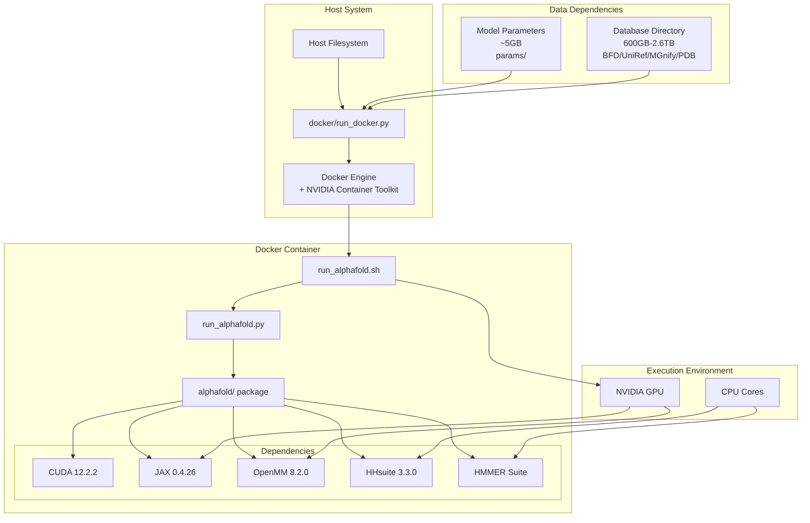
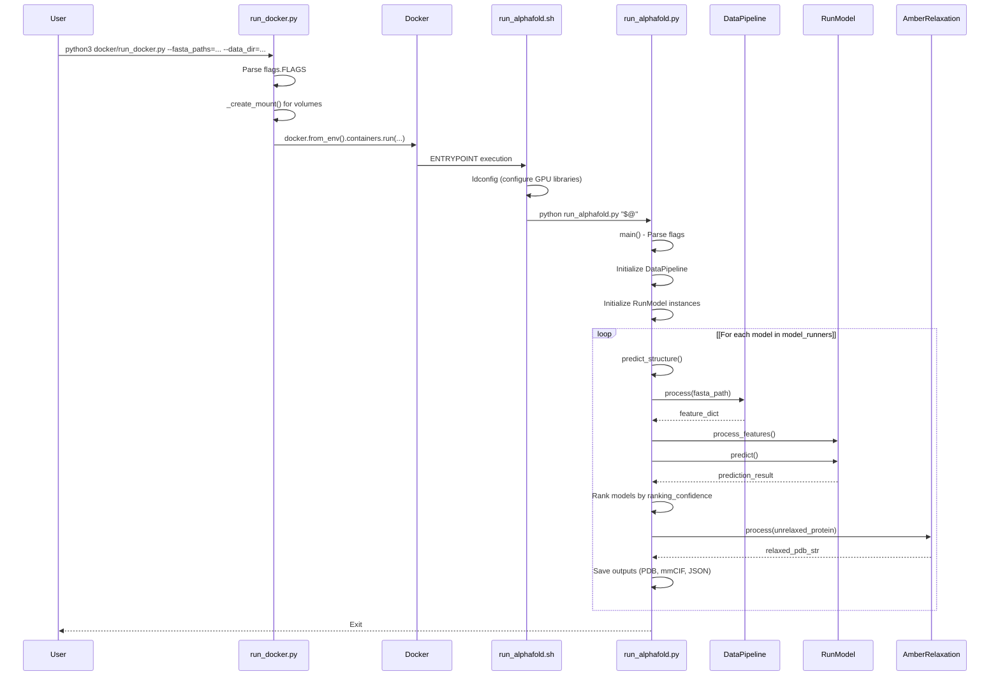

# Deployment and Execution

> **Relevant source files**
> * [.dockerignore](https://github.com/google-deepmind/alphafold/blob/c77e5d2a/.dockerignore)
> * [docker/Dockerfile](https://github.com/google-deepmind/alphafold/blob/c77e5d2a/docker/Dockerfile)
> * [docker/run_docker.py](https://github.com/google-deepmind/alphafold/blob/c77e5d2a/docker/run_docker.py)
> * [pyproject.toml](https://github.com/google-deepmind/alphafold/blob/c77e5d2a/pyproject.toml)
> * [requirements.txt](https://github.com/google-deepmind/alphafold/blob/c77e5d2a/requirements.txt)
> * [run_alphafold.py](https://github.com/google-deepmind/alphafold/blob/c77e5d2a/run_alphafold.py)
> * [run_alphafold_test.py](https://github.com/google-deepmind/alphafold/blob/c77e5d2a/run_alphafold_test.py)

## Purpose and Scope

This document provides an overview of AlphaFold's deployment architecture and execution pipeline. It covers how the system is containerized, launched, and orchestrated from initial deployment through structure prediction completion.

For specific topics:

* Docker image construction and dependencies: see [Docker Environment](/google-deepmind/alphafold/2.1-docker-environment)
* Database download and configuration: see [Database Setup](/google-deepmind/alphafold/2.2-database-setup)
* Detailed prediction workflow: see [Running AlphaFold](/google-deepmind/alphafold/2.3-running-alphafold)
* Command-line flags and configuration: see [Command-Line Interface](/google-deepmind/alphafold/2.4-command-line-interface)

## Deployment Architecture Overview

AlphaFold is primarily deployed via Docker containerization to ensure reproducibility and consistent dependency management. The deployment consists of three main components: the Docker container image, genetic databases, and pre-trained model parameters.

**Docker Image Construction**

The Docker image is built from `docker/Dockerfile` [docker/Dockerfile L1-L92](https://github.com/google-deepmind/alphafold/blob/c77e5d2a/docker/Dockerfile#L1-L92)

 which:

1. Uses `nvidia/cuda:12.2.2-cudnn8-runtime-ubuntu20.04` as base image [docker/Dockerfile L15-L16](https://github.com/google-deepmind/alphafold/blob/c77e5d2a/docker/Dockerfile#L15-L16)
2. Installs system dependencies: `build-essential`, `cmake`, `git`, `hmmer`, `kalign` [docker/Dockerfile L25-L37](https://github.com/google-deepmind/alphafold/blob/c77e5d2a/docker/Dockerfile#L25-L37)
3. Compiles `HHsuite 3.3.0` from source [docker/Dockerfile L39-L47](https://github.com/google-deepmind/alphafold/blob/c77e5d2a/docker/Dockerfile#L39-L47)
4. Installs `Miniconda` and `Python 3.11` [docker/Dockerfile L49-L59](https://github.com/google-deepmind/alphafold/blob/c77e5d2a/docker/Dockerfile#L49-L59)
5. Installs Python packages including `JAX 0.4.26` with CUDA support [docker/Dockerfile L68-L74](https://github.com/google-deepmind/alphafold/blob/c77e5d2a/docker/Dockerfile#L68-L74)  and `OpenMM 8.2.0` [requirements.txt L9](https://github.com/google-deepmind/alphafold/blob/c77e5d2a/requirements.txt#L9-L9)
6. Copies the AlphaFold codebase and creates the entry point script `run_alphafold.sh` [docker/Dockerfile L63-L91](https://github.com/google-deepmind/alphafold/blob/c77e5d2a/docker/Dockerfile#L63-L91)

Sources: [docker/Dockerfile L1-L92](https://github.com/google-deepmind/alphafold/blob/c77e5d2a/docker/Dockerfile#L1-L92)

 [requirements.txt L1-L14](https://github.com/google-deepmind/alphafold/blob/c77e5d2a/requirements.txt#L1-L14)

## Execution Flow

The execution flow involves three script layers that orchestrate container launching, GPU configuration, and the prediction pipeline.

Sources: [docker/run_docker.py L159-L250](https://github.com/google-deepmind/alphafold/blob/c77e5d2a/docker/run_docker.py#L159-L250)

 [docker/Dockerfile L87-L91](https://github.com/google-deepmind/alphafold/blob/c77e5d2a/docker/Dockerfile#L87-L91)

 [run_alphafold.py L345-L556](https://github.com/google-deepmind/alphafold/blob/c77e5d2a/run_alphafold.py#L345-L556)

 [run_alphafold_test.py L35-L92](https://github.com/google-deepmind/alphafold/blob/c77e5d2a/run_alphafold_test.py#L35-L92)

## Entry Points and Scripts

### docker/run_docker.py

Container orchestration script that launches the Docker container with appropriate volume mounts and GPU configuration.

* Uses `absl.flags` to define execution parameters like `fasta_paths`, `data_dir`, and `model_preset` [docker/run_docker.py L29-L126](https://github.com/google-deepmind/alphafold/blob/c77e5d2a/docker/run_docker.py#L29-L126)
* Implements `_create_mount()` to map host paths to container paths under `/mnt/` [docker/run_docker.py L133-L156](https://github.com/google-deepmind/alphafold/blob/c77e5d2a/docker/run_docker.py#L133-L156)
* Uses the `docker` Python library to manage container lifecycle [docker/run_docker.py L25-L26](https://github.com/google-deepmind/alphafold/blob/c77e5d2a/docker/run_docker.py#L25-L26)

### run_alphafold.sh

Shell script created during Docker image build [docker/Dockerfile L87-L91](https://github.com/google-deepmind/alphafold/blob/c77e5d2a/docker/Dockerfile#L87-L91)

 that serves as the container's `ENTRYPOINT`. It performs two critical operations:

1. **GPU Library Configuration**: Executes `ldconfig` to ensure GPU libraries are visible to applications [docker/Dockerfile L88](https://github.com/google-deepmind/alphafold/blob/c77e5d2a/docker/Dockerfile#L88-L88)
2. **Main Script Invocation**: Forwards all command-line arguments to `run_alphafold.py` [docker/Dockerfile L89](https://github.com/google-deepmind/alphafold/blob/c77e5d2a/docker/Dockerfile#L89-L89)

### run_alphafold.py

The main Python entry point containing the complete prediction pipeline [run_alphafold.py L15-L25](https://github.com/google-deepmind/alphafold/blob/c77e5d2a/run_alphafold.py#L15-L25)

 Key functions:

**`main()` Function**

* Initializes data pipelines and model runners based on `FLAGS.model_preset` [run_alphafold.py L168-L175](https://github.com/google-deepmind/alphafold/blob/c77e5d2a/run_alphafold.py#L168-L175)
* Validates database paths against the chosen `db_preset` [run_alphafold.py L160-L167](https://github.com/google-deepmind/alphafold/blob/c77e5d2a/run_alphafold.py#L160-L167)

**`predict_structure()` Function** [run_alphafold.py L345-L556](https://github.com/google-deepmind/alphafold/blob/c77e5d2a/run_alphafold.py#L345-L556)

* Orchestrates the transition from raw FASTA to final 3D structure.
* Calls `data_pipeline.process` to generate features [run_alphafold.py L375-L377](https://github.com/google-deepmind/alphafold/blob/c77e5d2a/run_alphafold.py#L375-L377)
* Calls `model_runner.predict` to perform inference [run_alphafold.py L438-L440](https://github.com/google-deepmind/alphafold/blob/c77e5d2a/run_alphafold.py#L438-L440)
* Handles structure relaxation using the `amber_relaxer` [run_alphafold.py L494-L515](https://github.com/google-deepmind/alphafold/blob/c77e5d2a/run_alphafold.py#L494-L515)

Sources: [run_alphafold.py L1-L733](https://github.com/google-deepmind/alphafold/blob/c77e5d2a/run_alphafold.py#L1-L733)

 [docker/Dockerfile L87-L91](https://github.com/google-deepmind/alphafold/blob/c77e5d2a/docker/Dockerfile#L87-L91)

## Configuration and Presets

AlphaFold uses a configuration system with model and database presets defined via `absl` flags.

### Model Presets

The `--model_preset` flag [run_alphafold.py L168-L175](https://github.com/google-deepmind/alphafold/blob/c77e5d2a/run_alphafold.py#L168-L175)

 determines the architecture:

* `monomer`: Original model for single chains.
* `monomer_casp14`: Monomer model with CASP14 configuration (extra ensembling).
* `monomer_ptm`: Monomer model with pTM head for confidence scoring.
* `multimer`: Model for protein complexes.

### Database Presets

The `--db_preset` flag [run_alphafold.py L160-L167](https://github.com/google-deepmind/alphafold/blob/c77e5d2a/run_alphafold.py#L160-L167)

 controls the MSA search depth:

* `full_dbs`: Uses the complete set of genetic databases (BFD, UniRef90, etc.).
* `reduced_dbs`: Uses a smaller version of BFD for faster execution [run_alphafold.py L115-L118](https://github.com/google-deepmind/alphafold/blob/c77e5d2a/run_alphafold.py#L115-L118)

Sources: [run_alphafold.py L160-L175](https://github.com/google-deepmind/alphafold/blob/c77e5d2a/run_alphafold.py#L160-L175)

 [docker/run_docker.py L80-L93](https://github.com/google-deepmind/alphafold/blob/c77e5d2a/docker/run_docker.py#L80-L93)

## Execution Modes

The system branches logic based on whether it is predicting a single chain or a multimer.

**Monomer Mode**

* Uses `pipeline.DataPipeline` [run_alphafold.py L33](https://github.com/google-deepmind/alphafold/blob/c77e5d2a/run_alphafold.py#L33-L33)
* Typically uses `hhsearch.HHSearch` for template finding [run_alphafold.py L36](https://github.com/google-deepmind/alphafold/blob/c77e5d2a/run_alphafold.py#L36-L36)

**Multimer Mode**

* Uses `pipeline_multimer.DataPipeline` [run_alphafold.py L34](https://github.com/google-deepmind/alphafold/blob/c77e5d2a/run_alphafold.py#L34-L34)
* Uses `hmmsearch.Hmmsearch` for template finding [run_alphafold.py L37](https://github.com/google-deepmind/alphafold/blob/c77e5d2a/run_alphafold.py#L37-L37)
* Allows multiple predictions per model via `--num_multimer_predictions_per_model` [run_alphafold.py L193-L201](https://github.com/google-deepmind/alphafold/blob/c77e5d2a/run_alphafold.py#L193-L201)

Sources: [run_alphafold.py L33-L40](https://github.com/google-deepmind/alphafold/blob/c77e5d2a/run_alphafold.py#L33-L40)

 [run_alphafold.py L193-L201](https://github.com/google-deepmind/alphafold/blob/c77e5d2a/run_alphafold.py#L193-L201)

## Output Directory Structure

For every input FASTA, AlphaFold creates a subdirectory in `output_dir` [run_alphafold.py L68-L70](https://github.com/google-deepmind/alphafold/blob/c77e5d2a/run_alphafold.py#L68-L70)

 containing:

* `features.pkl`: Pickled input features [run_alphafold_test.py L101](https://github.com/google-deepmind/alphafold/blob/c77e5d2a/run_alphafold_test.py#L101-L101)
* `unrelaxed_model_*.pdb`: Predicted structures before relaxation [run_alphafold_test.py L110](https://github.com/google-deepmind/alphafold/blob/c77e5d2a/run_alphafold_test.py#L110-L110)
* `relaxed_model_*.pdb`: Structures after Amber relaxation [run_alphafold_test.py L114](https://github.com/google-deepmind/alphafold/blob/c77e5d2a/run_alphafold_test.py#L114-L114)
* `ranked_*.pdb`: Final structures ranked by confidence [run_alphafold_test.py L105](https://github.com/google-deepmind/alphafold/blob/c77e5d2a/run_alphafold_test.py#L105-L105)
* `ranking_debug.json`: Confidence scores used for ranking [run_alphafold_test.py L106](https://github.com/google-deepmind/alphafold/blob/c77e5d2a/run_alphafold_test.py#L106-L106)

Sources: [run_alphafold_test.py L98-L128](https://github.com/google-deepmind/alphafold/blob/c77e5d2a/run_alphafold_test.py#L98-L128)

 [run_alphafold.py L61-L70](https://github.com/google-deepmind/alphafold/blob/c77e5d2a/run_alphafold.py#L61-L70)